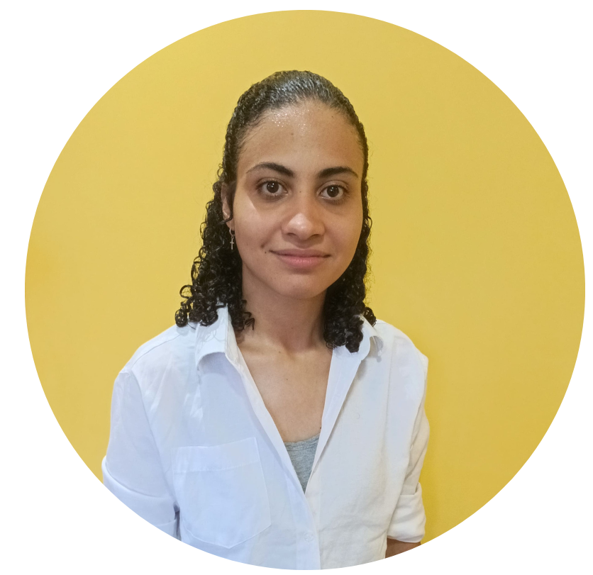

<h1 align="center">Programa de Bolsas Compass.UOL - Trilha de Engenharia de Dados</h1>

## Apresentação

🔭**Graduanda do Curso de Sistemas de Informação:**
atualmente curso o 3º semestre do Bacharelado em Sistemas de Informação no Instituto Federal de Educação, Ciência e Tecnologia da Bahia (IFBA) – Campus Vitória da Conquista.

☕ **Interesse em Banco de Dados e APIs:**
tenho grande afinidade com áreas como Banco de Dados, desenvolvimento de APIs e lógica de programação aplicada. Essas temáticas fazem parte não apenas da minha formação acadêmica, mas também dos projetos pessoais que desenvolvo por iniciativa própria.

🤝 **Valorização do trabalho em equipe:**
acredito no poder da colaboração e no crescimento proporcionado pela troca de conhecimentos. Tenho muito interesse em integrar equipes multidisciplinares e contribuir ativamente para o desenvolvimento de soluções tecnológicas.

🌱 **Curiosidade como motor de aprendizado:** sou naturalmente curiosa, o que me leva a explorar diferentes linguagens de programação, ferramentas e metodologias. Utilizo o sistema operacional Linux como meu ambiente principal de desenvolvimento, pois aprecio sua estrutura, customização e as possibilidades que oferece por meio da linha de comando.

🐈 Interesses além da tecnologia: 
nos momentos de lazer, aprecio livros que estimulam o pensamento crítico, músicas que favorecem a concentração e animações que proporcionam leveza. Além disso, encontro conforto e alegria na companhia dos meus gatos, que são parte essencial da minha rotina.

  

## Sprints 

1. [Sprint 1](/Sprint%201/README.md)

