# Resumo

**Fundamento da Segurança da Informação(PB):** Pude entender como funciona a Segurança da Informação e seus pilares fundamentais de confidencialidade, integridade e disponibilidade, além da importância de classificar adequadamente as informações durante todo seu ciclo de vida. Compreendi também como os ataques de engenharia social exploram o fator humano através de táticas como phishing e baiting, aproveitando-se da confiança natural das pessoas para obter acesso não autorizado a informações sensíveis. As boas práticas incluem não compartilhar credenciais, implementar autenticação multifator (MFA), manter softwares atualizados e ter cuidado especial com redes Wi-Fi abertas. Por fim, entendi a necessidade de precauções específicas ao usar IA Generativa, como utilizar apenas ferramentas homologadas, evitar compartilhar dados corporativos, remover informações sensíveis e aplicar mascaramento de dados para proteger informações confidenciais durante essas interações. 

**Dicionário Scrum:** Por meio do Dicionário Scrum eu aprendi como funciona o Scrum e sua estrutura como framework ágil que utiliza incrementações para maximizar produtividade e entregar maior valor aos projetos. Compreendi os três papéis fundamentais: Product Owner (responsável pelos backlogs do produto), Scrum Master (facilitador que mantém o ciclo funcionando) e Time de Desenvolvimento (equipe auto-organizada), além dos principais artefatos como Product Backlog (requisitos da aplicação), Sprint Backlog (tarefas de cada sprint), histórias (narrativas das funcionalidades a serem desenvolvidas) e gráficos Burndown (acompanhamento do esforço e prazos). Os eventos essenciais incluem as Sprints (períodos para completar tarefas), Sprint Planning (reuniões de planejamento), Daily (reuniões diárias), Sprint Review (apresentação dos incrementos) e Sprint Retrospective (revisão do processo de trabalho), tudo isso baseado na classificação visual de "A fazer, Fazendo e Feito" e na transparência total onde todos sabem o que cada membro está desenvolvendo.

**Git e GitHub:** Através desse curso aprendi como funciona o Git e GitHub e suas diferenças fundamentais: o Git é um sistema de controle de versão local que roda na máquina através do terminal, enquanto o GitHub é uma plataforma online para hospedagem e colaboração de repositórios. Compreendi o fluxo básico do Git desde a configuração inicial (user.name, user.email, branch padrão), passando pela inicialização de repositórios com git init, o processo de tracking dos arquivos (untracked → staged → committed), e comandos essenciais como git add, git commit, git status e git log. Entendi também os três tipos de reset (soft, mixed, hard) para voltar no tempo dos commits, o trabalho com branches para organizar diferentes funcionalidades, e a integração com GitHub através de comandos como git push, git pull e git merge. Por fim, aprendi sobre as funcionalidades do GitHub como Issues para reportar problemas, Pull Requests para propor mudanças, Actions para automação, e como criar Releases para lançar versões do projeto, tudo isso facilitando a colaboração em equipe e o backup seguro na nuvem.

**Markdown:** Pude entender como funciona o Markdown e sua sintaxe simples para formatação de texto, começando pela estrutura hierárquica de títulos usando # (título), ## (subtítulo) e ### (subtítulo nível 2), além das formatações básicas como itálico, negrito e riscado. Compreendi como criar links com textos, âncoras internas, listas não ordenadas com - ou *, listas numeradas com 1., e checkboxes com - [ ] para tarefas. Aprendi também sobre citações usando >, blocos de código com ``` para múltiplas linhas ou ` para código inline, criação de tabelas com | para separar colunas e alinhamento usando :, inserção de imagens com URL, linhas horizontais com --- ou ***, e links de referência que permitem reutilizar URLs ao longo do documento. Essa linguagem de marcação é extremamente útil para documentação, README de projetos no GitHub, e qualquer situação onde precisamos formatar texto de forma rápida e legível tanto no código quanto no resultado final.

**SQL:** Por meio do estudo da linguagem SQL pude realizar consultas de dados, devido ao meu aprendizado relacionado aos fundamentos de seleção de colunas (`SELECT`) e tabelas (`FROM`) , a remoção de duplicatas (`DISTINCT`) , a ordenação de resultados (`ORDER BY`) e a limitação do número de linhas (`LIMIT`). A filtragem de dados foi abordada através da cláusula `WHERE` , que utiliza operadores de comparação (`=, >, <`) , lógicos (`AND, OR, IN, BETWEEN`) e de texto (`LIKE, ILIKE`). Aprendi também a combinação de tabelas, seja unindo os resultados de consultas com `UNION` ou combinando colunas de diferentes tabelas através de `JOINs` (`LEFT, INNER, etc.`). Por fim, aprendi funções de agregação (`COUNT, SUM, AVG, MAX, MIN`) para sumarizar dados, o uso de `GROUP BY` para agrupar registros semelhantes , e a cláusula `HAVING` para filtrar esses grupos. O conceito de subqueries, incluindo o uso do `WITH`, me ajudou a entender e realizar consultas complexas e aninhadas para análises mais aprofundadas.

# Exercícios

## Exercícios - Parte 1


1. ...
[Resposta Ex1.](./Exercicios/ExerciciosI/Biblioteca/ex01.sql)


2. ...
[Resposta Ex2.](./Exercicios/ExerciciosI/Biblioteca/ex02.sql)

3. ...
[Resposta Ex3.](./Exercicios/ExerciciosI/Biblioteca/ex03.sql)

4. ...
[Resposta Ex4.](./Exercicios/ExerciciosI/Biblioteca/ex04.sql)

5. ...
[Resposta Ex5.](./Exercicios/ExerciciosI/Biblioteca/ex05.sql)

6. ...
[Resposta Ex6.](./Exercicios/ExerciciosI/Biblioteca/ex06.sql)

7. ...
[Resposta Ex7.](./Exercicios/ExerciciosI/Biblioteca/ex07.sql)

8. ...
[Resposta Ex8.](./Exercicios/ExerciciosI/Loja/ex08.sql)

9. ...
[Resposta Ex9.](./Exercicios/ExerciciosI/Loja/ex09.sql)

10. ...
[Resposta Ex10.](./Exercicios/ExerciciosI/Loja/ex10.sql)

11. ...
[Resposta Ex11.](./Exercicios/ExerciciosI/Loja/ex11.sql)

12. ...
[Resposta Ex12.](./Exercicios/ExerciciosI/Loja/ex12.sql)

13. ...
[Resposta Ex13.](./Exercicios/ExerciciosI/Loja/ex13.sql)

14. ...
[Resposta Ex14.](./Exercicios/ExerciciosI/Loja/ex14.sql)

15. ...
[Resposta Ex15.](./Exercicios/ExerciciosI/Loja/ex15.sql)

16. ...
[Resposta Ex16.](./Exercicios/ExerciciosI/Loja/ex16.sql)

## Exercícios - Parte 2

01. ...
[Resposta Ex01.](./Exercicios/ExerciciosII/ex01.csv)

02. ...
[Resposta Ex02.](./Exercicios/ExerciciosII/ex02.csv)

# Evidências

## Exercícios - Parte 1

### Exercício 1

Ao executar o código do exercício 1, observei a listagem de todos os livros que foram publicados após o ano de 2014, ou seja, a partir de 1º de janeiro de 2015.
A seleção das colunas foi feita de forma específica: o código do livro (`cod`), o título (`titulo`), o nome do autor (`autor`), a editora (`editora`), o valor do livro (`valor`), a data de publicação (`publicacao`), a edição (`edicao`) e o idioma (`idioma`).
A tabela utilizada como fonte de dados foi `livro`, e o filtro aplicado na cláusula `WHERE` restringe os resultados para que apenas os livros com data de publicação superior a '2014-12-31' sejam retornados. Isso significa que qualquer livro publicado no dia 1º de janeiro de 2015 em diante foi incluído no resultado.
Por fim, os resultados foram ordenados em ordem crescente com base na coluna `cod`,que representa o código do livro.

Isso pode ser observado na imagem a seguir:

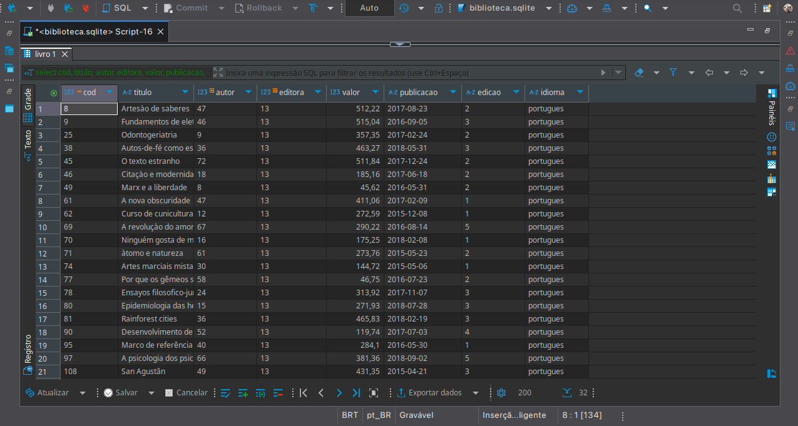

### Exercício 2

Ao executar o código referente ao exercício 2, obtive a listagem dos 10 livros mais caros cadastrados na tabela `livro`.

A instrução `SELECT` foi utilizada para selecionar duas colunas específicas: o `titulo` do livro e o seu `valor`. Com isso, a consulta retornou apenas essas duas informações, focando no essencial para análise de preços.
Em seguida, a cláusula `ORDER BY valor DESC` foi aplicada, o que significa que os resultados foram ordenados pelo valor do livro, do **maior para o menor**,ou seja, os livros mais caros aparecem no topo da lista.
Para garantir que apenas os **10 livros mais caros** fossem exibidos, a cláusula `LIMIT 10` foi utilizada ao final da query, limitando a quantidade de linhas retornadas pelo banco de dados.

Isso pode ser observado na imagem a seguir:

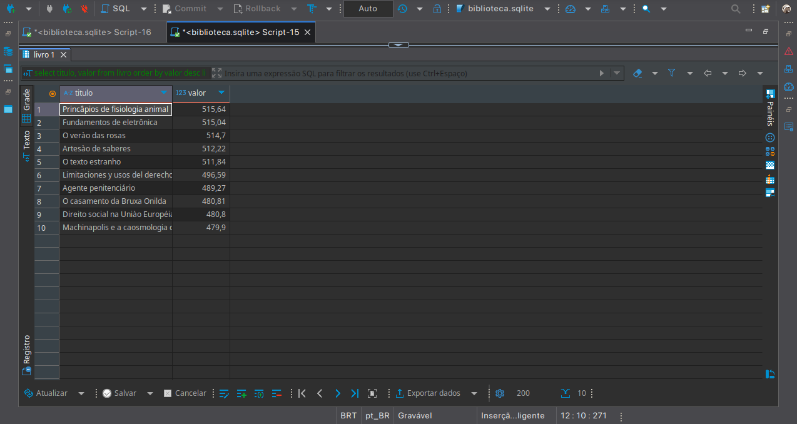

### Exercício  3

Ao executar o código do exercício 3, eu posso recuperar as cinco editoras que apresentaram o maior número de livros cadastrados na base de dados com o uso do `LIMIT`. No entanto, foram retornadas duas, pois somente duas editoras fizeram publicações.

Inicialmente, eu selecionei os campos `nome` da editora, `estado` e `cidade` de sua localização, e a contagem dos livros associados a cada uma. Para isso, eu realizei um `JOIN` entre três tabelas: `editora`, `livro` e `endereco`.
A ligação entre as tabelas ocorreu da seguinte forma: eu conectei a editora ao livro por meio da chave `e.codeditora = l.editora`, e em seguida associei a editora ao seu endereço usando `e.endereco = en.codendereco`.
Com esses dados unidos, eu agrupei os resultados usando o `GROUP BY` por nome da editora, código da editora, estado e cidade, garantindo que cada combinação única fosse contada corretamente.
Após isso, ordenei os resultados de forma decrescente pela quantidade de livros (`ORDER BY quantidade DESC`) e limitei a saída aos cinco primeiros registros.
Dessa forma, consegui identificar as editoras mais ativas em termos de volume de publicações, junto com a localização de cada uma.

Isso pode ser observado na imagem a seguir:

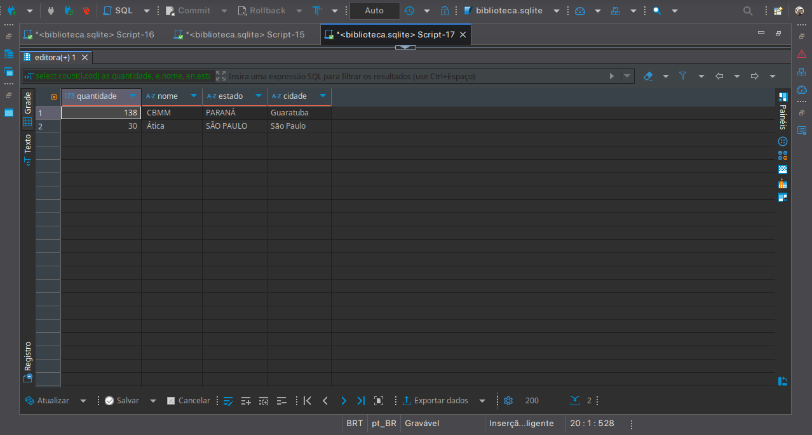

### Exercício 4

No exercício 4, eu montei uma consulta para listar os autores que publicaram livros, ordenando os nomes de forma padronizada, sem acentos ou caracteres especiais.

Para isso, eu construí um **CTE** com o `WITH` chamado `autores`, onde selecionei os campos `nome`, `codautor`, `nascimento` e a contagem de publicações para cada autor.
Usei um `JOIN` entre as tabelas `autor` e `livro`, conectando-as por `a.codautor = l.autor`, garantindo que apenas autores com publicações fossem incluídos. Agrupei os dados `a.codautor`, `a.nascimento`, `a.nome` com o `GROUP BY`.
Durante essa etapa, também criei uma coluna calculada chamada `nomes_com_replace`, onde apliquei uma série de `REPLACE` encadeados sobre `UPPER(nome)` para remover acentos e símbolos, como "Á", "Ç", "Ê", etc.
Depois de montar o CTE, executei a query final para trazer os autores com suas quantidades de publicações, ordenados com o `ORDER BY` por esse nome normalizado (`nomes_com_replace`). Essa ordenação garantiu que a listagem fosse de forma mais justa e padronizada, sem ser afetada pela variação de acentuação nos nomes dos autores.

Isso pode ser observado na imagem a seguir:

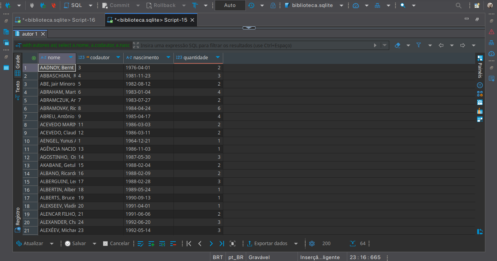

### Exercício 5

No exercício 5, eu construí uma consulta com o objetivo de listar o nome dos autores que publicaram livros por editoras **que não estão situadas na região Sul do Brasil**.  
Para alcançar esse resultado, eu utilizei quatro tabelas interligadas: `autor`, `livro`, `editora` e `endereco`.

A primeira junção com o `JOIN` foi feita entre as tabelas `autor` e `livro`, através do campo `a.codautor = l.autor`, permitindo que eu relacionasse cada autor aos seus respectivos livros.  
Em seguida, associei a tabela `livro` à tabela `editora` por meio da condição `l.editora = e.codeditora`, ligando cada livro à editora responsável pela publicação.  
Por fim, conectei a tabela `editora` à tabela `endereco`, usando a chave `e.endereco = en.codendereco`, o que me permitiu ter acesso à informação de **estado** em que cada editora está localizada.
Com essas relações estabelecidas, apliquei um filtro na cláusula `WHERE` para excluir todas as editoras localizadas nos três estados da região Sul: **Rio Grande do Sul**, **Paraná** e **Santa Catarina**. Isso foi feito com a condição `en.estado NOT IN (...)`, garantindo que apenas autores ligados a editoras de outras regiões fossem incluídos no resultado final.
Além disso, utilizei o `SELECT DISTINCT` para evitar repetições e garantir que cada autor aparecesse **uma única vez**, mesmo que tivesse publicado mais de um livro.  
Por fim, ordenei os nomes em ordem alfabética crescente, através da cláusula `ORDER BY a.nome`, deixando a apresentação dos dados mais organizada e legível.
Com isso, obtive uma lista limpa e confiável dos autores que publicaram obras por editoras localizadas fora da região Sul.

Isso pode ser observado na imagem a seguir:

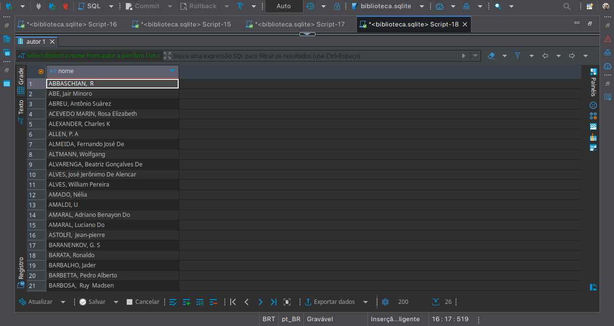

### Exercício 6

No exercício 6, eu desenvolvi uma consulta com o objetivo de **identificar o autor que mais publicou livros na base de dados**, ou seja, aquele que teve o maior número de obras associadas a seu nome.

Para isso, eu realizei uma junção `JOIN` entre as tabelas `autor` e `livro`, conectando-as por meio da condição `a.codautor = l.autor`. Essa junção me permitiu cruzar os dados de identificação dos autores com os registros dos livros publicados.
Em seguida, utilizei a função de agregação `COUNT(l.cod)` para contar quantos livros cada autor publicou, renomeando esse valor como `quantidade_publicacoes`.  
Para garantir que a contagem fosse precisa por autor, utilizei a cláusula `GROUP BY` nas colunas `a.codautor` e `a.nome`, agrupando os resultados por autor individualmente.
Após realizar essa contagem, ordenei os resultados de forma decrescente com `ORDER BY quantidade_publicacoes DESC`, colocando o autor com mais publicações no topo da lista.  
Por fim, apliquei a cláusula `LIMIT 1` para retornar **apenas o autor com maior número de publicações**, como solicitado no enunciado.
O resultado final exibiu três colunas: o código do autor (`codautor`), o nome (`nome`) e o total de publicações (`quantidade_publicacoes`). 

Isso pode ser observado na imagem a seguir:

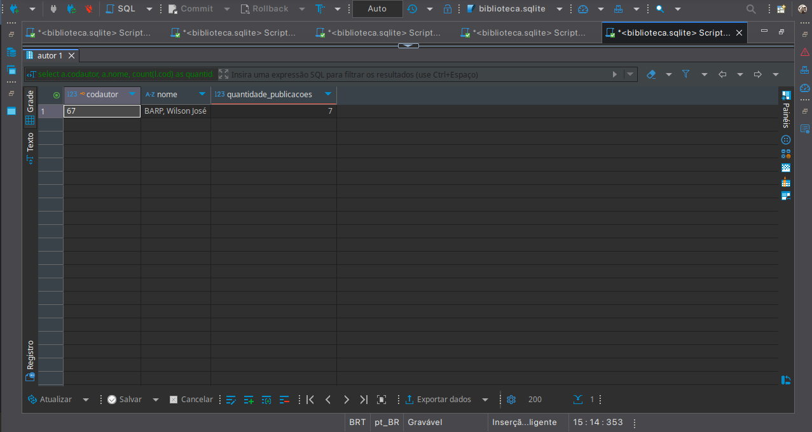

### Exercício 7

No exercício 7, eu elaborei uma query para identificar **quais autores ainda não possuem livros publicados** registrados na base de dados. A ideia foi destacar aqueles que estão cadastrados, mas que até o momento **não têm nenhuma obra associada** a seus nomes.

Para isso, utilizei um `LEFT JOIN` entre as tabelas `autor` e `livro`, conectando os dados por meio da condição `a.codautor = l.autor`. Esse tipo de junção me permitiu manter todos os autores, mesmo que não tivessem correspondência na tabela `livro`.
O ponto chave da consulta foi usar a cláusula `WHERE l.cod IS NULL` logo após o `LEFT JOIN`. Com esse filtro, eu capturei apenas os autores que não tiveram correspondência no lado da tabela `livro`, ou seja, aqueles para os quais não existe nenhum livro vinculado.
Em seguida, ordenei os resultados em ordem crescente de nome, utilizando `ORDER BY a.nome`, para deixar a apresentação mais organizada e facilitar a leitura dos resultados.

Isso pode ser observado na imagem a seguir:

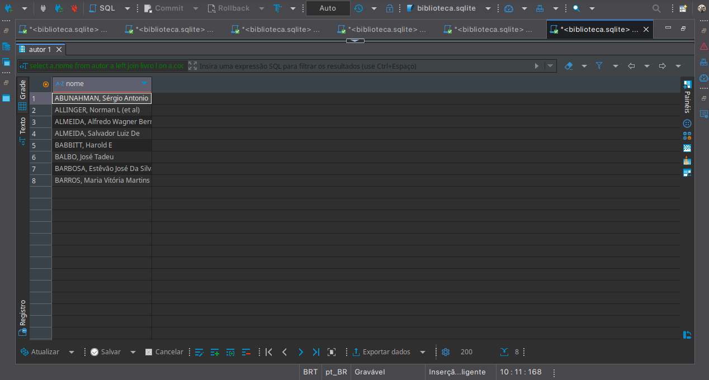

### Exercício 8

O objetivo do código relacionado ao exercício 8 foi identificar o vendedor que mais concluiu vendas. O foco da consulta esteve restrito apenas às vendas cujo **status** estava marcado como `'Concluído'`, ou seja, aquelas que realmente foram efetivadas, sem cancelamento ou pendência. Para isso foi utilizado o filtro `WHERE`.

Foi o `JOIN` entre a tabela `tbvendas` e a tabela `tbvendedor`, para conectar os dados através do campo `cdvdd`, que é o código do vendedor presente em ambas as tabelas. Essa junção foi fundamental para conseguir trazer não apenas o código (`cdvdd`) das vendas, mas também o nome do vendedor (`nmvdd`) correspondente.
Em seguida, os dados foram agrupados por vendedor, utilizando os campos `vdd.cdvdd` e `vdd.nmvdd`, de forma a contabilizar quantas vendas cada um concluiu. Essa contagem foi feita implicitamente através do `count(ven.cdven)` na cláusula `ORDER BY`, que organizou os resultados da maior para a menor quantidade de vendas.
Por fim, a cláusula `LIMIT 1` restringiu o resultado para mostrar apenas o vendedor com o maior número de vendas concluídas, ou seja, o campeão de performance dentro desse critério.

Isso pode ser observado na imagem a seguir:

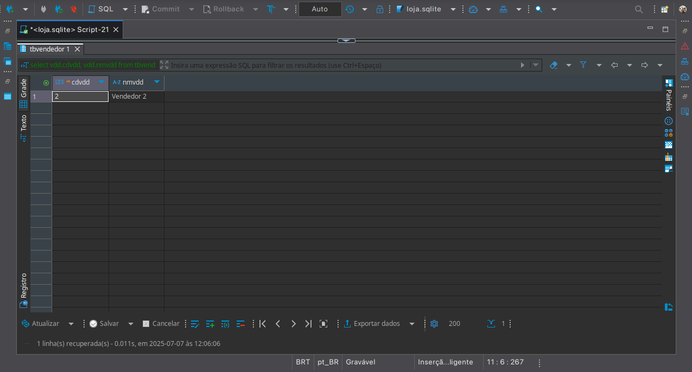

### Exercício 9

Ao executar o código do exercício 9, foi possível identificar o produto mais vendido no período compreendido entre os dias 3 de fevereiro de 2014 e 2 de fevereiro de 2018. Para isso, a query trabalhou com a tabela `tbvendas`, mas  foi filtrado os dados logo de início utilizando a cláusula `where`, garantindo que apenas as vendas com status igual a `'Concluído'` e que ocorreram dentro do intervalo de datas informado fossem consideradas. Após aplicar esses filtros, foi agrupado  os registros por código e nome do produto (`cdpro` e `nmpro`) utilizando o `GROUP BY`, permitindo assim a soma da quantidade total vendida (`SUM(qtd)`) para cada produto dentro daquele período. Em seguida, esses grupos foram ordenados de forma decrescente com base na soma das quantidades, colocando no topo o produto que mais vendeu. Por fim, o uso do `LIMIT 1` retornou apenas o campeão de vendas do intervalo analisado, revelando o código e o nome do produto que teve o maior volume de vendas concluídas entre 2014 e 2018.

Isso pode ser observado na imagem a seguir:

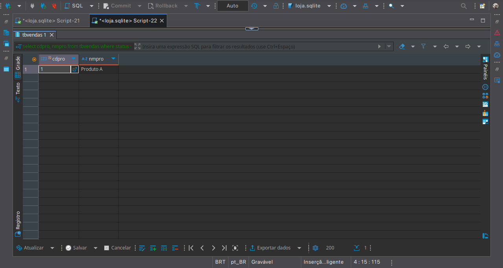

### Exercício 10

Ao executar o código do exercício 9, foi possível identificar o produto mais vendido no período compreendido entre os dias 3 de fevereiro de 2014 e 2 de fevereiro de 2018. Para isso, a query trabalhou com a tabela `tbvendas`, mas  foi filtrado os dados logo de início utilizando a cláusula `where`, garantindo que apenas as vendas com status igual a `'Concluído'` e que ocorreram dentro do intervalo de datas informado fossem consideradas. Após aplicar esses filtros, foi agrupado  os registros por código e nome do produto (`cdpro` e `nmpro`) utilizando o `GROUP BY`, permitindo assim a soma da quantidade total vendida (`SUM(qtd)`) para cada produto dentro daquele período. Em seguida, esses grupos foram ordenados de forma decrescente com base na soma das quantidades, colocando no topo o produto que mais vendeu. Por fim, o uso do `LIMIT 1` retornou apenas o campeão de vendas do intervalo analisado, revelando o código e o nome do produto que teve o maior volume de vendas concluídas entre 2014 e 2018.

Isso pode ser observado na imagem a seguir:

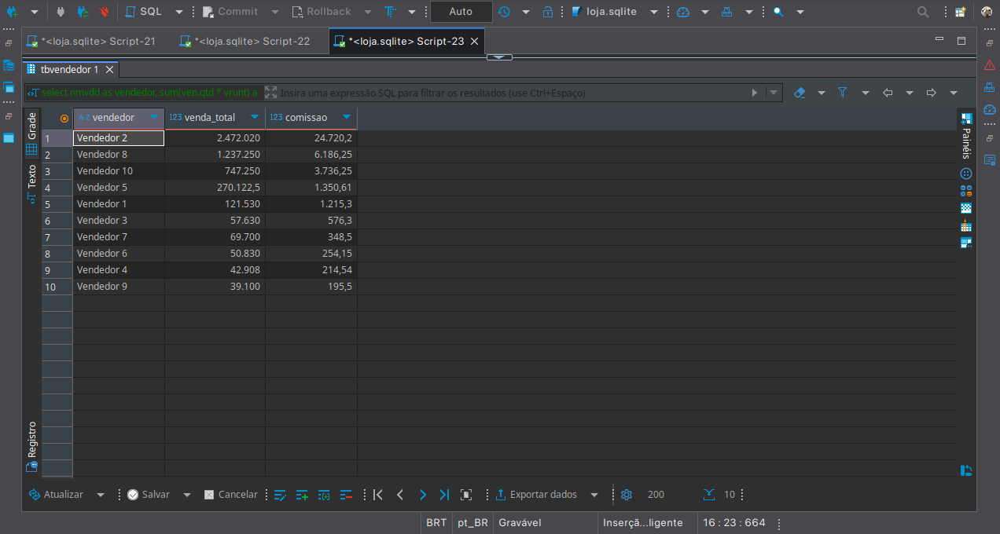

### Exercício 11

Ao executar o código do exercício 11, observei que, para encontrar o cliente com o maior gasto, precisei primeiro calcular o valor total de cada compra, multiplicando a quantidade (`qtd`) pelo valor unitário (`vrunt`), e nomeei essa coluna como `gasto`.

Para garantir a precisão, foi necessário usar a cláusula `WHERE` para filtrar apenas as vendas com status 'Concluído'. Em seguida, a cláusula `GROUP BY` foi aplicada para agrupar todas as compras por cliente (`cdcli`, `nmcli`), o que me permitiu somar o gasto total de cada um. Finalmente, para identificar aquele com maior gasto, o resultado foi organizado em ordem decrescente com a cláusula `ORDER BY gasto desc`, e a cláusula `LIMIT 1` foi usada para exibir apenas o  primeiro registro da lista, que era o `cdcli`, o `nmcli` e o `gasto` do cliente desejado.

Isso pode ser observado na imagem a seguir:

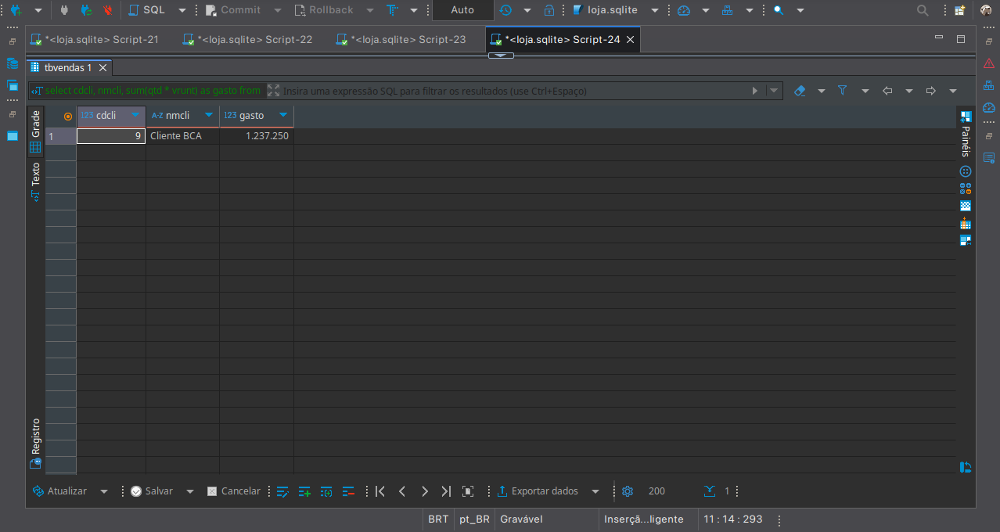

### Exercício 12

Para resolver o desafio do exercício 12, foi preciso adotar uma abordagem em duas fases, pois primeiro era necessário identificar o vendedor com o menor volume de vendas e, só então, buscar seus dependentes. A estratégia mais clara para isso foi usar uma cláusula `WITH` para criar uma tabela temporária chamada `vendedor`.

Nesta etapa inicial, calculei o `venda_total` de cada vendedor somando suas vendas da `tbvendas`, mas a cláusula `WHERE` garantiu que apenas as vendas com status 'Concluído' fossem consideradas. Em seguida, os resultados foram agrupados por vendedor (`GROUP BY cdvdd`), e a cláusula `HAVING` foi aplicada para filtrar e excluir os vendedores com vendas zeradas, um passo fundamental para atender ao requisito de "não sendo zero". Com a lista de vendedores e seus totais em mãos, ordenei o resultado do menor para o maior (`ORDER BY`) e usei `LIMIT 1` para isolar em nossa tabela temporária apenas o registro do vendedor com o menor volume de vendas.

Uma vez que a tabela temporária `vendedor` foi criada, contendo apenas o registro desejado, a segunda parte da tarefa tornou-se direta. A consulta final simplesmente selecionou o código, o nome e a data de nascimento da tabela `tbdependente` e juntou (`JOIN`) essas informações com a nossa tabela temporária. Como a tabela `vendedor` continha um único registro, esse `JOIN` funcionou como um filtro preciso, retornando na consulta final apenas os dependentes associados àquele vendedor específico, exibindo também o valor total de suas vendas.

Isso pode ser observado na imagem a seguir:

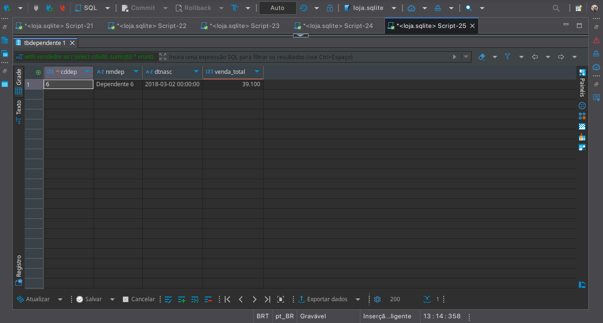

### Exercício 13

Para realizar a consulta do exercício 13, com objetivo de identificar os 10 produtos com o menor volume de vendas, considerando apenas os canais 'Ecommerce' e 'Matriz'. O primeiro passo foi filtrar os dados da tabela de vendas, utilizando a cláusula `WHERE` para definir duas condições essenciais: primeiro, que o `status` da venda fosse 'Concluído', garantindo a contagem apenas de transações efetivadas; e segundo, que o canal de venda (`nmcanalvendas`) estivesse na lista `('Ecommerce', 'Matriz')`, focando a análise apenas nos canais de interesse.

Com os dados já filtrados, o próximo passo foi somar as quantidades vendidas de cada produto. Para isso, usei a função `SUM(qtd)` e nomeei o resultado como `quantidade_vendas`. A parte fundamental aqui foi a cláusula `GROUP BY`, que agrupou os dados não só pelo código e nome do produto (`cdpro`, `nmpro`), mas também pelo canal de venda (`nmcanalvendas`). Isso foi crucial para obter a soma de vendas de um mesmo produto separadamente para 'Ecommerce' e para 'Matriz', caso ele fosse vendido em ambos.
Por fim, para encontrar os menos vendidos, o resultado foi organizado com a cláusula `ORDER BY quantidade_vendas`. Com a ordenação crescente, os produtos com as menores quantidades apareceram no topo da lista. A cláusula `LIMIT 10` foi então aplicada para restringir o resultado final a apenas esses 10 primeiros registros, cumprindo exatamente o que foi solicitado no enunciado.

Isso pode ser observado na imagem a seguir:

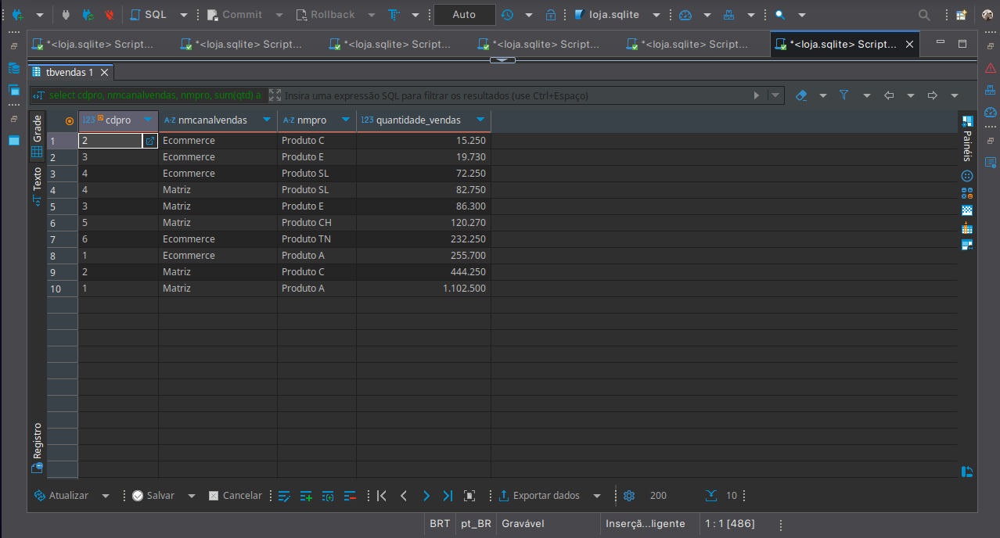


### Exercício 14

Esta consulta, tinha como objetivo calcular o gasto médio por estado, apresentando os resultados de forma clara e ordenada. 

Primeiramente, para garantir que o cálculo refletisse apenas o faturamento real, utilizei a cláusula `WHERE` para filtrar os dados e considerar exclusivamente as vendas com `status = 'Concluído'`. O passo seguinte e mais importante foi agrupar todas essas vendas por estado, usando a cláusula `GROUP BY estado`. Esse agrupamento foi essencial para que a função de agregação pudesse calcular a média separadamente para cada estado da federação.
Na cláusula `SELECT`, a operação principal foi realizada: a expressão `avg(qtd * vrunt)` calculou a média do valor de cada transação (quantidade multiplicada pelo valor unitário) para cada um dos estados que foram agrupados. Para atender à exigência de formatação do enunciado, essa função de média foi aninhada dentro da função `ROUND(..., 2)`, que arredondou o resultado final para duas casas decimais, e a coluna foi nomeada como `gastomedio`.
Por último, para que a visualização apresentasse os estados com maior gasto médio no topo da lista, a cláusula `ORDER BY gastomedio desc` foi usada para classificar o resultado final em ordem decrescente.

Isso pode ser observado na imagem a seguir:

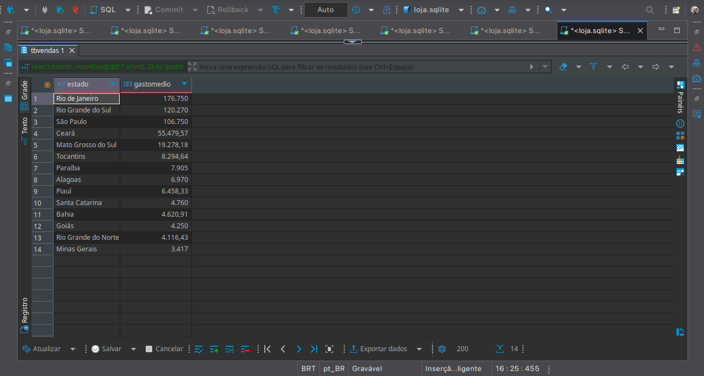

### Exercício 15

Para resolver esse exercício, a abordagem foi selecionar (`SELECT`) diretamente a coluna do código da venda, `cdven`, a partir da tabela `tbvendas`. A parte principal da lógica estava na cláusula `WHERE deletado = 1`, que atuou como um filtro para buscar e retornar apenas os registros em que o campo `deletado` estava marcado com o valor 1, que neste caso é usado para indicar um status verdadeiro de exclusão.
Por fim, para atender ao requisito de apresentação do resultado, a cláusula `ORDER BY cdven` foi adicionada para garantir que a lista de códigos de venda fosse exibida de forma organizada e em ordem crescente.

Isso pode ser observado na imagem a seguir:

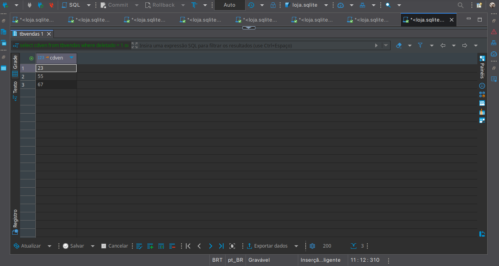

### Exercício 16

Para a consulta do exercício 16, o objetivo foi criar um relatório detalhado que mostrasse a quantidade média vendida de cada produto, com a análise separada por estado da federação.

Como primeiro passo, e seguindo a boa prática das consultas anteriores, utilizei a cláusula `WHERE status = 'Concluído'` para garantir que apenas as vendas finalizadas fossem incluídas na análise, o que assegura a precisão do cálculo da média.
O ponto central da consulta foi o agrupamento de dados. A cláusula `GROUP BY estado, nmpro` foi fundamental para criar grupos distintos para cada combinação única de estado e produto. Com essa estrutura definida, a função de agregação `AVG(qtd)` pôde calcular corretamente a quantidade média de itens vendidos para cada produto específico dentro de cada estado. Para atender ao requisito de formatação, o resultado dessa média foi então envolvido pela função `ROUND(..., 4)`, que o arredondou para quatro casas decimais, e a coluna foi nomeada como `quantidade_media`.
Finalmente, para organizar a apresentação dos resultados de forma lógica, apliquei uma ordenação de múltiplos níveis com a cláusula `ORDER BY estado, nmpro`. Isso fez com que a lista final fosse classificada primeiro pelo nome do estado em ordem alfabética e, em seguida, dentro de cada estado, os produtos também fossem listados em ordem alfabética, tornando o relatório final claro e fácil de consultar.

Isso pode ser observado na imagem a seguir:

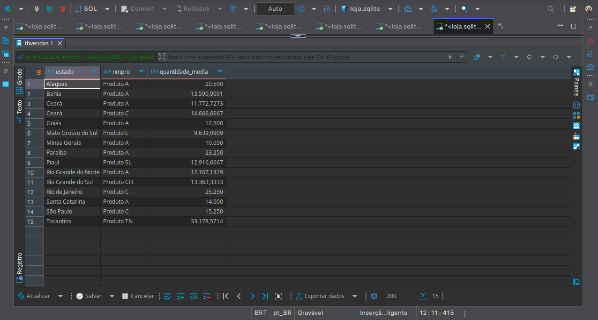

## Exercícios - Parte 2 

### Exercício 1

Para obter todos os dados necessários em uma única consulta, como o nome do autor e o nome da editora, que não estão na tabela `livro`, foi preciso combinar informações de três tabelas diferentes. Utilizei a cláusula `JOIN` para conectar a tabela `livro` (com o alias `l`) com a tabela `autor` (`a`) e também com a tabela `editora` (`e`), usando os códigos correspondentes para fazer a ligação correta entre elas.
Na cláusula `SELECT`, cada coluna foi cuidadosamente selecionada e, mais importante, renomeada usando um alias (como `l.cod as CodLivro`). Esse passo foi fundamental para garantir que os nomes dos cabeçalhos no resultado da consulta fossem idênticos aos exigidos na especificação do arquivo CSV (`CodLivro`, `Titulo`, `NomeAutor`, etc.).
Em seguida, para encontrar os livros mais caros, a cláusula `ORDER BY valor desc` foi aplicada para organizar a lista completa em ordem decrescente de preço. Com os livros já classificados do mais caro para o mais barato, a cláusula `LIMIT 10` foi usada para extrair apenas os 10 primeiros registros dessa lista.
Em seguida, o resultado final da query foi exportado em arquivo CSV. perfeitamente formatado com `;` (ponto e vírgula).

Isso pode ser observado na imagem a seguir:

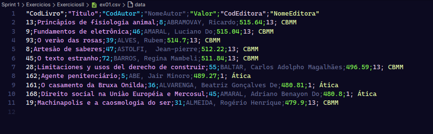

### Exercício 2

Neste exercício, o processo foi parecido com o anterior: a consulta foi criada com o objetivo de gerar dados para um arquivo de exportação, desta vez um CSV. com o separador `|` (pipe). A meta era encontrar as 5 editoras com a maior quantidade de livros cadastrados na biblioteca.

Para começar, foi necessário conectar a tabela de livros (`livro`) com a de editoras (`editora`). Isso foi feito com a cláusula `JOIN`, ligando as duas tabelas pelo código da editora. Essa união foi essencial para que pudéssemos contar os livros de cada editora e, ao mesmo tempo, obter o nome correspondente dela.
Com as tabelas já conectadas, o passo seguinte foi agrupar os dados por editora, usando `GROUP BY e.codeditora, e.nome`. Esse agrupamento permitiu que a função `COUNT(l.cod)` fosse aplicada para contar quantos livros pertenciam a cada uma das editoras. O resultado dessa contagem foi então nomeado como `QuantidadeLivros`, exatamente como pedia a especificação do arquivo final.
Na cláusula `SELECT`, os nomes das colunas foram definidos com aliases (`as CodEditora`, etc.) para que correspondessem perfeitamente aos cabeçalhos exigidos no arquivo CSV. Por fim, para identificar as 5 editoras com mais livros, a lista foi ordenada em ordem decrescente com `ORDER BY QuantidadeLivros desc`, e a cláusula `LIMIT 5` foi usada para selecionar apenas as 5 primeiras do ranking. O resultado final é foi uma tabela com duas editoras que eram as únicas no banco de dados com publicações. Em seguida fiz a exportação do arquivo requerido.

Isso pode ser observado na imagem a seguir:

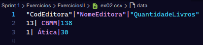
