# Etapas


1. ... [Etapa I](./etapa-1/etapa-1.ipynb)

## Preparando o Ambiente

Nesta fase inicial do desafio, foi realizado um procedimento de teste para certificar-se de que as bibliotecas essenciais para a análise e visualização de dados, `Pandas` e `Matplotlib`, estavam corretamente instaladas e operacionais no ambiente de desenvolvimento. 

Para validar a funcionalidade da biblioteca Pandas, foi criado um DataFrame, uma estrutura de dados bidimensional. Inicialmente, um dicionário Python foi definido para armazenar os dados.

Em seguida, este dicionário foi utilizado para instanciar um DataFrame através do comando `pd.DataFrame(dados)`. A correta exibição do DataFrame, com os nomes "Paulo" e "Maria" e suas respectivas idades, 24 e 27 , confirmou que a biblioteca Pandas estava funcionando como esperado.

Para a biblioteca Matplotlib, o teste consistiu na geração de um gráfico de barras simples. Foram utilizadas duas listas, uma para os nomes e outra para as idades.

A função `plt.bar(nomes, idades, color="green")` foi empregada para criar o gráfico, atribuindo os nomes ao eixo X e as idades ao eixo Y. O título "Teste da Biblioteca Matplotlib" e os rótulos dos eixos "Nomes" e "Idades" foram adicionados para contextualizar a visualização. A exibição bem-sucedida do gráfico de barras, demonstrando visualmente os dados de Paulo (24 anos) e Maria (27 anos), atestou a correta instalação e funcionamento da biblioteca Matplotlib.

Ambos os testes foram concluídos com sucesso, garantindo que o ambiente estava devidamente configurado para as próximas etapas do projeto.

Nessa etapa foram importadas as bibliotecas:

```
    # Importação da biblioteca Pandas
    import pandas as pd
    # Importação da biblioteca Matplotlib
    import matplotlib.pyplot as plt
```
    
Foi testado o funcionamento da biblioteca Pandas:

```

    dados = {
        "nome": ["Paulo", "Maria"],
        "idade": [24, 27]
    }

    df = pd.DataFrame(dados)

    print("Biblioteca Pandas Instalada e Funcionando!")
    display(df)

```

Obtive esse retorno:

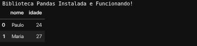


Foi testado o funcionamento da biblioteca MatplotLib:


```
    nomes  =  ["Paulo", "Maria"]
    idades = [24, 27]

    plt.bar(nomes, idades, color="green")
    plt.title("Teste da Biblioteca Matplotlib")
    plt.xlabel("Nomes")
    plt.ylabel("Idades")
    plt.show()

```

Obtive esse retorno:

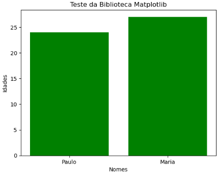


2. ... [Etapa II](./etapa-2/etapa-2.ipynb)

## Desenvolvimento


Nesta segunda etapa, foi realizada uma análise exploratória e tratamento de dados a partir do arquivo `googleplaystore.csv`. O objetivo foi limpar os dados, extrair informações relevantes e gerar visualizações para compreender o comportamento dos aplicativos na loja.

**1\. Preparação e Limpeza dos Dados**

- **Leitura e Remoção de Duplicatas**: O processo iniciou com a leitura do arquivo `googleplaystore.csv` para um DataFrame do Pandas. Em seguida, foram removidos os aplicativos duplicados, reduzindo o número de linhas de 10.841 para 9.660. A remoção foi feita mantendo a primeira ocorrência de cada aplicativo.
    
- **Correção de Dados**: Foi identificada e corrigida uma linha com dados deslocados para o aplicativo "Life Made WI-Fi Touchscreen Photo Frame". Os valores corretos foram atribuídos às suas respectivas colunas, garantindo a integridade do registro.
    

**2\. Análises e Visualizações**

- **Top 5 Aplicativos por Instalação**: A coluna `Installs` foi limpa, removendo caracteres como `+` e `,` e convertendo seu tipo para numérico. Após o tratamento, foram identificados os 5 aplicativos com maior número de instalações e apresentados em um gráfico de barras. Os aplicativos no topo da lista incluem "Subway Surfers", "Google Play Books" e "YouTube", todos com 1 bilhão de instalações.
    
- **Frequência de Aplicativos por Categoria**: Foi analisada a distribuição de aplicativos por categoria. As 5 categorias mais frequentes foram selecionadas e as demais agrupadas em "Outros" para melhor visualização. Um gráfico de pizza foi gerado, mostrando que a categoria "FAMILY" representa 19,0% dos aplicativos, enquanto "Outros" compõem a maior parte, com 54,1%.
    
- **Aplicativo Mais Caro**: A coluna `Price` foi tratada para remover o símbolo `$` e convertida para um tipo numérico. A análise revelou que o aplicativo mais caro é o "I'm Rich - Trump Edition", com um preço de $400.00.
    
- **Quantidade de Apps "Mature 17+"**: Foi realizada uma contagem na coluna `Content Rating`, que identificou a existência de 393 aplicativos com a classificação "Mature 17+".
    
- **Top 10 Aplicativos por Número de Reviews**: Após garantir que a coluna `Reviews` era do tipo numérico, os dados foram ordenados para listar os 10 aplicativos com o maior número de avaliações. "Facebook" e "WhatsApp Messenger" lideram a lista.
    

**3\. Cálculos Adicionais sobre o Dataset**

Foram realizados dois cálculos específicos para aprofundar a análise:

- **Top 5 Categorias com Maior Média de Avaliação**: Calculou-se a média de avaliação (`Rating`) por categoria. As 5 categorias com as maiores médias foram "EVENTS" (4.44), "EDUCATION" (4.36) e "ART_AND_DESIGN" (4.36). Os resultados foram apresentados em formato de lista e também em um gráfico de linhas para visualizar as pequenas variações entre as médias.
    
- **Porcentagem de Aplicativos Gratuitos**: Foi calculado que **92,17%** dos aplicativos no dataset são gratuitos. Para ilustrar essa proporção, foi criado um gráfico de rosca, uma alternativa visual ao gráfico de pizza, que mostrou a distribuição entre aplicativos pagos e gratuitos.

### Leitura da `googleplaystore.csv`
____

Nessa etapa pode-se perceber com esse código:
```
    df = pd.read_csv('../Arquivo/googleplaystore.csv')
    df
```

Obtive esse retorno:

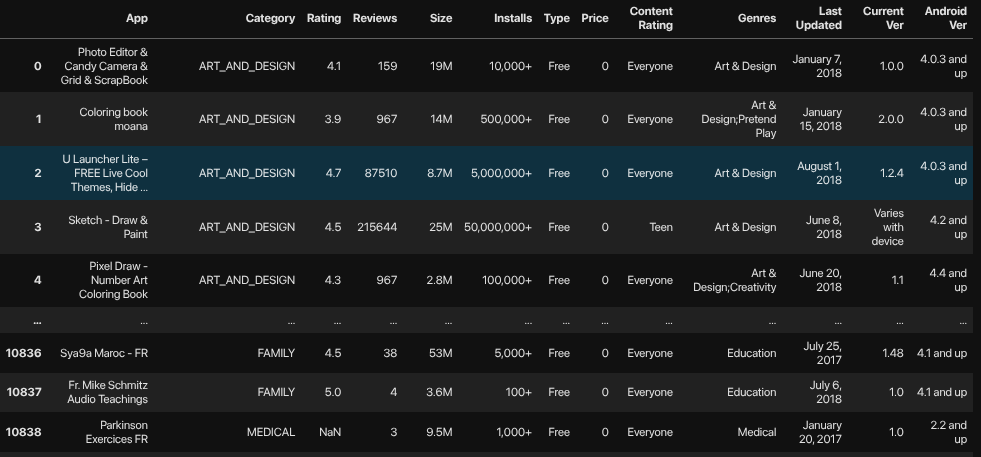

### Removendo Linhas Duplicadas e Corrigindo Linha
___

Nessa etapa pode-se perceber com esse código:
```        
    df_limpo = df.drop_duplicates(subset=['App'],keep='first').copy()
```

(Antes da remoção) Obtive esse retorno:

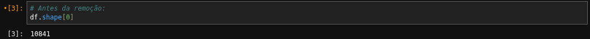

(Depois da remoção) Obtive esse retorno:

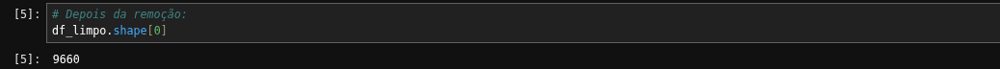

Na etapa da correção da linha pode-se perceber com esse código:

```
    idx = df_limpo[df_limpo['App'] == 'Life Made WI-Fi Touchscreen Photo Frame'].index[0]
    df_limpo.loc[[idx]]

    valores_corretos = [
    None,        
    1.9,               
    19,               
    '3.0M',             
    '1,000+',         
    'Free',            
    '0',               
    'Everyone',         
    None,        
    'February 11, 2018',
    '1.0.19',          
    '4.0 and up'     
    ]

    colunas_para_atualizar = [
        'Category', 'Rating', 'Reviews', 'Size', 'Installs',
        'Type', 'Price', 'Content Rating', 'Genres', 'Last Updated', 'Current Ver', 'Android Ver'
    ]

    for col, val in zip(colunas_para_atualizar, valores_corretos):
        df_limpo.loc[idx, col] = val

    df_limpo.loc[[idx]]
```

(Antes da correção) Obtive esse retorno:

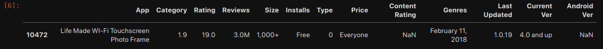

(Depois da correção) Obtive esse retorno:

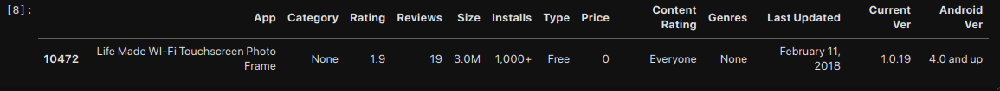

### Gráfico de Barras - Top 5 Apps por Número de Instalações
___

Nessa etapa pode-se perceber com esse código:

```        
    df_limpo['Installs'] = df_limpo['Installs'].astype(str)

    df_limpo['Installs'] = df_limpo['Installs'].str.replace('+', '', regex=False)
    df_limpo['Installs'] = df_limpo['Installs'].str.replace(',', '', regex=False)

    df_limpo['Installs'] = pd.to_numeric(df_limpo['Installs'], errors='coerce')

    df_limpo.dropna(subset=['Installs'], inplace=True)

    df_limpo['Installs'] = df_limpo['Installs'].astype(int)

    top_5_apps = df_limpo.sort_values(by='Installs', ascending=False).head(5)    
    top_5_apps[['App', 'Installs']]
```

Obtive esse retorno:

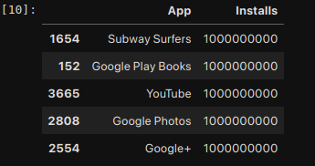

Na etapa de visualização, pode-se perceber com esse código:

```        

    plt.figure(figsize=(9, 7))

    plt.bar(top_5_apps['App'], top_5_apps['Installs'], color='deepskyblue')

    plt.xlabel('Aplicativos', fontsize=12, fontweight='bold')
    plt.ylabel('Número de Instalações', fontsize=12, fontweight='bold')
    plt.title('Top 5 Aplicativos por Número de Instalações', fontsize=16, fontweight='bold')

    plt.xticks(rotation=45, ha='right')

    plt.grid(False)

    ax = plt.gca()
    ax.get_yaxis().set_major_formatter(plt.FuncFormatter(lambda x, loc: "{:,}".format(int(x)).replace(",", ".")))

    plt.tight_layout()

    plt.show()
```

(Após a codificação para Gerar o Gráfico) Obtive esse retorno:

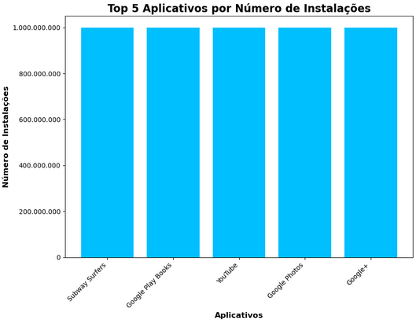

### Gráfico de Pizza para Frequência de Categorias 
___

Nessa etapa pode-se perceber com esse código:

```  

    contagem_categoria = df_limpo['Category'].value_counts()
    top_numero = 5
    top_categorias = contagem_categoria.head(top_numero)
    contagem_outros = contagem_categoria.iloc[top_numero:].sum()


    if contagem_outros > 0:
    top_categorias['Outros'] = contagem_outros
```

```      

    plt.figure(figsize=(14, 10))

    #Definição das cores do gráfico:
    cores = plt.get_cmap('summer_r', len(top_categorias))(np.arange(len(top_categorias)))

    fatias, texto, autotexto = plt.pie(top_categorias,
                                    labels=top_categorias.index,
                                    autopct='%1.1f%%',
                                    startangle=140,
                                    colors=cores,
                                    textprops={'fontsize': 14})

    plt.setp(autotexto, size=16, weight="bold", color='black')

    plt.title('Frequência de Aplicativos por Categoria (Top 5)', fontsize=20, fontweight='bold')

    plt.axis('equal')

    plt.show() 
```

Obtive esse retorno:

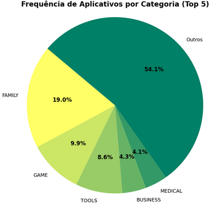


### App Mais Caro
____

Nessa etapa pode-se perceber com esse código:


```

    df_limpo['Price'] = df_limpo['Price'].astype(str).str.replace('$', '', regex=False)

    df_limpo['Price'] = pd.to_numeric(df_limpo['Price'], errors='coerce')

    df_limpo.dropna(subset=['Price'], inplace=True)
```

```

    indice_do_mais_caro = df_limpo['Price'].idxmax()

    app_mais_caro = df_limpo.loc[indice_do_mais_caro]

    print("========= O Aplicativo Mais Caro =========")
    print(f"Nome: {app_mais_caro['App']}")
    print(f"Preço: ${app_mais_caro['Price']:.2f}") 
    print("=========== Detalhes Completos ===========")
    print(app_mais_caro)

```

Obtive esse retorno:

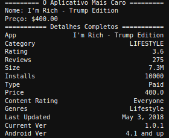

### Quantidade de Apps Classificados como 'Mature 17+'
___

Na etapa de visualização, pode-se perceber com esse código:

```

    contagem_classificacao = df_limpo['Content Rating'].value_counts()

    quantidade_mature_17 = contagem_classificacao['Mature 17+']

    print(f"A quantidade de aplicativos classificados como 'Mature 17+' é igual a {quantidade_mature_17}.")
```

Obtive esse retorno:


### Top 10 Apps por Número de Reviews
____

Nessa etapa pode-se perceber com esse código:

```
    df_limpo['Reviews'] = pd.to_numeric(df_limpo['Reviews'], errors='coerce')       
    df_limpo.dropna(subset=['Reviews'], inplace=True)       
    df_limpo['Reviews'] = df_limpo['Reviews'].astype(int)
```

```
    df_ordenado_por_reviews = df_limpo.sort_values(by='Reviews', ascending=False)
    top_10_reviews = df_ordenado_por_reviews.head(10)
    print("======== Top 10 Aplicativos por Número de Reviews ========")
    print(top_10_reviews[['App', 'Reviews']].to_string(index=False))

```

Obtive esse retorno:

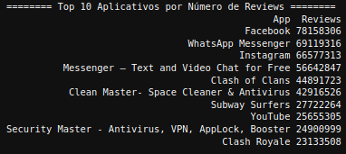

### Criação de 2 Cálculos sobre o Dataset
___

####  - Top 5 Categorias com Maior Média de Avaliação -  *Formato: Lista*

Nessa etapa pode-se perceber com esse código:

```

    df_limpo['Rating'] = pd.to_numeric(df_limpo['Rating'], errors='coerce')

    df_rating_ok = df_limpo.dropna(subset=['Rating'])

    media_por_categoria = df_rating_ok.groupby('Category')['Rating'].mean().sort_values(ascending=False)

    top5_df = media_por_categoria.head(5).reset_index()
    top5_df.columns = ['Categoria', 'Média de Avaliação']
    print(top5_df.to_string(index=False))

```

Obtive esse retorno:

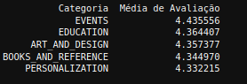

Na etapa de visualização, pode-se perceber com esse código:

```
    top5_df = media_por_categoria.head(5).reset_index()
    plt.figure(figsize=(10,6))

    plt.plot(top5_df['Category'], top5_df['Rating'], 
            marker='o',               
            linestyle='-',             
            linewidth=2,               
            color='green')   

    plt.title('Top 5 Categorias com Melhor Avaliação Média', fontsize=20, fontweight='bold')
    plt.ylabel('Média de Avaliação', fontsize=14, fontweight='bold')
    plt.ylim(4.3, 4.5)  
    for i, (categoria, nota) in enumerate(zip(top5_df['Category'], top5_df['Rating'])):
        plt.text(i, nota + 0.005, f"{nota:.2f}", ha='center', fontsize=10, color='black')
    plt.grid(True, linestyle='--', alpha=0.6)
    plt.tight_layout()
    plt.show()
```

Obtive esse retorno:

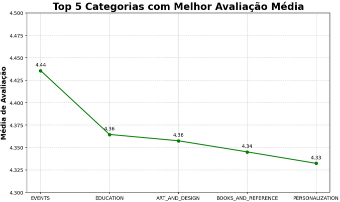


#### - Porcentagem de Aplicativos Gratuitos  -  *Formato: Valor*

Nessa etapa pode-se perceber com esse código:

```

    df_limpo.dropna(subset=['Type'], inplace=True)
    contagem_por_tipo = df_limpo['Type'].value_counts()
    apps_gratuitos = contagem_por_tipo['Free']
    total_de_apps = len(df_limpo)
    porcentagem_gratuitos = (apps_gratuitos / total_de_apps) * 100
    print(f"Porcentagem de Aplicativos Gratuitos: {porcentagem_gratuitos:.2f}%")
```

Obtive esse retorno:

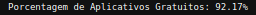


Na etapa de visualização, pode-se perceber com esse código:

```

    plt.figure(figsize=(10, 8))
    cores = ["#6CB174", "#6C84D6"]

    plt.pie(contagem_por_tipo,       
            labels=contagem_por_tipo.index,
            autopct='%1.1f%%',
            startangle=90,
            colors=cores,
            pctdistance=0.85, # Move a porcentagem para mais perto do centro
            textprops={'fontsize': 14, 'fontweight': 'bold'})

    circulo_central = plt.Circle((0, 0), 0.70, fc='white')
    fig = plt.gcf()
    fig.gca().add_artist(circulo_central)

    plt.title('Distribuição de Apps Gratuitos vs. Pagos', fontsize=20, fontweight='bold')
    plt.axis('equal')
    plt.show()
```

Obtive esse retorno:

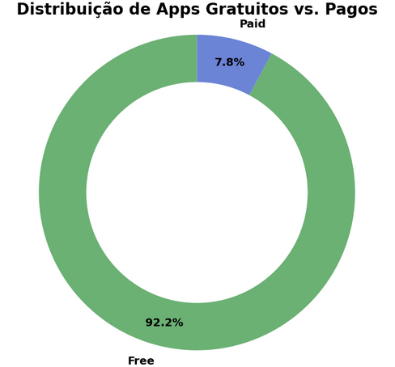

