# Resumo

**Python:** Aprendi sobre os conceitos fundamentais da linguagem, como sintaxe, o interpretador interativo, e os tipos de dados essenciais como listas, tuplas, dicionários e conjuntos. Meu aprendizado evoluiu para a criação de funções, explorando em profundidade os diferentes tipos de parâmetros (posicionais e nomeados), o uso de *args e **kwargs para argumentos variáveis, o funcionamento de decorators e a correta manipulação de argumentos mutáveis. O curso também me auxiliou no entendimento da programação funcional, apresentando conceitos como funções de primeira classe e o uso de lambdas. Um foco significativo foi dado à programação orientada a objetos, desde a criação de classes e herança até tópicos avançados como métodos "privados", sobrecarga de operadores, propriedades (@property), classes abstratas e herança múltipla.

**Ciência de Dados:** Pude entender como funcionam as três bibliotecas: Pandas, Numpy e Matplotlib. Com a biblioteca Pandas, aprendi a realizar a leitura e exportação de arquivos, a selecionar dados específicos utilizando o acessador .loc, a ordenar conjuntos de dados, a manipular colunas e a aplicar filtros complexos, tanto por condições lógicas quanto por expressões regulares (regex), além de agrupar dados com a função GROUP BY. No que diz respeito à computação numérica, estudei a biblioteca NumPy, compreendendo a criação e manipulação de arrays multidimensionais em 1D, 2D e 3D. Para a visualização de dados, adquiri conhecimentos em Matplotlib, o que me permite agora gerar e personalizar diversos tipos de gráficos para representar as informações analisadas.

# Exercícios

## Exercícios - Parte 1
1. ...
[Resposta Ex1.](./Exercicios/ExerciciosI/ex01.py)

2. ...
[Resposta Ex2.](./Exercicios/ExerciciosI/ex02.py)

3. ...
[Resposta Ex3.](./Exercicios/ExerciciosI/ex03.py)

4. ...
[Resposta Ex4.](./Exercicios/ExerciciosI/ex04.py)

5. ...
[Resposta Ex5.](./Exercicios/ExerciciosI/ex05.py)

6. ...
[Resposta Ex6.](./Exercicios/ExerciciosI/ex06.py)

7. ...
[Resposta Ex7.](./Exercicios/ExerciciosI/ex07.py)

8. ...
[Resposta Ex8.](./Exercicios/ExerciciosI/ex08.py)

9. ...
[Resposta Ex9.](./Exercicios/ExerciciosI/ex09.py)

10. ...
[Resposta Ex10.](./Exercicios/ExerciciosI/ex10.py)

11. ...
[Resposta Ex11.](./Exercicios/ExerciciosI/ex11.py)

12. ...
[Resposta Ex12.](./Exercicios/ExerciciosI/ex12.py)

13. ...
[Resposta Ex13.](./Exercicios/ExerciciosI/ex13.py)

14. ...
[Resposta Ex14.](./Exercicios/ExerciciosI/ex14.py)

## Exercícios - Parte 2

15. ...
[Resposta Ex15.](./Exercicios/ExerciciosII/ex15.py)

16. ...
[Resposta Ex16.](./Exercicios/ExerciciosII/ex16.py)

17. ...
[Resposta Ex17.](./Exercicios/ExerciciosII/ex17.py)

18. ...
[Resposta Ex18.](./Exercicios/ExerciciosII/ex18.py)

19. ...
[Resposta Ex19.](./Exercicios/ExerciciosII/ex19.py)

20. ...
[Resposta Ex20.](./Exercicios/ExerciciosII/ex20.py)

21. ...
[Resposta Ex21.](./Exercicios/ExerciciosII/ex21.py)

22. ...
[Resposta Ex22.](./Exercicios/ExerciciosII/ex22.py)

23. ...
[Resposta Ex23.](./Exercicios/ExerciciosII/ex23.py)

24. ...
[Resposta Ex24.](./Exercicios/ExerciciosII/ex24.py)

25. ...
[Resposta Ex25.](./Exercicios/ExerciciosII/ex25.py)

26. ...
[Resposta Ex20.](./Exercicios/ExerciciosII/ex26.py)

## Exercícios - ETL

1. ...
[Resposta Etapa 1.](./Exercicios/Exercico-ETL/etapa-1.py)

2. ...
[Resposta Etapa 2.](./Exercicios/Exercico-ETL/etapa-2.py)

3. ...
[Resposta Etapa 3.](./Exercicios/Exercico-ETL/etapa-3.py)

4. ...
[Resposta Etapa 4.](./Exercicios/Exercico-ETL/etapa-4.py)

5. ...
[Resposta Etapa 5.](./Exercicios/Exercico-ETL/etapa-5.py)

# Evidências

## Exercícios - Parte 1

### Exercício 1

Este código  tem como objetivo principal filtrar uma lista de números inteiros para extrair apenas os valores ímpares. Partindo de uma lista inicial a contendo dez elementos, o programa emprega uma *list comprehension* (`[num for num in a if num % 2 != 0]`), uma construção concisa da linguagem, para criar uma nova lista chamada `impares`. Durante este processo, cada número da lista original é verificado pela condição `num % 2 != 0`, que efetivamente seleciona apenas os números cujo resto da divisão por 2 é diferente de zero. Como resultado, o programa gera e, ao final, imprime a lista `impares`, cuja saída no console é `[1, 9, 25, 49, 81]`.

Isso pode ser observado na imagem a seguir:

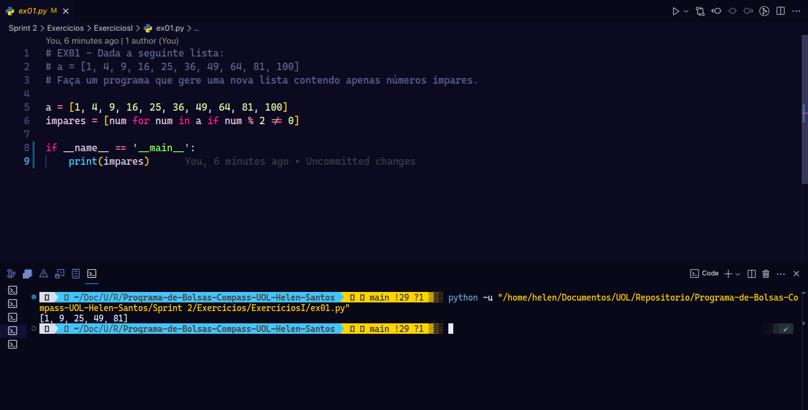

### Exercício 2

Para o exercício 02, houve a finalidade da verificação se  cada palavra de uma lista pré-definida seria um palíndromo ou não. Esse código percorre cada item da lista `['maça', 'arara', 'audio', 'radio', 'radar', 'moto']` através de um laço de repetição. A lógica central para a verificação está na expressão `palavra == palavra[::-1]`, onde `palavra[::-1]` é um recurso de fatiamento que inverte a string. Se a palavra original for idêntica à sua versão invertida, o programa imprime que ela é um palíndromo; caso contrário, informa que não é, resultando em uma frase de diagnóstico para cada palavra da lista.

Isso pode ser observado na imagem a seguir:

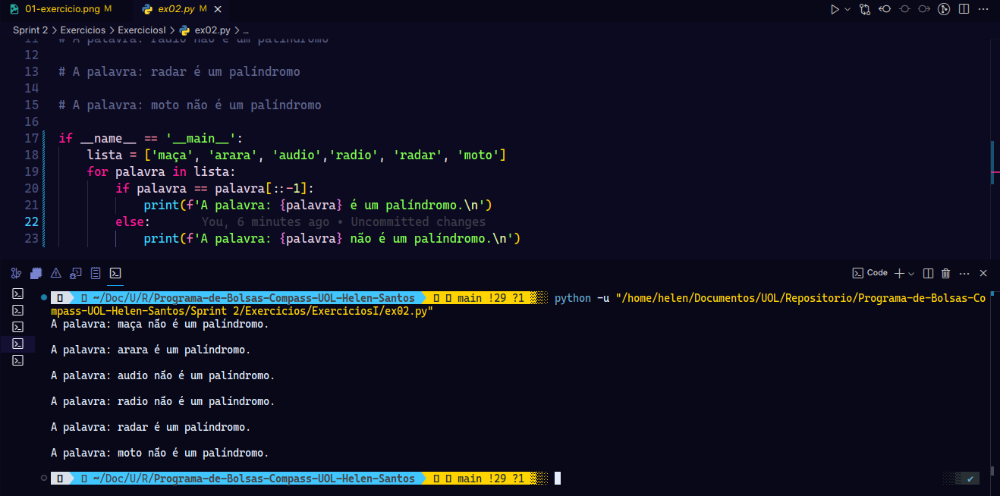

### Exercício  3

No exercício 03, o objetivo do código é consolidar informações de uma pessoa que estão distribuídas em três listas diferentes: `primeirosNomes`, `sobreNomes` e `idades`. Utilizando um laço `for`, o programa itera simultaneamente sobre as três listas de forma sincronizada, graças à combinação das funções `zip` e `enumerate`. A função `zip` agrupa os elementos correspondentes de cada lista (o primeiro nome com o primeiro sobrenome e a primeira idade, e assim por diante), enquanto a função `enumerate` adiciona um contador que serve como índice para cada grupo. A cada iteração, os dados agrupados (índice, nome, sobrenome e idade) são inseridos em uma string formatada que é impressa no console, seguindo a estrutura "índice - primeiroNome sobreNome está com idade anos".

Isso pode ser observado na imagem a seguir:

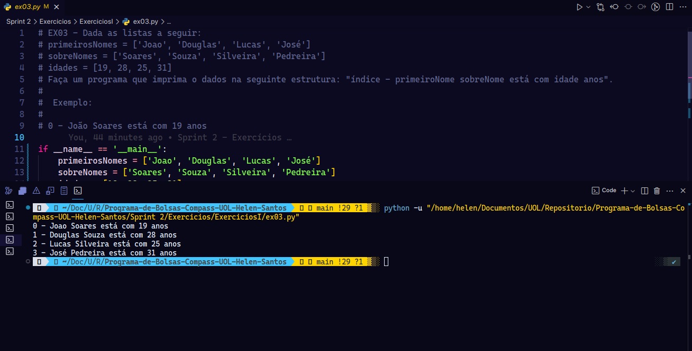

### Exercício 4

No exercício 04, o código define uma função chamada `semDuplicacao` com o objetivo de remover elementos duplicados de uma lista. Ao receber uma lista, a função primeiro a converte para um conjunto (`set`). A principal característica da estrutura de dados `set` é que ela, por definição, não permite elementos repetidos, eliminando automaticamente todas as duplicatas. Em seguida, o resultado é convertido de volta para uma lista com `list()` e retornado. 

Isso pode ser observado na imagem a seguir:

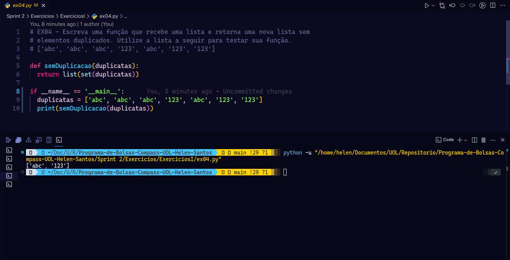

### Exercício 5

Para o exercício 05, é demonstrado a leitura e processamento do conteúdo do arquivo no formato JSON chamado `person.json`. Primeiramente, ele utiliza o módulo `os` para construir de forma dinâmica e segura o caminho até o arquivo, garantindo que o script funcione independentemente do diretório a partir do qual é executado. Em seguida, ele abre o arquivo especificado usando o gerenciador de contexto `with`, que assegura o fechamento correto do arquivo após a leitura. A função `json.load()` é então utilizada para fazer o "parsing", ou seja, para analisar o texto contido no arquivo JSON e convertê-lo em uma estrutura de dados, como um dicionário ou uma lista. 

Isso pode ser observado na imagem a seguir:

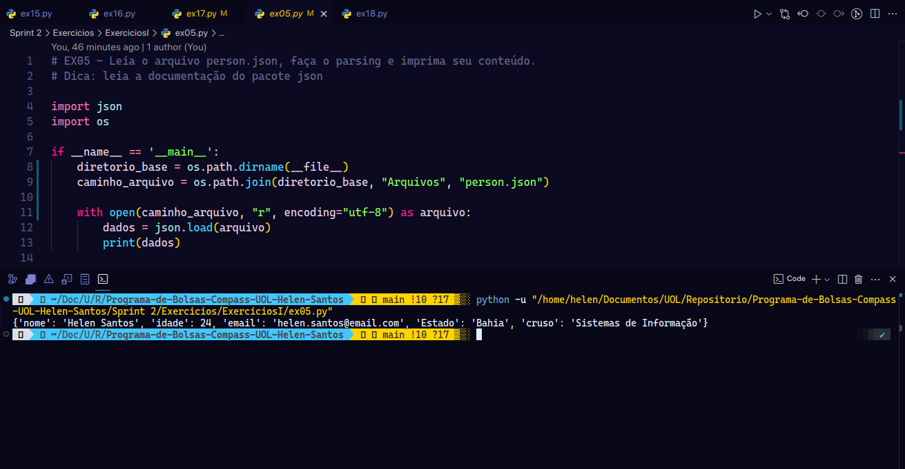

### Exercício 6

No exercício 06, o código implementa uma função personalizada chamada `my_map`. Esta função aceita dois argumentos: uma lista e uma outra função. O seu mecanismo de funcionamento consiste em percorrer cada elemento da lista de entrada, aplicar a função recebida a este elemento e armazenar o resultado em uma nova lista. Ao final do processo, a nova lista com os resultados é retornada. Para demonstrar sua aplicação, o programa a testa com uma lista de números de 1 a 10 e uma função auxiliar, `potencia_de_dois`, que calcula 2 elevado à potência de cada número, imprimindo a lista resultante.

Isso pode ser observado na imagem a seguir:

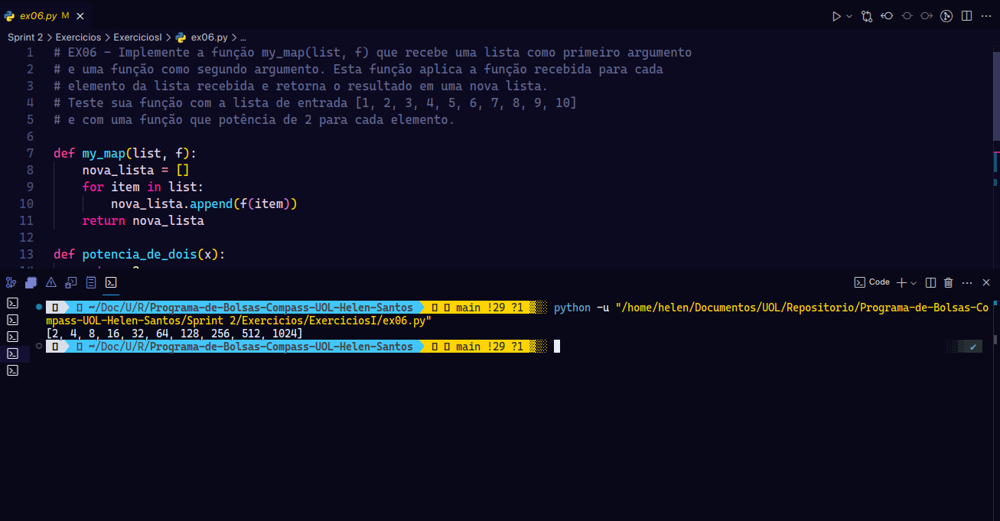

### Exercício 7

O exercício 07 tem como objetivo ler o conteúdo de um arquivo de texto, chamado `arquivo_texto.txt`, e exibi-lo no console. Para isso, ele primeiramente constrói o caminho dinâmico até o arquivo utilizando o módulo `os`, o que torna o script mais robusto e portável. Em seguida, ele utiliza o comando `with open` para abrir o arquivo de forma segura, garantindo que ele seja fechado automaticamente após o uso. O método `readlines()` é empregado para ler todas as linhas do arquivo e armazená-las em uma lista. Por fim, o código itera sobre essa lista e imprime cada linha individualmente, utilizando o método `strip()` para remover quaisquer espaços em branco ou quebras de linha no início ou no fim de cada linha antes da impressão.

Isso pode ser observado na imagem a seguir:

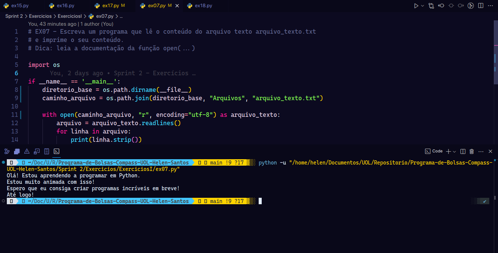

### Exercício 8

No exercício 08, o código define uma função, `mostrar_parametros`, projetada para aceitar e exibir um número indefinido de argumentos, tanto posicionais (não nomeados) quanto nomeados. A função utiliza as sintaxes especiais `*posicional` para agrupar todos os argumentos posicionais em uma tupla e `**nomeado` para agrupar todos os argumentos nomeados em um dicionário. Em sua execução, ela primeiro itera sobre a tupla de argumentos posicionais, imprimindo o índice e o valor de cada um. Em seguida, faz o mesmo para o dicionário de argumentos nomeados, imprimindo a chave (nome do parâmetro) e o valor correspondente. 

Isso pode ser observado na imagem a seguir:

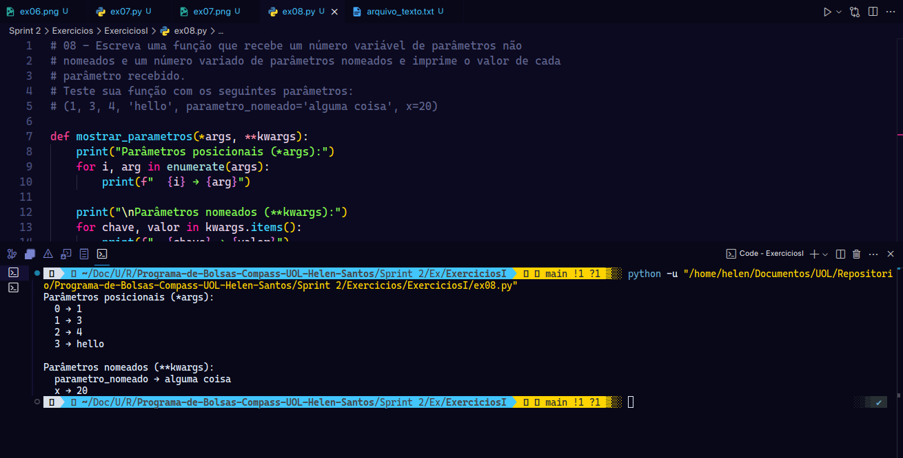

### Exercício 9

O exercício 09 consiste na implementação de uma classe `Lampada` para simular o comportamento de uma lâmpada, que pode estar ligada ou desligada. O estado da lâmpada, um valor booleano, é inicializado através do construtor da classe. A classe possui três métodos principais: `liga()`, que define o estado como `True` (ligada); `desliga()`, que define o estado como `False` (desligada); e `esta_ligada()`, que simplesmente retorna o valor booleano do estado atual. O código de teste demonstra o ciclo de vida de um objeto `Lampada`, que é criado, ligado, tem seu estado verificado e impresso, e em seguida é desligado, com seu estado final sendo verificado e impresso novamente.

Isso pode ser observado na imagem a seguir:

### Exercício 10

No exercício 10, é implementada uma função, `soma_numeros`, que calcula a soma total de números fornecidos dentro de uma única string, onde estão separados por vírgulas. A função primeiramente utiliza o método `split(',')` para quebrar a string de entrada em uma lista de strings menores, cada uma contendo um número. Em seguida, ela percorre essa nova lista e, para cada item, converte a string para um número inteiro usando `int()`, acumulando o valor em uma variável de soma. Ao final do laço, a função retorna a soma total.

Isso pode ser observado na imagem a seguir:

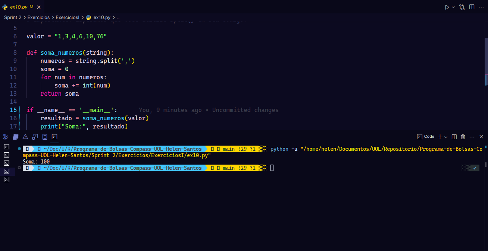

### Exercício 11

O exercício 11 apresenta uma função chamada `dividir_funcao`, cujo propósito é repartir uma lista em três partes iguais. O mecanismo de funcionamento se baseia em primeiro calcular o tamanho de cada uma das três seções, dividindo o comprimento total da lista por 3 com uma divisão inteira. Posteriormente, a função utiliza a técnica de fatiamento de listas (slicing) para extrair e criar as três novas listas correspondentes a cada terço da lista original. O programa principal testa essa função com uma lista de 12 números e, por fim, imprime cada uma das três sub-listas resultantes separadamente.

Isso pode ser observado na imagem a seguir:

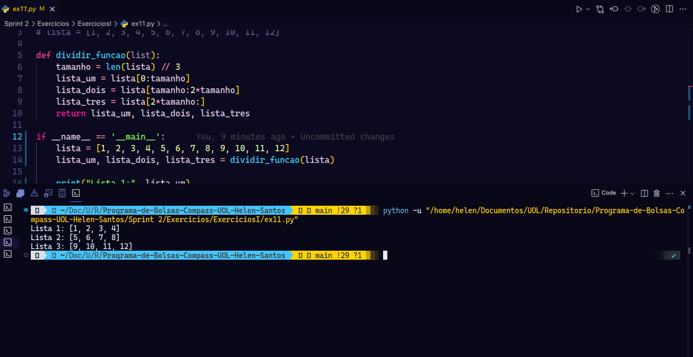

### Exercício 12

No exercício 12, foi  extraído os valores de um dicionário, em seguida eles foram apresentados em uma lista sem duplicatas. Partindo de um dicionário chamado `speed`, o código primeiro utiliza o método `.values()` para obter todos os seus valores. Em seguida, para eliminar as repetições, ele emprega um artifício comum: converte a lista de valores para um conjunto (`set`), que por sua natureza não permite elementos duplicados, e imediatamente converte o conjunto de volta para uma lista.

Isso pode ser observado na imagem a seguir:

### Exercício 13

O código do exercício 13 realiza uma análise estatística básica sobre uma lista de números gerada aleatoriamente. Primeiramente, ele cria uma lista com 50 números inteiros únicos, amostrados do intervalo de 0 a 499, utilizando a função `random.sample`. Na sequência, calcula quatro métricas: o valor mínimo e o máximo são obtidos com as funções `min()` e `max()`; a média é calculada somando-se todos os itens com `sum()` e dividindo pelo total de itens com `len()`; e a mediana é calculada ordenando-se a lista e encontrando a média dos dois valores centrais, um procedimento correto para listas com um número par de elementos. Ao final, o programa imprime os quatro valores calculados: mediana, média, mínimo e máximo.

Isso pode ser observado na imagem a seguir:

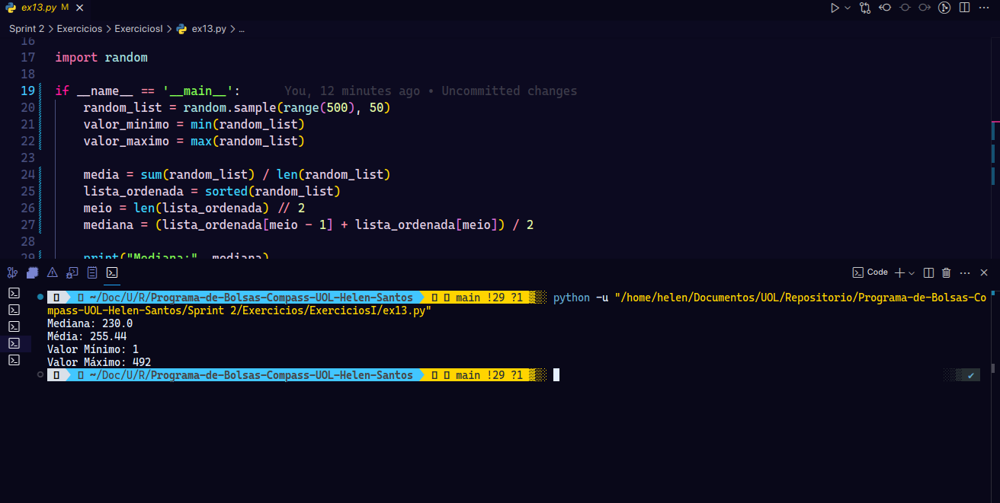

### Exercício 14

O programa do exercício 14 executa uma tarefa simples e direta: a inversão da ordem dos elementos de uma lista pré-definida. Para realizar essa operação, o código utiliza um recurso de fatiamento, a notação `[::-1]`. Aplicada à lista `a`, a expressão `a[::-1]` cria uma nova lista que é uma cópia da original, porém com todos os seus elementos dispostos em ordem reversa, do último para o primeiro. Por fim, o programa simplesmente imprime essa nova lista invertida no console.

Isso pode ser observado na imagem a seguir:

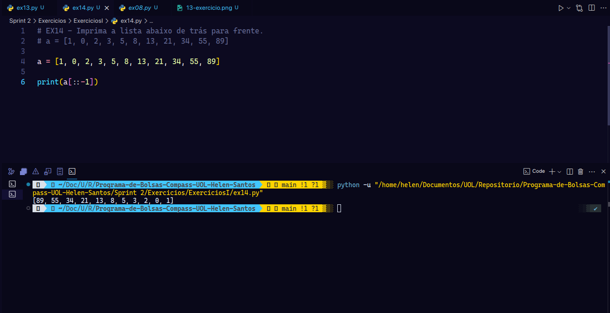

## Exercícios - Parte 2 

### Exercício 15

No exercício 15, o código demonstra os conceitos de herança e polimorfismo da programação orientada a objetos. Uma superclasse `Passaro` é criada com métodos genéricos para `voar` e `emitir_som`. Duas subclasses, `Pato` e `Pardal`, herdam de `Passaro`, o que lhes permite usar o método `voar` sem modificações. Contudo, ambas as subclasses sobrescrevem o método `emitir_som` para fornecer implementações específicas e distintas, fazendo com que o pato emita "Quack Quack" e o pardal "Piu Piu". O programa principal então instancia um objeto de cada subclasse e invoca seus métodos para mostrar como compartilham um comportamento (voar) e especializam outro (emitir som).

Isso pode ser observado na imagem a seguir:

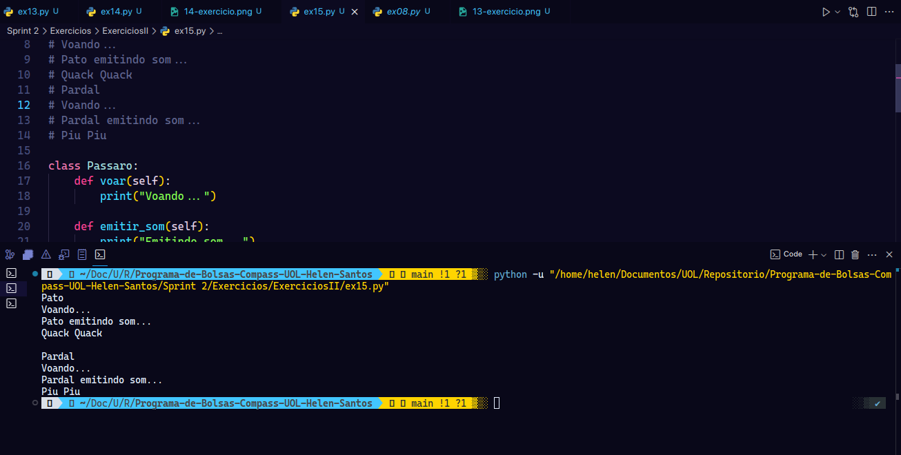

### Exercício 16

O exercício 16 foca em encapsulamento e no uso de `properties` para gerenciar o acesso a atributos. A classe `Pessoa` possui um atributo público `id` e um atributo privado `__nome`. Para controlar o acesso ao atributo privado, o código utiliza os decoradores `@property` para criar um método "getter" (que permite a leitura de `__nome` através de `pessoa.nome`) e `@nome.setter` para criar um método "setter" (que permite a alteração de `__nome` através de `pessoa.nome = 'novo valor'`). Essa abordagem permite que o atributo seja manipulado como se fosse público, mas com a lógica de acesso controlada internamente pela classe, conforme demonstrado no código de teste.

Isso pode ser observado na imagem a seguir:

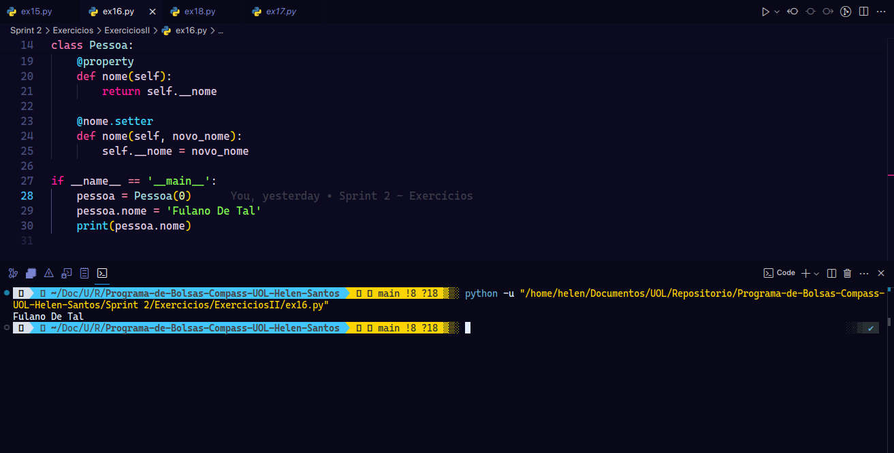

### Exercício 17

O programa do exercício 17 define uma classe simples chamada `Calculo`, que serve como um agrupador para métodos de operações matemáticas. A classe contém dois métodos: `soma`, que aceita dois números e retorna a soma deles, e `subtracao`, que também recebe dois números e retorna a diferença entre eles. O bloco de execução principal cria uma instância da classe `Calculo` e a utiliza para executar e imprimir os resultados de uma soma e uma subtração com valores de exemplo, demonstrando de forma direta a funcionalidade da classe.

Isso pode ser observado na imagem a seguir:

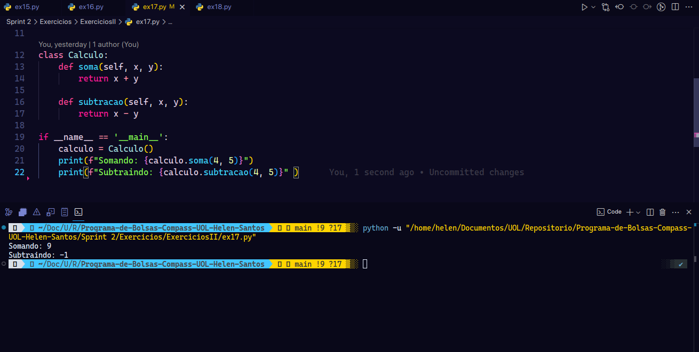

### Exercício 18

No exercício 18, o código define uma classe `Ordenadora` que encapsula uma lista e fornece métodos para ordená-la. O construtor da classe recebe uma lista e a armazena em um atributo. A classe possui dois métodos, `ordenacaoCrescente` e `ordenacaoDecrescente`, que utilizam a função `sorted()` para retornar uma nova lista com os elementos ordenados de forma crescente ou decrescente, respectivamente. O programa principal demonstra o uso da classe ao criar dois objetos distintos, cada um com uma lista desordenada diferente, e em seguida chama o método de ordenação apropriado para cada um, imprimindo os resultados.

Isso pode ser observado na imagem a seguir:

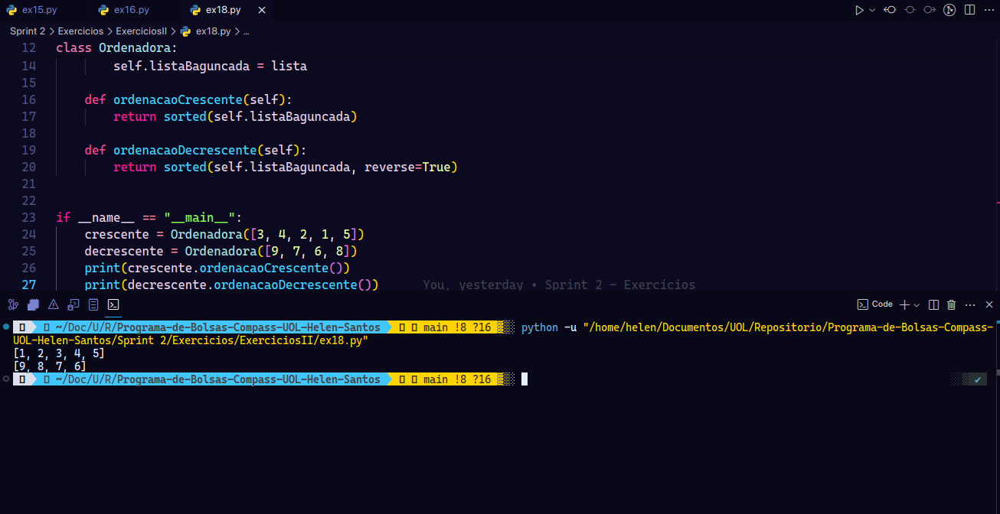

### Exercício 19

O exercício 19 consiste na criação de uma classe `Aviao` para modelar aviões com atributos específicos. Notavelmente, o atributo `cor` é definido como um atributo de classe com o valor fixo "azul", o que significa que todas as instâncias de `Aviao` compartilharão essa mesma cor. O construtor da classe, por sua vez, inicializa os atributos de instância: `modelo`, `velocidade_maxima` e `capacidade`. O código principal então cria três objetos `Aviao` com dados distintos, armazena-os em uma lista e itera sobre ela, imprimindo uma frase formatada que descreve detalhadamente cada avião, combinando seus atributos de instância e o atributo de classe compartilhado.

Isso pode ser observado na imagem a seguir:

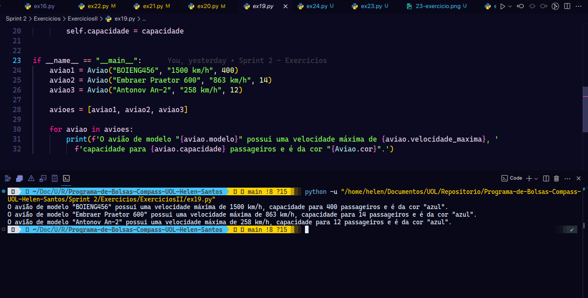

### Exercício 20

O programa do exercício 20 demonstra uma abordagem de programação funcional para processar um arquivo com uma grande quantidade de números. O objetivo é encontrar os cinco maiores valores pares e a soma destes. Para isso, o código estabelece um pipeline de processamento: primeiramente, lê todas as linhas do arquivo e usa a função `map` para converter cada linha de string para inteiro. Em seguida, a função `filter` com uma expressão `lambda` é usada para selecionar apenas os números pares. A função `sorted` organiza esses números pares em ordem decrescente e, por fim, um fatiamento de lista captura os cinco maiores, cuja soma é calculada com a função `sum`. 

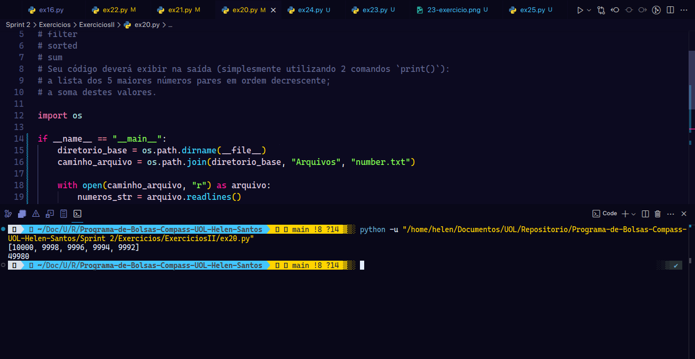

### Exercício 21

O programa do exercício 21 implementa a função `conta_vogais` que, utilizando uma abordagem de programação funcional, calcula a quantidade de vogais em uma string. A solução emprega a função `filter` em conjunto com uma expressão `lambda` para iterar sobre a string de entrada e selecionar apenas os caracteres que pertencem a uma lista predefinida de vogais. O resultado do filtro, que é um iterador, é convertido para uma lista, e a função `len` é então utilizada para obter o comprimento dessa lista, que corresponde ao número total de vogais encontradas.

Isso pode ser observado na imagem a seguir:

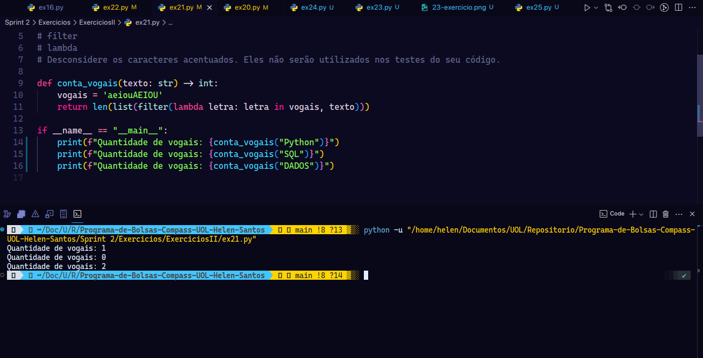

### Exercício 22

No exercício 22, a função `calcula_saldo` processa uma lista de lançamentos bancários para determinar o saldo final. O código aplica uma sequência de funções de alta ordem, iniciando com `map`, que percorre a lista de tuplas e, através de uma `lambda`, converte o valor de cada lançamento para negativo se for um débito ('D') ou o mantém positivo se for um crédito ('C'). Em seguida, a função `reduce` é utilizada para acumular (somar) todos esses valores já convertidos, resultando no saldo final da conta.

Isso pode ser observado na imagem a seguir:

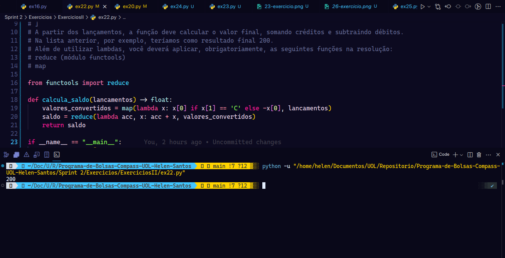

### Exercício 23

O exercício 23 define a função `calcular_valor_maximo`, que realiza uma série de cálculos e retorna o maior resultado. A função `zip` é usada para emparelhar uma lista de operadores matemáticos com uma lista de pares de operandos. Em seguida, a função `map` itera sobre esses pares, e uma `lambda` com expressões condicionais aninhadas aplica a operação correspondente (+, -, \*, /, %) a cada par de operandos. Por fim, a função 
`max` é aplicada ao resultado do `map` para encontrar e retornar o maior valor dentre todos os cálculos realizados.

Isso pode ser observado na imagem a seguir:

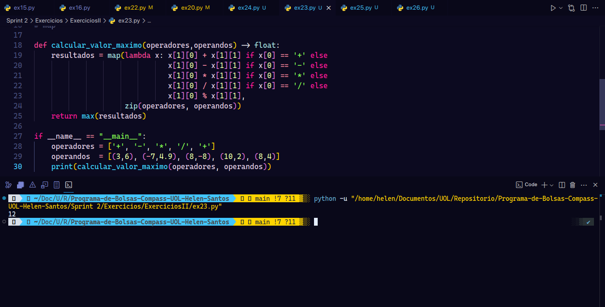

### Exercício 24

O programa do exercício 24 tem como objetivo processar um arquivo CSV (`estudantes.csv`), que contém nomes e notas de estudantes, para gerar um relatório formatado e ordenado. Inicialmente, o código lê todas as linhas do arquivo. Em seguida, ele itera sobre cada uma, separando o nome do estudante de suas cinco notas. A função `map` é utilizada para converter as notas de string para inteiro. Para cada estudante, o programa ordena suas notas em ordem decrescente com a função `sorted` e seleciona as três maiores. A média dessas três notas é então calculada e arredondada para duas casas decimais com `round`. As informações processadas (nome, as três maiores notas e a média) são armazenadas em uma lista. Por fim, essa lista é ordenada alfabeticamente pelo nome do estudante, utilizando `sorted` com uma função `lambda` como chave, e um laço final percorre a lista ordenada para imprimir os dados de cada aluno no formato especificado.

Isso pode ser observado na imagem a seguir:

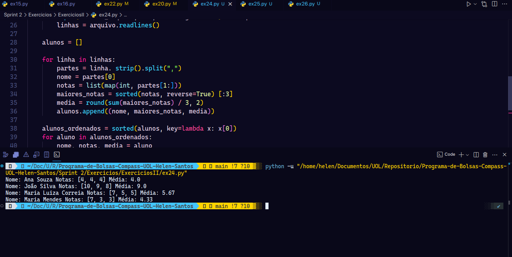

### Exercício 25

O programa do exercício 25 define a função `maiores_que_media`, que recebe um dicionário de produtos e seus preços e retorna uma lista com os itens cujo valor é superior à média. Primeiramente, a função calcula o preço médio de todos os produtos do dicionário. Em seguida, ela utiliza a função `filter` em conjunto com uma expressão `lambda` para percorrer os itens do dicionário e selecionar apenas aqueles cujo preço é estritamente maior que a média calculada. Por fim, a função `sorted`, também utilizando uma `lambda` como chave de ordenação, organiza a lista de produtos filtrados em ordem crescente de preço antes de retorná-la. O bloco principal do código testa a função com um dicionário de exemplo e imprime o resultado final.

Isso pode ser observado na imagem a seguir:

### Exercício 26

O programa do exercício 26 implementa uma função geradora, `pares_ate`, cujo objetivo é produzir uma sequência de números pares em um determinado intervalo. A função recebe um número `n` como limite e, utilizando um laço, percorre todos os números de 2 até `n`. A palavra-chave `yield` é o elemento central do código, pois transforma a função em um gerador: em vez de retornar uma lista completa de uma só vez, a função pausa sua execução a cada número par encontrado, "entregando" (yielding) esse valor. O bloco principal demonstra o consumo desse gerador, utilizando um laço `for` que, a cada iteração, solicita o próximo valor ao gerador e o imprime na tela, resultando na exibição de todos os números pares de 2 a 10.

Isso pode ser observado na imagem a seguir:

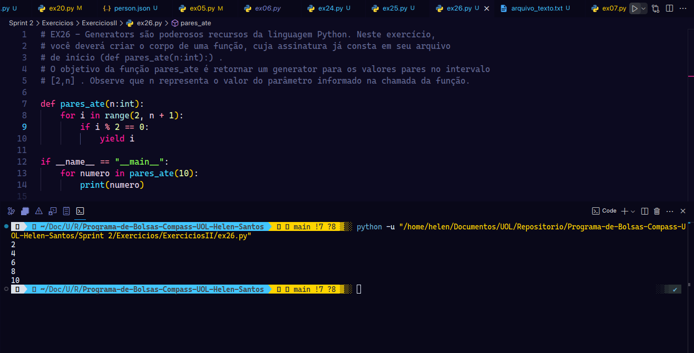

## Exercícios - ETL

### Etapa 1

O programa da Etapa 1 realiza a análise do arquivo CSV, `actors.csv`, com o objetivo de identificar o ator ou atriz com o maior número de filmes. A função principal primeiramente lê o arquivo, determinando dinamicamente as posições das colunas "Actor" e "Number of Movies" a partir do cabeçalho. Em seguida, ela itera por cada linha de dados, extraindo o nome do artista e a quantidade de filmes. Durante a iteração, o script compara o número de filmes de cada ator com o valor máximo encontrado até o momento, atualizando o nome e a quantidade máxima sempre que um novo recorde é estabelecido. O processo é envolto em um bloco `try-except` para garantir a execução mesmo com eventuais falhas de formato nos dados. Ao final, o resultado, uma frase indicando o nome do ator com mais filmes e a respectiva quantidade, é impresso no console e também salvo no arquivo de texto chamado `etapa-1.txt`.

Isso pode ser observado na imagem a seguir:

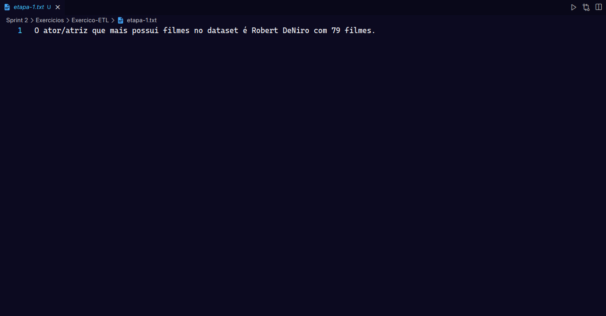

### Etapa 2

A Etapa 2 tem como finalidade calcular a receita bruta média dos filmes listados no arquivo `actors.csv`. Para isso, o script primeiro lê o arquivo e identifica a coluna "Gross". Em seguida, ele percorre cada linha, realizando um tratamento de dados para lidar com casos em que o nome do ator contém vírgulas, o que poderia quebrar a linha incorretamente. Para cada filme, o valor da receita bruta é limpo, removendo-se caracteres como `$` e vírgulas, e então convertido para um número. O script acumula a soma total da receita e a quantidade de filmes com dados válidos. Ao final, ele calcula a média dividindo a receita total pelo número de filmes, formata o resultado para duas casas decimais e o salva no arquivo `etapa-2.txt`, além de exibi-lo no console.

Isso pode ser observado na imagem a seguir:

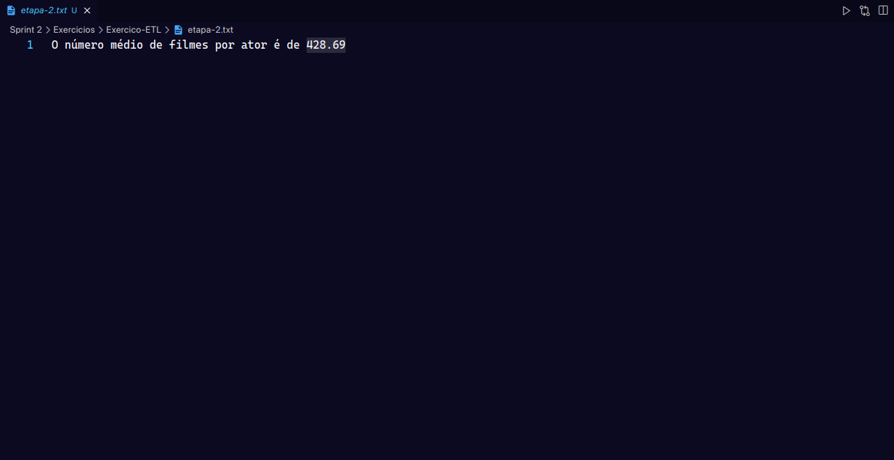

### Etapa 3

O programa da Etapa 3 foi desenvolvido para identificar, a partir do arquivo `actors.csv`, qual ator ou atriz possui a maior média de bilheteria por filme. O script inicia lendo o arquivo e localizando a coluna "Average per Movie" no cabeçalho. Em seguida, ele processa o arquivo linha por linha, tratando possíveis inconsistências nos dados, como nomes de atores que contêm vírgulas. Para cada registro, o valor da média de bilheteria é extraído e comparado com o maior valor encontrado até aquele momento. Se a média do ator atual for superior, o script atualiza o recorde, guardando o novo valor e o nome do respectivo ator. Ao final da leitura, o programa formata uma frase com o nome do ator de maior média e o valor correspondente, que é então exibido no console e salvo no arquivo `etapa-3.txt`.

Isso pode ser observado na imagem a seguir:

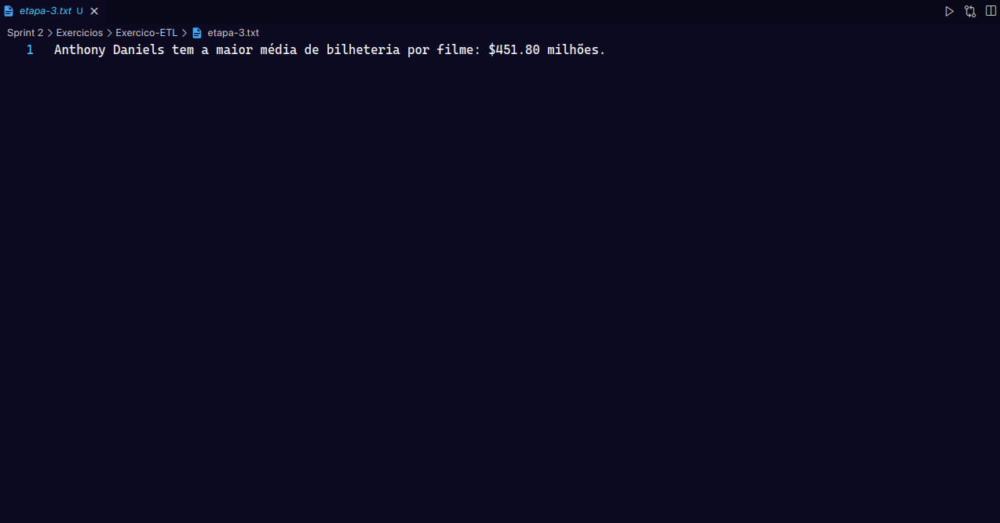

### Etapa 4

O programa da Etapa 4 foi criado para analisar a frequência com que cada filme aparece como o principal sucesso de um ator (a coluna "#1 Movie") no arquivo `actors.csv`. O script lê o arquivo e, para cada linha, extrai o nome do filme principal. Utilizando um dicionário, ele conta quantas vezes cada filme é mencionado. Após processar todo o arquivo, o programa ordena a lista de filmes. A ordenação é feita de forma primária pela contagem de aparições (do maior para o menor) e, como critério de desempate, pelo nome do filme em ordem alfabética. Por fim, o resultado, uma lista formatada indicando a contagem de cada filme, é salvo no arquivo `etapa-4.txt` e também exibido no console.

Isso pode ser observado na imagem a seguir:

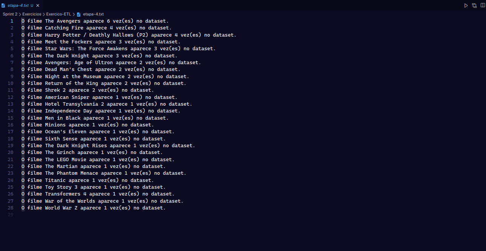

### Etapa 5

O programa da Etapa 5 foi projetado para criar um ranking de atores com base em sua receita bruta total, extraída do arquivo `actors.csv`. O script processa cada linha do arquivo, extraindo o nome do ator e o valor da sua receita bruta total. Após limpar os dados, removendo caracteres como `$` e vírgulas do valor da receita, ele armazena o nome do ator e o valor numérico correspondente em uma lista. Concluída a leitura, a lista é ordenada em ordem decrescente, colocando os atores com maior receita no topo. Por fim, o programa gera o ranking formatado, que é salvo integralmente no arquivo `etapa-5.txt` e tem seus 10 primeiros colocados exibidos no console.

Isso pode ser observado na imagem a seguir:

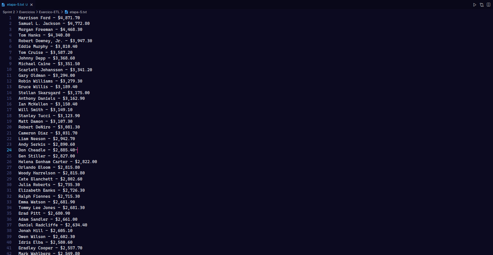

