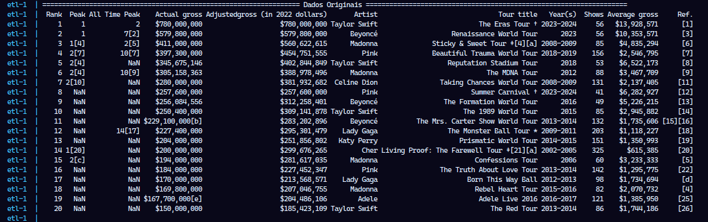
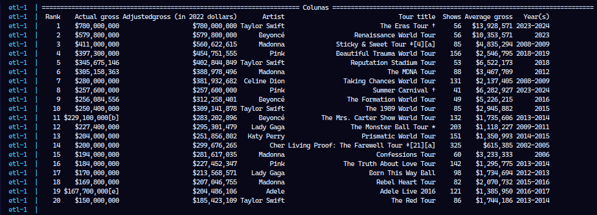
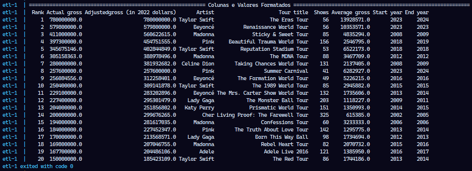
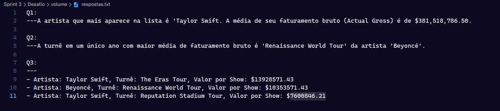
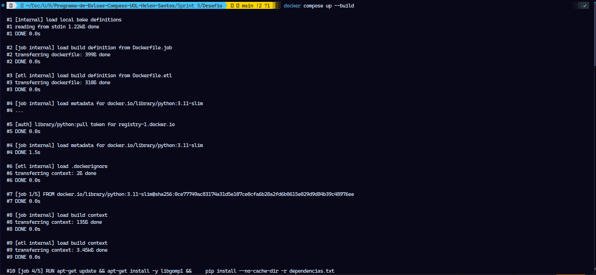
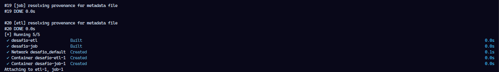
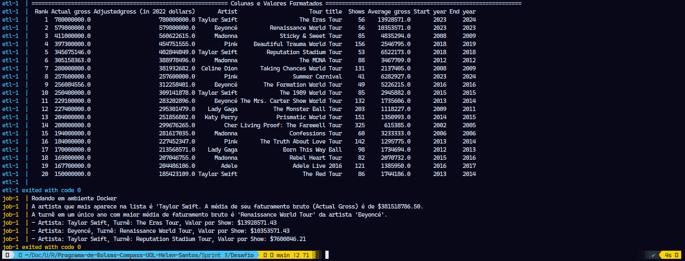
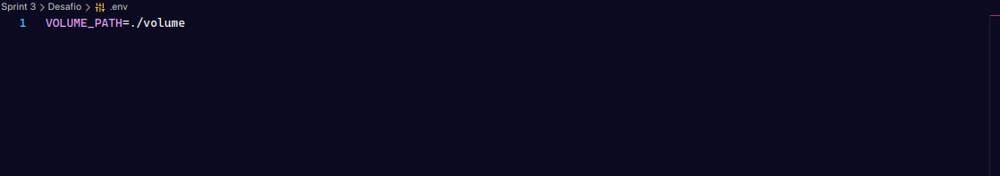
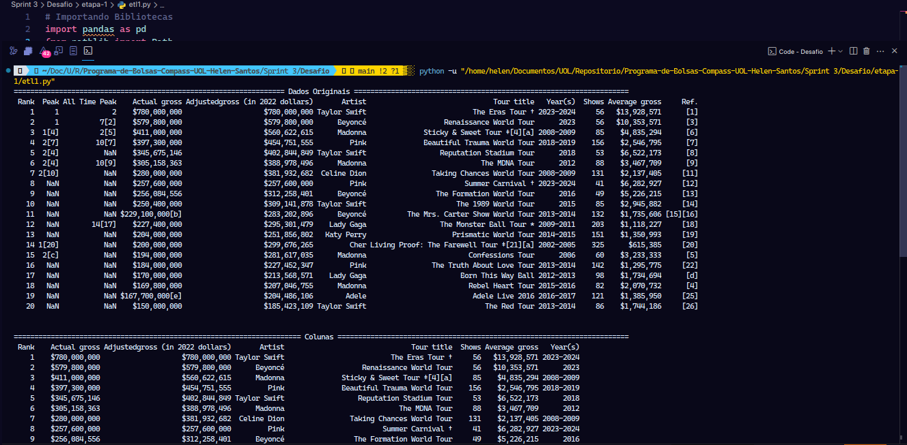
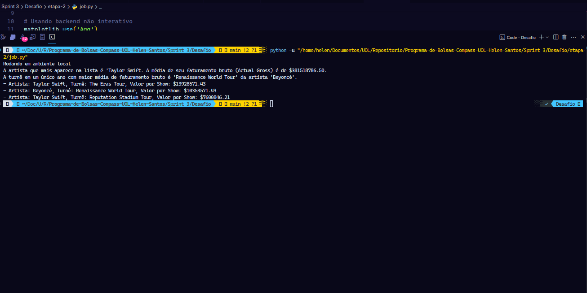

# Como Executar o Desafio Completo

Com o ambiente preparado, todo o fluxo de trabalho pode ser executado com um único comando a partir da pasta raiz Desafio:

```
docker compose up --build
```

Este comando irá:

1\. Construir as imagens Docker para os serviços `etl1` e `job`, instalando todas as dependências.

2\. Iniciar o container `desafio-etl-1` , que irá ler o arquivo original da pasta `volume/`, limpá-lo e salvar o `csv_limpo.csv` na mesma pasta.

3\. O container `desafio-job-1` irá ler o csv_limpo.csv da pasta `volume/`, realizar as análises e salvar os resultados ecomo `respostas.txt`, `Q4.png` e `Q5.png` na pasta `volume/`.


# Etapas

Neste desafio, foi desenvolvido um pipeline completo de dados para processar e analisar informações sobre as turnês mais lucrativas de artistas femininas. O projeto foi dividido em duas etapas principais: a primeira focada na limpeza e preparação dos dados (ETL), e a segunda na análise e geração de relatórios e visualizações. Todo o fluxo de trabalho é executado em um ambiente containerizado com Docker e Docker Compose para garantir a reprodutibilidade e a facilidade de execução.


1. ... [Código(Etapa I)](./etapa-1/etl1.py)
--
       [Dockerfile(Etapa I)](./Dockerfile.etl)

## Script `etl1.py`

Nesta primeira etapa, o script etl1.py é responsável por realizar o processo de ETL (Extração, Transformação e Carga). O objetivo é preparar os dados brutos do arquivo `concert_tours_by_women.csv` para a análise, gerando outro aqrquivo limpo e estruturado.

Dados Originais:



### **1\. Preparação e Leitura dos Dados**

- **Leitura do CSV**: O processo inicia com a leitura do arquivo `concert_tours_by_women.csv` para um DataFrame do Pandas. Foi implementada uma lógica para detectar o ambiente de execução (local ou Docker), garantindo que os caminhos para os arquivos sejam resolvidos corretamente em ambos os cenários.
    
    ```
    import pandas as pd
    from pathlib import Path as Path
    
    if Path('/app/dados').exists():
        # Ambiente Docker
        pasta_dados = Path('/app/dados')
    else:
        pasta_dados = Path(__file__).resolve().parent.parent / "volume"
    
    caminho_entrada = pasta_dados / "concert_tours_by_women.csv"
    df = pd.read_csv(caminho_entrada)
    ```

   
### **2\. Limpeza e Transformação**

- **Seleção de Colunas**: Inicialmente foram selecionadas apenas as colunas relevantes para a análise por meio do código abaixo:

```
colunas_mantidas=[
    'Rank',
    'Actual gross',
    'Adjustedgross (in 2022 dollars)',
    'Artist',
    'Tour title',
    'Shows',
    'Average gross',
    'Year(s)',
]
df_modificado = df[colunas_mantidas].copy()
print()

```

Obtive o seguinte resultado:



- **Limpeza de Colunas**: . A coluna `Tour title` passou por um processo de limpeza para remover caracteres especiais, referências (ex: `[1]`, `†`) e asteriscos, padronizando os nomes das turnês.

    ```    
    df_modificado['Tour title'] = df_modificado['Tour title'].str.replace(r'†|‡|\[.*?\]|\*', '', regex=True).str.strip()
    ```

- **Tratamento de Valores Monetários**: As colunas de faturamento (`Actual gross`, `Adjustedgross (in 2022 dollars)`, `Average gross`) foram tratadas para remover símbolos monetários (`$`), vírgulas (`,`), colchetes (`[]`) e letras. Em seguida, foram convertidas para o tipo numérico (float) e depois formatadas como strings com uma casa decimal, uma etapa crucial para padronizar a apresentação dos dados na fase de análise."
    
    ```   
    colunas_valores = [
        'Actual gross',
        'Adjustedgross (in 2022 dollars)',
        'Average gross'
    ]

    for coluna in colunas_valores:
        df_modificado[coluna] = df_modificado[coluna].astype(str)
        
        df_modificado[coluna] = df_modificado[coluna].str.replace(r'[$,\[\]a-zA-Z]', '', regex=True).str.strip()

        df_modificado[coluna] = pd.to_numeric(df_modificado[coluna], errors='coerce')  
        
        df_modificado[coluna] = df_modificado[coluna].map(lambda x: f"{x:.1f}" if pd.notnull(x) else "")

    ```

- **Conversão de coluna `Shows`**: Os valores da coluna foram convertidos para o tipo númerico.

    ```
    df_modificado['Shows'] = pd.to_numeric(df_modificado['Shows'], errors='coerce')
    ``` 

- **Criação de Colunas de Data**: A coluna `Year(s)`, que continha intervalos de anos (ex: "2008-2009"), foi dividida para criar duas novas colunas, `Start year` e `End year`. Para turnês que ocorreram em um único ano, o valor de `Start year` foi replicado em `End year`, garantindo a consistência dos dados. Em seguida, a coluna `Year(s)` é removida.
    
    ```
    df_modificado[['Start year', 'End year']] = df_modificado['Year(s)'].str.split('-', n=1, expand=True)
    df_modificado['End year'] = df_modificado['End year'].fillna(df_modificado['Start year'])
    df_modificado.drop(columns=['Year(s)'], inplace=True)
   
    df_modificado.drop(columns=['Year(s)'], inplace=True)
    ```

*Obs: O arquivo só será gerado caso o código seja executado localmente ou via Dokcer!*

Arquivo Limpo Gerado:

[DataFrame Limpo - Imagem](./volume/csv_limpo.csv)

DataFrame após a limpeza:




### **3\. Carga dos Dados Limpos**

- **Salvando o CSV Limpo**: Ao final do processo, o DataFrame limpo e transformado é salvo como `csv_limpo.csv` na pasta `volume/`, pronto para ser consumido pela etapa de análise.

```
df_modificado.to_csv(caminho_saida, index=False)
```

## `Dockerfile.etl`

O arquivo `Dockerfile.etl`, localizado na pasta raiz `Desafio`, é a "planta" para construir o container responsável pela primeira etapa do nosso pipeline: a limpeza e transformação dos dados. Ao colocá-lo na raiz, permitimos que o Docker tenha acesso a todas as pastas do projeto durante o processo de construção, o que é uma prática recomendada para projetos com múltiplos componentes.

Este Dockerfile começa com uma imagem oficial e leve do Python (`FROM python:3.11-slim`), garantindo um ambiente limpo e otimizado para a execução do script `etl1.py`. O diretório `/app` é definido como o diretório de trabalho principal dentro do container, de modo que todos os comandos seguintes serão executados a partir deste local. Para a instalação de dependências, o processo primeiro copia o arquivo `dependencias.txt` para dentro do container e em seguida executa `pip install` para instalar as bibliotecas necessárias, neste caso o `pandas`. Na cópia dos arquivo da aplicação, o script `etl1.py` é copiado da pasta local `etapa-1/` para a raiz do diretório de trabalho (`/app`) no container. É importante notar que o arquivo de dados `concert_tours_by_women.csv` não é copiado para a imagem, o que é intencional, pois os dados são fornecidos ao container em tempo de execução através de um volume compartilhado definido no `docker-compose.yml`, tornando a imagem mais flexível e reutilizável.

```
FROM python:3.11-slim
WORKDIR /app
COPY dependecias.txt .
RUN pip install --no-cache-dir -r dependecias.txt
COPY etapa-1/etl1.py .
CMD ["python", "etl1.py"]
```

2. ... [Código(Etapa II)](./etapa-2/job.py)
--
       [Dockerfile(Etapa II)](./Dockerfile.job)

## Script `job.py`

Na segunda etapa, o script `job.py` foi criado para consumir o arquivo `csv_limpo.csv` com o intuito de realizar as análises e responder a cinco questões de negócio, gerando um relatório em texto e dois gráficos.

### 1\. Iniciando Ambiente e Definindo Diretórios 

O trecho de código abaixo, realiza a configuração inicial do ambiente e carregamento dos dados para análise. Primeiro, o matplotlib.use('Agg') configura o matplotlib para usar um backend não interativo, o que é essencial para gerar gráficos em ambientes sem interface gráfica como containers Docker, permitindo salvar as imagens diretamente em arquivos sem tentar exibi-las na tela. Em seguida, o código implementa uma detecção automática de ambiente verificando se o diretório `/app/dados` existe, se existir, determina que está rodando em ambiente Docker e usa esse caminho como `pasta_volume`, caso contrário, assume que está em ambiente local e constrói o caminho relativo navegando dois diretórios acima do arquivo atual e acessando a pasta `volume`. 

```
matplotlib.use('Agg')

if Path('/app/dados').exists():
    pasta_volume = Path('/app/dados')
else:   
    pasta_volume = Path(file).resolve().parent.parent / "volume"

pasta_volume.mkdir(parents=True, exist_ok=True)

caminho_entrada = pasta_volume / "csv_limpo.csv"

df_limpo = pd.read_csv(caminho_entrada)

```

Após definir o caminho correto, o código garante que a pasta de destino existe criando-a com `mkdir(parents=True, exist_ok=True)`, onde `parents=True` cria diretórios pais se necessário e `exist_ok=True` evita erros se a pasta já existir. Finalmente, define o caminho de entrada como `csv_limpo.csv` dentro da pasta volume e carrega os dados usando `pd.read_csv()`. Esta estrutura permite que o mesmo código funcione tanto localmente quanto em containers Docker sem modificações, adaptando-se automaticamente ao ambiente de execução.

### 2\. Análises e Respostas Geradas

• **Q1 - Qual é a artista que mais aparece nessa lista e possui a maior média de seu faturamento bruto (Actual gross)?**

```
contar_artistas = df_limpo['Artist'].value_counts()
maximo_aparicoes = contar_artistas.max()
artista_frequentes = contar_artistas[contar_artistas == maximo_aparicoes].index.tolist()

top_artista = None
maximo_faturamento = 0

for artista in artista_frequentes:
    df_artista = df_limpo[df_limpo['Artist'] == artista]
    media_faturamento = df_artista['Actual gross'].mean()

    if media_faturamento > maximo_faturamento:
        maximo_faturamento = media_faturamento
        top_artista = artista

resposta_q1 = (
    f"A artista que mais aparece na lista é '{top_artista}. A média de seu faturamento bruto (Actual Gross) é de ${maximo_faturamento:.2f}."
)

print(resposta_q1)

```

Este trecho de código resolve a primeira questão identificando a artista mais frequente com maior média de faturamento bruto através de um processo em duas etapas. Primeiro, usa `value_counts()` na coluna `Artist` para contar quantas vezes cada artista aparece no dataset, depois encontra o número máximo de aparições com `max()` e cria uma lista de todos os artistas que têm esse número máximo de aparições usando indexação booleana e `tolist()`, o que é necessário porque pode haver empate entre múltiplas artistas. Em seguida, inicializa as variáveis de controle `top_artista` como None e `maximo_faturamento` como zero para rastrear qual artista tem a maior média de faturamento. O loop itera sobre cada artista mais frequente, filtrando o DataFrame para obter apenas as turnês daquela artista específica usando `df_limpo[df_limpo['Artist'] == artista]`, calcula a média do faturamento bruto dessas turnês com `mean()` na coluna `Actual gross`, e compara essa média com o valor máximo atual armazenado. Quando encontra uma artista com média de faturamento superior, atualiza tanto `maximo_faturamento` quanto `top_artista` com os novos valores. Finalmente, formata a resposta usando f-string com formatação monetária `{maximo_faturamento:.2f}` que mostra duas casas decimais, imprimindo o resultado que identifica a artista mais frequente e sua respectiva média de faturamento bruto.

• **Q2 - Das turnês que aconteceram dentro de um ano, qual a turnê com a maior média de faturamento bruto (Average gross)?**

```
df_limpo['Start year'] = df_limpo['Start year'].astype(str)
df_limpo['End year'] = df_limpo['End year'].astype(str)
df_um_ano = df_limpo[df_limpo['Start year'] == df_limpo['End year']].copy()
turne_maior_media = df_um_ano.loc[df_um_ano['Average gross'].idxmax()]
resposta_q2 = f"A turnê em um único ano com maior média de faturamento bruto é '{turne_maior_media['Tour title']}' da artista '{turne_maior_media['Artist']}'."
print(resposta_q2)
```

 Para essa questão foi implementado esse código que busca identificar a turnê realizada dentro de um único ano com a maior média de faturamento bruto. O processo inicia convertendo as colunas `Start year` e `End year` para string usando `astype(str)` para garantir que a comparação entre elas funcione corretamente. Em seguida, filtra o DataFrame original criando `df_um_ano` que contém apenas as linhas onde o ano de início é igual ao ano de fim (`df_limpo['Start year'] == df_limpo['End year']`), identificando assim as turnês que aconteceram dentro de um único ano, e usa `.copy()` para criar uma cópia independente dos dados filtrados. Depois, utiliza `idxmax()` na coluna 'Average gross' para encontrar o índice da linha que contém o maior valor de média de faturamento bruto dentro desse subset de turnês de um ano, e usa `loc[]` para acessar toda a linha correspondente a esse índice, armazenando o resultado em `turne_maior_media`. Finalmente, formata a resposta usando f-string para extrair o título da turnê (`turne_maior_media['Tour title']`) e o nome da artista (`turne_maior_media['Artist']`) da linha selecionada, criando uma mensagem informativa que identifica qual turnê de um único ano teve a maior média de faturamento bruto e qual artista a realizou.

• **Q3 - Quais são as 3 turnês que possuem o show (unitário) mais lucrativo? Cite também o nome de cada artista e o valor por show. Utilize a coluna "Adjusted gross (in 2022 dollars)". Caso necessário, crie uma coluna nova para essa conta.**

```
df_limpo['Lucro por show'] = df_limpo['Adjustedgross (in 2022 dollars)'] / df_limpo['Shows']
top_3 = df_limpo.sort_values(by='Lucro por show', ascending=False).head(3)

resposta_q3_lista = []

for index, row in top_3.iterrows():
    # Formatando valor do lucro por show 
    lucro_formatado = f"${row['Lucro por show']:.2f}"
    
    # Criando texto para cada turnê e a adiciona na lista
    resposta_q3_lista.append(
       f"- Artista: {row['Artist']}, Turnê: {row['Tour title']}, Valor por Show: {lucro_formatado}"
    )

resposta_q3 = "\n".join(resposta_q3_lista)
print(resposta_q3)
```

Este segmento de código aborda a terceira questão calculando quais são as três turnês com shows unitários mais lucrativos. A análise começa criando uma nova coluna chamada `Lucro por show` que divide o faturamento ajustado para 2022 ('Adjustedgross (in 2022 dollars)') pela quantidade de shows ('Shows'), obtendo assim o valor de receita por apresentação individual de cada turnê. Na sequência, ordena todo o DataFrame pelos valores dessa nova coluna em ordem decrescente usando `sort_values(by='Lucro por show', ascending=False)` e seleciona apenas as três primeiras linhas com `head(3)`, armazenando o resultado em `top_3`. Para formatar adequadamente a saída, inicializa uma lista vazia `resposta_q3_lista` e implementa um loop que percorre cada linha do DataFrame `top_3` usando `iterrows()`, que retorna tanto o índice quanto os dados de cada linha. Dentro do loop, formata o valor do lucro por show como moeda usando f-string com `f"${row['Lucro por show']:.2f}"` para mostrar duas casas decimais precedidas pelo símbolo de dólar, e constrói uma string formatada contendo o nome da artista, título da turnê e valor por show, adicionando cada resultado à lista. Por fim, une todos os elementos da lista em uma única string usando `"\n".join()` para separar cada turnê por quebra de linha, criando uma resposta organizada que lista as três turnês mais lucrativas por show individual.

## Salvando Respostas `Q1`, `Q2` e `Q3`:

O código abixo consolida todas as respostas das três questões em um único arquivo de texto. Utiliza uma f-string multilinha para formatar as respostas das questões Q1, Q2 e Q3 com separadores visuais, criando uma estrutura organizada. Em seguida, define o caminho de saída (`respostas.txt`) dentro da pasta volume e salva o conteúdo usando `with open()` com codificação `UTF-8`, aplicando `strip()` para remover espaços em branco desnecessários no início e fim do texto antes da gravação.

```
respostas = f"""
Q1:
---{resposta_q1}

Q2:
---{resposta_q2}

Q3:
---
{resposta_q3}
"""

caminho_saida = pasta_volume / "respostas.txt"
with open(caminho_saida, 'w', encoding='utf-8') as arquivo:
    arquivo.write(respostas.strip())

```

Obtive esse retorno:



*Obs: O arquivo só será gerado caso o código seja executado localmente ou via Dokcer!*

Arquivo Gerado:

[Arquivo Gerado(repostas.txt)](../Desafio/volume/respostas.txt)


## Gráficos

• **Q4 - Para a artista que mais aparece nessa lista e que tenha o maior somatório de faturamento bruto, crie um gráfico de linhas que mostra o faturamento por ano da turnê (use a coluna Start Year). Apenas os anos com turnês.**

Esta seção gera um gráfico de linhas mostrando a evolução do faturamento anual da artista mais frequente. Filtra o DataFrame para incluir apenas as turnês da artista identificada anteriormente, converte a coluna `Start year` para valores numéricos e agrupa os dados por ano somando o faturamento bruto total. Cria uma figura matplotlib, plotando uma linha com marcadores circulares na cor `slateblue` que representa o faturamento por ano. Adiciona títulos, rótulos dos eixos, grade pontilhada e formata o eixo Y para exibir valores em milhões de dólares usando `ticker.FuncFormatter`. Finalmente, ajusta o layout com `tight_layout()`, salva o gráfico como `Q4.png` na pasta volume e fecha a figura para liberar memória com o `plt.close()`.

```
df_artista_top = df_limpo[df_limpo['Artist'] == top_artista].copy()
df_artista_top['Start year'] = pd.to_numeric(df_artista_top['Start year'], errors='coerce')
faturamento_ano = df_artista_top.groupby('Start year')['Actual gross'].sum()

plt.figure(figsize=(12, 9))
plt.plot(faturamento_ano.index, faturamento_ano.values, marker='o', linestyle='-', color='slateblue')
plt.title(f'Faturamento Bruto Anual da Artista: {top_artista}', fontsize=20, fontweight='bold')
plt.xlabel('Ano da Turnê', fontsize=12, fontweight='bold')
plt.ylabel('Faturamento Bruto Total (em milhões de $)', fontsize=12, fontweight='bold')
plt.grid(True, linestyle='--', alpha=0.6)
plt.xticks(faturamento_ano.index.astype(int))
plt.gca().yaxis.set_major_formatter(ticker.FuncFormatter(lambda x, _: f'${x/1e6:.1f}M'))
plt.tight_layout()
plt.savefig(pasta_volume / 'Q4.png')
plt.close()

```

Obtive esse resultado:


*Obs: O arquivo só será gerado caso o código seja executado localmente ou via Dokcer!*
Arquivo Limpo Gerado:

Arquivo Gerado:

[Arquivo Gerado(Q4.png)](../Desafio/volume/Q4.png)

• **Q5 - Faça um gráfico de colunas demonstrando as 5 artistas com mais shows na lista.**

Para gerar o gráfico de barras das cinco artistas com maior número total de shows. Agrupou-se o DataFrame por artista, somou-se a quantidade de shows de cada uma, ordenou-se em ordem decrescente e  foi selecionado as cinco primeiras usando `head(5)`. Criou-se uma figura matplotlib e foi gerado um gráfico de barras na cor `slateblue` usando o método `plot(kind='bar')`. Adicionou-se o título e rótulos dos eixos com formatação em negrito, rotacionando os nomes das artistas no eixo X em 45 graus com alinhamento à direita para melhor legibilidade. Após isso, foi salvo o resultado como `Q5.png` na pasta `volume` e assim fechou-se a figura com `plt.close()`.

Obtive esse resultado:


*Obs: O arquivo só será gerado caso o código seja executado localmente ou via Dokcer!*
Arquivo Limpo Gerado:

Arquivo Gerado:

[Arquivo Gerado(Q5.png)](../Desafio/volume/Q5.png)

## `Dockerfile.job`

Este Dockerfile configura um ambiente containerizado para executar o script de análise de dados `job.py`. Utiliza a imagem base Python 3.11-slim e define `/app` como diretório de trabalho. Copia o arquivo de dependências e instala tanto bibliotecas de sistema (incluindo `libgomp1` necessária para operações paralelas do pandas e matplotlib) quanto as dependências Python listadas em `dependecias.txt` sem cache para otimizar o tamanho da imagem. Copia o script `job.py` da pasta `etapa-2` para o diretório raiz do container e define que o comando `python job.py` será executado automaticamente quando o container iniciar, executando assim todo o pipeline de análise e geração de gráficos.

```
FROM python:3.11-slim

WORKDIR /app

COPY dependecias.txt .

RUN apt-get update && apt-get install -y libgomp1 && \
    pip install --no-cache-dir -r dependecias.txt
    
COPY etapa-2/job.py .

CMD ["python", "job.py"]
```

3. ... [Código(Docker Compose)](../Desafio/docker-compose.yml)
-- 
       [Arquivo (dependecias.txt)](../Desafio/arquivos/dependencias.txt)

## Docker Compose - `docker-compose.yml`

Este arquivo Docker Compose orquestra a execução de dois containers em sequência para processar um pipeline de dados completo. Define dois serviços: o `etl1` que constrói uma imagem usando `Dockerfile.etl` para limpar o arquivo CSV original, e o `job` que usa `Dockerfile.job` para analisar os dados limpos e gerar os resultados. Ambos os serviços compartilham o mesmo volume definido pela variável de ambiente `${VOLUME_PATH}` mapeado para `/app/dados` dentro dos containers, permitindo que o primeiro serviço grave os dados limpos e o segundo os leia para análise. A configuração `depends_on` com `condition: service_completed_successfully` garante que o serviço `job` só inicie após o serviço `etl1` terminar com sucesso, criando uma dependência sequencial que assegura o processamento ordenado dos dados.

```
services:
  etl:
    build:
      context: .
      dockerfile: Dockerfile.etl
    volumes:     
      - ${VOLUME_PATH}:/app/dados

  job:
    build:
      context: .
      dockerfile: Dockerfile.job
    volumes: 
      - ${VOLUME_PATH}:/app/dados
    depends_on:
      etl:
        condition: service_completed_successfully
```

Após utilizar o seguinte comando:

```
docker compose up --build  
```

Obtive os seguintes resultados:





Resultado Final:




## Arquivo Extra

- **Arquivo `.env`**: O arquivo  `.env` desempenha um papel fundamental. O Compose automaticamente carrega o arquivo `.env` da raiz do projeto e utiliza suas variáveis para interpolar os valores do `docker-compose.yml `. Com essa abordagem, é possível evita hard-coding de caminhos e valores específicos, deixando o projeto mais limpo, reutilizável e fácil de manter por múltiplas pessoas ou em diferentes ambientes.

Arquivo `.env`:



## Rodando Localmente

O Desafio também podem ser executados localmente:

Arquivo `etl1`:



Arquivo `job`:


