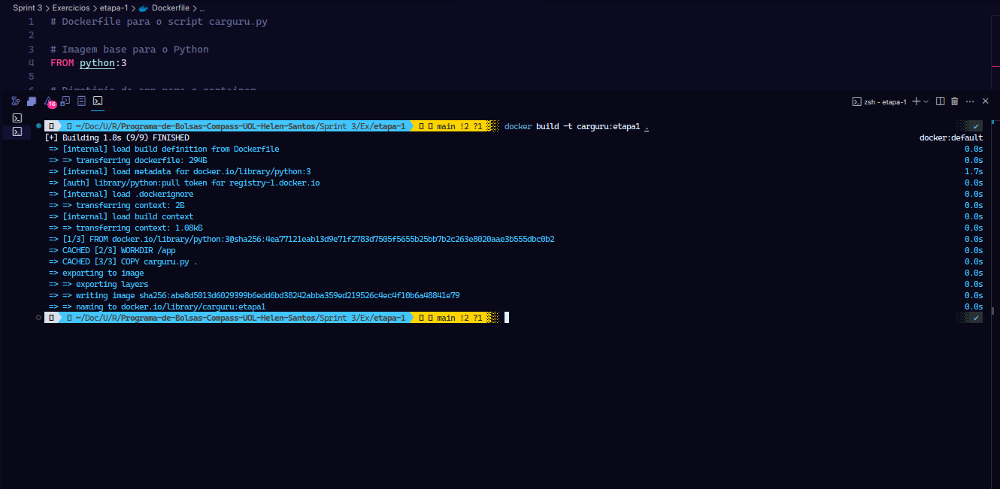
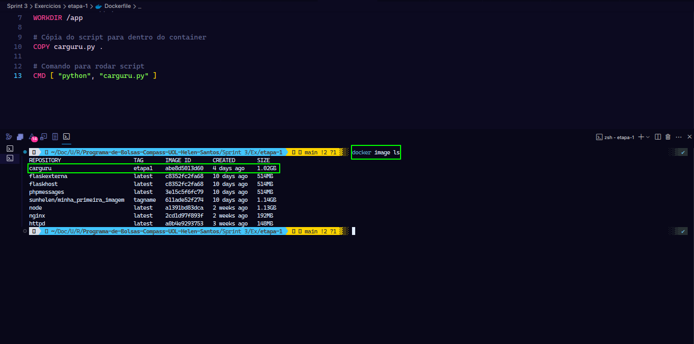
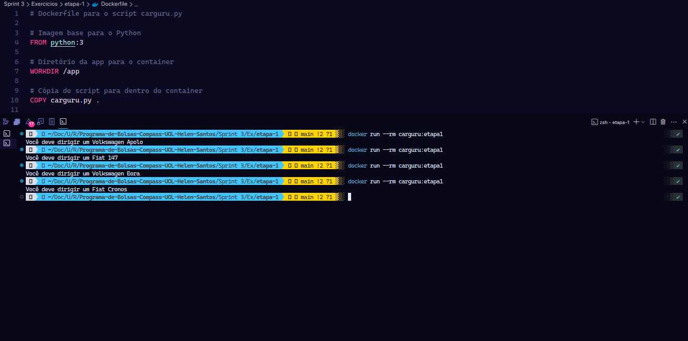
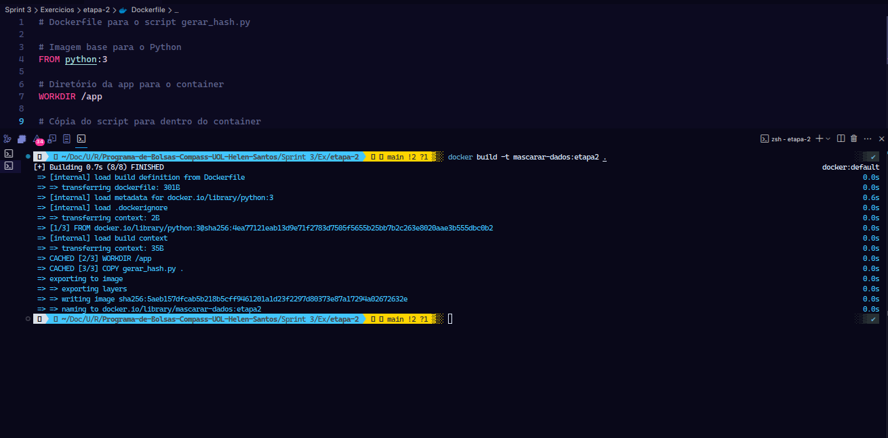
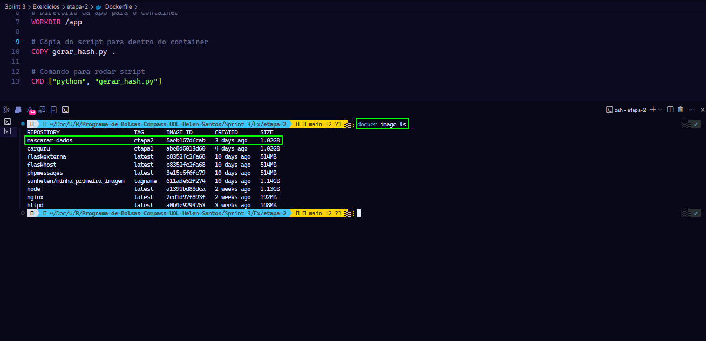
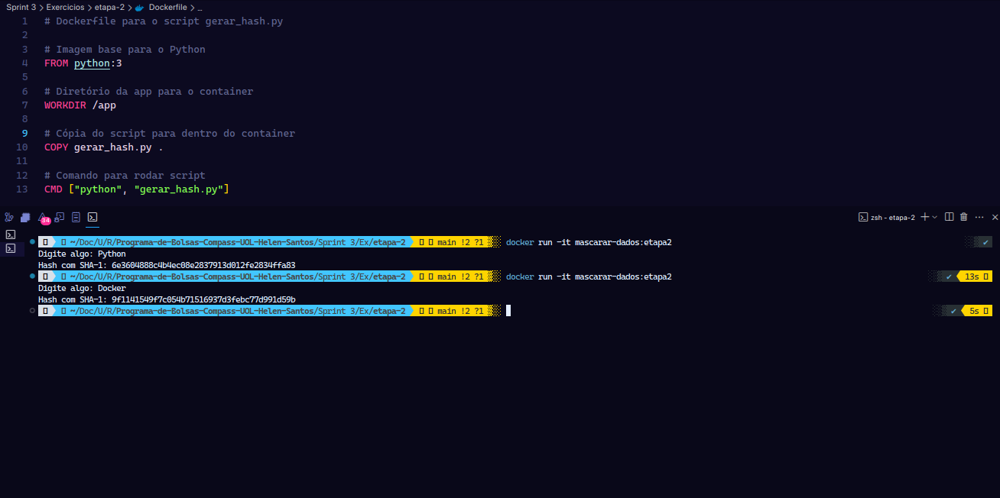
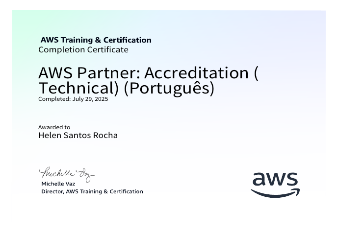
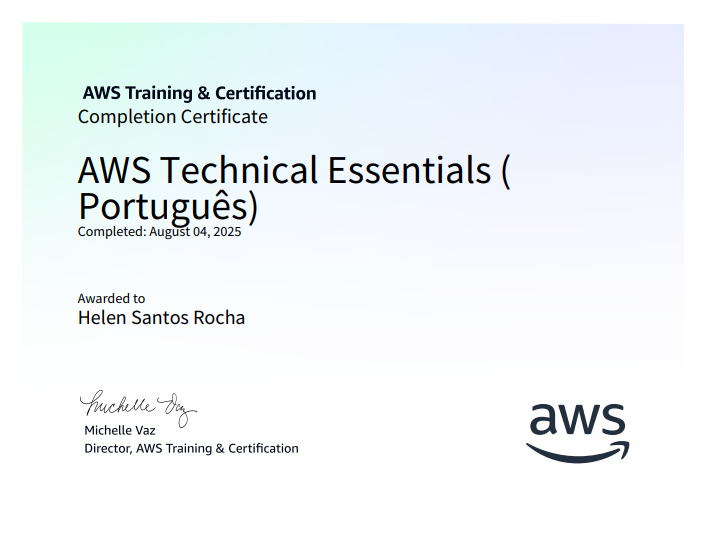

# Resumo

**Docker:** Pude entender como trabalhar com containers de imagens já existentes no Docker Hub, além de criar minhas próprias imagens e executá-las com containers. Compreendi o uso de volumes com containers e a utilização de bind mounts para persistência de dados. Aprendi também a conectar containers entre si, trabalhar com arquivos YAML para configuração, e gerenciar múltiplos containers através do Docker Compose. Por fim, estudei orquestração de containers tanto com Docker Swarm quanto com Kubernetes, o que me permitiu entender como escalar e gerenciar aplicações containerizadas em ambiente de produção.

**REGEX:** Pude entender como funciona o módulo `re` do Python para expressões regulares (regex) e suas principais funções para manipulação de padrões em strings. Compreendi as diferenças entre `re.match()` que verifica padrões apenas no início da string, `re.search()` que busca em qualquer posição, `re.findall()` que retorna todas as ocorrências encontradas, e `re.finditer()` que fornece um iterador com objetos de match. Aprendi também sobre `re.sub()` para substituições, `re.split()` para dividir strings baseado em padrões, e `re.compile()` para compilar regex reutilizáveis. Dominei os metacaracteres essenciais como `.` (qualquer caractere), `^` e `$` (início e fim de string), `*`, `+` e `?` (quantificadores de repetição), `{n}`, `{n,}` e `{n,m}` (repetições específicas), `[]` para classes de caracteres, `|` para operador OU, `()` para agrupamentos, e `\\` para escape de caracteres especiais. Essa ferramenta é fundamental para validação de dados, extração de informações de textos, limpeza de strings e qualquer tarefa que envolva busca e manipulação de padrões complexos em Python.

**AWS Technical Essentials**: Nesse curso eu aprendi que a Amazon Web Services (AWS) oferece um ecossistema de computação em nuvem com vantagens como o pagamento conforme o uso e a escalabilidade global. Estudei os fundamentos da infraestrutura da AWS, incluindo Regiões e Zonas de Disponibilidade, e como interagir com os serviços através do Console, CLI ou SDKs. Aprendi a diferenciar e escolher os serviços de computação ideais, como máquinas virtuais (EC2), contêineres (ECS/EKS) e serverless (Lambda). Além disso, compreendi os conceitos de redes (VPC), o modelo de responsabilidade compartilhada e a importância do gerenciamento de identidade e acesso (IAM) para criar aplicações seguras. Além disso, aprendi que a AWS oferece uma vasta gama de serviços de armazenamento e banco de dados, e a importância de escolher a ferramenta certa para cada necessidade. Diferenciei os principais tipos de armazenamento: em bloco com Amazon EBS, ideal para dados que mudam com frequência como em bancos de dados; de objetos com Amazon S3, para conteúdo estático e backups; e de arquivos com Amazon EFS e FSx, para armazenamento compartilhado. Aprofundei no conceito de bancos de dados com propósito específico, comparando os relacionais gerenciados do Amazon RDS, com seus recursos de alta disponibilidade Multi-AZ, e os NoSQL como o Amazon DynamoDB, otimizado para escalabilidade e baixa latência. Também aprendi a garantir a disponibilidade da aplicação utilizando o Amazon EC2 Auto Scaling para escalar a capacidade computacional dinamicamente.

**AWS Partner Accreditation**: Pude entender como funciona o AWS Cloud Adoption Framework (CAF) e as estratégias de migração para nuvem da Amazon Web Services. Compreendi que o CAF orienta os clientes através de quatro fases de transformação: Concepção (identificação de valor mensurável), Alinhamento (clareza sobre o que representa a adoção da nuvem), Lançamento (início do uso prático para obter valor comercial) e Dimensionamento (expansão de pilotos para escala de produção). Aprendi sobre o AWS Well-Architected Framework com suas seis áreas fundamentais: Excelência Operacional (melhoria de processos e automação), Segurança (controles e privilégios mínimos), Confiabilidade (sistemas altamente disponíveis), Performance (uso eficiente de recursos), Otimização de Custos (maximização do valor dos investimentos) e Sustentabilidade (minimização do impacto ambiental). Dominei as principais estratégias de migração conhecidas como os "6 Rs": Refatorar (reescrever para nuvem nativa), Redefinir Plataforma (melhorar componentes mantendo a base), Recomprar (substituir por soluções SaaS), Redefinir Hospedagem/Lift-and-Shift (migrar sem alterações), Realocar (mover com tempo mínimo de inatividade), Reter (manter temporariamente) e Retirar (desativar aplicações desnecessárias). Esse conhecimento é essencial para tomar decisões técnicas informadas sobre soluções em nuvem que sejam altamente disponíveis, tolerantes a falhas, dimensionáveis e econômicas. 


# Exercícios


1. ...
[Código (Etapa I)](./Exercicios/etapa-1/carguru.py)
--
[Dockerfile (Etapa I)](./Exercicios/etapa-1/Dockerfile)


2. ...
[Código (Etapa II)](./Exercicios/etapa-2/gerar_hash.py)
--
[Dockerfile (Etapa II)](./Exercicios/etapa-2/Dockerfile)


# Evidências

### Exercício - Etapa I
---

O Dockerfile complementa o código `carguru.py` (que funciona como gerador aleatório de carros brasileiros) permitindo sua execução em containers Docker através de quatro comandos essenciais: "FROM python:3" estabelece uma imagem base Linux com Python pré-instalado, `WORKDIR /app` cria e define o diretório de trabalho interno, `COPY carguru.py .` transfere o script do sistema host para dentro do container isolado, e `CMD [ "python", "carguru.py" ]` define que o script será executado automaticamente quando o container iniciar. 

Assim, por meio desse código:

```
docker build -t carguru:etapa1 .
```

Foi criada uma imagem nomeada `carguru` e adicionada uma `tag` chamada `etapa1`:

Em seguida, por meio do código:

```
docker run --rm carguru:etapa1
```

Obtive essa evidência:



Para verificar se a imagem foi criada: 

```
docker image ls
```



Para executar o container foi usado o seguinte código:

```
docker run --rm carguru:etapa1
```

Obtive essa evidência:



### Exercício - Etapa II
___

Foi desenvolvido um script Python chamado `gerar_hash.py` que funciona como um gerador de hash criptográfico usando o algoritmo SHA-1, importando a biblioteca hashlib para receber uma entrada do usuário via `input()`, codificar o texto em `UTF-8`, processar através do algoritmo SHA-1 e exibir o hash resultante em formato hexadecimal usando `hexdigest()`. O Dockerfile segue a mesma estrutura do exemplo anterior, utilizando "FROM python:3" para estabelecer a imagem base com Python, `WORKDIR /app` para definir o diretório de trabalho, `COPY gerar_hash.py .` para transferir o script para o container e `CMD ["python", "gerar_hash.py"]` para executar automaticamente a aplicação quando o container iniciar. Esta solução é útil para demonstrar conceitos de criptografia e hashing.

Assim, por meio desse código:

```
docker build -t mascarar-dados:etapa2 . 
```

Foi criada uma imagem nomeada `mascarar-dados` e adicionanda uma `tag` chamada `etapa2`:



Para verificar se a imagem foi criada: 
```
docker image ls
```




Em seguida, por meio do código:

```
docker run -it mascarar-dados:etapa2 
```

*A flag `-it` foi importante para habilitar o modo interativo, sendo `-i` utilizado para manter o STDIN aberto (necessário para o `input()`) e `-t` para alocar um pseudo-TTY (terminal virtual)."*

Obtive essa evidência:




# Certificados

Certificado do Curso *AWS Partner Accreditation*




Certificado do Curso *AWS Technical Essentials*

