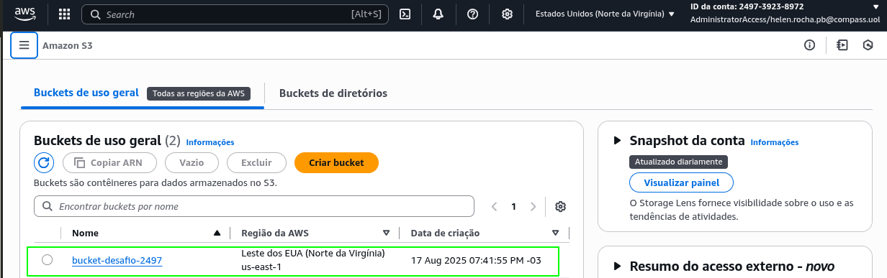
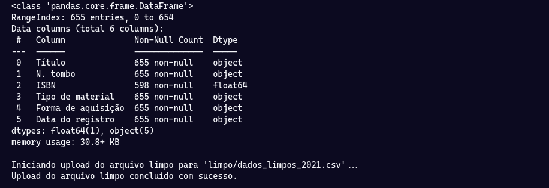
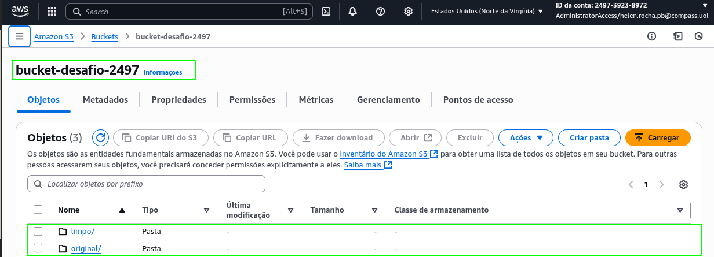
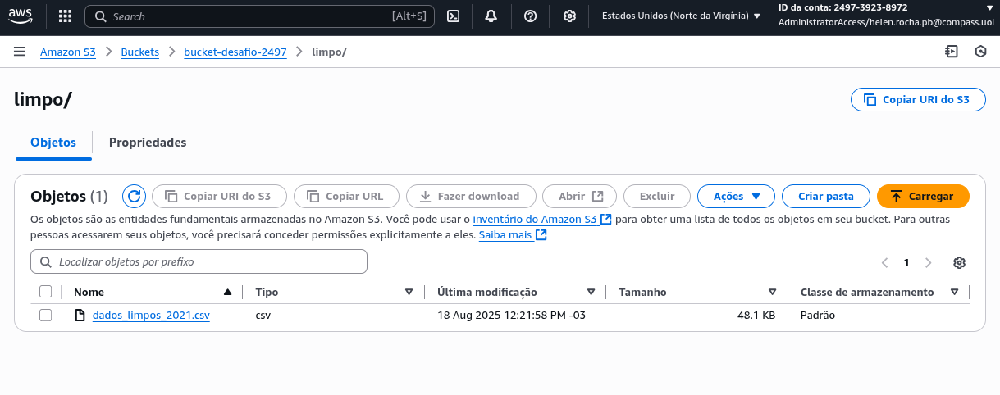
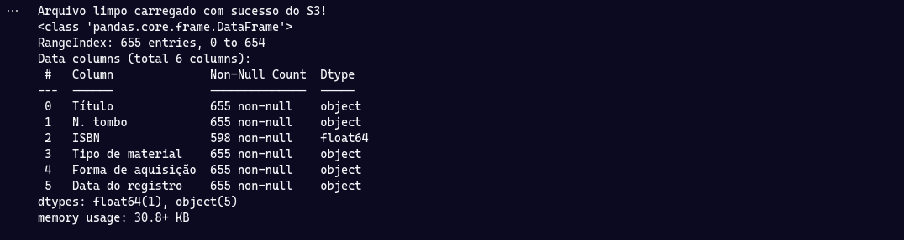
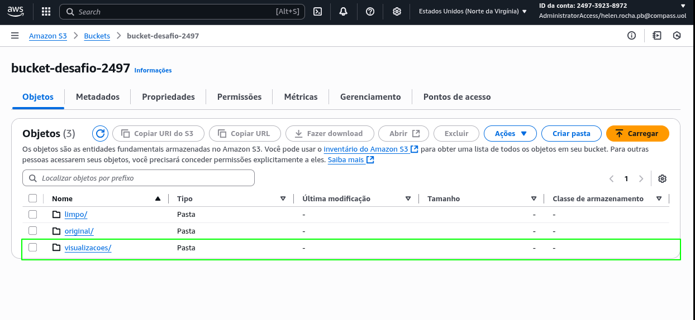
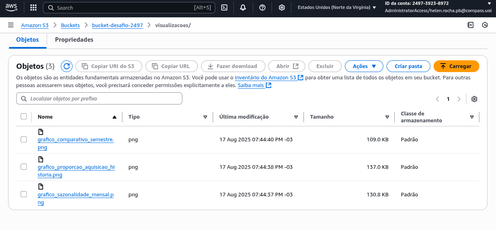
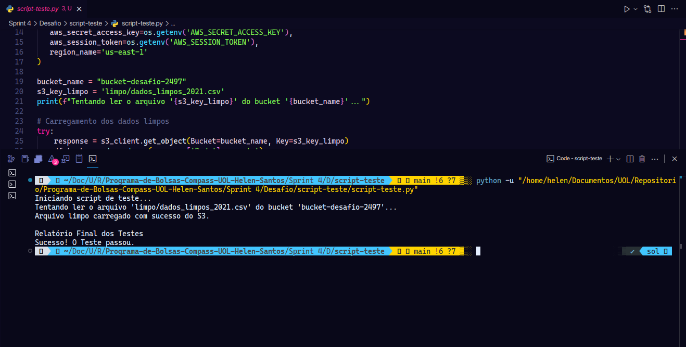

# Base de Dados

A base de dados "Itens Incorporados ao Acervo (Obras em geral)" da Fundação Biblioteca Nacional, referente ao ano de 2021, foi selecionada devido à sua riqueza e diversidade de informações, o que a torna ideal para demonstrar um ciclo completo de análise de dados. O conjunto oferece uma variedade de tipos de dados, como texto (Título), datas (Data do registro) e categorias (Tipo de material e Forma de aquisição), que permitem a aplicação prática de múltiplas técnicas de limpeza, transformação e visualização. Além disso, por se tratar de dados públicos de uma instituição cultural relevante, a análise possibilitou a extração de insights concretos e interessantes, como a identificação de padrões sazonais nos registros e o perfil das novas aquisições do acervo.

[Base de Dados](https://dados.gov.br/dados/conjuntos-dados/fbn-itens-incorporados-ao-acervo-obras-em-geral)

# Etapas


1. ... [Etapa I](./etapa-1/etapa-1.ipynb)

## Gerenciamento de Credenciais com o Arquivo `.env`

A segurança das credenciais de acesso foi uma prioridade neste desafio. Para evitar a exposição de informações sensíveis diretamente no código, foi utilizado um arquivo `.env` para armazenar as chaves de acesso da AWS (`AWS_ACCESS_KEY_ID`, `AWS_SECRET_ACCESS_KEY`, e `AWS_SESSION_TOKEN`).

A importância desta abordagem é fundamental: o arquivo `.env` é mantido localmente e **nunca deve ser versionado** em sistemas de controle como o Git (ele foi adicionado ao `.gitignore`). Isso garante que, mesmo que o código-fonte seja compartilhado, as chaves de acesso permaneçam privadas e seguras.

Para carregar essas variáveis de ambiente do arquivo `.env` para dentro do script Python, foi utilizada a biblioteca **`python-dotenv`**. No início dos notebooks, a função `load_dotenv()` é chamada para ler o arquivo, e em seguida as credenciais são recuperadas de forma segura no código através do módulo nativo `os`, com o comando `os.getenv('NOME_DA_VARIAVEL')`.

*O arquivo `.env` deve conter essas informações:* 

```
AWS_ACCESS_KEY_ID=seu_id
AWS_SECRET_ACCESS_KEY=sua_chave
AWS_SESSION_TOKEN=seu_token
```

## Arquivo `etapa-1.ipynb`

O objetivo principal do primeiro arquivo `etapa-1.ipynb` foi criar um pipeline de dados ETL, automatizado e robusto. Ele extrai os dados da base de dados original:

[Base de Dados - Original](./Arquivo/Dados%20abertos%202021_CPP_CSB_Itens%20incorporados%20ao%20acervo_Obras%20em%20geral.csv)

Realiza um processo de limpeza e, por fim, os carrega em um ambiente de nuvem (AWS S3) em dois diretórios distintos: original (dados brutos) e limpo (dados limpos).

- *Configuração Inicial e Conexão Segura com a AWS*

Primeiramente são importadas as bibliotecas essenciais e, mais importante, estabelece-se uma conexão segura com a AWS. Para isso, a função `load_dotenv` da biblioteca `dotenv` é utilizada para carregar as credenciais a partir de um arquivo `.env` local, que são então lidas de forma segura com o módulo `os`. Essas credenciais são passadas para o`boto3`, o SDK da AWS, que cria o cliente de conexão para realizar todas as operações no S3, como a criação do bucket e o upload dos arquivos. O `pandas` é a biblioteca central para a manipulação dos dados, sendo usada para ler o CSV original, aplicar todas as transformações de limpeza e, ao final, converter o DataFrame tratado de volta para o formato CSV. Por fim, a biblioteca `io` entra em cena para otimizar o processo de upload, permitindo que o CSV limpo seja salvo em um buffer na memória em vez de um arquivo físico, tornando a operação mais eficiente.

```
import pandas as pd
import boto3
from dotenv import load_dotenv
import os
import io

load_dotenv()

s3_client = boto3.client('s3',
   aws_access_key_id=os.getenv('AWS_ACCESS_KEY_ID'),
   aws_secret_access_key=os.getenv('AWS_SECRET_ACCESS_KEY'),
   aws_session_token=os.getenv('AWS_SESSION_TOKEN'),
   region_name='us-east-1'
)
```

- *Definição dos Caminhos e Criação do Bucket*

O trecho de código abaixo serve como um bloco de configuração, centralizando todos os nomes e caminhos importantes que serão usados no script. Ele define, em variáveis, o nome do bucket S3, o caminho para encontrar o arquivo de dados original, e os nomes dos objetos de destino dentro do bucket, separando os dados brutos em `original/` dos dados já limpos em `limpo/`. 

```
nome_bucket = "bucket-desafio-2497"
caminho_original = '../Arquivo/Dados abertos 2021_CPP_CSB_Itens incorporados ao acervo_Obras em geral.csv'
s3_key_original = 'original/dados_originais_2021.csv'
s3_key_limpo = 'limpo/dados_limpos_2021.csv'
```

O próximo trecho de código é essencial para lidar com uma particularidade da API do serviço S3 da AWS, especificamente em relação a como as regiões são tratadas durante a criação de um bucket. A região us-east-1 (Norte da Virgínia), por ser a original e principal da AWS, funciona como uma exceção à regra geral. Por isso, a lógica do if verifica se a região selecionada é a us-east-1 e, em caso afirmativo, executa o comando create_bucket em sua forma mais simples, apenas com o nome do bucket, pois a API proíbe a especificação de local para esta região.

```
if aws_region == 'us-east-1':
        s3_client.create_bucket(Bucket=nome_bucket)
else:
    location = {'LocationConstraint': aws_region}
    s3_client.create_bucket(Bucket=nome_bucket, CreateBucketConfiguration=location)
```

Por meio desses códigos, obtive o seguinte resultado:




- *Enviando Base de Dados Original para a Amazon S3*

O código em seguida tenta enviar o arquivo local para o S3 e, caso algo dê errado, ele captura o erro específico, seja um problema local (arquivo não encontrado) ou um problema com a AWS (permissão, conexão), informando a causa da falha sem quebrar a execução do programa.

```
try:
    s3_client.create_bucket(Bucket=bucket_name)
    print(f"Bucket '{bucket_name}' criado com sucesso ou já existente.")
except ClientError as e:
    if e.response['Error']['Code'] != 'BucketAlreadyOwnedByYou':
        raise e
```

- *Carregamento e Limpeza de Dados*

O código a seguir realiza a leitura do seu arquivo CSV original, utilizando a codificação `latin-1` (devido ao erro de leitura utilizando a codificação `UTF-8`), e o delimitador de ponto e vírgula para interpretar os dados corretamente. Em seguida, ele carrega essas informações em um DataFrame do Pandas chamado `df` e exibe uma pré-visualização dessa tabela na tela.

```
df = pd.read_csv('../Arquivo/Dados abertos 2021_CPP_CSB_Itens incorporados ao acervo_Obras em geral.csv', 
    delimiter=';',
    encoding='latin-1'
) 
df
```

Como parte do pré-processamento, as colunas `Volume` e `Edição` foram removidas para focar o conjunto de dados. A coluna Volume foi descartada pela alta incidência de valores ausentes, enquanto a Edição foi removida por não ser relevante para as análises propostas neste projeto. Essa remoção foi realizada por meio do código a seguir.

```
colunas_remover = ['Volume', 'Edição']
df_limpo = df.drop(columns=colunas_remover).copy()
df_limpo
```

Para garantir a integridade do dataset, os valores nulos na coluna `Forma de aquisição` foram preenchidos com o valor "Não especificada". Esta etapa de tratamento de dados ausentes preserva todos os registros e prepara a coluna para análises categóricas, tratando a falta de informação como uma categoria explícita. O trecho de código abaixo foi utilizado para esse tratamento.

```
df_limpo['Forma de aquisição'] = df_limpo['Forma de aquisição'].fillna('Não especificada')
df_limpo
```

Para garantir a consistência dos dados categóricos, as colunas `Tipo de material` e `Forma de aquisição` foram padronizadas. Este processo removeu espaços em branco desnecessários e converteu todo o texto para maiúsculas, assegurando que variações de escrita como "Livro" e " livro " sejam tratadas como uma única categoria, o que é crucial para a precisão de futuras análises e agregações.

```
df_limpo['Tipo de material'] = df_limpo['Tipo de material'].str.strip().str.upper()
df_limpo['Forma de aquisição'] = df_limpo['Forma de aquisição'].str.strip().str.upper()
```

Para concluir o pipeline de dados, o bloco de código a seguir finaliza o processo de carga. Primeiramente, ele realiza uma verificação da estrutura do DataFrame limpo e, em seguida, o converte para o formato CSV (com codificação `UTF-8`) diretamente na memória, utilizando um buffer `io.StringIO` para evitar a criação de arquivos temporários. A operação de upload para o diretório do S3 é então executada de forma segura, com tratamento de erros que garante que o envio só ocorra se a etapa de limpeza foi bem-sucedida e que falhas de comunicação com a AWS sejam devidamente capturadas.

```
df_limpo.info()
if 'df_limpo' in locals():
    try:
        print(f"\nIniciando upload do arquivo limpo para '{s3_key_limpo}'...")
        csv_buffer = io.StringIO()
        df_limpo.to_csv(csv_buffer, index=False, sep=';', encoding='utf-8')        
        s3_client.put_object(Bucket=nome_bucket, Key=s3_key_limpo, Body=csv_buffer.getvalue())        
        print("Upload do arquivo limpo concluído com sucesso.")
        
    except ClientError as e:
        print(f"ERRO ao fazer upload do arquivo limpo: {e}")
else:
    print("\nUpload do arquivo limpo não realizado devido a erros.")
```

Resultado que obtive por meio da limpeza e upload do DataFrame limpo:



- *Resultados na Amazon S3*:

Diretórios Criados na Amazon S3:



Base de Dados Limpa na Amazon S3:



Base de Dados Original na Amazon S3:


## Análises Escolhidas


### Análise 1: Descobrindo quais meses o acervo recebe mais itens

- **Objetivo:** Entender a distribuição dos registros de novos itens ao longo do ano para identificar possíveis padrões sazonais ou meses com maior volume de trabalho.
    
- **Principal Descoberta:** A análise revelou uma sazonalidade extremamente forte e atípica. Foi descoberto que mais de **98%** de todas as incorporações ao acervo em 2021 foram registradas no mês de **Dezembro**, indicando um provável processo de registro de dados em lote no final do ano, em vez de um fluxo contínuo ao longo dos meses.

### Análise 2: Descobrindo quais livros contêm a palavra "história" no título

- **Objetivo:** Realizar uma análise de conteúdo para segmentar um nicho específico do acervo (livros de história) e investigar o perfil de aquisição desses itens.
    
- **Principal Descoberta:** O resultado mostrou que **95%** dos livros de história foram adquiridos por **"DL" (Depósito Legal)**. Isso revela um insight importante: a principal via de entrada para obras dessa temática no acervo não é a compra direta, mas sim a obrigação legal de depósito.

### Análise 3: Classificação por Semestre de Registro

- **Objetivo:** Simplificar a análise de sazonalidade, confirmando a concentração de registros no final do ano através da criação de uma nova categoria temporal (semestre).
        
- **Principal Descoberta:** A análise confirmou de forma numérica e visual a disparidade encontrada na Análise 1. A grande maioria dos registros de fato ocorreu no **segundo semestre**, validando a conclusão sobre a concentração de atividades de registro no final do ano.
---

2. ... [Etapa II](./etapa-2/etapa-2.ipynb)

## Arquivo `etapa-2.ipynb`

A Etapa 2, contida no arquivo`etapa-2.ipynb`, representa a fase de **análise e visualização** do desafio. Um ponto crucial desta etapa é que o DataFrame com os dados limpos é  puxado diretamente do diretório `/limpo` do bucket na Amazon S3, sem a utilização de nenhum arquivo local. Este passo garante que a análise utilize a "fonte única da verdade", os dados já validados pela Etapa 1, tornando o processo robusto, reprodutível e independente da máquina local.

Uma vez com os dados carregados, foram conduzidas **três análises principais** para explorar o acervo: uma investigação sobre a distribuição mensal dos registros, que revelou uma forte concentração em Dezembro; um filtro específico para livros de "história", descobrindo que sua principal forma de aquisição é o Depósito Legal (DL); e uma classificação condicional por semestre, que confirmou numericamente as descobertas da análise de sazonalidade.

Primeiramente são importadas todas as bibliotecas para realizar esse processo. O `Pandas` foi a ferramenta central para toda a manipulação e estruturação dos dados no formato de DataFrame, enquanto o `NumPy` foi utilizado de forma pontual para executar funções condicionais eficientes, como a classificação por semestre. Para a comunicação dos resultados, o `Matplotlib` serviu como a base para a criação de todos os gráficos, sendo aprimorado esteticamente pelo Seaborn para gerar visualizações mais claras e atraentes. A infraestrutura do pipeline e a segurança foram gerenciadas por um outro conjunto de ferramentas: a biblioteca `dotenv`, em conjunto com o módulo nativo os, garantiu o manuseio seguro das credenciais da AWS, que foram então utilizadas pelo `Boto3` para realizar todas as operações com o S3, como fazer o upload dos arquivos. Finalmente, para otimizar o processo de upload, a biblioteca `io` foi fundamental, permitindo que os DataFrames e os gráficos fossem salvos em buffers na memória, eliminando a necessidade de criar arquivos temporários em disco.

```
import pandas as pd
import numpy as np
import matplotlib.pyplot as plt
import seaborn as sns
import boto3
from dotenv import load_dotenv
import os
import io
```

Este comando abaixo procura e faz a leitura do arquivo `.env` na pasta do projeto. Em seguida, ela carrega as variáveis definidas nesse arquivo, como chaves de acesso e senhas, no ambiente de execução do script, permitindo que o código acesse essas informações sensíveis de forma segura, sem expô-las diretamente.

```
load_dotenv()
```

Este trecho de código utiliza a função `os.getenv()` para ler as credenciais da AWS, que foram previamente carregadas no ambiente pela `load_dotenv()`. Ele recupera a chave de acesso, a chave secreta e o token de sessão, armazenando cada um em uma variável Python para serem usadas de forma segura na conexão com a nuvem, ao mesmo tempo em que define a região da AWS a ser utilizada.

```
aws_key_id = os.getenv('AWS_ACCESS_KEY_ID')
aws_secret_key = os.getenv('AWS_SECRET_ACCESS_KEY')
aws_token = os.getenv('AWS_SESSION_TOKEN')
aws_region = 'us-east-1'
```

O código abaixo utiliza a biblioteca `boto3` para criar e configurar o objeto de conexão com o serviço S3 da AWS. Ele efetivamente autentica a sessão ao passar as credenciais de acesso e a região que foram previamente armazenadas em variáveis. O objeto resultante, `s3_client`, passa a funcionar como um "controle remoto" para executar todas as operações no S3.

```
s3_client = boto3.client('s3',
   aws_access_key_id=aws_key_id,
   aws_secret_access_key=aws_secret_key,
   aws_session_token=aws_token,
   region_name=aws_region
)
```

O  trecho a seguir define o nome do bucket e o caminho do arquivo limpo a ser lido do S3 e, em seguida, executa a leitura desses dados diretamente para a memória. Utilizando o `boto3`, ele busca o objeto no S3 e passa seu conteúdo, que é um fluxo de dados em memória `stream`, diretamente para a função `read_csv` do Pandas. Essa abordagem carrega eficientemente as informações do DataFrame sem a necessidade de primeiro baixar o arquivo para o disco local. Toda a operação é encapsulada em um bloco `try...except` para gerenciar de forma segura quaisquer erros que possam ocorrer durante a comunicação com a AWS.

```
nome_bucket = "bucket-desafio-2497"
s3_key_limpo = 'limpo/dados_limpos_2021.csv'

try:
    # Pegando objeto do S3
    response = s3_client.get_object(Bucket=nome_bucket, Key=s3_key_limpo)    
    df_analise = pd.read_csv(response['Body'], sep=';')   

    print("Arquivo limpo carregado com sucesso do S3!")  
    df_analise.info()
    
except Exception as e:
    print(f"Ocorreu um erro ao carregar o arquivo do S3: {e}")
```

Obtive o seguinte resultado com o código acima:



### Desenvolvimento das Análises
---

- **Análise I**

***Função de Conversão:***

A coluna `Data do registro` é inicialmente tratada pelo Pandas como um simples texto (string). A função `pd.to_datetime` **converte** essas strings em um tipo de dado especial de data e hora (`datetime`), que o Pandas entende cronologicamente.

O parâmetro `format='%d/%m/%Y'` é essencial, pois informa o "molde" exato das datas no seu arquivo (Dia/Mês/Ano), garantindo que a conversão seja feita sem erros ou ambiguidades. Sem este passo, seria impossível realizar qualquer operação baseada em datas, como extrair o mês.

```
df_analise['Data do registro'] = pd.to_datetime(df_analise['Data do registro'], format='%d/%m/%Y')
```

***Função de Data:***

```
df_analise['Número Mês'] = df_analise['Data do registro'].dt.month
df_analise['Mês de Registro'] = df_analise['Data do registro'].dt.month_name()
```

Este trecho de código utiliza a coluna de datas, já no formato `datetime`, para criar duas novas colunas essenciais para a análise de sazonalidade. A primeira, `Número Mês`, armazena o número do mês (de 1 a 12) extraído de cada data, servindo como uma chave para a ordenação cronológica correta dos dados. A segunda, `Mês de Registro`, contém o nome completo do mês correspondente, sendo utilizada para a exibição de rótulos legíveis nas tabelas e nos eixos dos gráficos.

***Função de Agregação:***

Utilizando a função de agregação `groupby`, este código agrupa todos os registros do DataFrame por mês, utilizando `.size()` para contar o total de itens em cada um. O resultado dessa contagem é então convertido em um novo DataFrame, que é ordenado cronologicamente pelo número do mês para garantir a sequência correta. Por fim, o trecho formata e imprime uma tabela limpa na tela, exibindo apenas o nome do mês e o total de registros correspondente, sem o índice padrão.

```
registro_mes = df_analise.groupby(['Número Mês', 'Mês de Registro']).size().reset_index(name='Total Registros')
registro_mes = registro_mes.sort_values('Número Mês')

print(50*'=')
print("        Total de Obras Incorporados por Mês")
print(50*'=')
print(registro_mes[['Mês de Registro', 'Total Registros']].to_string(index=False))
```

Resultado que obtive com os códigos acima:


- **Análise I - Visualização**

O bloco de código a seguir orquestra o processo completo de criação, customização e armazenamento de uma visualização de dados. Inicialmente, ele utiliza a biblioteca `Seaborn` para gerar um gráfico de barras vertical, mapeando os meses do ano no eixo X e o total de registros no eixo Y, com cores e ordem definidos. Em seguida, o código aprimora o gráfico de forma detalhada: um laço de repetição percorre cada barra para adicionar um rótulo com seu valor exato, enquanto uma série de comandos do `Matplotlib` ajusta o título, os nomes dos eixos e a rotação das legendas para garantir a máxima clareza. A etapa final transforma essa visualização em um artefato persistente na nuvem: o gráfico é salvo como uma imagem PNG de alta qualidade em um buffer na memória, e este buffer é enviado diretamente para uma pasta de visualizações no bucket S3, com tratamento de erros para garantir a robustez da operação. Por último, o comando `plt.show()` exibe o gráfico finalizado na tela.

```
plt.figure(figsize=(8, 7))
ax = sns.barplot(
    x='Mês de Registro',
    y='Total Registros',
    data=registro_mes,
    palette='Spectral',
    hue='Mês de Registro',
    legend=False,
    order=registro_mes['Mês de Registro']
)

for bar in ax.patches:
    height = bar.get_height()
    
    ax.annotate(f'{int(height)}',                   
                xy=(bar.get_x() + bar.get_width() / 2, height),                 
                xytext=(0, 3),                    
                textcoords="offset points",
                ha='center',                       
                va='bottom')                      

plt.title('Total de Obras Incorporadas ao Acervo por Mês em 2021', fontsize=12, fontweight='bold')
plt.xlabel('Mês', fontweight='bold')
plt.ylabel('Quantidade de Obras', fontweight='bold')
plt.xticks(rotation=45, ha='right')
plt.ylim(0, 700)

img_data = io.BytesIO()
plt.savefig(img_data, format='png', dpi=300, bbox_inches='tight')
img_data.seek(0)
s3_key_barras = 'visualizacoes/grafico_sazonalidade_mensal.png'

try:
    s3_client.upload_fileobj(img_data, nome_bucket, s3_key_barras)
    print(f"\nSUCESSO: Gráfico '{s3_key_barras}' enviado para o bucket '{nome_bucket}'.")
except Exception as e:
    print(f"\nERRO: Falha ao enviar o gráfico para o S3. Erro: {e}")

plt.show()
```


- **Análise II**

***Função de String:***

O comando abaixo cria um filtro booleano (uma série de `Verdadeiro` ou `Falso`) chamado `contem_historia` para identificar todas as obras cujo título contenha a palavra "história". Ele utiliza a função `.str.contains()` para realizar a busca em cada item da coluna `Título`, com o parâmetro `case=False` garantindo que a busca ignore diferenças entre letras maiúsculas e minúsculas. O parâmetro `na=False` assegura que valores nulos na coluna de títulos sejam tratados como `Falso`, resultando em um filtro limpo e pronto para ser usado na seleção das linhas desejadas do DataFrame.

```
contem_historia = df_analise['Título'].str.contains("história", case=False, na=False)
```

***Filtro com 2 Operadores Lógicos***

```
livros_de_historia = df_analise[

    (df_analise['Tipo de material'] == 'LIVRO') & 

    (contem_historia)
]

print(50*'=')
print(f"Foram encontrados {len(livros_de_historia)} livros sobre 'história'.")
print(50*'=')
print("          Forma de aquisição desses livros")
print(50*'=')
print(livros_de_historia['Forma de aquisição'].value_counts().to_string())
print(50*'=')
```

O código acima formata e exibe os resultados da sua análise como um relatório de texto. Utilizando linhas de separação para organizar a saída, ele primeiro apresenta um resumo dinâmico com a contagem total de livros encontrados e, em seguida, exibe a distribuição detalhada desses livros por forma de aquisição, de forma limpa e legível.

Com os códigos anteriores, obtive os seguintes resultados:


- **Análise II - Visualização**

O bloco de código  abaixo também executa o processo completo de gerar, customizar e armazenar uma visualização. Primeiramente, ele prepara os dados da análise e os plota como um gráfico de rosca, aplicando customizações de estilo no título e nos rótulos de texto para máxima clareza. Em seguida, em vez de apenas exibir, ele salva o gráfico final como uma imagem PNG de alta qualidade em um buffer de memória e realiza o upload deste buffer diretamente para uma pasta de visualizações no bucket S3.

```
dados_para_pizza = livros_de_historia['Forma de aquisição'].value_counts()

plt.figure(figsize=(7, 7)) 

patches, textos, autotextos = plt.pie(
    dados_para_pizza.values,                  
    labels=dados_para_pizza.index,          
    autopct='%1.0f%%',                       
    startangle=180,                             
    colors=sns.color_palette('tab10', len(dados_para_pizza)), # Paleta de cores
    textprops={'fontsize': 10, 'color': 'black', 'fontweight': 'bold'}
)

centre_circle = plt.Circle((0, 0), 0.70, fc='white')
fig = plt.gcf()  
fig.gca().add_artist(centre_circle) 

plt.setp(autotextos, size=15, weight="bold", color='black')
plt.title("Proporção da Forma de Aquisição dos Livros de 'História'", fontsize=20, fontweight='bold')
plt.axis('equal')  

img_data = io.BytesIO()
plt.savefig(img_data, format='png', dpi=300, bbox_inches='tight')
img_data.seek(0)
s3_key_rosca = 'visualizacoes/grafico_proporcao_aquisicao_historia.png'

try:
    s3_client.upload_fileobj(img_data, nome_bucket, s3_key_rosca)
    print(f"\nSUCESSO: Gráfico '{s3_key_rosca}' enviado para o bucket '{nome_bucket}'.")
except Exception as e:
    print(f"\nERRO: Falha ao enviar o gráfico para o S3. Erro: {e}")

plt.show()
```

- **Análise III**

***Função de Condicional:***

```
df_analise['Semestre'] = np.where(df_analise['Data do registro'].dt.month <= 6, 
                                  '1º Semestre', 
                                  '2º Semestre')
```

Este comando cria uma nova coluna chamada `Semestre` no DataFrame, utilizando a função condicional `np.where` do NumPy. Para cada linha, ele avalia se o número do mês na coluna `Data do registro` é menor ou igual a 6; se a condição for verdadeira, ele atribui o valor "1º Semestre", caso contrário, atribui "2º Semestre", classificando eficientemente todos os registros do ano em um dos dois períodos.

```
contagem_semestre = df_analise['Semestre'].value_counts()
contagem_semestre = contagem_semestre.sort_index(ascending=True)

print(50*'=')
print("      Total de itens incorporados por semestre")
print(50*'=')
print(contagem_semestre.to_string())
```

Este código primeiro calcula a contagem total de registros para cada semestre utilizando a função `.value_counts()`. Como essa função ordena o resultado pela quantidade (do maior para o menor), o passo seguinte, `.sort_index()`, é essencial para reorganizar os dados em ordem cronológica, garantindo que "1º Semestre" venha antes de "2º Semestre". Por fim, o trecho formata e imprime essa contagem já ordenada como uma tabela de resumo limpa e de fácil leitura.

Com os códigos anteriores, obtive o seguinte resultado: 


- **Análise III - Visualização**

Este bloco de código a seguir constrói, customiza e armazena uma visualização completa da proporção de registros por semestre. Ele gera um gráfico de pizza, destacando uma das fatias com o efeito explode e aplicando formatações detalhadas no estilo dos textos para garantir a legibilidade. Em seguida, o script salva a visualização final como uma imagem PNG de alta qualidade em um buffer de memória e a envia diretamente para o S3, utilizando um tratamento de erros para a operação na nuvem.

```
plt.figure(figsize=(8, 8))

colors = sns.color_palette('cool', len(contagem_semestre))

patches, texts, autotexts = plt.pie(
    contagem_semestre,
    labels=contagem_semestre.index,
    autopct='%1.1f%%',              
    startangle=180,                
    colors=colors,
    explode=(0.05, 0)             
)

plt.setp(autotexts, size=12, weight="bold", color='black')
plt.setp(texts, size=12, fontweight='bold')

plt.title('Proporção de Registros de Obras por Semestre', fontsize=16, fontweight='bold')
plt.axis('equal') # Garantindo que a pizza seja um círculo

img_data = io.BytesIO()
plt.savefig(img_data, format='png', dpi=300, bbox_inches='tight')
img_data.seek(0)
s3_key_grafico = 'visualizacoes/grafico_comparativo_semestre.png'

try:
    s3_client.upload_fileobj(img_data, nome_bucket, s3_key_grafico)
    print(f"\nSUCESSO: Gráfico '{s3_key_grafico}' enviado para o bucket '{nome_bucket}'.")
except Exception as e:
    print(f"\nERRO: Falha ao enviar o gráfico para o S3. Erro: {e}")

plt.show()
```

- *Resultados na Amazon S3*:

Após executar os códigos, foi possível observar que os arquivos resultantes enviados para um diretório denominado `visualizacoes` no `bucket-desafio-2497`.

Diretório `visualizacoes` na Amazon S3:



Imagens dos Gráficos na Amazon S3:



# Arquivo de Teste


O arquivo `script-teste.py` representa um script de teste fundamental para validar a integridade e funcionalidade do pipeline de dados desenvolvido no projeto de análise do acervo cultural. O código está estruturado de forma modular, seguindo uma abordagem sistemática para verificar se os dados processados estão adequadamente armazenados e acessíveis no ambiente de nuvem da AWS. Ademais, ele foi desenvolvido para evitar gastos desnecessários com o serviço Amazon S3.


[Código - Script para Teste](./script-teste/script-teste.py)

Com o código executado, obtive o seguinte resultado:

