# Resumo

**AWS Partner: Sales Accreditation**: Nesse curso eu aprendi que a computação na nuvem é a entrega de recursos de TI sob demanda pela internet com pagamento conforme o uso, e que a AWS se destaca como líder do mercado oferecendo mais de 200 serviços em uma infraestrutura global com 26+ regiões. O valor comercial da nuvem se fundamenta em quatro pilares: economia de custos através de otimização progressiva, produtividade da equipe liberando recursos para trabalho estratégico, resiliência operacional com maior disponibilidade de sistemas, e agilidade empresarial permitindo resposta rápida às mudanças de mercado. A AWS diferencia-se pela cultura orientada ao cliente com mais de 100 reduções proativas de preços, 98 padrões de segurança e conformidade, e o maior conjunto de recursos híbridos do mercado. Para superar objeções comuns dos clientes sobre custo, segurança, dependência de fornecedor e déficit de habilidades, a AWS oferece modelos de pagamento flexíveis, ambiente mais seguro que data centers tradicionais, tecnologias open source que evitam lock-in, e programas de capacitação junto com parceiros especializados. A estratégia de venda conjunta funciona através do programa ACE com financiamentos como MAP e POCs, segmentando clientes entre comercial e setor público, onde a jornada típica evolui de casos simples como backup para aplicativos modernos e cargas críticas de negócio, sempre focando na transformação digital e modernização de aplicativos monolíticos para microsserviços escaláveis.

**AWS Partner: Cloud Economics**: Por meio desse curso aprendi que Cloud Economics abrange duas áreas principais: valor aos negócios e gerenciamento financeiro na nuvem. O Cloud Value Framework é composto por cinco pilares fundamentais: economia de custos (através do modelo baseado em consumo, diferentes modelos de preços e reduções contínuas de preços da AWS), produtividade de equipe (eliminando tarefas operacionais não diferenciadas e permitindo foco em atividades estratégicas), resiliência operacional (melhorando disponibilidade e segurança, reduzindo tempo de inatividade que pode custar milhões), agilidade empresarial (capacidade de desenvolver novos produtos e responder rapidamente ao mercado através do conceito "Fail Fast") e sustentabilidade (redução da pegada de carbono através de infraestrutura energeticamente eficiente). Para o gerenciamento financeiro efetivo na nuvem, são essenciais quatro pilares: medição e atribuição de responsabilidade através de estratégias de contas e tagueamento, otimização de custos eliminando desperdícios, planejamento e forecast adequados, e estabelecimento de um Cloud Center of Excellence (CoE) para governança e automação. O curso também apresenta ferramentas práticas como Migration Portfolio Assessment (MPA), AWS Cost Explorer e Instance Scheduler, demonstrando através de casos reais de clientes como Itaú, Banco Inter e Bayer os benefícios tangíveis da migração para a nuvem AWS.

**AWS Cloud Quest: Cloud Practitioners**: Por meio do jogo disponibilizado por esse curso eu aprendi que o Amazon S3 é um serviço de armazenamento de objetos versátil e seguro, ideal para hospedar websites estáticos e armazenar diversos tipos de dados, oferecendo diferentes classes de armazenamento para otimizar custos com base na frequência de acesso. Entendi como configurar a conectividade à internet para uma Nuvem Privada Virtual (VPC) usando componentes como Internet Gateway para comunicação bidirecional e NAT Gateway para permitir que instâncias privadas acessem a internet de forma segura. Aprendi sobre a importância da infraestrutura global da AWS, com suas Regiões e Zonas de Disponibilidade, para criar aplicações com alta disponibilidade e tolerância a falhas. Compreendi os fundamentos do Amazon EC2 para provisionar servidores virtuais escaláveis, utilizando diferentes tipos de instância otimizados para cargas de trabalho específicas e como o Amazon EBS funciona como um disco virtual persistente para esses servidores. Também explorei os princípios de economia na nuvem, utilizando a Calculadora de Preços da AWS para estimar custos e entendendo como o Auto Scaling ajusta os recursos à demanda para otimizar gastos. Além disso, aprofundei meus conhecimentos em segurança com o AWS IAM, que gerencia o acesso de usuários e grupos a recursos por meio de políticas, e aprendi sobre o modelo de responsabilidade compartilhada, onde a AWS cuida da segurança da nuvem e o cliente, da segurança na nuvem. Por fim, descobri a flexibilidade dos bancos de dados NoSQL, como o DynamoDB, que são ideais para aplicações que exigem alta escalabilidade e desempenho rápido com esquemas de dados flexíveis. 

# Exercícios

## Lab AWS S3

1. ... [Exercício I - Arquivo(CSV)](./Exercicios/01-Lab-AWS-S3/dados/nomes.csv) 
--
       [Exercício I - Arquivo(index.html)](./Exercicios/01-Lab-AWS-S3/index.html) 
--
       [Exercício I - Arquivo(404.html)](./Exercicios/01-Lab-AWS-S3/404.html) 

## Lab AWS Athena

2. ... [Exercício II - Arquivo(Usando SELECT para verificar dados)](./Exercicios/02-Lab-AWS-Athena/primeiro_select.csv) 
--
        [Exercício II - Arquivo(Os 3 Nomes mais Populares de cada Década)](./Exercicios/02-Lab-AWS-Athena/nomes_populares_decada.csv) 

  ## Lab AWS Lambda

3. ... [Exercício III - Arquivo(Dockerfile)](./Exercicios/03-Lab-AWS-Lambda/projeto-lambda-layer/Dockerfile)
--
        [Exercício III - Arquivo(minha-camada-pandas.zip)](./Exercicios/03-Lab-AWS-Lambda/projeto-lambda-layer/minha-camada-pandas.zip)

# Evidências


### Exercício I - Lab AWS S3
---

Nesse exercício utilizando o AWS S3, foi explorada a capacidade do serviço para hospedar conteúdo estático. O objetivo principal foi configurar um bucket do Amazon S3 para funcionar como hospedagem de um website estático.
Primeiramente, foi criado um bucket na região US East (N. Virginia) us-east-1, seguido pela habilitação da hospedagem de site estático nas propriedades do bucket, onde foi especificado o arquivo `index.html` como documento de índice.

*Criação do Bucket*

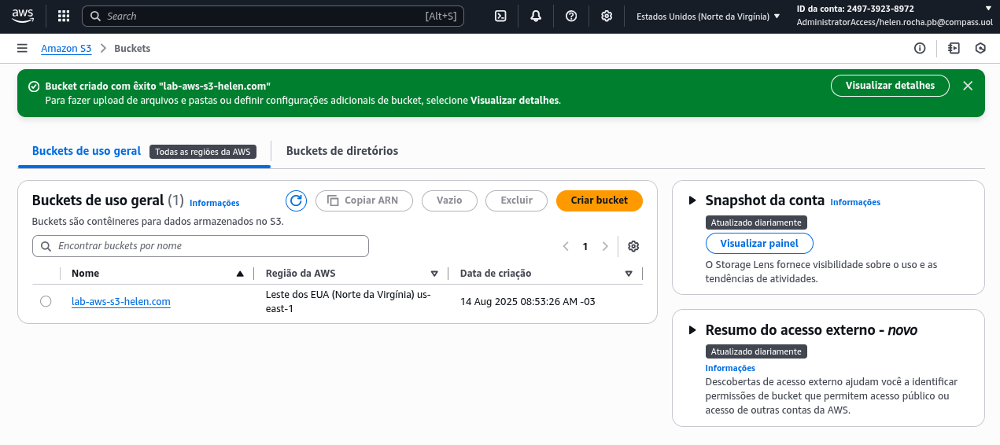

*Código do`ìndex.html`*

```
<html xmlns="http://www.w3.org/1999/xhtml">

<head>
  <title>Home Page do meu WebSite</title>
</head>

<body>
  <h1>Bem-vindo ao meu website</h1>
  <p>Agora hospedado em Amazon S3!</p>
  <a href="dados/nomes.csv">Download CSV File</a>
</body>

</html>
```

Para tornar o conteúdo publicamente acessível, foram editadas as configurações de bloqueio de acesso público, desabilitando o bloqueio total, e foi adicionada uma política de bucket que concede acesso público de somente leitura.

*Código para conceder acesso público de leitura*


```
{
    "Version": "2012-10-17",
     "Statement": [
        {
            "Sid": "PublicReadGetObject",
            "Effect": "Allow",
             "Principal": "*",
             "Action": [
                "s3:GetObject"
           ],
            "Resource": [
                 "arn:aws:s3:::lab-aws-s3-helen.com/*"
            ]
         }
     ]
}
```

O documento de índice foi criado localmente como um arquivo HTML simples contendo uma página de boas-vindas e um link para download de um arquivo CSV. Este arquivo HTML foi então carregado para o bucket, junto com a pasta `dados` contendo o arquivo CSV `nomes.csv`. Adicionalmente, foi configurado um documento de erro `404.html` para tratar erros da classe 4XX.


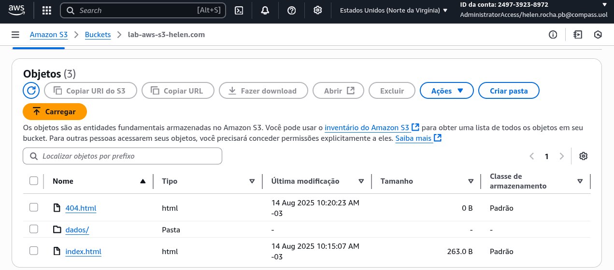

*Resultado do site hospedado na Amazon S3 com a opção de download do CSV File*

[](http://lab-aws-s3-helen.com.s3-website-us-east-1.amazonaws.com)

### Exercício II - Lab AWS Athena
---

No exercício dois utilizando o AWS Athena, foi explorada a capacidade do serviço para executar consultas SQL em dados armazenados no Amazon S3. O objetivo principal foi configurar o Athena para analisar o arquivo `nomes.csv` armazenado no bucket S3 criado no laboratório anterior.

Inicialmente, foi verificada a existência do arquivo `nomes.csv` no bucket S3 e criada uma pasta chamada `queries` para armazenar os resultados das consultas do Athena. Em seguida, foi acessado o AWS Athena e configurado o local de armazenamento dos resultados das consultas apontando para a pasta `queries` no bucket S3.

*Por meio desse código:*

```
CREATE DATABASE meubanco
```

Foi criado um banco de dados denominado `meubanco`. Posteriormente   foi elaborada uma tabela chamada `tabela_nomes` no banco criado, definindo a estrutura dos dados com campos nome, sexo, total e ano, todos com seus respectivos tipos de dados. A tabela foi configurada para usar o formato CSV com delimitador por vírgulas e para ignorar a primeira linha que continha os cabeçalhos.

*Por meio desse código:*

```
CREATE EXTERNAL TABLE IF NOT EXISTS meubanco.tabela_nomes (
    `nome` STRING,
    `sexo` STRING,
    `total` INT,
    `ano` INT
)
ROW FORMAT SERDE 'org.apache.hadoop.hive.serde2.lazy.LazySimpleSerDe'
WITH SERDEPROPERTIES (
  'serialization.format' = ',',
  'field.delim' = ','
)
LOCATION 's3://lab-aws-s3-helen.com/dados/'
TBLPROPERTIES (
  'skip.header.line.count'='1'
);
```

*Criação da tabela:*

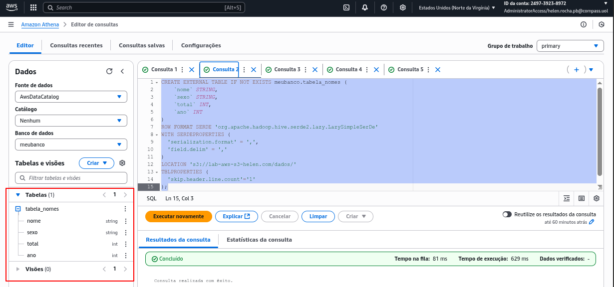


Para testar a funcionalidade, foi executada uma consulta simples filtrando nomes por ano específico.

```
select nome from meubanco.tabela_nomes where ano = 1999 order by total limit 15;
```

O exercício foi finalizado com a criação de uma consulta para listar os três nomes mais populares por década desde 1950, demonstrando a capacidade do Athena de realizar análises avançadas em grandes volumes de dados armazenados no S3 sem necessidade de carregá-los em um banco de dados tradicional.

```
WITH nomes_agregados AS (
  SELECT
    (ano / 10) * 10 AS decada,
    nome,
    SUM(total) AS total_decada
  FROM
    meubanco.tabela_nomes
  WHERE
    ano >= 1950
  GROUP BY
    (ano / 10) * 10,
    nome
),
nomes_populares AS (
  SELECT
    decada,
    nome,
    total_decada,
    ROW_NUMBER() OVER (PARTITION BY decada ORDER BY total_decada DESC) as top_nomes
  FROM
    nomes_agregados
)
SELECT
  decada,
  nome,
  total_decada
FROM
  nomes_populares
WHERE
  top_nomes <= 3
ORDER BY
  decada,
  top_nomes;
```

*Após realizar a consulta:*


### Exercício III - Lab AWS Lambda
---

Nesse exercício utilizando o AWS Lambda, foi explorada a capacidade do serviço para executar código serverless que processa dados armazenados no S3. O objetivo principal foi criar uma função Lambda em Python que utiliza a biblioteca Pandas para analisar o arquivo `nomes.csv` do laboratório anterior.
Inicialmente, foi criada uma função Lambda do zero usando Python 3.9 como runtime. O código desenvolvido utilizava as bibliotecas boto3, pandas e json para acessar o arquivo nomes.csv no bucket S3, ler os dados em um DataFrame e retornar o número total de linhas do arquivo. 

```
import json
import pandas
import boto3
 
 
def lambda_handler(event, context):
    s3_client = boto3.client('s3')
 
    bucket_name = 'lab-aws-s3-helen.com'
    s3_file_name = 'dados/nomes.csv'
    objeto = s3_client.get_object(Bucket=bucket_name, Key=s3_file_name)
    df=pandas.read_csv(objeto['Body'], sep=',')
    rows = len(df.axes[0])
 
    return {
        'statusCode': 200,
        'body': f"Este arquivo tem {rows} linhas"
    }
```

Durante os primeiros testes, foi identificado um erro de importação da biblioteca pandas, pois o Lambda não possui essa dependência por padrão.

Para resolver essa limitação, foi necessário criar uma Layer personalizada contendo a biblioteca pandas. O processo envolveu o uso do Docker com uma imagem Amazon Linux para instalar as dependências em um ambiente compatível com o Lambda. Foi criado um Dockerfile, construída uma imagem Docker, e dentro do container foram instaladas as bibliotecas necessárias na estrutura de diretórios correta `/python`. As dependências foram compactadas em um arquivo zip e enviadas para o S3.

*Código do Docker:*

```
FROM amazonlinux:2023
RUN yum update -y
RUN yum install -y \
python3-pip \
zip
RUN yum -y clean all
```

*Construindo a imagem:*

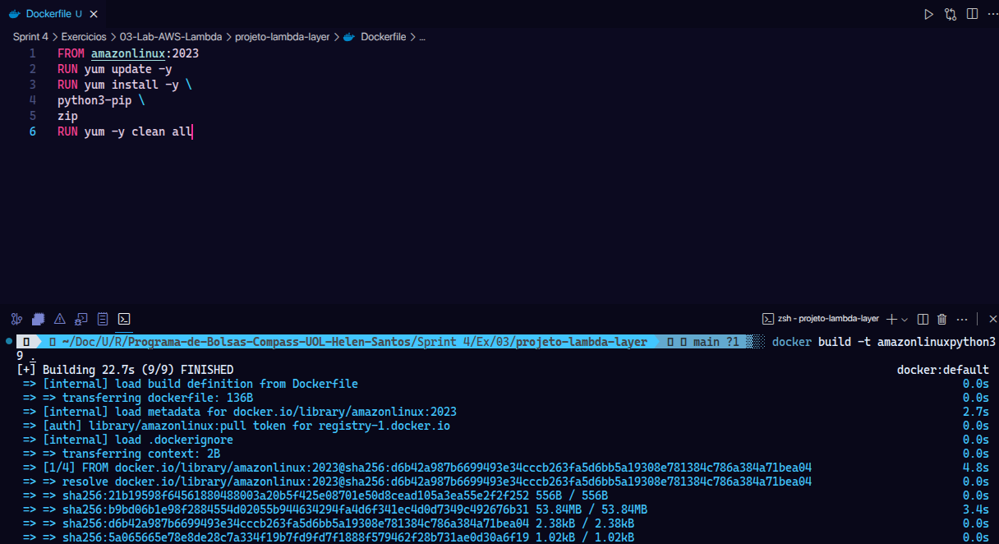


*Criando as pastas:*

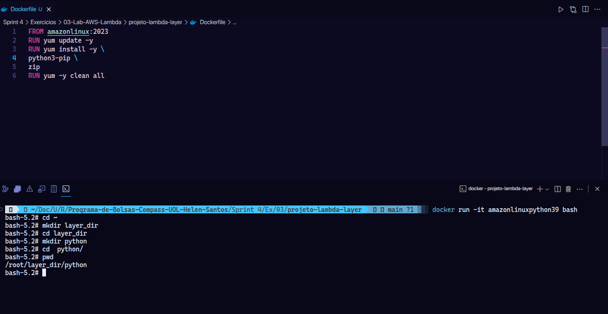

*Instalação da Biblioteca:*

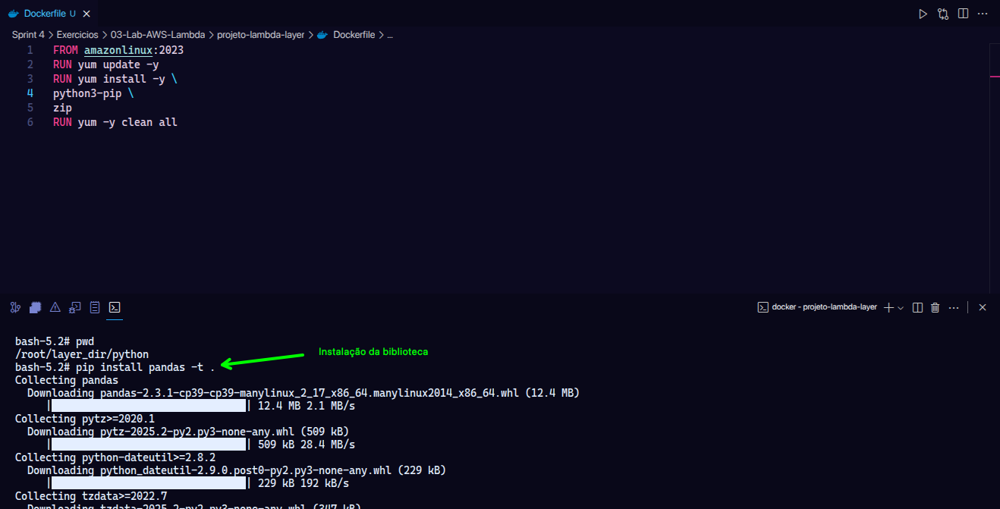


*Compactação:*

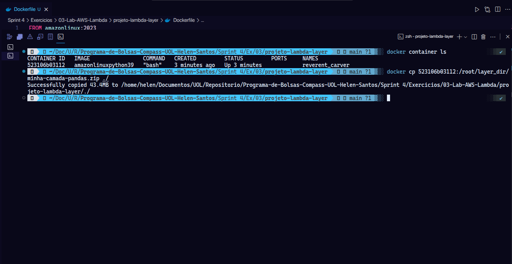

*Resultado:*

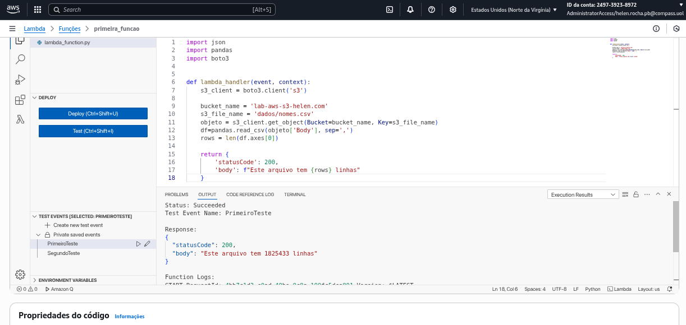


# Certificados

Certificado do Curso *AWS Partner: Sales Accreditation*


Certificado do Curso *AWS Partner: Cloud Economics*

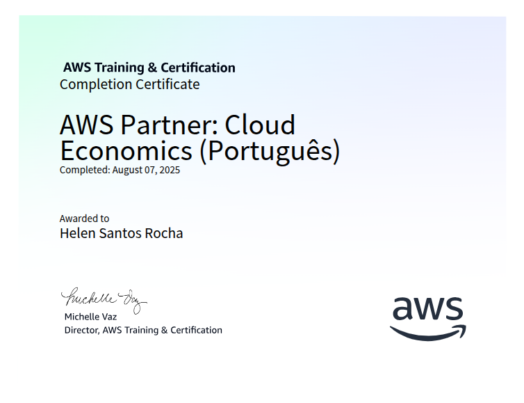

Certificado do Curso *AWS Cloud Quest: Cloud Practitioner*

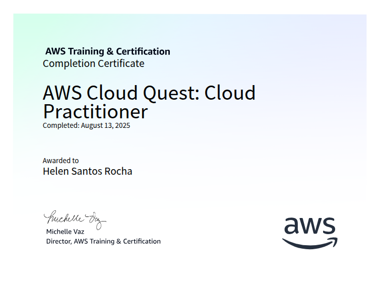

# Insígnia do Curso - AWS Cloud Quest: Cloud Practitioner

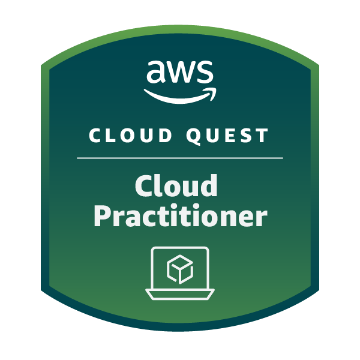

## Evidências da Conclusão do Jogo

[Link - Badge](https://www.credly.com/badges/253505da-3300-4641-ab45-26034e45848b/public_url)

Evidência I - *AWS Cloud Quest: Cloud Practitioner*

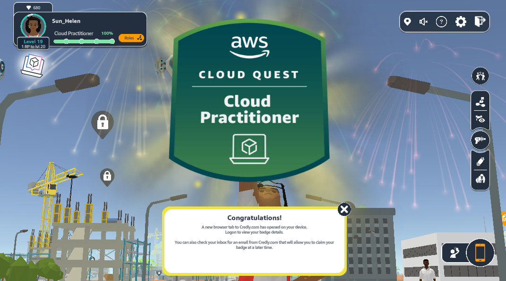
