# Sobre a Análise

A motivação para esta análise é dissecar os fatores que definem o sucesso e a aclamação no cinema de terror e mistério. Indo além de métricas superficiais, a investigação explora a evolução de arquétipos de gênero, as dinâmicas de parcerias criativas, o impacto de estratégias de mercado (como a classificação indicativa) e o estilo autoral de diretores icônicos. O objetivo é usar dados para entender o que realmente ressoa com o público e a crítica em dois dos gêneros mais fascinantes do cinema.

Para guiar este trabalho, a análise buscará responder às seguintes perguntas-chave:

A Evolução da Protagonista Feminina: Comparando a década de 80 com a de 2020, filmes de terror com protagonistas femininas se tornaram mais comuns? E como a avaliação média desses filmes se compara entre as duas épocas?

O Reinado dos Ícones Masculinos do Terror Moderno: Quem são os atores que definem o terror moderno? Analisando a filmografia de atores proeminentes no gênero pós-anos 2000, qual deles construiu a carreira mais impactante em termos de número de filmes, nota média e sucesso de bilheteria?

*Obs: Os atores icônicos escolhidos para essa análise foram: Patrick Wilson, Ethan Hawke, Tobin Bell e Daniel Kaluuya.*

Terror Psicológico e Mistério: Filmes de terror psicológico que também são classificados como mistério são, de fato, mais bem avaliados pela crítica do que aqueles que são puramente terror psicológico?

O Dilema do Terror Leve: Filmes de terror com classificação indicativa mais branda (PG-13 nos EUA) são mais populares ou mais bem avaliados que os filmes com classificação restrita (R)? Como a popularidade e a nota média desses filmes se comparam?

Mestres do Suspense Moderno: Quem é o verdadeiro mestre do suspense: David Fincher ou Christopher Nolan? Analisando a filmografia de mistério e suspense de ambos, qual diretor apresenta uma carreira mais consistente em termos de aclamação da crítica (nota média de seus filmes)?

O Toque de Midas de Stephen King: Filmes de terror e mistério baseados na obra de Stephen King apresentam um desempenho crítico superior à média do gênero? Como a nota média das adaptações de King se compara com filmes de terror com roteiros originais?

### Nota Sobre a Coleta de Dados
É importante ressaltar que os dados coletados da API do The Movie Database (TMDb) para este projeto representam amostras limitadas. Para cada análise, foram extraídas apenas as primeiras páginas de resultados a fim de respeitar os limites de requisição da API e garantir que o volume de dados fosse adequado para o processamento e armazenamento na nuvem da Amazon Web Services (AWS), evitando custos e extrapolação de limites.


# Etapas

1. ... [Etapa I](./etapa-1/etapa_1.py)

A primeira etapa do desafio consistiu na **ingestão em batch** dos arquivos CSV locais (`movies.csv` e `series.csv`) para a camada `Raw` do Data Lake na AWS S3. Para garantir que esse processo fosse portátil, consistente e seguro, a solução foi dividida em três componentes principais: um script Python para a lógica de negócio, um arquivo de dependências e um `Dockerfile` para a containerização.

## 1\. O Script Python (`etapa_1.py`)

Neste script da etapa 1, a biblioteca `boto3`, o SDK oficial da AWS para Python, é a ferramenta principal, utilizada para criar um bucket no S3 e para fazer o upload dos arquivos CSV. Para configurar o `boto3` e encontrar os arquivos locais, a biblioteca `os` é usada para ler variáveis de ambiente, como a região da AWS, e para construir os caminhos dos arquivos de forma compatível com qualquer sistema operacional. A `dotenv` auxilia no desenvolvimento local, carregando essas variáveis de um arquivo `.env`. Por fim, a `datetime` é usada para obter a data atual, permitindo que os arquivos sejam organizados no S3 em uma estrutura de pastas com `ano/mês/dia`.

```
import boto3
from datetime import datetime
import os 
from dotenv import load_dotenv 
```

O coração da Etapa 1 é um script Python que automatiza todo o processo de conexão com a AWS e o upload dos dados. Suas principais responsabilidades são:

- **Gerenciamento de Credenciais:** Utiliza a biblioteca `python-dotenv` para carregar de forma segura as credenciais da AWS (`AWS_ACCESS_KEY_ID`, `AWS_SECRET_ACCESS_KEY`, etc.) a partir de um arquivo `.env` local. Isso evita que informações sensíveis sejam expostas diretamente no código.

O arquivo `.env` possui essa estrutura:

```
AWS_ACCESS_KEY_ID=XXXXXXXXXXX
AWS_SECRET_ACCESS_KEY=XXXXXXXXXXX
AWS_SESSION_TOKEN=XXXXXXXXXXX
AWS_REGION=XXXXXXXXXXX
```

    
- **Criação do Bucket S3:** O script possui uma função (`criar_bucket`) que, antes de qualquer coisa, verifica se o bucket de destino (`bucket`) já existe. Caso não exista, ele o cria. Se já existir e pertencer ao usuário, ele simplesmente continua a execução. Isso torna o script resiliente e executável múltiplas vezes sem erros.

```
def criar_bucket(nome_bucket):
    try:
        cliente_s3= boto3.client('s3', regiao)
        cliente_s3.create_bucket(Bucket=nome_bucket)
        print(f"Bucket '{nome_bucket}' criado com sucesso.")
       
    except boto3.client('s3').exceptions.ClientError as e:
        if e.response['Error']['Code'] == 'BucketAlreadyOwnedByYou':
            print(f"Bucket '{nome_bucket}' já existe.")
        else:
            print(f"Erro inesperado ao criar o bucket: {e}")
            raise e

```

Obtive o resultado abaixo:

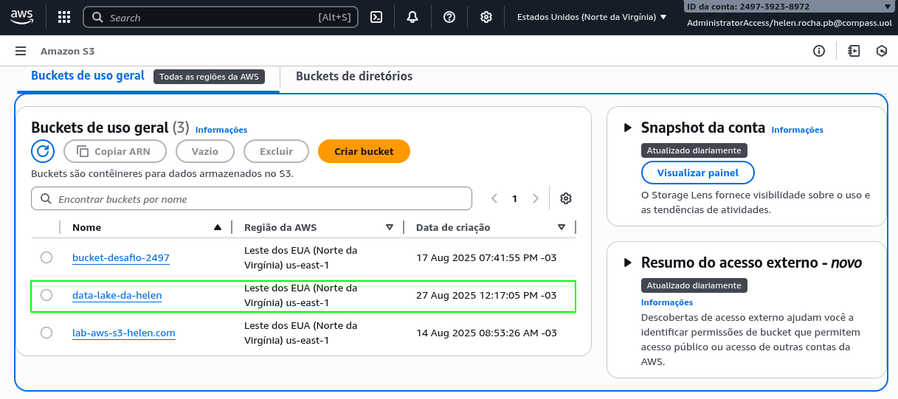
    
**Upload e Estruturação dos Dados:** A função `upload_s3` constrói um caminho de destino dinâmico no S3, seguindo o padrão exigido pelo desafio. A data é gerada automaticamente com base no dia da execução, garantindo um versionamento temporal dos dados ingeridos.

```
def upload_s3(nome_bucket):
    print("Iniciando o processo de upload para o S3")
    cliente_s3 = boto3.client('s3', regiao)

    hoje = datetime.now()
    ano = hoje.strftime("%Y")
    mes = hoje.strftime("%m")
    dia = hoje.strftime("%d")
```

Após isso, o código inicia um loop for que processa cada nome de arquivo contido na lista `ARQUIVOS_UPLOAD` (que são `movies.csv` e `series.csv`).
A cada iteração, `os.path.join` é usado para criar o caminho completo do arquivo no sistema local, juntando o diretório de dados (`DADOS_DIR`) com o nome do arquivo atual.

```
    for nome_arquivo in ARQUIVOS_UPLOAD:
        caminho_arquivos = os.path.join(DADOS_DIR, nome_arquivo)
```

O próximo bloco funciona como um "etiquetador". Ele verifica se o nome do arquivo (convertido para minúsculas) contém a palavra "`movies`" ou "`series`". Com base no nome, ele define a variável `spec` como "`Movies`" ou "`Series`". Essa variável será usada mais tarde para salvar o arquivo na subpasta correta dentro do S3.

```
    if 'movies' in nome_arquivo.lower():
            spec = 'Movies'
        elif 'series' in nome_arquivo.lower():
            spec = 'Series'
        else:
            print(f"Arquivo '{nome_arquivo}' não reconhecido.")
            continue
```

A linha abaixo é uma das partes mais importantes. Usando uma f-string, e a data capturada do trecho acima o código constrói o "endereço" completo onde o arquivo será salvo dentro do S3.

```
    chave_s3 = f"Raw/Local/CSV/{spec}/{ano}/{mes}/{dia}/{nome_arquivo}"
```

Obtive os resultados abaixo:


No trecho abaixo, o bloco `try...except` garante que, se ocorrer um erro durante o upload, o programa não irá travar. Em seguida, a função `cliente_s3.upload_file` do `boto3` é chamada para realizar o upload, recebendo três parâmetros principais:

- `Filename`: O caminho do arquivo de origem na máquina local.

- `Bucket`: O nome do bucket de destino no S3.

- `Key`: O caminho completo do objeto de destino dentro do S3, que foi montado no bloco anterior.

Se o upload for bem-sucedido, uma mensagem de sucesso é exibida. Se falhar, o bloco except captura a exceção, imprime uma mensagem de erro informando qual arquivo falhou e o motivo, e o loop continua para o próximo arquivo.

```
    print(f"Enviando '{caminho_arquivos}' para o bucket '{NOME_BUCKET}'...")
        
        cliente_s3.upload_file(
            Filename=caminho_arquivos,
            Bucket=NOME_BUCKET,
            Key=chave_s3
        )

        print(f"Sucesso! Arquivo enviado para: s3://{NOME_BUCKET}/{chave_s3}\n")

    except Exception as e:
        print(f"Erro ao enviar o arquivo '{nome_arquivo}': {e}\n")
```

Obtive os resultados a seguir:

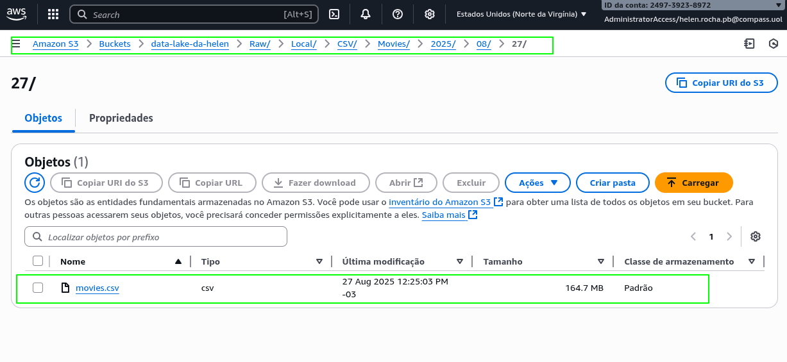

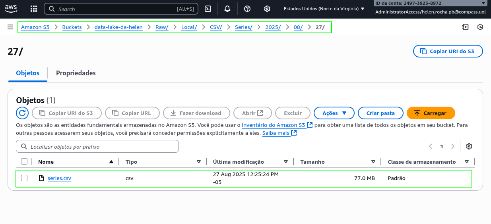        

## 2\. Gerenciamento de Dependências (`dependencias.txt`)

Para que o script Python funcione, ele precisa de bibliotecas externas. Um arquivo `dependencias.txt` foi criado para listar todas as bibliotecas necessárias, facilitando a instalação em qualquer ambiente. As dependências são:

- `boto3`: O SDK oficial da AWS para Python, que permite a comunicação com serviços como o S3.
    
- `python-dotenv`: Uma biblioteca que facilita o gerenciamento de variáveis de ambiente, usada para carregar as credenciais do arquivo `.env`.

Arquivo `dependencias.txt`:

[Arquivo com Dependências](./etapa-1/dependencias.txt)    

## 3\. Containerização com Docker (`Dockerfile`)

Para encapsular toda a lógica e suas dependências em um ambiente portátil e consistente, foi utilizado o Docker. O `Dockerfile` define a "receita" para construir a imagem da aplicação:

1.  **Imagem Base:** Inicia a partir de uma imagem oficial e leve do Python (`python:3.9-slim`).
    
2.  **Diretório de Trabalho:** Cria e define o diretório `/app` como o padrão dentro do container.
    
3.  **Instalação de Dependências:** Copia o arquivo `dependencias.txt` para dentro da imagem e executa o `pip install` para instalar `boto3` e `python-dotenv`.
    
4.  **Cópia dos Arquivos:** Copia a pasta local `arquivos/` (com os CSVs) e o script `etapa_1.py` para o diretório de trabalho `/app` do container.
    
5.  **Execução:** Define o comando `CMD` para executar o script `python etapa_1.py` assim que o container for iniciado.

Arquivo `Dockerfile`:

[Arquivo Dockerfile](./etapa-1/Dockerfile)    

A imagem foi criada com o seguinte comando:

```
docker build -t etapa-1 -f etapa-1/Dockerfile .
```
    

Ao final, o processo é executado localmente usando os comandos do Docker, que constroem a imagem e rodam o container. O uso da flag `--env-file` no comando `docker run` garante que as credenciais do arquivo `.env` sejam passadas de forma segura para dentro do container, permitindo que o script se autentique na AWS e complete a ingestão dos dados.

```
docker run --env-file etapa-1/.env etapa-1
```

Obtive esse resultado:

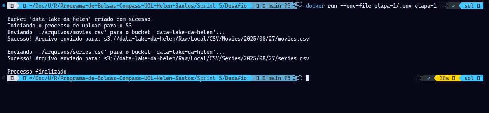

2. ... [Etapa II](./etapa-2/etapa-2.py)

A Etapa 2 do desafio foi dedicada à ingestão de dados via API, com o objetivo de enriquecer nosso Data Lake com informações detalhadas e específicas do The Movie Database (TMDB). Para isso, foi desenvolvido um script Python sofisticado e modular (`etapa-2.py`), projetado para funcionar tanto em um ambiente de desenvolvimento local quanto na nuvem, como uma função AWS Lambda. A arquitetura do script foi pensada para ser robusta, configurável e focada em coletar precisamente os dados necessários para responder às seis perguntas de análise definidas no projeto.

A base do script é seu sistema de configuração flexível, que utiliza a biblioteca `python-dotenv` para carregar informações sensíveis, como as chaves da AWS e da API do TMDB, a partir de um arquivo `.env`. Uma variável de ambiente chave, `MODO_DESENVOLVIMENTO`, atua como um interruptor inteligente: quando ativada, o script salva todos os arquivos JSON gerados em uma pasta local (`resultados_json`), permitindo testes e depuração rápidos sem custos ou complexidade da nuvem. Quando desativada, o script assume seu papel de produção, enviando os arquivos diretamente para o bucket S3 na AWS, organizando-os em uma estrutura de pastas particionada por ano, mês e dia.

Para garantir um código limpo e eficiente, a lógica foi dividida em funções especializadas. Uma função central, `processar_e_salvar_dados`, gerencia a forma como os dados são finalizados, utilizando uma função auxiliar, `agrupar_registros`, para dividir as coletas em arquivos com no máximo 100 registros cada, conforme as boas práticas do desafio. O script também foi programado para ser um "bom cidadão" da internet, com uma função `buscar_multiplas_paginas` que inclui pausas (`time.sleep`) entre as chamadas à API para evitar sobrecargas.

O coração do script executa, em sequência, seis funções de análise distintas, cada uma projetada para responder a uma das perguntas do projeto. Essas funções realizam buscas direcionadas na API do TMDB, coletando dados sobre a evolução da protagonista feminina no terror, a carreira de atores icônicos do gênero, a interseção entre terror psicológico e mistério, o impacto da classificação indicativa no sucesso dos filmes, uma comparação entre os diretores David Fincher e Christopher Nolan e, por fim, uma análise sobre as adaptações de Stephen King. Cada função coleta, enriquece e estrutura os dados em um formato JSON significativo para a análise que se propõe a responder.

Finalmente, a função `lambda_handler` atua como o maestro de toda a operação, orquestrando as chamadas para cada análise e garantindo que o processo ocorra na ordem correta. Um bloco `if __name__ == "__main__"` permite que todo esse fluxo seja executado localmente com um simples comando `python etapa-2.py`, simulando o ambiente da AWS e provando a funcionalidade do código de ponta a ponta antes mesmo de seu deploy para a nuvem. O resultado é um sistema de ingestão de dados resiliente, testável e preparado para popular o Data Lake com informações de alta qualidade.

----

## Variáveis do Arquivo `.env`

O arquivo `.env` funciona como um painel de controle central e seguro para o projeto, definindo todas as configurações externas que o script precisa para operar. As variáveis `AWS_ACCESS_KEY_ID`, `AWS_SECRET_ACCESS_KEY` e o opcional `AWS_SESSION_TOKEN` fornecem as credenciais de autenticação, essencialmente o usuário, a senha e o token de sessão, que permitem ao script acessar a conta da Amazon Web Services de forma segura.

```
AWS_ACCESS_KEY_ID=XXXXXXXXXXXXXXXX
AWS_SECRET_ACCESS_KEY=XXXXXXXXXXXXXXXX
AWS_SESSION_TOKEN=XXXXXXXXXXXXXXXX
AWS_REGION=XXXXXXXXXXXXXXXX
TMDB_API_KEY=XXXXXXXXXXXXXXXX
S3_BUCKET=XXXXXXXXXXXXXXXX
MODO_DESENVOLVIMENTO=XXXXXXXXXXXXXXXX
```

Complementando a configuração da AWS, a `AWS_REGION` especifica em qual data center da Amazon seus serviços estão localizados (ex:`us-east-1`), enquanto `S3_BUCKET` define o nome exato do "balde" de armazenamento onde os dados serão salvos.

Para a coleta de dados, a `TMDB_API_KEY` atua como a chave de permissão para que o script possa fazer requisições e buscar informações na base de dados do The Movie Database.

Finalmente, a variável `MODO_DESENVOLVIMENTO` funciona como um interruptor para testes: quando definida como `True`, o script salva os resultados localmente em seu computador para fácil verificação; caso contrário, ele opera em modo de produção, enviando os arquivos para o S3.

O comando do script `etapa-2` faz o carregamento dessas variáveis para serem utilizadas:

```
load_dotenv()
```

#### 1\. O Script Python (`etapa_2.py`)

O script utiliza um conjunto de bibliotecas para construir um pipeline de dados automatizado. A `tmdbv3api` é usada para buscar os dados de filmes na API do The Movie Database, enquanto a `boto3` (o SDK da AWS) é responsável por enviar os resultados para o Amazon S3. Para evitar sobrecarregar a API externa, a biblioteca `time` adiciona pausas estratégicas entre as requisições. O gerenciamento de configurações e arquivos é feito por um conjunto de bibliotecas: `dotenv` carrega as chaves secretas de um arquivo `.env` durante o desenvolvimento local, que são lidas pela `os`, biblioteca que também gerencia as pastas. Finalmente, `json` converte os dados coletados para o formato de texto JSON, e `datetime` fornece a data atual para organizar os arquivos no S3 em pastas de `ano/mês/dia`.

```
import json
import os
from datetime import datetime
from tmdbv3api import TMDb, Movie, Person, Discover
from dotenv import load_dotenv
import boto3
import time
```

O bloco de código  abaixo executa a configuração essencial para que o script possa se comunicar com a API do The Movie Database (TMDB). Primeiramente, ele inicializa os principais objetos da biblioteca `tmdbv3api`: o controlador central `TMDb`, e os objetos especialistas `Movie` e `Person`, que funcionam como ferramentas específicas para buscar dados de filmes e de pessoas, respectivamente. O passo final e crucial é a autenticação, onde a chave da API, carregada de forma segura a partir das variáveis de ambiente com `os.getenv("TMDB_API_KEY")`, é atribuída ao controlador principal. Ao final deste processo, o script está devidamente autenticado e pronto para começar a fazer as requisições de dados.

```
tmdb = TMDb()
movie = Movie()
person = Person()
tmdb.api_key = os.getenv("TMDB_API_KEY")

```

O trecho de código seguinte é responsável por criar e configurar o cliente do Amazon S3, que é a ferramenta de conexão com o serviço de armazenamento da AWS, utilizando a biblioteca `boto3`. Ele instancia um cliente para o serviço 's3', passando explicitamente as credenciais de autenticação que são lidas de forma segura a partir das variáveis de ambiente com `os.getenv`: o `aws_access_key_id` (o "usuário"), a `aws_secret_access_key` (a "senha"), e o `aws_session_token` (o token para sessões temporárias, se houver). Além disso, o parâmetro `region_name` também é configurado a partir do ambiente, garantindo que o cliente se conecte ao data center correto da AWS onde seu bucket está localizado. Ao final, a variável `s3` contém um objeto pronto e autenticado para realizar operações no S3, como salvar os arquivos JSON.

```
s3 = boto3.client(
    's3',
    aws_access_key_id=os.getenv("AWS_ACCESS_KEY_ID"),
    aws_secret_access_key=os.getenv("AWS_SECRET_ACCESS_KEY"),
    aws_session_token=os.getenv("AWS_SESSION_TOKEN"),
    region_name=os.getenv("AWS_REGION")
)
```

A seguir são inicializadas variáveis de configuração cruciais para o funcionamento do script, lendo-as a partir do ambiente para tornar o código flexível. Primeiramente, ele define a variável `BUCKET_S3` buscando o nome do bucket de destino no S3 a partir da variável de ambiente `S3_BUCKET`. Em seguida, ele estabelece um "modo de operação" através da variável booleana `MODO_DESENVOLVIMENTO`, que se torna `True` se a variável de ambiente correspondente estiver definida como "true" ou se não estiver definida, garantindo um padrão seguro para testes locais. Por fim, o código utiliza essa flag para uma ação condicional: se o script estiver rodando em modo de desenvolvimento, ele verifica se a pasta local para os resultados, `resultados_json`, já existe e, caso não exista, a cria automaticamente, garantindo que o ambiente esteja sempre preparado para salvar os arquivos de teste sem gerar erros.

```
BUCKET_S3 = os.getenv("S3_BUCKET")

MODO_DESENVOLVIMENTO = os.getenv("MODO_DESENVOLVIMENTO", "True").lower() == "true"

PASTA_RESULTADOS = "resultados_json"

if MODO_DESENVOLVIMENTO:
    if not os.path.exists(PASTA_RESULTADOS):
        os.makedirs(PASTA_RESULTADOS)
```

### Funções

A função `objeto_para_dict`, atua como um "conversor universal" projetado para transformar objetos complexos da biblioteca `tmdbv3api` em um formato de dicionário Python puro, que é ideal para ser salvo como JSON. Ela opera de forma recursiva, ou seja, "olha para dentro" de cada dado que recebe para convertê-lo. Se a função encontra um objeto, ela transforma seus atributos em um dicionário, ignorando atributos internos que começam com `_`, e então chama a si mesma para cada um desses valores, garantindo que objetos aninhados também sejam convertidos. Se encontra uma lista, ela percorre cada item e aplica a mesma lógica de conversão. Caso o dado já seja um tipo simples, como um texto ou número, ela o retorna sem modificação, finalizando o processo.

```
def objeto_para_dict(obj):
    if hasattr(obj, '__dict__'):
        return {k: objeto_para_dict(v) for k, v in obj.__dict__.items() if not k.startswith('_')}
    elif isinstance(obj, list):
        return [objeto_para_dict(item) for item in obj]
    else:
        return obj
```

A função `agrupar_registros` é um utilitário prático que resolve o requisito de não gerar arquivos JSON muito grandes. Sua principal finalidade é pegar uma lista longa de dados, como os resultados de uma busca na API, e dividi-la em vários "pedaços" ou "grupos" menores, cada um com um tamanho máximo de 100 registros. Ela faz isso percorrendo a lista em saltos de 100 e, a cada passo, "fatia" a lista original para criar um subgrupo. Ao final, ela retorna uma lista de listas, onde cada lista interna contém no máximo 100 itens. Isso permite que o script principal processe e salve os dados em partes, gerando múltiplos arquivos quando a coleta de dados é muito grande.

```
def agrupar_registros(dados, max_registros=100):
    if not isinstance(dados, list):
        return [dados]
    
    grupos = []
    for i in range(0, len(dados), max_registros):
        grupos.append(dados[i:i+max_registros])
    return grupos

```

A função `salvar_json_local` é responsável por gravar os dados coletados em um arquivo no seu computador. Primeiramente, ela constrói um caminho de arquivo completo e compatível com o sistema operacional, juntando o nome da pasta de resultados pré-definida com o nome do arquivo da análise e a extensão `.json`. Em seguida, utilizando um bloco `with open`, ela abre este caminho em modo de escrita (`"w"`), garantindo que o arquivo seja fechado automaticamente após a operação. O uso de `encoding="utf-8"` assegura que caracteres especiais, como acentos, sejam salvos corretamente. Por fim, o método `json.dump` converte o objeto de dados Python diretamente para o formato JSON, com uma indentação de dois espaços para facilitar a leitura, e o escreve no arquivo, imprimindo uma mensagem de sucesso no console com a localização do arquivo salvo.

```
def salvar_json_local(nome_arquivo, dados):
    caminho = os.path.join(PASTA_RESULTADOS, f"{nome_arquivo}.json")
    with open(caminho, "w", encoding="utf-8") as arquivo:
        json.dump(dados, arquivo, ensure_ascii=False, indent=2)
    print(f"Arquivo salvo localmente: {caminho}")
    return caminho
```

A função `salvar_s3` tem como objetivo enviar os dados como um arquivo JSON para um bucket no Amazon S3, mas com um mecanismo de segurança integrado. A primeira coisa que ela faz é verificar a variável `MODO_DESENVOLVIMENTO`; se for `True`, a função apenas imprime uma mensagem de que está simulando o envio e encerra sua execução, evitando uploads reais para a nuvem durante os testes. Caso contrário, ela prossegue para o modo de produção, construindo um caminho de destino dinâmico no S3 que organiza o arquivo em pastas por ano, mês e dia da ingestão. Dentro de um bloco `try...except` para tratamento de erros, ela converte o objeto de dados Python em uma string formatada em JSON usando `json.dumps` e, em seguida, utiliza o método `s3.put_object` para realizar o upload dessa string como o corpo do arquivo para o bucket e caminho especificados, retornando `True` em caso de sucesso ou `False` se qualquer erro for capturado.

```
def salvar_s3(nome_arquivo, dados):
    if MODO_DESENVOLVIMENTO:
        print(f"Modo desenvolvimento: Simulando envio para S3 - {nome_arquivo}")
        return True
    
    data_atual = datetime.now()
    path_s3 = f"Raw/TMDB/JSON/{data_atual.year}/{data_atual.month:02}/{data_atual.day:02}/{nome_arquivo}.json"
    
    try:
        s3.put_object(
            Bucket=BUCKET_S3, 
            Key=path_s3, 
            Body=json.dumps(dados, ensure_ascii=False, indent=2)
        )
        print(f"Arquivo enviado para o S3: {path_s3}")
        return True
    except Exception as e:
        print(f"Erro ao enviar para S3: {e}")
        return False
```

A função `processar_e_salvar_dados` atua como um orquestrador central para o processo de salvamento dos dados coletados. Após receber um nome base para a análise e a lista de dados, ela primeiro verifica se a lista não está vazia. Em seguida, para lidar com grandes volumes de informações e respeitar o limite de 100 registros por arquivo, ela utiliza a função `agrupar_registros` para dividir os dados em pedaços menores. Depois, ela percorre cada um desses pedaços e cria um nome de arquivo inteligente: se houver múltiplos grupos, ela adiciona um sufixo numérico (como `_parte_1`, `_parte_2`); caso contrário, usa apenas o nome base. Finalmente, a função decide onde salvar cada grupo com base na variável `MODO_DESENVOLVIMENTO`: se este modo estiver ativo, ela salva uma cópia local do arquivo e, independentemente do modo, também chama a função `salvar_s3`, que fará o upload real para a nuvem ou apenas simulará o processo, garantindo que os dados cheguem ao seu destino final de forma organizada.

```
def processar_e_salvar_dados(nome_base, dados):
    if not dados:
        print(f"Nenhum dado encontrado para {nome_base}")
        return
    
    grupos = agrupar_registros(dados, 100)
    
    for i, grupo in enumerate(grupos):
        nome_arquivo = f"{nome_base}_parte_{i+1}" if len(grupos) > 1 else nome_base
        
        if MODO_DESENVOLVIMENTO:
            salvar_json_local(nome_arquivo, grupo)
        
        salvar_s3(nome_arquivo, grupo)
```

A função `buscar_multiplas_paginas` é um utilitário projetado para automatizar a coleta de dados de várias páginas de resultados da API do TMDB, superando o limite padrão de 20 resultados por chamada. Ela recebe um objeto `discover` da API, um dicionário com os parâmetros de busca (como gênero ou data) e um número máximo de páginas a serem buscadas. A função então inicia um loop que executa para cada número de página, adicionando o número atual aos parâmetros de busca antes de fazer a chamada à API. Os resultados daquela página são então adicionados a uma lista principal que acumula todos os filmes encontrados. Para ser um "bom cidadão" da internet e evitar sobrecarregar a API, a função inclui uma pequena pausa (`time.sleep`) entre cada requisição. Além disso, ela possui um tratamento de erros que, em caso de falha, interrompe o processo de forma segura e retorna os dados que conseguiu coletar até aquele momento, resultando em uma única lista com todos os filmes de todas as páginas buscadas com sucesso.

```
def buscar_multiplas_paginas(discover, params, max_paginas=3):
    todos_filmes = []
    
    for pagina in range(1, max_paginas + 1):
        try:
            print(f"Buscando página {pagina}...")
            params["page"] = pagina
            resultados = discover.discover_movies(params)
            
            if hasattr(resultados, 'results'):
                todos_filmes.extend(resultados.results)
            
            time.sleep(0.1)
            
        except Exception as e:
            print(f"Erro na página {pagina}: {e}")
            break
    
    return todos_filmes
```

A função abaixo atua na identificação do gênero do personagem principal de um filme. Ao receber o ID de um filme, ela primeiro busca na API do TMDB os detalhes do elenco (`movie.credits`), assumindo que o primeiro nome na lista é o protagonista. Em seguida, ela verifica o atributo de gênero dessa pessoa, onde o TMDB utiliza o código `1` para feminino. Se o protagonista for de fato uma mulher, a função retorna `True` junto com o nome da atriz. Caso contrário, ou se ocorrer qualquer erro durante a busca (como um filme sem elenco listado), ela retorna `False` e `None`, garantindo que o programa principal possa continuar sua execução sem travar.

```
def verificar_protagonista_feminina(filme_id):
    try:
        detalhes = movie.details(filme_id)
        creditos = movie.credits(filme_id)
        
        if (hasattr(creditos, 'cast') and len(creditos.cast) > 0):
            protagonista = creditos.cast[0]
            # Gênero 1 = feminino, 2 = masculino
            if hasattr(protagonista, 'gender') and protagonista.gender == 1:
                return True, protagonista.name
        
        return False, None
        
    except Exception as e:
        print(f"Erro ao verificar protagonista do filme {filme_id}: {e}")
        return False, None
```

A próxima função orquestra a análise completa sobre a evolução das protagonistas femininas no cinema de terror, comparando as décadas de 80 e 2020. Inicialmente, ela utiliza a função auxiliar `buscar_multiplas_paginas` para coletar uma lista de filmes de terror populares de cada uma das duas décadas. Em seguida, ela processa essas duas listas separadamente, utilizando a função `verificar_protagonista_feminina` para filtrar e criar novas listas contendo apenas os filmes que de fato possuem uma mulher como personagem principal. Com os dados já filtrados, a função calcula estatísticas importantes para cada década, como a quantidade total de filmes com protagonistas femininas e a nota média de avaliação desses filmes. Por fim, ela consolida todos os dados — as listas de filmes e as estatísticas, em um único objeto de resultado, incluindo uma seção de "comparacao" que calcula diretamente a diferença na quantidade de filmes e na nota média entre os anos 2020 e os anos 80, deixando os dados prontos para a etapa de visualização.

```
def analise_protagonista_feminina():
    discover = Discover()
    resultado_total = {}

    try:
        print("Buscando filmes de terror anos 80...")
        filmes_anos_80 = buscar_multiplas_paginas(discover, {
            "with_genres": 27,
            "primary_release_date.gte": "1980-01-01",
            "primary_release_date.lte": "1989-12-31"
        }, max_paginas=3)

        print("Buscando filmes de terror anos 2020...")
        filmes_anos_2020 = buscar_multiplas_paginas(discover, {
            "with_genres": 27,
            "primary_release_date.gte": "2020-01-01",
            "primary_release_date.lte": "2024-12-31"
        }, max_paginas=3)

        filmes_80_femininos = []
        for filme in filmes_anos_80:
            try:
                tem_protagonista_feminina, nome_ator = verificar_protagonista_feminina(filme.id)
                
                if tem_protagonista_feminina:
                    filme_data = {
                        "id": filme.id,
                        "title": filme.title,
                        "release_date": filme.release_date,
                        "vote_average": filme.vote_average,
                        "vote_count": filme.vote_count,
                        "protagonista_feminina": True,
                        "nome_protagonista": nome_ator
                    }
                    filmes_80_femininos.append(filme_data)
                    
            except Exception as e:
                print(f"Erro ao processar filme {filme.id}: {e}")
                continue

        # Filtrar apenas filmes com protagonistas femininas - Anos 2020
        filmes_2020_femininos = []
        for filme in filmes_anos_2020:
            try:
                tem_protagonista_feminina, nome_ator = verificar_protagonista_feminina(filme.id)
                
                if tem_protagonista_feminina:
                    filme_data = {
                        "id": filme.id,
                        "title": filme.title,
                        "release_date": filme.release_date,
                        "vote_average": filme.vote_average,
                        "vote_count": filme.vote_count,
                        "protagonista_feminina": True,
                        "nome_protagonista": nome_ator
                    }
                    filmes_2020_femininos.append(filme_data)
                    
            except Exception as e:
                print(f"Erro ao processar filme {filme.id}: {e}")
                continue

        def calcular_estatisticas_femininas(filmes_femininos):
            if filmes_femininos:
                nota_media = sum(f["vote_average"] for f in filmes_femininos if f["vote_average"]) / len(filmes_femininos)
                total_votos = sum(f["vote_count"] for f in filmes_femininos)
            else:
                nota_media = 0
                total_votos = 0
                
            return {
                "quantidade_filmes": len(filmes_femininos),
                "nota_media": round(nota_media, 3),
                "total_votos": total_votos
            }

        stats_80 = calcular_estatisticas_femininas(filmes_80_femininos)
        stats_2020 = calcular_estatisticas_femininas(filmes_2020_femininos)

        resultado_total = {
            "anos_80": {
                **stats_80,
                "filmes": filmes_80_femininos  
            },
            "anos_2020": {
                **stats_2020,
                "filmes": filmes_2020_femininos  
            },
            "comparacao": {
                "diferenca_quantidade": stats_2020["quantidade_filmes"] - stats_80["quantidade_filmes"],
                "diferenca_nota_media": round(stats_2020["nota_media"] - stats_80["nota_media"], 3),
                "aumento_percentual_quantidade": round((stats_2020["quantidade_filmes"] - stats_80["quantidade_filmes"]) / stats_80["quantidade_filmes"] * 100, 2) if stats_80["quantidade_filmes"] > 0 else 0
            }
        }

    except Exception as e:
        print(f"Erro na análise: {e}")
        resultado_total = {"erro": str(e)}

    return resultado_total
```

A função abaixo opera como um investigador focado, projetado para mapear a carreira de um ator específico dentro do gênero de terror. Ao receber o ID e o nome de um ator, ela primeiro busca na API do TMDB a lista completa de todos os filmes em que a pessoa atuou. Em seguida, ela percorre essa filmografia filme a filme e, para cada um, verifica se ele pertence ao gênero de terror (ID 27). Se pertencer, a função faz uma segunda chamada à API para obter detalhes mais aprofundados, como orçamento, bilheteria e resumo. Com todos esses dados em mãos, ela calcula o retorno sobre o investimento (ROI) do filme e consolida todas as informações em um formato de dicionário completo. Para evitar sobrecarregar a API, uma pequena pausa é feita entre cada consulta de detalhes. Ao final, a função retorna uma lista contendo apenas os filmes de terror da carreira do ator, com cada filme representado por um conjunto rico de informações.

```
def buscar_filmografia_terror(ator_id, nome_ator):
    filmografia_terror = []
    
    try:
        print(f"Buscando filmografia de {nome_ator}...")
        creditos = person.movie_credits(ator_id)        
       
        if hasattr(creditos, 'cast'):
            for filme in creditos.cast:
                # Acessa os genre_ids diretamente do objeto 'filme'
                if hasattr(filme, 'genre_ids') and 27 in filme.genre_ids:
                    try:
                        detalhes = movie.details(filme.id)
                        
                        filme_completo = {
                            "id": filme.id,
                            "title": filme.title,
                            "release_date": filme.release_date if hasattr(filme, 'release_date') else None,
                            "vote_average": filme.vote_average,
                            "vote_count": filme.vote_count,
                            "character": filme.character if hasattr(filme, 'character') else None,
                            "overview": detalhes.overview,
                            "revenue": detalhes.revenue,
                            "budget": detalhes.budget,
                            "runtime": detalhes.runtime,
                            "poster_path": detalhes.poster_path
                        }
                        
                        if filme_completo['budget'] > 0 and filme_completo['revenue'] > 0:
                            filme_completo['roi'] = round(
                                (filme_completo['revenue'] - filme_completo['budget']) / 
                                filme_completo['budget'] * 100, 2
                            )
                        else:
                            filme_completo['roi'] = None
                            
                        filmografia_terror.append(filme_completo)
                        
                    except Exception as e:
                        print(f"Erro ao buscar detalhes do filme {filme.id}: {e}")
                    
                    time.sleep(0.1)  # Delay para não sobrecarregar a API
            
            print(f"Encontrados {len(filmografia_terror)} filmes de terror para {nome_ator}")
        
    except Exception as e:
        print(f"Erro ao buscar filmografia de {nome_ator}: {e}")
    
    return filmografia_terror
```

A próxima função orquestra a análise completa sobre os ícones masculinos do terror moderno. Ela começa com uma lista pré-definida de atores a serem investigados e, para cada um, utiliza a função auxiliar `buscar_filmografia_terror` para obter uma lista detalhada de todos os seus filmes no gênero. Caso a busca retorne algum filme, a função inicia um processo de cálculo de estatísticas agregadas para a carreira daquele ator: ela ordena os filmes por data de lançamento, calcula a nota média de avaliação, soma toda a bilheteria e o orçamento de seus filmes de terror, e identifica qual foi o seu filme mais popular com base no número de votos. Todos esses dados consolidados, incluindo as estatísticas e a filmografia completa, são então adicionados a um resultado final. Esse processo se repete para cada ator da lista, resultando em um relatório completo que permite uma comparação direta entre eles, respondendo assim à pergunta central da análise.

```
def analise_atores_terror_moderno():
    """Análise detalhada da filmografia de terror dos atores"""
    atores = [
        {"nome": "Patrick Wilson", "id": 17178},
        {"nome": "Ethan Hawke", "id": 569},
        {"nome": "Tobin Bell", "id": 2144},
        {"nome": "Daniel Kaluuya", "id": 206919}
    ]
    
    resultado_total = []
    
    for ator in atores:
        try:
            # Buscar filmografia de terror
            filmografia = buscar_filmografia_terror(ator["id"], ator["nome"])
            
            # Calcular estatísticas
            if filmografia:
                # Ordenar por data de lançamento
                filmografia_ordenada = sorted(
                    [f for f in filmografia if f.get('release_date')],
                    key=lambda x: x.get('release_date', ''),
                    reverse=True
                )
                
                # Calcular métricas
                notas_validas = [f["vote_average"] for f in filmografia if f.get("vote_average")]
                nota_media = sum(notas_validas) / len(notas_validas) if notas_validas else 0
                
                total_bilheteria = sum(f.get("revenue", 0) for f in filmografia)
                total_orcamento = sum(f.get("budget", 0) for f in filmografia)
                
                # Encontrar filme mais popular
                filmes_com_votos = [f for f in filmografia if f.get('vote_count', 0) > 0]
                if filmes_com_votos:
                    filme_mais_popular = max(filmes_com_votos, key=lambda x: x.get('vote_count', 0))
                else:
                    filme_mais_popular = {}
                
                estatisticas = {
                    "quantidade_filmes_terror": len(filmografia),
                    "nota_media": round(nota_media, 2),
                    "total_bilheteria": total_bilheteria,
                    "total_orcamento": total_orcamento,
                    "lucro_total": total_bilheteria - total_orcamento,
                    "filme_mais_popular": {
                        "titulo": filme_mais_popular.get('title', 'N/A'),
                        "nota": filme_mais_popular.get('vote_average', 0),
                        "votos": filme_mais_popular.get('vote_count', 0)
                    }
                }
            else:
                estatisticas = {}
                filmografia_ordenada = []
            
            resultado_total.append({
                "ator": ator["nome"],
                "id": ator["id"],
                "estatisticas": estatisticas,
                "filmografia_terror": filmografia_ordenada,
                "quantidade_filmes": len(filmografia_ordenada)
            })
            
        except Exception as e:
            print(f"Erro ao processar {ator['nome']}: {e}")
            resultado_total.append({
                "ator": ator["nome"],
                "erro": str(e),
                "filmografia_terror": []
            })
    
    return resultado_total
```

A função `analise_terror_psicologico_misterio` foi projetada para comparar dois grupos de filmes: terror psicológico puro versus terror psicológico que também incorpora elementos de mistério. Inicialmente, ela realiza duas buscas distintas na API do TMDB: a primeira para filmes de terror com a palavra-chave "psychological" e a segunda para filmes que, além dessa palavra-chave, também pertencem ao gênero de mistério. Em seguida, uma função interna chamada `processar_resultados` é usada para extrair e limpar as informações essenciais de cada filme encontrado, como título e nota média. Com os dois grupos de dados devidamente processados e separados, a função consolida tudo em um resultado final, calculando a quantidade total de filmes e a nota média para cada grupo, permitindo uma comparação direta entre eles. Todo o processo é envolto em um bloco de tratamento de erros para garantir que qualquer falha na comunicação com a API seja capturada sem interromper a execução do script.

```
def analise_terror_psicologico_misterio():
    """Compara filmes de terror psicológico"""
    discover = Discover()
    resultado_total = {}

    try:
        print("Buscando terror psicológico...")
        terror_psicologico = discover.discover_movies({
            "with_genres": 27,  # Terror
            "with_keywords": "295907",  # ID para Psychological
            "page": 1
        })

        print("Buscando terror psicológico com mistério...")
        terror_misterio = discover.discover_movies({
            "with_genres": "27,9648",  # Terror + Mistério
            "with_keywords": "295907",  # Psychological
            "page": 1
        })

        # Processar resultados
        def processar_resultados(resultados):
            filmes = []
            if hasattr(resultados, 'results'):
                for filme in resultados.results:
                    filmes.append({
                        "id": getattr(filme, 'id', None),
                        "title": getattr(filme, 'title', None),
                        "release_date": getattr(filme, 'release_date', None),
                        "vote_average": getattr(filme, 'vote_average', None)
                    })
            return filmes

        psicologico = processar_resultados(terror_psicologico)
        misterio = processar_resultados(terror_misterio)

        resultado_total = {
            "terror_psicologico": {
                "quantidade": len(psicologico),
                "nota_media": sum(f["vote_average"] for f in psicologico if f["vote_average"]) / len(psicologico) if psicologico else 0,
                "filmes": psicologico
            },
            "terror_psicologico_misterio": {
                "quantidade": len(misterio),
                "nota_media": sum(f["vote_average"] for f in misterio if f["vote_average"]) / len(misterio) if misterio else 0,
                "filmes": misterio
            }
        }

    except Exception as e:
        print(f"Erro na análise de terror psicológico: {e}")
        resultado_total = {"erro": str(e)}

    return resultado_total
```

A próxima função tem como objetivo analisar e comparar filmes de terror com base em sua classificação indicativa nos Estados Unidos, especificamente entre as categorias "PG-13" (terror mais leve) e "R" (terror mais explícito). Para isso, ela executa duas buscas direcionadas na API do TMDB, uma para cada classificação, filtrando sempre por filmes do gênero terror e especificando o país da certificação como "US". Assim como na análise anterior, uma função interna `processar_resultados` é responsável por organizar os dados de cada filme retornado pela API, extraindo informações como título, nota média e popularidade. Ao final, a função estrutura o resultado total em um objeto que separa os dois grupos, calculando a quantidade de filmes e a nota média de cada um, o que facilita a comparação direta do desempenho e da recepção de filmes de terror com diferentes níveis de intensidade. Um tratamento de erro geral garante que a análise seja concluída mesmo que ocorram falhas durante as buscas.

```
def analise_terror_classificacao():
    """Compara filmes de terror por classificação indicativa"""
    discover = Discover()
    resultado_total = {}

    try:
        print("Buscando terror PG-13...")
        terror_pg13 = discover.discover_movies({
            "with_genres": 27,
            "certification_country": "US",
            "certification": "PG-13",
            "page": 1
        })

        print("Buscando terror R...")
        terror_r = discover.discover_movies({
            "with_genres": 27,
            "certification_country": "US",
            "certification": "R",
            "page": 1
        })

        # Processar resultados
        def processar_resultados(resultados):
            filmes = []
            if hasattr(resultados, 'results'):
                for filme in resultados.results:
                    filmes.append({
                        "id": getattr(filme, 'id', None),
                        "title": getattr(filme, 'title', None),
                        "release_date": getattr(filme, 'release_date', None),
                        "vote_average": getattr(filme, 'vote_average', None),
                        "popularidade": getattr(filme, 'popularity', None)
                    })
            return filmes

        pg13 = processar_resultados(terror_pg13)
        r = processar_resultados(terror_r)

        resultado_total = {
            "terror_pg13": {
                "quantidade": len(pg13),
                "nota_media": sum(f["vote_average"] for f in pg13 if f["vote_average"]) / len(pg13) if pg13 else 0,
                "filmes": pg13
            },
            "terror_r": {
                "quantidade": len(r),
                "nota_media": sum(f["vote_average"] for f in r if f["vote_average"]) / len(r) if r else 0,
                "filmes": r
            }
        }

    except Exception as e:
        print(f"Erro na análise de classificação: {e}")
        resultado_total = {"erro": str(e)}

    return resultado_total
```

A função `analise_mestres_suspense` realiza uma análise comparativa detalhada entre as carreiras dos diretores David Fincher e Christopher Nolan, focando especificamente em seus trabalhos nos gêneros de suspense e mistério. Ela inicia com uma lista pré-definida com os nomes dos dois cineastas e, para cada um, utiliza a API do TMDB para primeiro buscar o ID correspondente ao diretor. Com o ID em mãos, a função solicita a filmografia completa e a percorre trabalho por trabalho, filtrando apenas os filmes em que a pessoa atuou como diretor. Para cada um desses filmes, ela verifica se ele pertence aos gêneros de suspense ou mistério e, em caso afirmativo, coleta um conjunto detalhado de informações, como título, data de lançamento e nota média. Ao final do processo para cada diretor, a função consolida os dados, incluindo a filmografia filtrada e ordenada por data, e os adiciona a um resultado total que permite uma comparação direta entre os dois mestres do suspense.


```
def analise_mestres_suspense():
    diretores = ["David Fincher", "Christopher Nolan"]
    resultado_total = []
    pessoa = Person()

    GENERO_SUSPENSE = 53  
    GENERO_MISTERIO = 9648 

    for nome in diretores:
        try:
            print(f"Buscando {nome}...")
            pesquisa = pessoa.search(nome)
            
            if not pesquisa:
                resultado_total.append({"diretor": nome, "erro": "Diretor não encontrado"})
                continue

            diretor_info = pesquisa[0]
            diretor_id = getattr(diretor_info, 'id', None)

            filmografia_filtrada = []
            if diretor_id:
                creditos = pessoa.movie_credits(diretor_id)
                
                if hasattr(creditos, 'crew'):
                    for trabalho in creditos.crew:
                        if hasattr(trabalho, 'job') and trabalho.job == 'Director':
                            genre_ids = getattr(trabalho, 'genre_ids', [])
                            
                            if GENERO_SUSPENSE in genre_ids or GENERO_MISTERIO in genre_ids:
                                filmografia_filtrada.append({
                                    "id": getattr(trabalho, 'id', None),
                                    "title": getattr(trabalho, 'title', None),
                                    "release_date": getattr(trabalho, 'release_date', None),
                                    "vote_average": getattr(trabalho, 'vote_average', None),
                                    "vote_count": getattr(trabalho, 'vote_count', None),
                                    "overview": getattr(trabalho, 'overview', None),
                                    # Convertendo a lista de gêneros para uma lista padrão
                                    "genre_ids": list(genre_ids) 
                                })

            resultado_total.append({
                "diretor": nome,
                "id": diretor_id,
                "nome": getattr(diretor_info, 'name', None),
                # Convertendo a popularidade para float
                "popularidade": float(getattr(diretor_info, 'popularity', 0.0)),
                "filmografia_suspense_misterio": sorted(
                    [f for f in filmografia_filtrada if f.get('release_date')],
                    key=lambda x: x.get('release_date', ''),
                    reverse=True
                )
            })
                
        except Exception as e:
            print(f"Erro ao buscar {nome}: {e}")
            resultado_total.append({"diretor": nome, "erro": str(e)})

    return resultado_total
```

A seguinte função foi implementada para comparar o desempenho das adaptações cinematográficas de Stephen King com um grupo de filmes de terror de roteiro original. Primeiramente, ela executa duas buscas paralelas na API do TMDB: uma para encontrar todos os filmes em que Stephen King está creditado como membro da equipe (usando o filtro `with_crew`) e outra para buscar filmes de terror que não sejam baseados em livros ou associados a King, criando assim um grupo de controle. Com os resultados das duas buscas em mãos, uma função interna `processar_resultados` é utilizada para extrair e formatar as informações essenciais de cada filme, como título e nota média. Finalmente, a função consolida os dados, calculando a quantidade total de filmes e a nota média para cada um dos dois grupos ("stephen_king" e "originais"), e retorna um objeto de resultado estruturado que permite uma comparação direta e clara entre o sucesso das adaptações de King e o de filmes originais.

```
def analise_stephen_king():
    discover = Discover()
    resultado_total = {}
    try:
        print("Buscando filmes de Stephen King...")
        king_filmes = discover.discover_movies({"with_crew": "3027", "page": 1})
        
        print("Buscando filmes de terror originais...")
        outros_filmes = discover.discover_movies({"with_genres": 27, "without_keywords": "8231,3027", "page": 1})

        def processar_resultados(resultados):
            filmes = []
            if hasattr(resultados, 'results'):
                for filme in resultados.results:
                    filmes.append({"id": filme.id, "title": filme.title, "release_date": filme.release_date, "vote_average": filme.vote_average})
            return filmes

        king = processar_resultados(king_filmes)
        originais = processar_resultados(outros_filmes)
        
        resultado_total = {
            "stephen_king": {"quantidade": len(king), "nota_media": sum(f["vote_average"] for f in king if f.get("vote_average")) / len(king) if king else 0, "filmes": king},
            "originais": {"quantidade": len(originais), "nota_media": sum(f["vote_average"] for f in originais if f.get("vote_average")) / len(originais) if originais else 0, "filmes": originais}
        }
    except Exception as e:
        print(f"Erro na análise de Stephen King: {e}")
        resultado_total = {"erro": str(e)}

    return resultado_total    
```

A função `lambda_handler` atua como o ponto de entrada principal e o orquestrador de todo o processo de coleta de dados, sendo a primeira função a ser executada tanto no ambiente AWS Lambda quanto durante os testes locais. Inicialmente, ela imprime mensagens informativas no log para indicar o modo de operação (desenvolvimento ou produção) e o início do processo de coleta. Em seguida, ela executa de forma sequencial cada uma das seis funções de análise definidas no script, imprimindo no console o progresso antes de chamar cada uma. Após cada função de análise retornar os dados coletados, a `lambda_handler` imediatamente passa esses resultados para a função `processar_e_salvar_dados`, que cuida da formatação e do salvamento do arquivo JSON correspondente. Todo esse fluxo de execução é envolto por um bloco `try...except` para garantir um tratamento de erros robusto. Se todas as análises forem concluídas com sucesso, a função retorna um código de status `200` com uma mensagem de sucesso; caso qualquer erro inesperado ocorra durante o processo, ele é capturado, uma mensagem de erro é registrada no log, e a função retorna um código de status `500`, indicando que a execução falhou.

```
def lambda_handler(event, context):
       try:
        print(f"Modo desenvolvimento: {MODO_DESENVOLVIMENTO}")
        print(f"Iniciando coleta de dados para as análises...")
        
        # Executar análises uma por uma para debug
        print("\n1. Executando análise: Evolução da Protagonista Feminina...")
        dados_protagonista_feminina = analise_protagonista_feminina()
        processar_e_salvar_dados("protagonista_feminina", dados_protagonista_feminina)
        
        print("\n2. Executando análise: Ícones Masculinos do Terror Moderno...")
        dados_atores_terror = analise_atores_terror_moderno()
        processar_e_salvar_dados("atores_terror_moderno", dados_atores_terror)
        
        print("\n3. Executando análise: Terror Psicológico e Mistério...")
        dados_terror_psicologico = analise_terror_psicologico_misterio()
        processar_e_salvar_dados("terror_psicologico_misterio", dados_terror_psicologico)
        
        print("\n4. Executando análise: Dilema do Terror Leve...")
        dados_terror_classificacao = analise_terror_classificacao()
        processar_e_salvar_dados("terror_classificacao", dados_terror_classificacao)
        
        print("\n5. Executando análise: Mestres do Suspense Moderno...")
        dados_mestres_suspense = analise_mestres_suspense()
        processar_e_salvar_dados("mestres_suspense", dados_mestres_suspense)
        
        print("\n6. Executando análise: Toque de Midas de Stephen King...")
        dados_stephen_king = analise_stephen_king()
        processar_e_salvar_dados("stephen_king", dados_stephen_king)
        
        print("\nProcessamento concluído!")
        
        return {
            'statusCode': 200,
            'body': json.dumps('Análises executadas com sucesso!')
        }
    
    except Exception as e:
        print(f"Erro na execução: {str(e)}")
        return {
            'statusCode': 500,
            'body': json.dumps(f'Erro: {str(e)}')
        }
```

Este bloco de código final, iniciado por `if __name__ == "__main__":`, serve como o ponto de partida para a **execução local** do script. Essa linha é um padrão do Python que garante que o código dentro do bloco só será executado quando o arquivo é rodado diretamente pelo terminal, e não quando é importado como um módulo por outro script. Antes de iniciar o processo principal, ele primeiro prepara o ambiente de teste: força a variável de ambiente `MODO_DESENVOLVIMENTO` para `True`, garantindo que os resultados sejam salvos localmente, e imprime uma mensagem de status para o usuário, verificando se a chave da API do TMDB foi carregada corretamente do arquivo `.env`. Com o ambiente preparado, a linha `lambda_handler({}, {})` é a que efetivamente "aperta o play", chamando a função principal do script para iniciar toda a orquestração da coleta de dados, passando parâmetros vazios para `event` e `context`, já que não são necessários para a execução local.

```
if __name__ == "__main__":
    os.environ['MODO_DESENVOLVIMENTO'] = 'True'
    
    print("Iniciando coleta de dados do TMDB...")
    print(f"TMDB_API_KEY: {'Configurada' if os.getenv('TMDB_API_KEY') else 'Não configurada'}")
    
    lambda_handler({}, {})
```

Obtive esse resultado ao executar o script localmente:

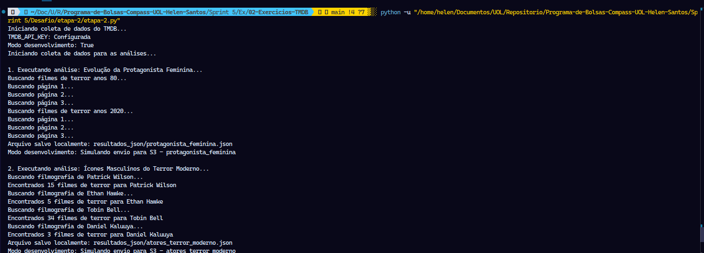


## 2\. Arquivos `.json` salvos localmente

1... [Dados - Análise 1](./etapa-2/resultados_json/protagonista_feminina.json)

2... [Dados - Análise 2](./etapa-2/resultados_json/atores_terror_moderno.json)

3... [Dados - Análise 3](./etapa-2/resultados_json/terror_psicologico_misterio.json)

4... [Dados - Análise 4](./etapa-2/resultados_json/terror_classificacao.json)

5... [Dados - Análise 5](./etapa-2/resultados_json/mestres_suspense.json)

6... [Dados - Análise 6](./etapa-2/resultados_json/stephen_king.json)


## 3\. Amazon Lambda

### Processos Realizados Localmente

Para que o código Python da função Lambda (`etapa-2.py`) pudesse ser executado na nuvem da AWS, foi necessário gerenciar suas dependências externas.

O ambiente padrão do AWS Lambda é minimalista e não inclui bibliotecas de terceiros que são instaladas via `pip`. Nosso script depende de duas bibliotecas externas principais:

- `tmdbv3api`: Para se comunicar com a API do The Movie Database.
    
- `python-dotenv`: Para carregar variáveis de ambiente durante o desenvolvimento local.

Comando usado:

```
pip install tmdbv3api python-dotenv -t lambda_layer/python
```
    
Se apenas o arquivo `etapa-2.py` fosse enviado para a AWS, a execução falharia imediatamente com um erro de `ModuleNotFoundError`, pois o Lambda não saberia como importar essas bibliotecas.

A solução adotada foi o uso de **AWS Lambda Layers**. Uma camada (Layer) é um arquivo `.zip` que contém bibliotecas, dependências ou até mesmo código personalizado, que pode ser anexado a uma ou mais funções Lambda. Isso mantém o pacote de código da função principal mais leve e facilita o gerenciamento de dependências.

Para construir essa camada, uma estrutura de pastas específica foi criada localmente:

1.  **`lambda_layer/`**: Esta foi uma pasta de trabalho temporária, criada localmente para organizar a preparação do pacote. O seu único propósito foi servir como um ambiente limpo para agrupar as dependências antes de compactá-las.
    
2.  **`python/`**: A criação desta pasta **é um requisito mandatório do runtime Python no AWS Lambda**. Quando uma camada é anexada a uma função, seu conteúdo é extraído para o diretório `/opt` no ambiente de execução. O runtime do Python é pré-configurado para adicionar o diretório `/opt/python` ao seu `sys.path` (os caminhos onde ele procura por módulos para importar).
    
    Portanto, para que o Lambda consiga encontrar e importar as bibliotecas `tmdbv3api` e `python-dotenv`, elas precisaram ser instaladas **dentro** de uma pasta chamada `python`.    

O fluxo de trabalho foi o seguinte:

- Criar a pasta `lambda_layer` e, dentro dela, a subpasta `python`.
    
- Executar o comando `pip install tmdbv3api python-dotenv -t ./python` para instalar as bibliotecas no local correto.

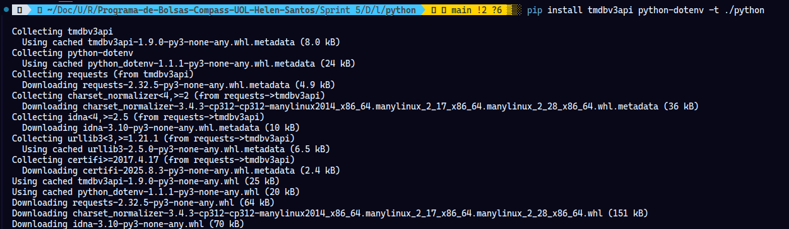
    
- Compactar a pasta `python` em um arquivo `tmdb_layer.zip`.

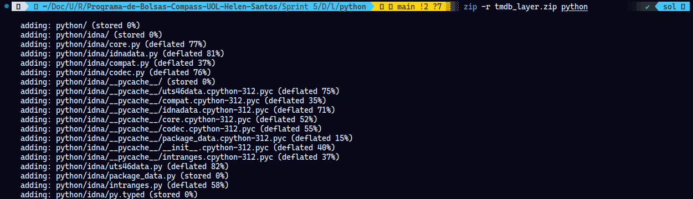
    
- Fazer o upload deste `.zip` no console da AWS como uma nova Camada.

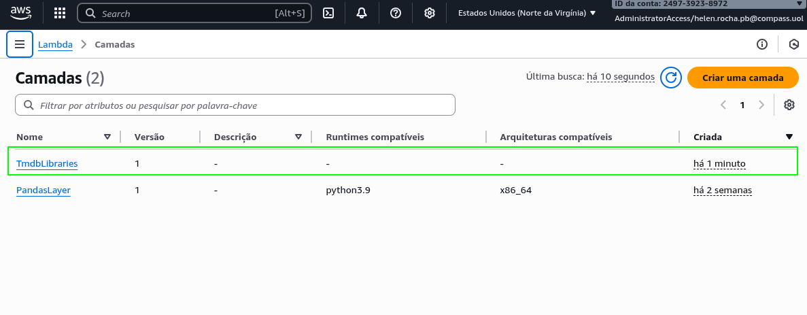
    
- Anexar a Camada  à função Lambda `coleta-dados-tmdb`.

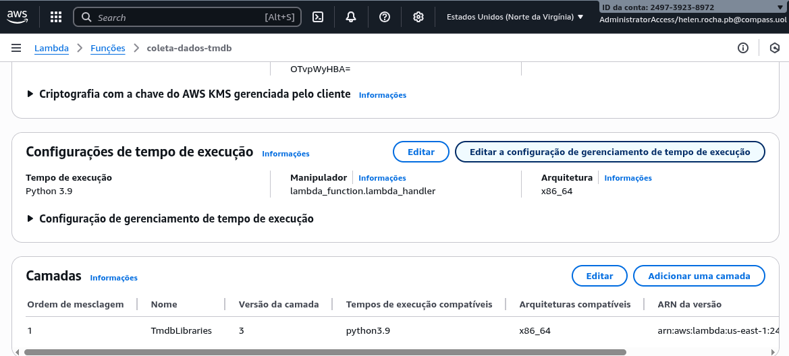

### Processos Realizados na Amazon

**1\. Criação e Configuração da Função Lambda**

- Uma função Lambda chamada **`coleta-dados-tmdb`** foi criada utilizando o runtime **Python 3.9**.

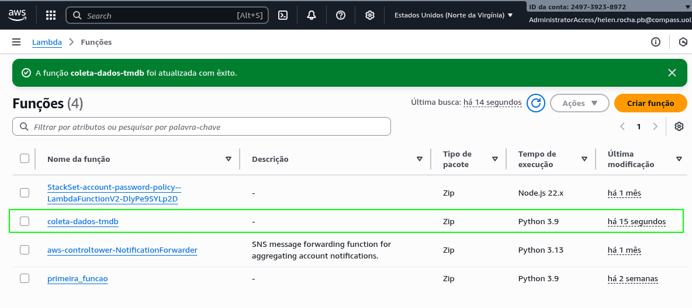
    
**2\. **Adição do Código-Fonte**
    
- O código Python do projeto foi inserido no editor online da AWS, no arquivo `lambda_function.py`. A tela indica que existem alterações a serem salvas.

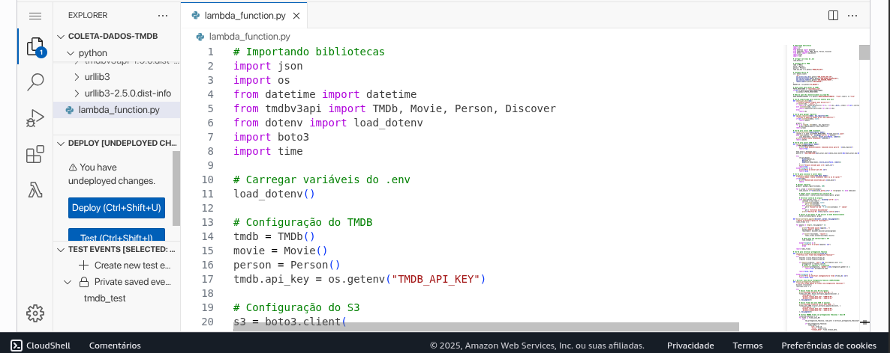

**3\.*Configuração das Variáveis de Ambiente**
    
- As variáveis de ambiente `MODO_DESENVOLVIMENTO`, `S3_BUCKET`, e `TMDB_API_KEY` foram configuradas na função. O `MODO_DESENVOLVIMENTO` foi definido como `False` para ativar a execução na nuvem.
    
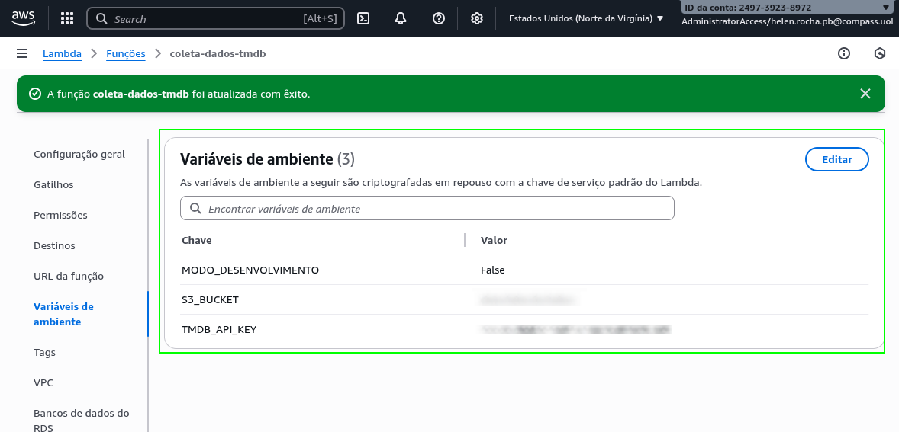

**4\.Acesso às Configurações de Permissão**
    
- Na aba de "Configuração" -> "Permissões", o link para o "Papel de execução" (IAM Role) da função foi identificado para iniciar a edição das permissões de acesso ao serviço S3.

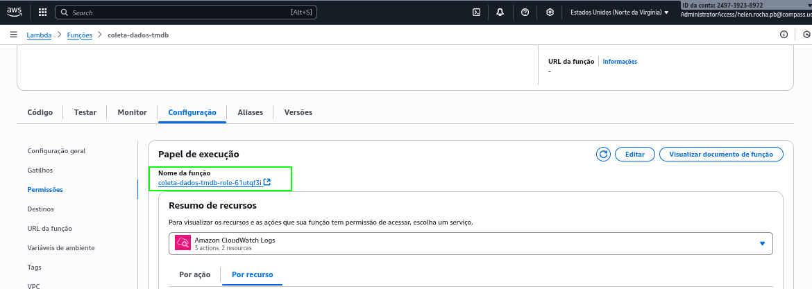

**5\.Início da Criação da Nova Política**
    
- Após acessar o IAM Role, o processo para adicionar uma nova política de permissão foi iniciado clicando em "Adicionar permissões".

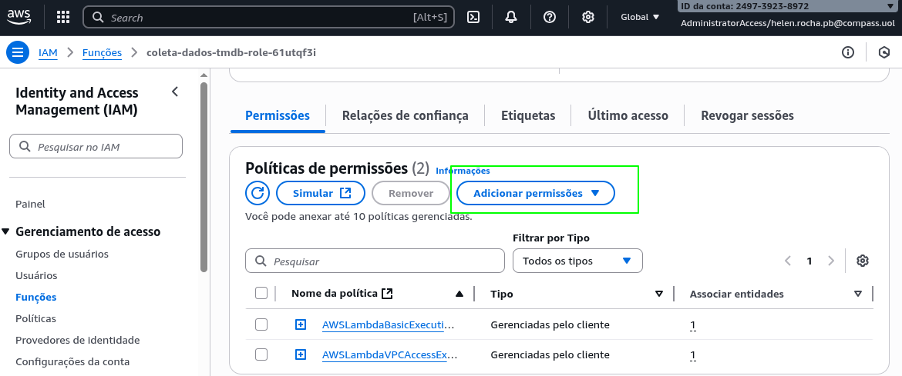

**6\.Definição do Serviço da Política**
    
- No editor de políticas, o serviço **S3** foi selecionado como o alvo para as novas permissões.

**7\.Especificação do Recurso (Bucket S3)**
    
- A permissão foi restringida para um recurso específico: o bucket `data-lake-da-helen`, permitindo ações em qualquer objeto (`*`) dentro dele.

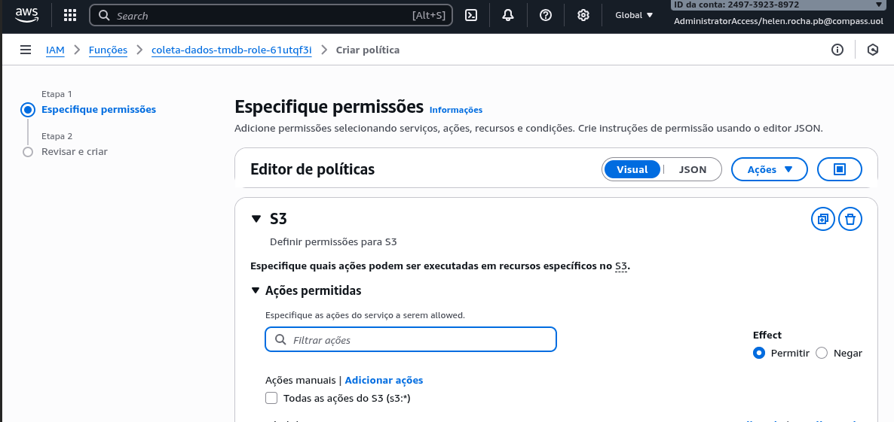

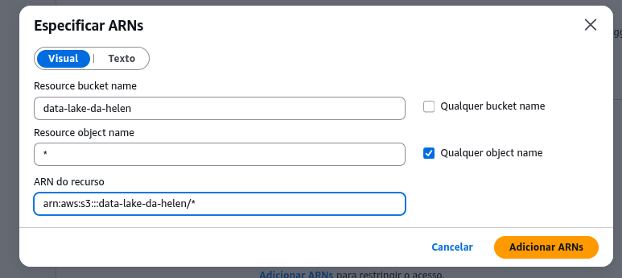

**8\.Confirmação da Política Criada**
    
- A nova política, nomeada `Colocar_objetos_S3`, foi criada e anexada com sucesso ao IAM Role, que agora lista três políticas no total.

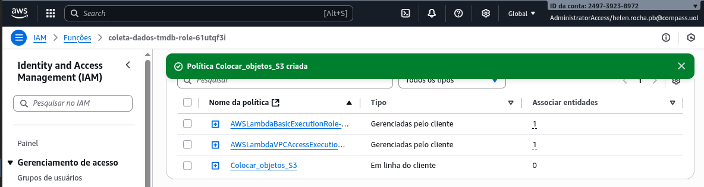

**9\.Ajuste Final de Recursos**

- Antes da execução final, os recursos da função Lambda foram ajustados para garantir um desempenho adequado. A Memória foi aumentada para 512 MB e o Tempo limite (Timeout) foi configurado para 5 minutos. Isso foi feito para garantir que a função tivesse poder de processamento e tempo suficientes para completar todas as chamadas de API e o processamento de dados.

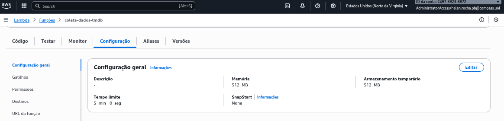

**10\.Início da Execução**

- Com todas as permissões, variáveis e configurações prontas, a execução foi iniciada manualmente a partir da aba "Código". O evento de teste `tmdb_test` foi selecionado e o botão **"Test"** foi acionado para iniciar o processo de coleta de dados.

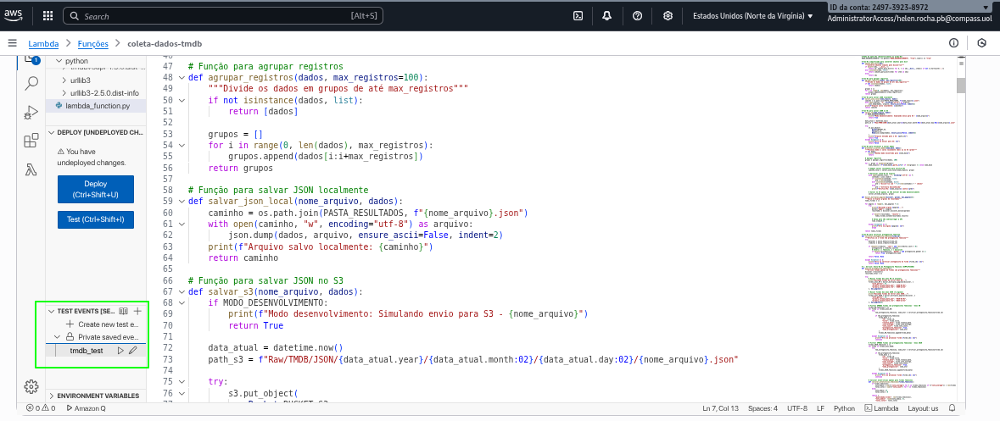

**11\.Execução Bem-Sucedida**

- A função Lambda executou o script do início ao fim com sucesso, o que é confirmado pelo status "Succeeded" no painel de resultados. Os logs da função mostram o progresso de cada uma das seis análises, desde a busca de filmes dos anos 80 até a análise final de Stephen King.

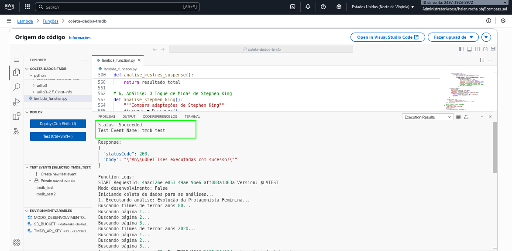

### Amazon S3 - Resultados

Como resultado final, os seis arquivos JSON gerados pelo script foram salvos com sucesso no bucket Amazon S3 **`data-lake-da-helen`**. Os arquivos foram organizados corretamente sob o caminho `Raw/TMDB/JSON/`, seguindo a estrutura de pastas por ano, mês e dia da execução. A presença dos seis arquivos, confirma que o pipeline de dados da Etapa 2 foi concluído com êxito.

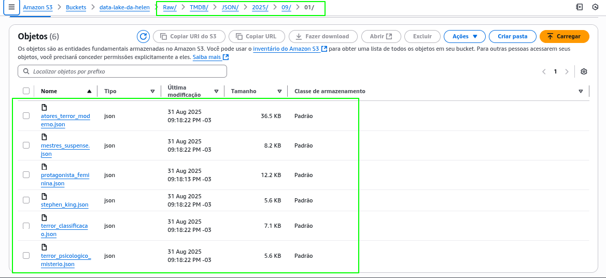
