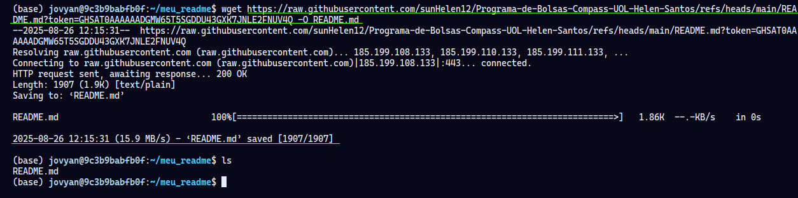
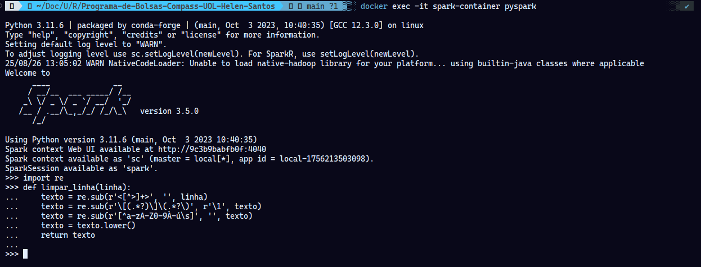
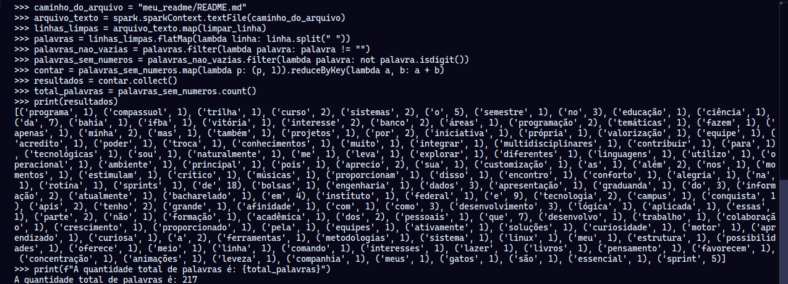
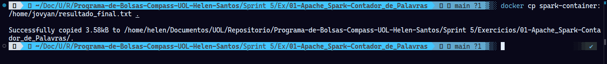
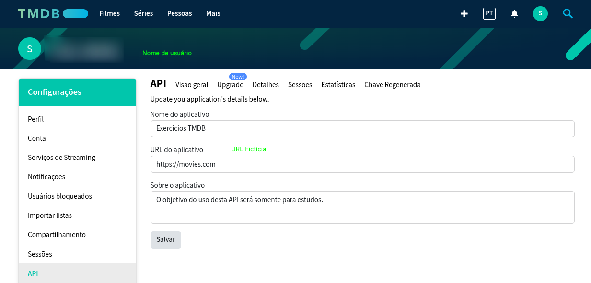
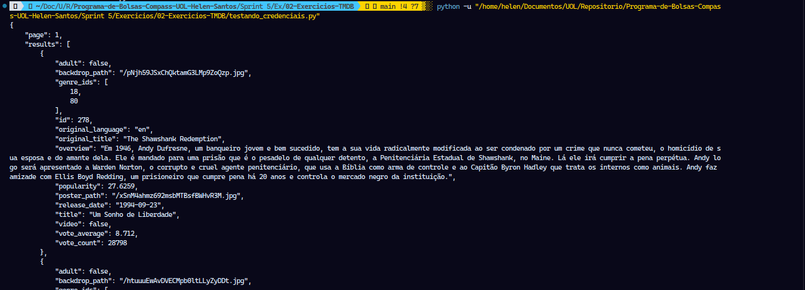
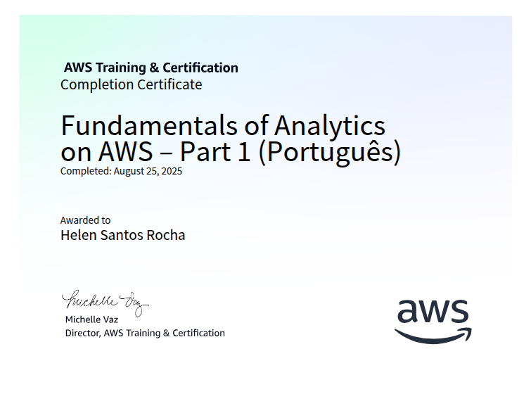
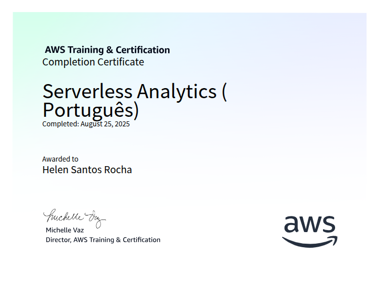

# Resumo

**Fundamentals of Analytics on AWS – Part 1 (Português)**: Nesse curso aprendi que o data analytics é um processo amplo, dividido em quatro tipos (descritiva, diagnóstica, preditiva e prescritiva), que transforma dados brutos em insights para tomadas de decisão. O curso explora os desafios do big data por meio dos 5 Vs: Volume, Variedade, Velocidade, Veracidade e Valor. Para cada desafio, são apresentados serviços da AWS como solução: para o Volume, foram destacados o Amazon S3, AWS Lake Formation e Amazon Redshift como formas de armazenamento escalável ; para a Variedade de dados (estruturados, semiestruturados e não estruturados), foram abordados o Amazon RDS, DynamoDB e Amazon Redshift ; para a Velocidade no processamento, o Amazon EMR, Amazon Kinesis e AWS Lambda foram apresentados como soluções para dados em lote e streaming ; para garantir a Veracidade dos dados, foram demonstrados o AWS Glue e o Amazon DataZone para realizar a limpeza, transformação e governança ; e, por fim, para extrair Valor, o curso mostrou como utilizar o Amazon QuickSight para visualização de dados, o Amazon SageMaker para machine learning e o Amazon Athena para analytics interativa.

**Introduction to Amazon Athena (Português)**: Neste curso sobre o Amazon Athena, aprendi o que é o serviço, tive uma visão geral de seu ambiente operacional e compreendi as etapas básicas para sua implementação. De forma prática, o curso demonstrou como utilizar o Console de Gerenciamento da AWS para criar um banco de dados e, em seguida, executar consultas SQL para realizar a validação dos dados.

**Serverless Analytics (Português)**: Neste curso de Serverless Analytics, aprendi como conectar e processar dados de clientes vindos de diversas fontes e formatos para viabilizar decisões mais orientadas por dados. O curso demonstrou como sintetizar essas informações usando o poder de um conjunto de ferramentas serverless da AWS, incluindo AWS IoT Analytics, Amazon Cognito, AWS Lambda e Amazon SageMaker. Com esses serviços, aprendi as etapas essenciais para agregar, processar, armazenar e disponibilizar os dados de maneiras inovadoras e poderosas.

**Formação Spark com Pyspark : o Curso Completo**: Nessa formação aprendi que o Spark é uma poderosa ferramenta para processamento de big data, compreendendo sua arquitetura, componentes e os diferentes formatos de dados que ele suporta. Aprofundei-me nas estruturas de dados fundamentais, RDD, Dataset e DataFrame, e aprendi a manipular os dados através de suas principais transformações e ações, além de importá-los e exportá-los de diversas fontes. A formação deu grande ênfase ao Spark SQL, ensinando a criar e gerenciar bancos de dados, tabelas (gerenciadas e externas), views, e a realizar joins complexos para consultar os dados de forma estruturada. Coloquei o conhecimento em prática desenvolvendo aplicações Spark, aprendendo a passar parâmetros pela linha de comando e a construir um conversor de formatos de arquivos. Para garantir o desempenho, estudei técnicas de otimização cruciais como particionamento, bucketing e o uso estratégico de cache e persistência. Por fim, explorei a integração do Spark com ferramentas como notebooks Jupyter, a conversão de DataFrames do Pandas, e a utilização da Spark UI para monitorar e analisar a execução das tarefas.

# Exercícios

## Apache Spark: Contador de Palavras

1. ... [Exercício I - Apache Spark: Contador de Palavras](./Exercicios/01-Apache_Spark-Contador_de_Palavras/resultado_final.txt) 

## Exercícios TMDB

2. ... [Exercício II - Exercícios TMDB](./Exercicios//02-Exercicios-TMDB/testando_credenciais.py) 

# Evidências

## Apache Spark: Contador de Palavras

O primeiro passo é foi a obtenção da  imagem que continha todo o ambiente Spark necessário. Isso fooi feito com o comando abixo:

```
docker pull jupyter/all-spark-notebook
```

Após isso foi criado um container a partir dela. O comando abaixou iniciou o  container no modo interativo (`it`) e mapeou a porta `8888` do container para a porta `8888` da máquina (`p 8888:8888`), conforme solicitado. Com o comando a seguir:

```
docker run -it -p 8888:8888 --name spark-container jupyter/all-spark-notebook
```

O comando do `docker exec` foi utilizado para iniciar o terminal interativo do Spark (pyspark) dentro do container.

```
docker exec -it spark-container pyspark
```

Acessando o bash do container, foi criada uma pasta para armazenar o arquivo `README.md`. Os comandos abaixo foram utilizado para isso:

```
docker exec -it spark-container bash
mkdir meu_readme
cd meu_readme
```

Para acessar o `README.md` do GitHub, foi utilizado o seguinte comando:

```
wget https://raw.githubusercontent.com/sunHelen12/Programa-de-Bolsas-Compass-UOL-Helen-Santos/refs/heads/main/README.md?token=GHSAT0AAAAAADGMW65T5SGDDU43GXK7JNLE2FNUV4Q -O README.md
```

Obtive o seguinte resultado: 



A linha de código abaixo realiza uma limpeza sequencial. Primeiramente, ela remove todas as tags HTML e, em seguida, extrai o texto de links em formato Markdown, descartando a URL. Depois, a função elimina quaisquer caracteres que não sejam letras, números ou espaços, como pontuações e símbolos. Por fim, ela padroniza todo o texto para letras minúsculas e retorna o arquivo resultante completamente limpo.

```
import re
 def limpar_linha(linha):
        texto = re.sub(r'<[^>]+>', '', linha)
	      texto = re.sub(r'\[(.*?)\]\(.*?\)', r'\1', texto)
		    texto = re.sub(r'[^a-zA-Z0-9À-ú\s]', '', texto)
		    texto = texto.lower()
		    return texto
```

Código de limpeza sendo executado: 




```
 caminho_do_arquivo = "meu_readme/README.md"
 arquivo_texto = spark.sparkContext.textFile(caminho_do_arquivo)
 linhas_limpas = arquivo_texto.map(limpar_linha)
 palavras = linhas_limpas.flatMap(lambda linha: linha.split(" "))
 palavras_nao_vazias = palavras.filter(lambda palavra: palavra != "")
 palavras_sem_numeros = palavras_nao_vazias.filter(lambda palavra: not palavra.isdigit())
 contar = palavras_sem_numeros.map(lambda p: (p, 1)).reduceByKey(lambda a, b: a + b)
 resultados = contar.collect()
 total_palavras = palavras_sem_numeros.count()
 print(resultados)
 print(f"A quantidade total de palavras é: {total_palavras}")
```

O bloco de código acima  carrega o arquivo `README.md` do container e aplica a função `limpar_linha` em cada linha para remover tags HTML, extrair texto de links, eliminar pontuação e converter tudo para minúsculas. Em seguida, o script transforma as linhas limpas em uma longa lista de palavras individuais e realiza dois filtros: um para remover quaisquer strings vazias resultantes da limpeza e outro, mais específico, para descartar "palavras" que são compostas apenas por números. Com a lista de palavras final e limpa, ele executa a lógica de contagem, mapeando cada palavra para um par `(palavra, 1)` e somando as ocorrências de cada palavra idêntica. Por fim, o script dispara duas ações que executam todo o processamento: `.collect()`, para trazer a lista de frequência de cada palavra para a memória, e `.count()`, para obter o número total de palavras. Os dois resultados são então impressos no terminal.

Obtive o seguinte resultado:



Com a lista de palavras final e limpa, ele executa a lógica de contagem, mapeando cada palavra para um par `(palavra, 1)` e somando as ocorrências de cada palavra idêntica. Por fim, o script dispara duas ações que executam todo o processamento: `.collect()`, para trazer a lista de frequência de cada palavra para a memória, e `.count()`, para obter o número total de palavras. Os dois resultados são então impressos no terminal.

```
nome_do_arquivo_saida = "resultado_final.txt"

with open(nome_do_arquivo_saida, 'w') as arquivo:
   arquivo.write("Frequência de cada palavra:\n")
   arquivo.write("---------------------------\n")
   for palavra, contagem in sorted(resultados):
       arquivo.write(f"{palavra}: {contagem}\n")
   arquivo.write("\n---------------------------\n")
   arquivo.write(f"A quantidade total de palavras é: {total_palavras}\n").
```

Este trecho final de código é responsável por salvar os resultados da contagem de palavras, que estão na memória do programa, em um arquivo de texto de forma organizada. Ele define o nome do arquivo como `resultado_final.txt` e o abre em modo de escrita, o que cria um novo arquivo ou apaga o conteúdo de um existente. Em seguida, o código escreve um cabeçalho e, utilizando um laço `for`, percorre a lista `resultados` (previamente ordenada em ordem alfabética) para registrar a frequência de cada palavra, uma por linha. Por fim, ele adiciona um separador e a contagem total de palavras no final do arquivo, garantindo que todos os dados fiquem salvos de maneira legível.

Por fim, é necessário executar o comando abaixo para que esse arquivo `resultado_final.txt` seja salvo localmente :

```
docker cp spark-container:/home/jovyan/resultado_final.txt .
```

Obtive o seguinte resultado:




## Exercícios TMDB

Primeiramente, foi criada uma conta no TMDB e gerada uma `Chave de API`:



```
load_dotenv()

api_key = os.getenv("api_key")
endpoint = "movie/top_rated"
parametros_opcionais = "language=pt-BR"

url = f"https://api.themoviedb.org/3/{endpoint}?api_key={api_key}&{parametros_opcionais}"
```

Este bloco prepara a requisição à API. Primeiro, ele carrega variáveis de ambiente do arquivo `.env` para obter de forma segura a `api_key`. Em seguida, define qual parte da API será acessada (`movie/top_rated` para filmes mais bem avaliados) e o idioma da resposta (`pt-BR`). Por fim, ele monta a URL completa que será usada para a consulta, juntando todas essas informações.

```
pasta_resposta = pathlib.Path('resposta')
pasta_resposta.mkdir(exist_ok=True)

nome_arquivo = pasta_resposta / 'filmes_mais_avaliados.json'
```

Esta parte do código prepara o local onde os dados serão salvos. Ela cria uma pasta chamada `resposta` no diretório atual (o argumento `exist_ok=True` evita erros caso a pasta já exista). Depois, define o caminho completo para o arquivo de saída, que se chamará `filmes_mais_avaliados.json` e ficará dentro da pasta `resposta`.

```
response = requests.get(url)
data = response.json()
print(json.dumps(data, indent=4, ensure_ascii=False))
```

Aqui, o script efetivamente busca os dados. Ele envia uma requisição `GET` para a URL montada e armazena a resposta. Em seguida, converte o conteúdo da resposta, que está em formato JSON, para um objeto Python (dicionário/lista). Por fim, ele imprime esse objeto no console de forma formatada e legível, com indentação e garantindo que caracteres especiais (como acentos) sejam exibidos corretamente.

```
with open(nome_arquivo, 'w', encoding='utf-8') as arquivo:
        json.dump(data, arquivo, ensure_ascii=False, indent=4)
        
print(f"Dados salvos com sucesso!")
```

Para finalizar, este bloco salva os dados no arquivo preparado anteriormente. Ele abre o arquivo `filmes_mais_avaliados.json` em modo de escrita (`w`) e, usando `json.dump`, escreve o conteúdo completo da variável `data` (a resposta total da API) no arquivo. A formatação com indentação e o encoding `utf-8` garantem que o arquivo JSON seja legível e preserve todos os caracteres. Ao final, uma mensagem de sucesso é impressa no console.

Obtive esse resultado:



Abaixo está o arquivo `.json` gerado:

[Arquivo JSON](./Exercicios/02-Exercicios-TMDB/resposta/filmes_mais_avaliados.json)

# Certificados

Certificado do Curso *Fundamentals of Analytics on AWS – Part 1 (Português)*



Certificado do Curso *Introduction to Amazon Athena (Português)*


Certificado do Curso *Serverless Analytics (Português)*



