# Processamento da Camada Trusted: transformando dados brutos em insights confiáveis

Esta etapa do projeto representa o coração do pipeline de engenharia de dados, onde as informações brutas e heterogêneas, coletadas nas fases anteriores e armazenadas na camada **Raw** são transformadas em um conjunto de dados limpo, confiável e padronizado na camada **Trusted**. O objetivo principal é preparar os dados para que possam ser facilmente consultados e analisados, respondendo às perguntas de negócio definidas.

Para realizar essa tarefa, foi utilizado o poder do **Apache Spark** através do serviço **AWS Glue**, que permite processar grandes volumes de dados de forma distribuída e eficiente. Todo o dado processado nesta etapa é persistido no Amazon S3 no formato **Parquet** , uma escolha otimizada para performance em ferramentas de análise como o **AWS Athena**.

Seguindo as diretrizes do desafio, o processamento foi dividido em dois jobs distintos no AWS Glue, cada um responsável por uma fonte de dados específica.

### Job 1: Processamento dos Dados em Batch (CSV)

O primeiro job foi responsável por tratar o arquivo CSV, que contém um vasto dataset de filmes. O processo de limpeza e transformação incluiu:

*Obs: Apenas o arquivo `movies.csv` foi processado nessa etapa do desafio, pois a análise selecionada é direcionada apenas aos filmes. Isso reduziu o uso dos serviços da AWS, evitando custos altos.*

- **Renomeação de colunas** para um padrão mais claro e consistente.
    
- **Tratamento de valores ausentes**, preenchendo campos nulos com valores padrão (como "Desconhecido" ou 0).
    
- **Ajuste de tipos de dados**, convertendo colunas como `ano_lancamento` e `numero_votos` para números inteiros e `nota_media` para float.
    
- **Remoção de registros duplicados** para garantir a integridade dos dados.
    
Conforme as instruções do desafio, uma exceção importante foi aplicada a esses dados: eles 
**não foram particionados por data**, uma vez que representam uma carga histórica em batch.

### Job 2: Processamento dos Dados da API (JSONs)

O segundo job focou nos dados coletados da API do TMDB, que estavam em formato JSON. O principal desafio técnico aqui era a estrutura aninhada e complexa desses arquivos. A solução foi:

- **"Achatar" (Flatten) a estrutura hierárquica**, utilizando a função `explode` do Spark. Isso transformou as listas de filmes aninhadas dentro de cada arquivo em um formato tabular (linhas e colunas), ideal para análise.
    
- **Enriquecer os dados**, adicionando colunas de categoria (ex: `decada`, `classificacao`) para manter o contexto original das análises.
    
- **Aplicar um filtro de qualidade**, removendo registros que não possuíam um ID de filme válido (`filme_id`).
    

Em conformidade com as regras do desafio, todos os dados processados por este job foram **particionados pela data de ingestão**, seguindo o padrão `ano/mês/dia`.

### Desenvolvimento e Boas Práticas

Para garantir a robustez e a eficiência de custos, seguimos as melhores práticas:

- **Testes Locais:** Para cada job do Glue, foi desenvolvido um script de teste local (utilizando Pandas para o CSV e PySpark para o JSON) que permitiu validar toda a lógica de transformação antes do deploy para a nuvem.

- **Arquivo `.env` para Credenciais:** Ocorreu  a implementação de um arquivo `.env` com as credenciais da AWS. Isso foi necessário para a execução dos testes locais. 

    Variáveis de ambiente utilizadas:

    ```
    AWS_ACCESS_KEY_ID=XXXXXXXXXXXXXXXX
    AWS_SECRET_ACCESS_KEY=XXXXXXXXXXXXXXXX
    AWS_SESSION_TOKEN=XXXXXXXXXXXXXXXX
    AWS_REGION=XXXXXXXXXXXXXXXX
    S3_BUCKET=XXXXXXXXXXXXXXXX
    ```

- **IAM Role:** Foi desenvolvido também uma IAM Role exclusiva para as etapas desse desafio. Essa função foi nomeada `AWSGlueServiceRole-Desafio6`, ela foi  associada a policies geridas pela AWS `AmazonS3FullAccess`,`AWSLakeFormationDataAdmin`,`AWSGlueConsoleFullAccess` e `CloudWatchFullAccess`. Isso foi importante para a permissão do acesso do serviço do Glue ao S3.

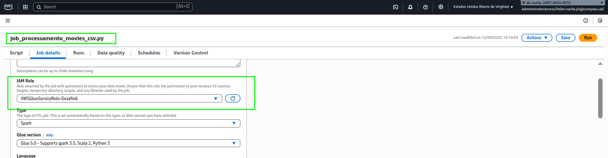

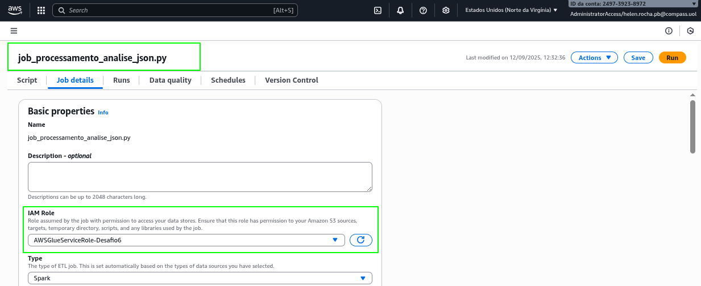
    
- **Configuração Otimizada:** Os jobs no AWS Glue foram configurados com os recursos mínimos necessários para a tarefa (`Worker type: G.1X`, `Requested number of workers: 2`), evitando custos desnecessários.

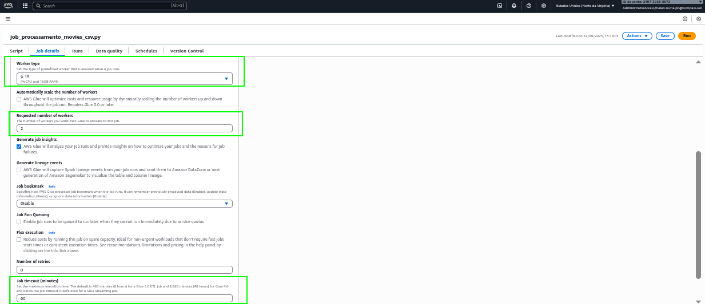

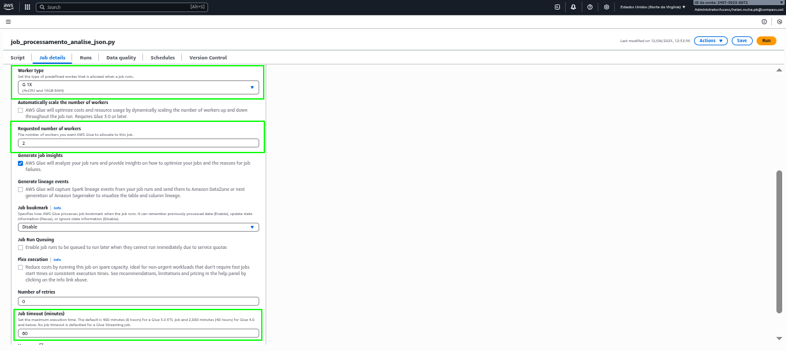

# Etapas

1. ... [Etapa I](./etapa-1/etapa-1.py)

A primeira etapa do processamento na camada Trusted focou nos dados históricos de filmes, provenientes do arquivo `movies.csv`. O objetivo foi transformar este arquivo, que estava em sua forma bruta na Raw Zone, em um dataset limpo, estruturado e otimizado para consultas na Trusted Zone. Para garantir a robustez e a correção da lógica, o desenvolvimento foi dividido em duas fases: um script para teste local e o script final para execução no AWS Glue.

## 1. O Script de Teste Local

[Script para Teste Local - Etapa 1](./etapa-1/teste_script_local/teste_local.py)

Antes de executar o processo na nuvem, foi desenvolvido um script Python para rodar inteiramente em ambiente local. Esta abordagem permitiu validar cada etapa da transformação de forma rápida e sem custos. 

#### 1\. Imports e Definição da Função Principal

```
def run_local():
    import pandas as pd
    import boto3
    import shutil
    import os
    from dotenv import load_dotenv
```

O script inicia importando todas as bibliotecas necessárias para sua execução. O `pandas` é a ferramenta principal para a manipulação e limpeza dos dados; o `boto3` é o SDK da AWS para Python, utilizado para se conectar e baixar arquivos do S3; o `shutil` e o `os` são empregados para operações no sistema de arquivos, como criação de pastas e limpeza de arquivos temporários; e o `python-dotenv` é usado para carregar de forma segura as credenciais da AWS a partir de um arquivo `.env`. Toda a lógica está encapsulada na função `run_local()`.

#### 2\. Configuração e Conexão com a AWS

```
    load_dotenv()

    s3_client = boto3.client(
        's3',
        aws_access_key_id=os.getenv('AWS_ACCESS_KEY_ID'),
        aws_secret_access_key=os.getenv('AWS_SECRET_ACCESS_KEY'),
        aws_session_token=os.getenv('AWS_SESSION_TOKEN'), 
        region_name=os.getenv('AWS_REGION'),
    )

    bucket_name=os.getenv('S3_BUCKET')
    s3_prefix = 'Raw/Local/CSV/Movies/2025/08/27'
    local_download_dir = 'temp_csv_s3'
```

Nesta seção, a rotina primeiro invoca a função `load_dotenv()` para carregar as variáveis de ambiente do arquivo `.env`. Em seguida, utiliza essas variáveis para instanciar o cliente do `boto3`, estabelecendo uma conexão autenticada com os serviços da AWS. Por fim, são definidas as variáveis que controlam o fluxo de dados: o nome do bucket S3, o prefixo (caminho) exato onde os arquivos CSV brutos estão localizados e o nome de um diretório local temporário que será usado para o download.

#### 3\. Download dos Arquivos do S3 (Extração)

```
    print(f"Baixando arquivos do S3: s3://{bucket_name}/{s3_prefix}")
    if not os.path.exists(local_download_dir):
        os.makedirs(local_download_dir)

    try:
        response = s3_client.list_objects_v2(Bucket=bucket_name, Prefix=s3_prefix)
        if 'Contents' not in response:
            print(f"Nenhum arquivo encontrado em '{s3_prefix}'.")
            return

        input_files = []
        for obj in response['Contents']:
            key = obj['Key']
            if key.endswith('.csv'):
                local_file_path = os.path.join(local_download_dir, os.path.basename(key))
                print(f"Baixando '{key}' para '{local_file_path}'...")
                s3_client.download_file(bucket_name, key, local_file_path)
                input_files.append(local_file_path)

    except Exception as e:
        print(f"Erro ao baixar arquivos do S3: {e}")
        return

    if not input_files:
        print("Nenhum arquivo CSV foi baixado. Encerrando.")
        return
```

Este bloco é responsável pela fase de extração dos dados. Ele primeiro verifica se o diretório de download temporário existe e, caso contrário, o cria. Em seguida, dentro de um bloco `try...except` para tratamento de erros, ele utiliza o cliente S3 para listar todos os objetos no prefixo especificado. A rotina itera sobre a lista de objetos, identifica aqueles que terminam com a extensão `.csv`, e faz o download de cada um para a pasta temporária. Os caminhos dos arquivos baixados são armazenados em uma lista para uso posterior.

#### 4\. Leitura e Combinação dos Dados

```
    print("\nLendo e combinando arquivos CSV baixados...")
    df = pd.concat([pd.read_csv(f, sep='|', na_values=['\\N']) for f in input_files], ignore_index=True)
    print("Leitura concluída. Registros lidos:", len(df))
```

Após o download, o script inicia a fase de transformação. Utilizando `pandas`, ele lê cada arquivo CSV da lista `input_files`, especificando que o separador de colunas é `|` e que o valor `\N` deve ser interpretado como nulo. A função `pd.concat` é então usada para unificar todos os dados lidos em um único DataFrame, consolidando as informações para a etapa de limpeza.

#### 5\. Limpeza e Transformação de Dados

```
    print("Renomeando colunas...")
    column_mapping = {
        'id': 'id_filme', 'tituloPincipal': 'titulo_principal', 'tituloOriginal': 'titulo_original',
        'anoLancamento': 'ano_lancamento', 'tempoMinutos': 'tempo_minutos', 'genero': 'genero',
        'notaMedia': 'nota_media', 'numeroVotos': 'numero_votos', 'generoArtista': 'genero_artista', 
        'nomeArtista': 'nome_artista', 'anoNascimento': 'ano_nascimento', 'anoFalecimento': 'ano_falecimento',
        'profissao': 'profissao', 'titulosMaisConhecidos': 'titulos_mais_conhecidos', 'personagem': 'personagem'
    }
    
    df.rename(columns=column_mapping, inplace=True)
    
    print("Tratando valores ausentes e ajustando tipos...")
    df.dropna(subset=["ano_lancamento"], inplace=True)
    fill_values = {
        "tempo_minutos": 0, "ano_nascimento": 0, "ano_falecimento": 0, "genero": "Desconhecido", 
        "personagem": "N/A", "profissao": "N/A", "titulos_mais_conhecidos": "N/A"
    }
    df.fillna(value=fill_values, inplace=True)
    integer_columns = ["ano_lancamento", "tempo_minutos", "ano_nascimento", "ano_falecimento", "numero_votos"]
    for col_name in integer_columns:
        df[col_name] = df[col_name].astype(int)
    df["nota_media"] = df["nota_media"].astype(float)
        
    print("3. Removendo linhas duplicadas...")
    df.drop_duplicates(inplace=True)
    print("Limpeza concluída. Registros restantes:", len(df))
```

Este trecho executa a lógica de limpeza principal, espelhando o que será feito no ambiente de produção com o Glue. Primeiramente, as colunas são renomeadas para um padrão mais claro e consistente. Em seguida, o script trata os valores ausentes, removendo linhas onde o ano de lançamento é nulo e preenchendo outros campos vazios com valores padrão. Os tipos de dados são ajustados para garantir que colunas numéricas sejam tratadas como tal. Por fim, registros duplicados são removidos para assegurar a integridade do dataset final.

#### 6\. Armazenamento do Resultado (Carga)

```
    pasta_resultado = "resultado_local"
    arquivo_saida = "movies_limpo.parquet"

    if not os.path.exists(pasta_resultado):
        os.makedirs(pasta_resultado)

    caminho_saida = os.path.join(pasta_resultado, arquivo_saida)
    print(f"\nGravando arquivo limpo em formato Parquet: {caminho_saida}")
    df.to_parquet(caminho_saida, index=False)
```

Finalizada a transformação, o script executa a fase de carga. Ele define uma pasta de destino (`resultado_local`) e um nome para o arquivo de saída. O DataFrame limpo é então salvo no formato **Parquet**, um formato de armazenamento colunar otimizado para performance em análises, que é muito mais eficiente para consultas do que o CSV.

#### 7\. Limpeza e Verificação Final

```
    print(f"Limpando arquivos CSV temporários da pasta '{local_download_dir}'...")
    try:
        shutil.rmtree(local_download_dir)
        print("Limpeza da pasta temporária concluída com sucesso.")
    except Exception as e:
        print(f"Erro ao limpar a pasta temporária: {e}")

    print(f"\nProcesso local finalizado! O arquivo '{caminho_saida}' foi salvo.")

    df_parquet = pd.read_parquet(caminho_saida)
    print(df_parquet.head())
```

Como etapa final, o script realiza a limpeza do ambiente, utilizando `shutil.rmtree` para apagar a pasta temporária que continha os arquivos CSV brutos. Para confirmar o sucesso da operação, ele lê o arquivo Parquet recém-criado e exibe as cinco primeiras linhas na tela, oferecendo uma verificação visual imediata do resultado.

#### 8\. Bloco de Execução Principal

```
if __name__ == "__main__":
    run_local()
```

Este bloco final é o ponto de entrada padrão para a execução de scripts Python. Ele garante que a função `run_local()` seja chamada somente quando o arquivo é executado diretamente pelo terminal, permitindo que a orquestração de todo o processo seja iniciada com um único comando.

Obtive o seguinte resultado:

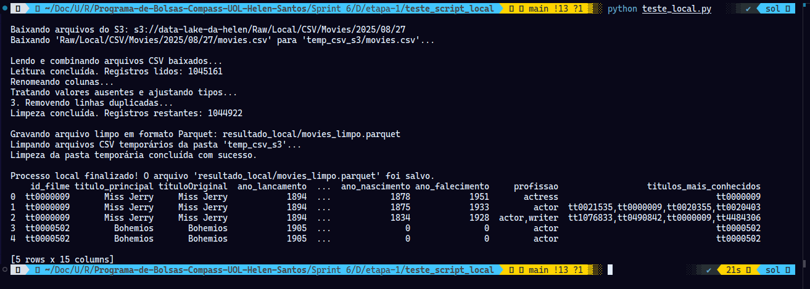

Abaixo está o arquivo resultante do processo:

[Resultado do Teste Local - Etapa 1](./etapa-1/teste_script_local/resultado_local)

## 2. Criando Database pelo AWS Lake Formation

Por meio do AWS Lake Formation criou-se o banco de dados `movie_db` para que o crawler adicione automaticamente uma tabela a partir dos dados armazenados no S3 gerados pelo Job.

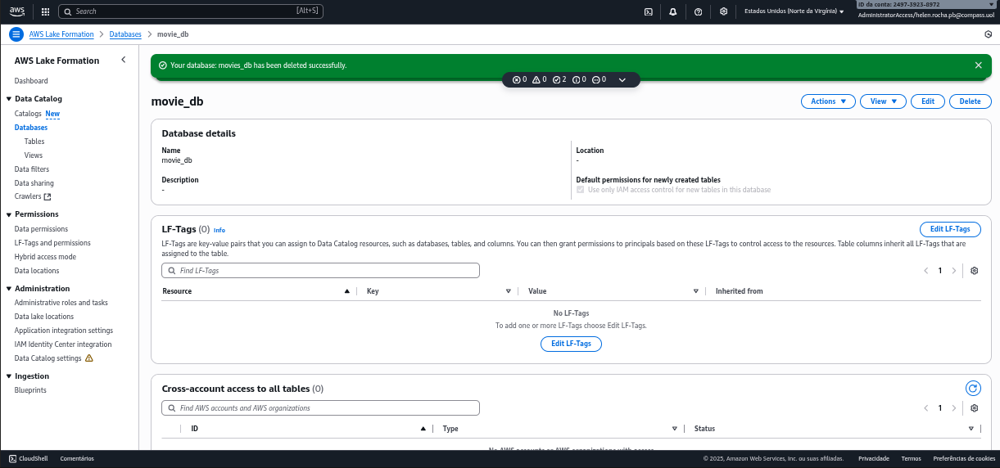


## 3. O Script do Job no AWS Glue

Este script é a versão de produção para o processamento dos dados em batch. Ele foi projetado para ser executado no ambiente serverless e distribuído do AWS Glue, utilizando o poder do Apache Spark para realizar as transformações de forma escalável e eficiente.

#### 1\. Imports e Leitura de Parâmetros

```
import sys
from datetime import datetime
from awsglue.utils import getResolvedOptions
from pyspark.context import SparkContext
from awsglue.context import GlueContext
from awsglue.job import Job
from pyspark.sql.functions import col
from pyspark.sql.types import IntegerType, FloatType
from awsglue.dynamicframe import DynamicFrame

args = getResolvedOptions(sys.argv, [
    "JOB_NAME",
    "S3_INPUT_PATH",
    "S3_OUTPUT_PATH_BASE", 
    "GLUE_DB_NAME"
])
```

O script começa importando todas as bibliotecas e funções necessárias do AWS Glue e do PySpark. Logo em seguida, a função `getResolvedOptions` é utilizada para capturar os argumentos que são passados para o job no momento da sua execução. Essa abordagem torna o script flexível, permitindo que os caminhos de entrada e saída, bem como o nome do banco de dados, sejam configurados diretamente no console do AWS Glue, sem a necessidade de alterar o código.

Abaixo adição de parâmetros nas configurações do JOB:

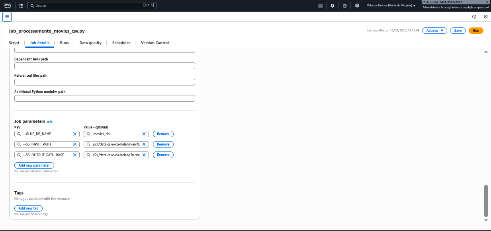

#### 2\. Inicialização do Ambiente Glue e Spark

```
sc = SparkContext.getOrCreate()
glueContext = GlueContext(sc)
spark = glueContext.spark_session
job = Job(glueContext)
job.init(args["JOB_NAME"], args)
logger = glueContext.get_logger()

S3_INPUT_PATH = args['S3_INPUT_PATH']
S3_OUTPUT_PATH_BASE = args['S3_OUTPUT_PATH_BASE']
GLUE_DB_NAME = args['GLUE_DB_NAME']
```

Este bloco é responsável por inicializar todos os objetos essenciais para a execução do job. Ele cria o `SparkContext` e o `GlueContext`, que são os pontos de entrada para as funcionalidades do Spark e do Glue. A `SparkSession` é ativada para permitir o uso da API de DataFrames, e o objeto `Job` é inicializado para gerenciar o estado da execução. Por fim, as variáveis com os caminhos do S3 e o nome do banco de dados são atribuídas a partir dos parâmetros lidos na etapa anterior.

#### 3\. Leitura e Extração de Dados do S3 (Raw Zone)


```
logger.info(f"Iniciando leitura dos dados CSV de: {S3_INPUT_PATH}")
dynamic_frame = glueContext.create_dynamic_frame.from_options(
    connection_type="s3",
    connection_options={"paths": [S3_INPUT_PATH], "recurse": True},
    format="csv",
    format_options={"withHeader": True, "separator": "|", "quoteChar": '"'},
)
df = dynamic_frame.toDF()
logger.info(f"Leitura concluída. Total de registros lidos: {df.count()}")
```

Nesta fase de extração, o script utiliza a função `create_dynamic_frame.from_options` do Glue para ler os dados diretamente do S3. As opções de formato são configuradas para interpretar corretamente o arquivo CSV, especificando que ele possui um cabeçalho (`withHeader`), que as colunas são separadas por `|`, e que as aspas `"` são usadas para agrupar o texto. O resultado é um `DynamicFrame`, um objeto otimizado do Glue, que é então convertido para um DataFrame do Spark (`toDF()`) para facilitar as manipulações subsequentes.

#### 4\. Renomeação de Colunas

```
logger.info("Iniciando renomeação de colunas para o padrão...")
column_mapping = {
    'id': 'id_filme', 'tituloPincipal': 'titulo_principal', 'tipoTitulo': 'tipo_titulo',
    'anoLancamento': 'ano_lancamento', 'tempoMinutos': 'tempo_minutos', 'genero': 'genero',
    'notaMedia': 'nota_media', 'numeroVotos': 'numero_votos', 'idArtista': 'id_artista',
    'nomeArtista': 'nome_artista', 'anoNascimento': 'ano_nascimento', 'anoFalecimento': 'ano_falecimento',
    'profissao': 'profissao', 'titulosMaisConhecidos': 'titulos_mais_conhecidos', 'personagem': 'personagem'
}
for old_name, new_name in column_mapping.items():
    df = df.withColumnRenamed(old_name, new_name)
```

A primeira etapa da transformação consiste em padronizar os nomes das colunas. Um dicionário de mapeamento (`column_mapping`) define os nomes antigos e novos. O script então itera sobre esse dicionário, utilizando a função `withColumnRenamed` do Spark para aplicar as mudanças, resultando em um DataFrame com um esquema mais limpo e legível.

#### 5\. Limpeza e Conversão de Tipos

```
logger.info("Iniciando tratamento de valores ausentes e ajuste de tipos de dados.")
df = df.dropna(subset=["ano_lancamento"])
df = df.fillna(0, subset=["tempo_minutos", "ano_nascimento", "ano_falecimento"])
df = df.fillna("Desconhecido", subset=["genero"])
df = df.fillna("N/A", subset=["personagem", "profissao", "titulos_mais_conhecidos"])

integer_columns = ["ano_lancamento", "tempo_minutos", "ano_nascimento", "ano_falecimento", "numero_votos"]
for col_name in integer_columns:
    df = df.withColumn(col_name, col(col_name).cast(IntegerType()))

df = df.withColumn("nota_media", col("nota_media").cast(FloatType()))
```

Este bloco executa a limpeza principal dos dados. A função `dropna` é usada para remover registros críticos que não possuem ano de lançamento. Em seguida, `fillna` é aplicado para preencher valores nulos em colunas numéricas com `0` e em colunas de texto com valores padrão como `"Desconhecido"`. Por fim, a função `cast` é utilizada para converter as colunas para seus tipos de dados corretos, como `IntegerType` para anos e `FloatType` para notas, garantindo a consistência e a qualidade dos dados.

#### 6\. Remoção de Duplicatas

```
logger.info("Iniciando remoção de linhas duplicadas.")
df = df.dropDuplicates()
logger.info(f"Limpeza concluída. Total de registros restantes: {df.count()}")
```

Como passo final da transformação, a função `dropDuplicates` é aplicada ao DataFrame. Esta operação remove quaisquer linhas que sejam completamente idênticas, um passo crucial para garantir a integridade e a confiabilidade dos dados que serão armazenados na camada Trusted.

#### 7\. Escrita na Trusted Zone (Carga)

```
logger.info(f"Gravando dados limpos em formato Parquet em: {S3_OUTPUT_PATH_BASE}")
dynamic_frame_to_write = DynamicFrame.fromDF(df, glueContext, "cleaned_df")

glueContext.write_dynamic_frame.from_options(
    frame=dynamic_frame_to_write,
    connection_type="s3",
    connection_options={
        "path": S3_OUTPUT_PATH_BASE, 
        "database": GLUE_DB_NAME
    },
    format="parquet"
)

job.commit()
```

Na etapa de carga, o DataFrame do Spark, já limpo e transformado, é convertido de volta para um `DynamicFrame` do Glue. A função `write_dynamic_frame.from_options` é então utilizada para salvar o resultado. As opções de conexão especificam o caminho de destino no S3 (`path`) e o nome do banco de dados no **Glue Data Catalog** (`database`), garantindo que a nova tabela seja catalogada. O `format="parquet"` assegura que os dados sejam armazenados de forma otimizada para performance. Por fim, `job.commit()` sinaliza ao AWS Glue que a execução foi concluída com sucesso.

Abaixo uma evidência de que o Job foi executado com sucesso:

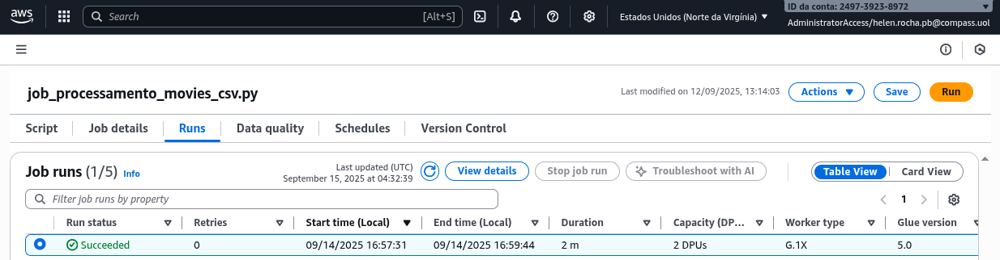

Obtive o seguinte resultado no S3:

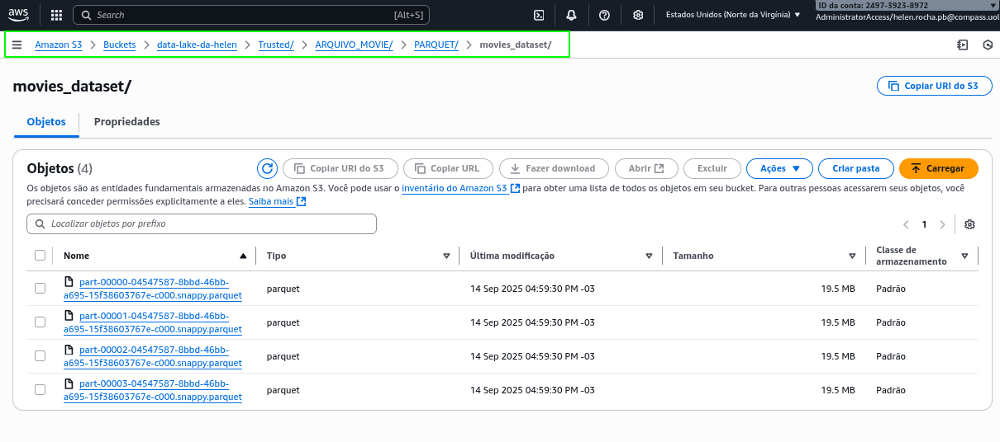

## 3. Crawler MovieTrusted

Após a execução do Job, foi configurado um Crawler no AWS Glue. Crawlers são mecanismos utilizados para monitorar o armazenamento de dados e, a partir deles, criar ou atualizar automaticamente os metadados no Glue Data Catalog. Com isso, uma tabela será criada de forma automática, catalogando os dados processados para futuras consultas.

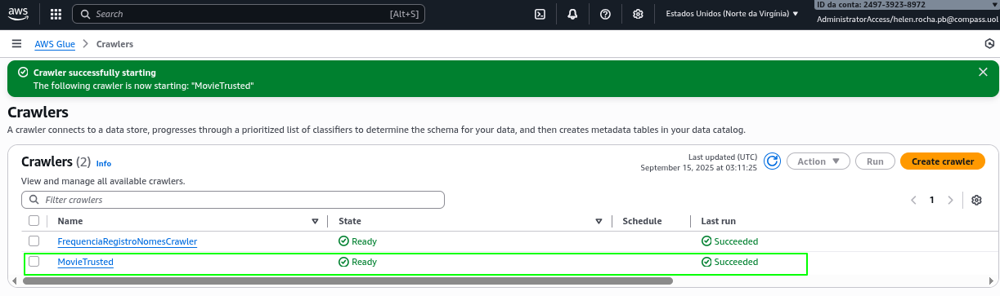

2. ... [Etapa II](./etapa-2/etapa-2.py)

A segunda etapa do processamento na camada Trusted foi dedicada a transformar os dados oriundos da API do TMDB. O desafio principal desta fase residia na natureza dos arquivos de origem: seis JSONs com esquemas complexos, aninhados e distintos entre si. Para superar isso, a estratégia adotada foi ler cada arquivo individualmente, inferindo seu esquema específico. Utilizando o poder do PySpark no AWS Glue, a estrutura hierárquica de cada arquivo foi "achatada" (`flattened`) através da função `explode`, convertendo as listas de filmes em um formato tabular (linhas e colunas). Ao final, cada conjunto de dados foi salvo como uma tabela Parquet separada e particionada por data, garantindo um formato otimizado e pronto para análises SQL no AWS Athena.

## 1. O Script de Teste Local

[Script para Teste Local - Etapa 2](./etapa-2/teste_script_local/teste_local.py)

Este script foi desenvolvido para simular e validar todo o processo de ETL (Extração, Transformação e Carga) dos dados da API em um ambiente local, antes de sua implementação na nuvem com o AWS Glue. Ele utiliza o `boto3` para buscar os dados na AWS, e o `PySpark` para realizar as transformações de forma robusta.

#### 1\. Imports e Inicialização da Sessão Spark

```
def run_local():
    import os
    import boto3
    import shutil
    from dotenv import load_dotenv
    from pyspark.sql import SparkSession
    from pyspark.sql.functions import col, explode, input_file_name, lit

    print("Iniciando a sessão Spark local...")
    spark = SparkSession.builder \
        .appName("Teste Local Job Glue com Boto3") \
        .master("local[*]") \
        .getOrCreate()
```

O script começa importando todas as bibliotecas e funções necessárias para a sua execução. O `pyspark` é a ferramenta central para o processamento distribuído dos dados; o `boto3` é o SDK da AWS para Python, utilizado para se conectar e baixar os arquivos do S3; o `shutil` e o `os` são empregados para operações no sistema de arquivos, como a criação e remoção de pastas; e o `python-dotenv` é usado para carregar as credenciais da AWS de forma segura a partir de um arquivo `.env`. Toda a lógica está encapsulada na função `run_local()` e, em seguida, uma `SparkSession` é iniciada para habilitar o processamento local.

#### 2\. Configuração e Download dos Arquivos do S3 (Extração)

```
    print("Iniciando download de arquivos do S3...")
    load_dotenv()

    s3_client = boto3.client(
        's3',
        aws_access_key_id=os.getenv('AWS_ACCESS_KEY_ID'),
        aws_secret_access_key=os.getenv('AWS_SECRET_ACCESS_KEY'),
        aws_session_token=os.getenv('AWS_SESSION_TOKEN'), 
        region_name=os.getenv('AWS_REGION'),
    )

    nome_bucket =os.getenv('S3_BUCKET') 
    S3_PREFIXO = f"Raw/TMDB/JSON/{'2025'}/{'09'}/{'01'}/"
    dados_locais = "dados_entrada_json/"
    pasta_saida = "dados_saida_trusted/"

    if not os.path.exists(dados_locais):
        os.makedirs(dados_locais)
    if not os.path.exists(pasta_saida):
        os.makedirs(pasta_saida)

    try:
        response = s3_client.list_objects_v2(Bucket=nome_bucket, Prefix=S3_PREFIXO)

        if 'Contents' not in response or len(response['Contents']) == 0:
            print(f"AVISO: Nenhum arquivo encontrado em s3://{nome_bucket}/{S3_PREFIXO}")
            spark.stop()
            exit()
        else:
            for obj in response['Contents']:
                s3_key = obj['Key']
                nome_arquivo = os.path.basename(s3_key)

                if not nome_arquivo:
                    continue

                pasta_local = os.path.join(dados_locais, nome_arquivo)
                print(f"Baixando '{s3_key}' para '{pasta_local}'...")
                s3_client.download_file(nome_bucket, s3_key, pasta_local)
        
        print("Download do S3 concluído com sucesso.")

    except Exception as e:
        print(f"\nERRO ao conectar ou baixar arquivos do S3: {e}")
        spark.stop()
        exit() 
```

Nesta seção, a rotina primeiro carrega as variáveis de ambiente e estabelece uma conexão autenticada com a AWS. Em seguida, define as variáveis de controle, como o nome do bucket, o caminho (prefixo) onde os arquivos JSON estão armazenados e os nomes dos diretórios locais para entrada e saída. O script então garante que essas pastas locais existam e inicia o processo de download, listando e baixando cada arquivo `.json` do S3 para o diretório temporário `dados_entrada_json/`. Todo o bloco é envolto em um `try...except` para capturar possíveis erros de conexão ou de acesso aos arquivos.

#### 3\. Leitura dos Dados e Tratamento de Atores e Diretores

```
 print(f"\nLendo todos os arquivos JSON da pasta local '{dados_locais}'...")
    df_raw = spark.read.option("multiline", "true").json(dados_locais)
    df_raw = df_raw.withColumn("source_file", input_file_name())

    print("Processando arquivos de atores e diretores...")

    df_atores = df_raw.filter(col("source_file").contains("atores_terror_moderno"))
    if not df_atores.rdd.isEmpty():
        df_atores_exploded = df_atores.select(explode(col("filmografia_terror")).alias("filme"), col("ator"), col("id").alias("ator_id"))
        df_atores_final = df_atores_exploded.select(
            col("ator"), col("ator_id"), col("filme.id").alias("filme_id"), col("filme.title").alias("filme_titulo"),
            col("filme.release_date").alias("filme_data_lancamento"), col("filme.vote_average").alias("filme_nota_media"),
            col("filme.budget").alias("filme_orcamento"), col("filme.revenue").alias("filme_receita")
        )
        df_atores_final = df_atores_final.filter(col("filme_id").isNotNull())
        print(f"Total de filmes de atores após limpeza: {df_atores_final.count()}")
        salvar_localmente(df_atores_final, "atores_filmografia_trusted")

    df_diretores = df_raw.filter(col("source_file").contains("mestres_suspense"))
    if not df_diretores.rdd.isEmpty():
        df_diretores_exploded = df_diretores.select(explode(col("filmografia_suspense_misterio")).alias("filme"), col("diretor"), col("id").alias("diretor_id"))
        df_diretores_final = df_diretores_exploded.select(
            col("diretor"), col("diretor_id"), col("filme.id").alias("filme_id"), col("filme.title").alias("filme_titulo"),
            col("filme.release_date").alias("filme_data_lancamento"), col("filme.vote_average").alias("filme_nota_media")
        )
        df_diretores_final = df_diretores_final.filter(col("filme_id").isNotNull())
        print(f"Total de filmes de diretores após limpeza: {df_diretores_final.count()}")
        salvar_localmente(df_diretores_final, "diretores_filmografia_trusted")
        
```

Após o download, o Spark lê todos os arquivos JSON da pasta temporária de uma só vez. A opção `multiline` é crucial para interpretar corretamente os arquivos formatados. Uma coluna `source_file` é adicionada para identificar a origem de cada registro. Em seguida, o script filtra o DataFrame para processar os atores e diretores separadamente. A função `explode` é a chave aqui: ela transforma a lista de filmes aninhada de cada ator/diretor em múltiplas linhas, "achatando" a estrutura dos dados. Após a seleção e renomeação das colunas desejadas, um filtro de qualidade remove registros sem ID de filme, e o resultado é salvo.

#### 4\. Função Genérica para Processamento de Comparações

```
def processando_comparacao(df_completa, nome_arquivo, colunas, coluna_nova):
        print(f"Processando arquivo {nome_arquivo}...")
        df_filtrado = df_completa.filter(col("source_file").contains(nome_arquivo))
        if df_filtrado.rdd.isEmpty():
            print(f"Aviso: Nenhum dado encontrado para {nome_arquivo}")
            return
        
        df_uniao = None
        for col_name in colunas:
            if col_name in df_filtrado.columns:
                df_temporaria = df_filtrado.select(explode(col(f"{col_name}.filmes")).alias("filme")).withColumn(coluna_nova, lit(col_name))
                if df_uniao is None:
                    df_uniao = df_temporaria
                else:
                    df_uniao = df_uniao.unionByName(df_temporaria, allowMissingColumns=True)

        if df_uniao:
            df_final = df_uniao.select(
                col(coluna_nova), col("filme.id").alias("filme_id"), col("filme.title").alias("filme_titulo"),
                col("filme.release_date").alias("filme_data_lancamento"), col("filme.vote_average").alias("filme_nota_media")
            )
            df_final = df_final.filter(col("filme_id").isNotNull())
            print(f"Total de registros para '{nome_arquivo}' após limpeza: {df_final.count()}")
            salvar_localmente(df_final, f"{nome_arquivo}_trusted")
```

Para evitar a repetição de código, foi criada uma função genérica chamada `processando_comparacao`. Ela recebe o DataFrame completo e parâmetros que especificam qual arquivo processar (ex: "protagonista_feminina"), quais seções do JSON devem ser unidas (ex: `["anos_80", "anos_2020"]`) e qual o nome da nova coluna de categoria (ex: "decada"). A lógica interna é similar à anterior: ela filtra, "achata" os dados com `explode` e utiliza `unionByName` para empilhar os resultados das diferentes seções em um único DataFrame, enriquecendo-o com a nova coluna de contexto antes de salvá-lo.

#### 5\. Execução e Limpeza Final

```
    processando_comparacao(df_raw, "protagonista_feminina", ["anos_80", "anos_2020"], "decada")
    processando_comparacao(df_raw, "terror_classificacao", ["terror_pg13", "terror_r"], "classificacao")
    processando_comparacao(df_raw, "stephen_king", ["stephen_king", "originais"], "fonte")
    processando_comparacao(df_raw, "terror_psicologico_misterio", ["terror_psicologico", "terror_psicologico_misterio"], "categoria")

    print("\nProcessamento local concluído!")

    try:
        if os.path.exists(dados_locais):
            print(f"Limpando a pasta temporária: {dados_locais}")
            shutil.rmtree(dados_locais)
            print("Limpeza concluída com sucesso.")
    except Exception as e:
        print(f"ERRO ao limpar a pasta temporária: {e}")

    spark.stop()
    
if __name__ == "__main__":
    run_local()
```

O final do script orquestra a execução de todo o processo. Ele invoca a função `processando_comparacao` para cada um dos quatro arquivos de análise. Ao término do processamento, uma mensagem de sucesso é exibida, e a rotina de limpeza é acionada para remover o diretório temporário `dados_entrada_json/`, liberando o espaço em disco. Finalmente, a sessão Spark é encerrada com `spark.stop()`. O bloco `if __name__ == "__main__":` garante que toda essa sequência seja executada ao rodar o arquivo Python.

Obtive o seguinte resultado com a execução do Teste Local:

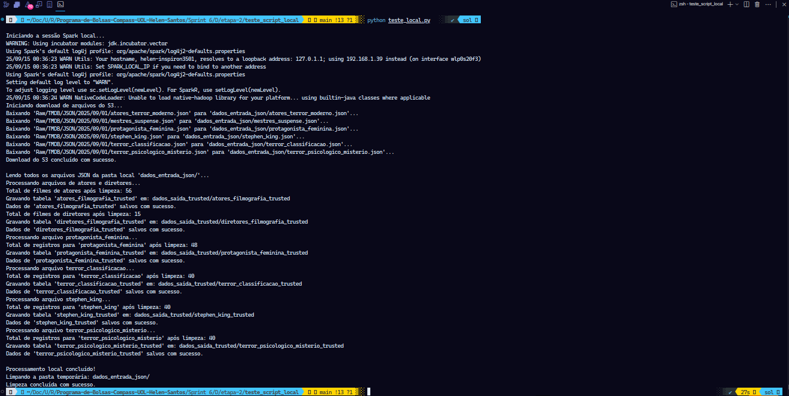

Abaixo está o caminho para os arquivos resultante do processo:

[Resultado do Teste Local - Etapa 2](./etapa-2/teste_script_local/dados_saida_trusted/)

## 2. Criando Database pelo AWS Lake Formation

Por meio do AWS Lake Formation foi criado o banco de dados `tmdb_db` para que o crawler adicione automaticamente uma tabela a partir dos dados armazenados no S3 gerados pelo Job.

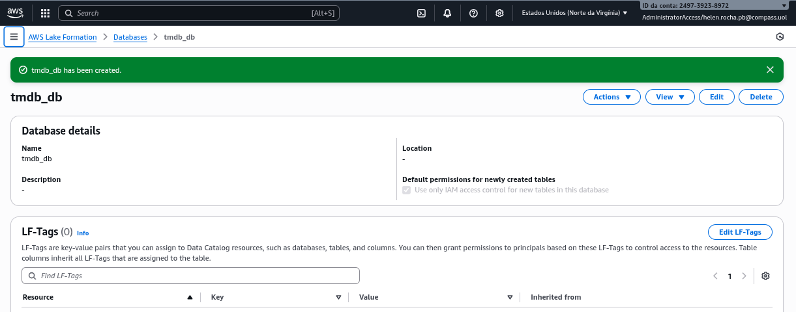

## 3. O Script do Job no AWS Glue

Este script representa a versão de produção para o processamento dos dados da API. Ele foi projetado para ser executado no ambiente serverless do AWS Glue, lidando com os desafios específicos dos arquivos JSON para entregar tabelas limpas e estruturadas na camada Trusted.

#### 1\. Imports e Leitura de Parâmetros

```
import sys
from datetime import datetime
from awsglue.utils import getResolvedOptions
from pyspark.context import SparkContext
from awsglue.context import GlueContext
from awsglue.job import Job
from pyspark.sql.functions import col, explode, input_file_name, lit
from awsglue.dynamicframe import DynamicFrame

args = getResolvedOptions(sys.argv, [
    "JOB_NAME",
    "GLUE_DB_NAME",
    "S3_INPUT_PATH_TMDB",
    "S3_TRUSTED_PATH_BASE"
])
```

A execução do script começa com a importação das bibliotecas essenciais do AWS Glue e do PySpark. A função `getResolvedOptions` é utilizada para capturar os parâmetros configurados no Job, como os caminhos de S3 e o nome do banco de dados. Esta abordagem torna o código reutilizável e independente do ambiente, uma vez que as configurações são externalizadas.

Parâmetros adicionados nas Configurações do Job:

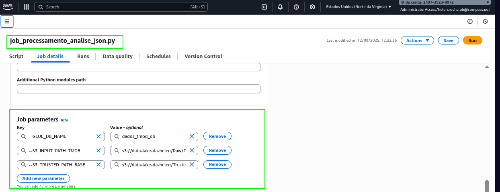

#### 2\. Inicialização do Ambiente Glue e Spark

```
sc = SparkContext.getOrCreate()
glueContext = GlueContext(sc)
spark = glueContext.spark_session
job = Job(glueContext)
job.init(args["JOB_NAME"], args)
logger = glueContext.get_logger()

S3_INPUT_PATH = args['S3_INPUT_PATH_TMDB']
S3_OUTPUT_PATH = args['S3_TRUSTED_PATH_BASE']
GLUE_DB_NAME = args['GLUE_DB_NAME']
```

Este bloco é responsável por estabelecer o ambiente de execução. Ele inicializa os contextos do Spark e do Glue, que são os motores do processamento, e ativa a `SparkSession` para a manipulação de DataFrames. O objeto `Job` é instanciado para controlar o ciclo de vida da execução, e as variáveis de configuração são atribuídas a partir dos parâmetros lidos anteriormente, preparando o cenário para as próximas etapas.

#### 3\. Geração do Caminho e Função de Escrita

```
hoje = datetime.now()
S3_OUTPUT_PATH_FINAL = f"{S3_OUTPUT_PATH}{hoje.year}/{hoje.month:02d}/{hoje.day:02d}/" 

def salvano_trusted_zone(df, nome_tabela):
    logger.info(f"Gravando tabela '{nome_tabela}' em: {S3_OUTPUT_PATH_FINAL}{nome_tabela}/")
    dynamic_frame_to_write = DynamicFrame.fromDF(df, glueContext, f"df_{nome_tabela}")   
    
    glueContext.write_dynamic_frame.from_options(
        frame=dynamic_frame_to_write,
        connection_type="s3",        
        connection_options={
            "path": f"{S3_OUTPUT_PATH_FINAL}{nome_tabela}/", 
            "database": GLUE_DB_NAME
        },
        format="parquet"
    )
    logger.info(f"Dados {nome_tabela} salvos com sucesso em S3.")
```

Cumprindo um requisito chave do desafio, o script primeiro constrói um caminho de saída que inclui a data de ingestão (`ano/mês/dia`). Em seguida, a função `salvano_trusted_zone` encapsula a lógica de escrita: ela recebe um DataFrame limpo e um nome de tabela, salva os dados em uma pasta específica dentro do caminho particionado e, crucialmente, registra a tabela no Glue Data Catalog. O formato de saída é definido como **Parquet**, otimizando os dados para performance.

#### 4\. Tratamento Específico de Atores e Diretores

```
try:
    logger.info("Lendo arquivo de atores...")
    df_atores_raw = spark.read.option("multiline", "true").json(f"{S3_INPUT_PATH}atores_terror_moderno.json")
    
    if not df_atores_raw.rdd.isEmpty():
        df_atores_exploded = df_atores_raw.select(explode(col("filmografia_terror")).alias("filme"), col("ator"), col("id").alias("ator_id"))
        df_atores_final = df_atores_exploded.select(
            col("ator"), col("ator_id"), col("filme.id").alias("filme_id"), col("filme.title").alias("filme_titulo"),
            col("filme.release_date").alias("filme_data_lancamento"), col("filme.vote_average").alias("filme_nota_media"),
            col("filme.budget").alias("filme_orcamento"), col("filme.revenue").alias("filme_receita")
        )
        df_atores_final = df_atores_final.filter(col("filme_id").isNotNull())
        logger.info(f"Total de filmes de atores após limpeza: {df_atores_final.count()}")
        salvano_trusted_zone(df_atores_final, "atores_filmografia_trusted")
except Exception as e:
    logger.error(f"Erro ao processar arquivo de atores: {e}")

try:
    logger.info("Lendo arquivo de diretores...")
    df_diretores_raw = spark.read.option("multiline", "true").json(f"{S3_INPUT_PATH}mestres_suspense.json")

    if not df_diretores_raw.rdd.isEmpty():
        df_diretores_exploded = df_diretores_raw.select(explode(col("filmografia_suspense_misterio")).alias("filme"), col("diretor"), col("id").alias("diretor_id"))
        df_diretores_final = df_diretores_exploded.select(
            col("diretor"), col("diretor_id"), col("filme.id").alias("filme_id"), col("filme.title").alias("filme_titulo"),
            col("filme.release_date").alias("filme_data_lancamento"), col("filme.vote_average").alias("filme_nota_media")
        )
        df_diretores_final = df_diretores_final.filter(col("filme_id").isNotNull())
        logger.info(f"Total de filmes de diretores após limpeza: {df_diretores_final.count()}")
        salvano_trusted_zone(df_diretores_final, "diretores_filmografia_trusted")
except Exception as e:
    logger.error(f"Erro ao processar arquivo de diretores: {e}")
```

Devido à estrutura única e complexa dos JSONs de atores e diretores, eles são tratados individualmente. Cada arquivo é lido de forma específica, permitindo que o Spark infira seu esquema corretamente. O núcleo da transformação é a função `explode`, que desmembra a lista de filmes aninhada em múltiplas linhas, criando um formato tabular. O uso de `try...except` torna o job mais robusto, permitindo que ele continue a execução mesmo que um desses arquivos esteja ausente ou corrompido.

#### 5\. Função Genérica para Processamento de Comparações

```
def processando_comparacao(nome_arquivo, colunas, coluna_nova):
    try:
        logger.info(f"Processando arquivo {nome_arquivo}...")
        # Leitura do arquivo dentro da função 
        df_filtrado = spark.read.option("multiline", "true").json(f"{S3_INPUT_PATH}{nome_arquivo}.json")
        
        if df_filtrado.rdd.isEmpty():
            logger.warning(f"Nenhum dado encontrado para {nome_arquivo}")
            return
        
        df_uniao = None
        for col_name in colunas:
            if col_name in df_filtrado.columns:
                df_temporaria = df_filtrado.select(explode(col(f"{col_name}.filmes")).alias("filme")).withColumn(coluna_nova, lit(col_name))
                if df_uniao is None:
                    df_uniao = df_temporaria
                else:
                    df_uniao = df_uniao.unionByName(df_temporaria, allowMissingColumns=True)

        if df_uniao:
            df_final = df_uniao.select(
                col(coluna_nova), col("filme.id").alias("filme_id"), col("filme.title").alias("filme_titulo"),
                col("filme.release_date").alias("filme_data_lancamento"), col("filme.vote_average").alias("filme_nota_media")
            )
            df_final = df_final.filter(col("filme_id").isNotNull())
            logger.info(f"Total de registros para '{nome_arquivo}' após limpeza: {df_final.count()}")
            salvano_trusted_zone(df_final, f"{nome_arquivo}_trusted")
    except Exception as e:
        logger.error(f"Erro ao processar arquivo de comparação '{nome_arquivo}': {e}")

```

Para processar os quatro arquivos de análise restantes, que compartilham um padrão estrutural, foi criada uma função genérica e reutilizável. Ela recebe o nome do arquivo, as seções a serem processadas (ex: `["anos_80", "anos_2020"]`) e o nome de uma nova coluna de contexto. A função lê o arquivo correspondente, aplica a transformação `explode` para cada seção, adiciona a coluna de contexto usando `lit`, e une os resultados com `unionByName`, gerando um DataFrame consolidado e pronto para ser salvo.

#### 6\. Orquestração da Execução e Finalização

```
processando_comparacao("protagonista_feminina", ["anos_80", "anos_2020"], "decada")
processando_comparacao("terror_classificacao", ["terror_pg13", "terror_r"], "classificacao")
processando_comparacao("stephen_king", ["stephen_king", "originais"], "fonte")
processando_comparacao("terror_psicologico_misterio", ["terror_psicologico", "terror_psicologico_misterio"], "categoria")

job.commit()
```

O final do script funciona como o orquestrador do processo. Ele invoca a função `processando_comparacao` para cada um dos quatro arquivos de análise, passando os parâmetros específicos para cada um. Essa sequência de chamadas garante que todos os dados de comparação sejam transformados e salvos. Por fim, `job.commit()` é executado para sinalizar a conclusão bem-sucedida do job ao serviço AWS Glue.

Abaixo uma evidência de que o Job foi executado com sucesso:

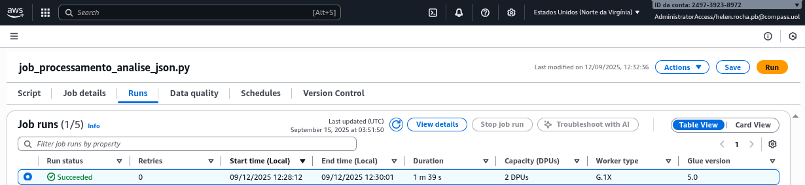

Obtive o seguinte resultado no S3:


## 3. Crawler TMDBTrusted

Após a execução do Job, foi configurado um Crawler no AWS Glue. Crawlers são mecanismos utilizados para monitorar o armazenamento de dados e, a partir deles, criar ou atualizar automaticamente os metadados no Glue Data Catalog. Com isso, uma tabela será criada de forma automática, catalogando os dados processados para futuras consultas.

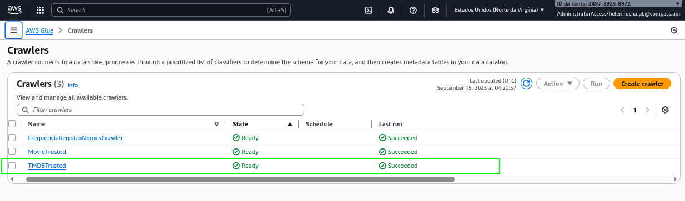