# Resumo

**Fundamentals of Analytics on AWS – Part 2 (Português)**: Nesse curso aprendi sobre os fundamentos da arquitetura de dados moderna, explorando as diferenças e os benefícios de tecnologias de armazenamento como data lakes e data warehouses. Compreendi como construir, gerenciar e proteger um data lake na AWS utilizando serviços como o Lake Formation , e as vantagens de modernizar um data warehouse com o Amazon Redshift, que oferece recursos avançados como tecnologia sem servidor e machine learning. Além disso, aprofundei meus conhecimentos nos pilares da arquitetura de dados moderna , em conceitos como movimentação de dados , malha de dados e o uso do Amazon DataZone para governança. Por fim, analisei casos de uso práticos em diversos setores e os serviços da AWS que suportam cada etapa de um pipeline de analytics.

**AWS Glue Getting Started (Português)**: Por meio do conteúdo desse curso, aprendi a utilizar o AWS Glue como um serviço completo de integração de dados sem servidor. Explorei seus principais componentes e funcionalidades, compreendendo como automatizar processos de extração, transformação e carregamento (ETL) com o AWS Glue Studio, que oferece uma interface visual intuitiva para construir e monitorar pipelines de dados. Além disso, aprendi a usar o AWS Glue Data Catalog para descobrir, pesquisar e gerenciar metadados de diversas fontes de forma centralizada. Também adquiri conhecimentos práticos com o AWS Glue DataBrew para limpar, normalizar e analisar a qualidade dos dados por meio de transformações pré-construídas e sem a necessidade de código, aplicando esses conceitos em exercícios práticos que abrangeram desde a criação de crawlers até a execução de trabalhos de ETL e a configuração de regras de qualidade de dados.

**AWS - Tutoriais Técnicos - Analytics**: A partir desse curso, aprendi a construir um pipeline de análise de dados na AWS, utilizando uma arquitetura que transforma dados brutos em insights visuais. Entendi como usar o AWS Glue para catalogar e processar dados armazenados no S3, empregando o Glue Studio para criar trabalhos de ETL que realizam transformações, como junção de tabelas e exclusão de campos desnecessários. Em seguida, explorei o Amazon Athena para executar consultas SQL diretamente nos dados processados e catalogados, aproveitando sua capacidade serverless para análises interativas. Por fim, utilizei o Amazon Quicksight para criar dashboards e visualizações dinâmicas a partir dos dados consultados com o Athena, compreendendo como essa ferramenta de Business Intelligence se conecta às fontes de dados para gerar relatórios e análises de forma rápida e escalável.

# Exercícios

## Parte 1 - Geração e massa de dados

1. ... [Exercício I - Geração e massa de dados](./Exercicios/01-Parte-1-Geracao-e-massa-de-dados/gerar_dados.py) 

## Parte 2 - Apache Spark

2. ... [Exercício II - Apache Spark](./Exercicios/02-Parte-2-Apache-Spark/processamento_spark.py) 

##  Lab AWS Glue

3. ... [Exercício III - Lab AWS Glue](./Exercicios/03-Lab-AWS-Glue/script_job.py) 


# Evidências

## Parte 1 - Geração e massa de dados

Neste primeiro bloco, o script foca na manipulação de dados numéricos. Ele inicia criando uma lista com 250 números inteiros aleatórios, variando de 1 a 1000. Após exibir a lista original no terminal para verificação.

```
numeros_aleatorios = [random.randint(1, 1000) for _ in range(250)]
print(100*'=')
print(f"""
                                 Lista Original
      """
    )
print(100*'=')
print(numeros_aleatorios)
```

Após isso, é aplicado o método `reverse()` para inverter a ordem dos elementos e, em seguida, imprimir o resultado dessa inversão. 

```
numeros_aleatorios.reverse()
print(100*'=')
print(f"""                            
                                    Lista Reversa
      """
      )
print(100*'=')
print(numeros_aleatorios)

```

Obtive esse resultado:

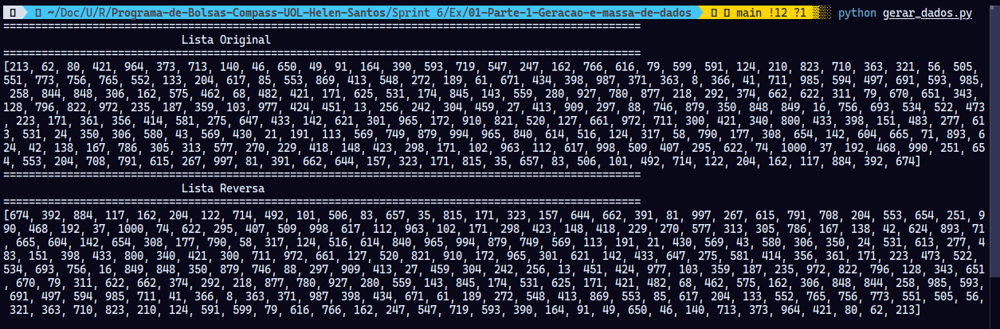

Primeiramente, uma lista contendo 20 nomes de animais é definida e, em seguida, organizada em ordem alfabética com o método `sort()`.  Os nomes ordenados são exibidos no console. 

```
animais = [
    "Gato", "Coelho", "Cachorro", "Raposa", "Tamanduá", "Tigre", "Cavalo", "Lhama", "Coruja","Urso",
    "Chinchilla", "Furão", "Zebra", "Girafa", "Leão", "Coala", "Arara", "Beija-Flor", "Abelha", "Esquilo"
]
animais.sort()

print(100*'=')
print(f"""
                                  Lista Animais em Ordem Alfabética
      """
    )
print(100*'=')
[print(animal) for animal in animais]
```

Obtive esse resultado:

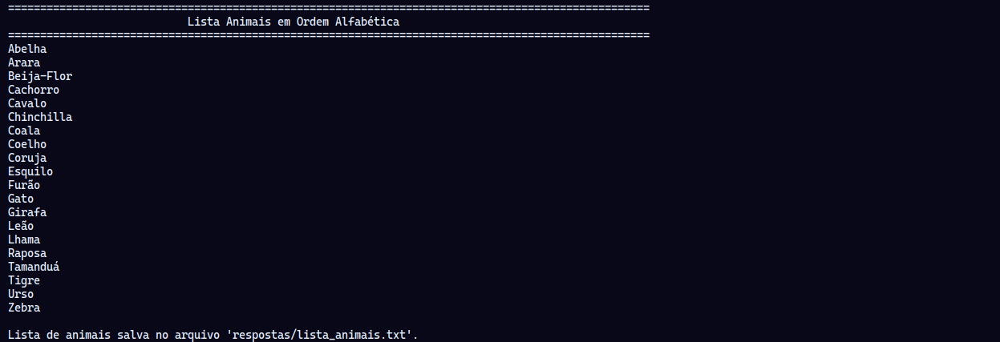

Na sequência, é utilizada a biblioteca `pathlib` para criar um diretório chamado respostas e, dentro dele, gera o arquivo de texto `lista_animais.txt` contendo a lista de animais formatada, garantindo que o resultado seja salvo.

```
pasta_respostas = pathlib.Path('respostas')
pasta_respostas.mkdir(exist_ok=True)

arquivo_animais = pasta_respostas / "lista_animais.txt"
with open(arquivo_animais, 'w', encoding='utf-8') as arquivo:
    arquivo.write("============Lista de Animais============\n")
    for animal in animais:
        arquivo.write(f"{animal}\n")

print(f"\nLista de animais salva no arquivo '{arquivo_animais}'.")
```

Abaixo, arquivo de texto com lista de Animais:

[Arquivo de Texto Contendo Lista de Animais](./Exercicios/01-Parte-1-Geracao-e-massa-de-dados/respostas/lista_animais.txt)

O processo começa com a criação de uma base de aproximadamente 39 mil nomes completos e únicos. Para garantir que os resultados sejam reprodutíveis, a aleatoriedade é inicializada com um seed fixo.

```
random.seed(40)
qtd_nomes_unicos= 39080
qtd_nomes_aleatorios = 10000000

print(100*'=')
print(f"""
                    Nomes Únicos
      """)
print(100*'=')
print(qtd_nomes_unicos)

aux = []
for i in range(qtd_nomes_unicos):
    aux.append(names.get_full_name())

print("Base de nomes únicos criada.")
```

A partir dessa base, será gerado uma lista final contendo 10 milhões de nomes, selecionados aleatoriamente do conjunto inicial. 

```
print(f"Gerando {qtd_nomes_aleatorios} nomes aleatórios...")
dados = []
for i in range(qtd_nomes_aleatorios):
  dados.append(random.choice(aux))
```

Por fim, essa lista massiva é escrita em um arquivo `nomes_aleatorios.txt` na pasta respostas. O código também mede e informa o tempo exato, em segundos, que a operação de escrita no arquivo levou para ser concluída, oferecendo uma métrica de desempenho para a manipulação de grandes volumes de dados.

```
arquivo_nomes = pasta_respostas / "nomes_aleatorios.txt"
print(f"Escrevendo nomes no arquivo '{arquivo_nomes}'...")
tempo_inicio = time.time()

with open(arquivo_nomes, 'w', encoding='utf-8') as arquivo:
    arquivo.write("==========Lista Nomes==========\n")
    for nome in dados:
        arquivo.write(f"{nome}\n")

tempo_fim = time.time()
tempo_total = tempo_fim - tempo_inicio

print(f"Arquivo '{arquivo_nomes}' gerado com sucesso!")
print(f"Tempo de escrita no arquivo: {tempo_total:.2f} segundos.")
```

Obtive esse resultado no console:


Abaixo, arquivo de texto com lista de nomes:

[Arquivo de Texto Contendo Nomes Aleatórios](./Exercicios/01-Parte-1-Geracao-e-massa-de-dados/respostas/nomes_aleatorios.txt)

## Parte 2 - Apache Spark

Nesta etapa, o ambiente para o processamento de dados é preparado. O script importa as bibliotecas essenciais do PySpark para manipulação de dados e do `pathlib` para gerenciamento de pastas. Em seguida, ele garante que o diretório `respostas`, onde os resultados serão salvos, exista. O ponto central deste bloco é a inicialização da `SparkSession`, que é a porta de entrada para qualquer funcionalidade do Spark, aqui configurada para rodar localmente em todos os núcleos disponíveis.

```
from pyspark.sql import SparkSession
from pyspark.sql.functions import col, lit, when, rand, floor, element_at
import pathlib

pasta_respostas = pathlib.Path('respostas')
pasta_respostas.mkdir(exist_ok=True)

spark = SparkSession \
    .builder \
    .master("local[*]") \
    .appName("Exercício Spark") \
    .getOrCreate()

```

Com o Spark iniciado, o próximo passa foca na ingestão dos dados brutos. É realizada a leitura do arquivo de texto com milhões de nomes gerado anteriormente, carregando-o em um DataFrame. A opção `comment='='` é utilizada para ignorar a linha de cabeçalho do arquivo. Após a leitura, ele realiza uma pequena limpeza, renomeando a coluna padrão `_c0` para um nome mais descritivo, "Nomes", e exibe o esquema e as primeiras cinco linhas para confirmar que os dados foram carregados corretamente.

```
print(
f"""{50*'='}    
                Lendo Arquvo de Nomes...
{50*'='}
    """
)

df_nomes_leitura = spark.read.csv('../01-Parte-1-Geracao-e-massa-de-dados/respostas/nomes_aleatorios.txt', header=False, comment='=')
df_nomes_leitura.printSchema()

df_nomes= df_nomes_leitura.withColumnRenamed("_c0", "Nomes")
df_nomes.printSchema()
df_nomes.show(5)
```

A primeira etapa de enriquecimento de dados ocorre no próximo bloco de código. Uma nova coluna chamada "Escolaridade" é adicionada ao DataFrame. Seus valores ("Fundamental", "Medio" ou "Superior") são atribuídos de forma aleatória para cada registro, utilizando uma estrutura condicional `when` baseada em números aleatórios gerados pela função `rand()`.

```
print(
f"""{50*'='}    
                   Escolaridade
{50*'='}
    """    
)

df_nomes = df_nomes.withColumn("Escolaridade",
    when(rand() < 0.33, lit("Fundamental"))
    .when(rand() < 0.66, lit("Medio"))
    .otherwise(lit("Superior"))
)
df_nomes.show(10)
```

Continuando o enriquecimento, o script agora cria a coluna "Pais". Ele define uma lista com nomes de países da América do Sul e, para cada linha do DataFrame, seleciona aleatoriamente um desses países para preencher a nova coluna. A função `element_at` é utilizada para extrair um elemento da lista com base em um índice gerado aleatoriamente.

```
print(
f"""{50*'='}    
                   Escolaridade e País
{50*'='}
    """    
)
paises_sul_americanos = [
    "Argentina", "Bolívia", "Brasil", "Chile", "Colômbia", "Equador",
    "Guiana", "Paraguai", "Peru", "Suriname", "Uruguai", "Venezuela", "Guiana Francesa"
]
paises_col = lit(paises_sul_americanos)
df_nomes = df_nomes.withColumn("Pais", element_at(paises_col, (floor(rand() * len(paises_sul_americanos)) + 1).cast("int")))
df_nomes.show(10)
```

Abaixo, é gerada a coluna "AnoNascimento". Ela recebe um número inteiro aleatório no intervalo entre 1945 e 2010, simulando o ano de nascimento de cada pessoa no DataFrame. A função `floor` garante que o resultado seja um número inteiro.

```
print(
f"""{50*'='}    
                   Ano de Nascimento
{50*'='}
    """    
)

df_nomes = df_nomes.withColumn("AnoNascimento", (1945 + floor(rand() * (2010 - 1945 + 1))).cast("int"))
df_nomes.select("Nomes", "AnoNascimento").show(10)

```

Em seguida, demonstra-se como realizar consultas utilizando a API nativa do DataFrame. Ele aplica o método `.filter()` para criar um novo DataFrame `df_select` contendo apenas os registros de pessoas que nasceram a partir do ano 2000.

```
print(
f"""{80*'='}
                Pessoas Nascidas a Partir dos Anos 2000
{80*'='}
    """
)

df_select = df_nomes.filter(col("AnoNascimento") >= 2000)
df_select.select("Nomes", "AnoNascimento").show(10)
```

Este bloco abaixo mostra a flexibilidade do Spark ao alcançar o mesmo resultado do bloco anterior, mas utilizando Spark SQL. O DataFrame é registrado como uma "view" temporária chamada `pessoas`, o que permite que ele seja consultado com comandos SQL padrão. Uma consulta `SELECT` com `WHERE` é executada para filtrar os dados, e o resultado é salvo como um único arquivo CSV `coalesce(1)` na pasta `respostas`.

```
# Repetição do processo usando o Spark SQL 
print(
f"""{80*'='}
                Spark SQL - Pessoas Nascidas a Partir dos Anos 2000
{80*'='}
    """
)

df_nomes.createOrReplaceTempView("pessoas")
df_sql_seculo = spark.sql("SELECT Nomes, AnoNascimento FROM pessoas WHERE AnoNascimento >= 2000")
df_sql_seculo.show(10)
caminho_saida_csv = pasta_respostas / "relatorio_seculo_csv"
df_sql_seculo.coalesce(1).write.csv(str(caminho_saida_csv), header=True, mode='overwrite')
```

Abaixo, são realizadas consultas de agregação para obter um insight específico: a quantidade de pessoas da geração "Millennials". O cálculo é feito de duas formas: primeiro com a API de DataFrames `filter().count()` e depois com Spark SQL `SELECT COUNT(*)`, com o resultado desta última sendo salvo em um novo arquivo CSV.

```
total_millennials = df_nomes.filter((col("AnoNascimento") >= 1980) & (col("AnoNascimento") <= 1994)).count()
print(
    f"""{100*'='}
                Geração Millennials (Pessoas Nascidas entre 1980 e 1994)
{100*'='}
                Número total de pessoas da geração Millennials: {total_millennials}
    """
)

print(
f"""{100*'='}
                Spark SQL - Geração Millennials (Pessoas Nascidas entre 1980 e 1994) 
{100*'='}
        """
)

df_sql_millennials = spark.sql("SELECT COUNT(*) as total FROM pessoas WHERE AnoNascimento BETWEEN 1980 AND 1994")
df_sql_millennials.show()
caminho_saida_csv = pasta_respostas / "relatorio_millenius_csv"
df_sql_millennials.coalesce(1).write.csv(str(caminho_saida_csv), header=True, mode='overwrite')
```

O último bloco executa a análise mais complexa. Utilizando uma consulta SQL, ele categoriza cada indivíduo em uma geração (`Baby Boomers`, `Geração X`, `Millennials` e `Geração Z`.) com base em seu ano de nascimento. Em seguida, agrupa os resultados por país e geração para criar um relatório que lista as gerações presentes em cada nação. Este relatório final é exibido por completo no console e salvo em um arquivo CSV, consolidando o resultado de todo o processamento.

```
print(
f"""{50*'='}
                País e Gerações
{50*'='}
    """
)
query_geracoes = """
    SELECT
        Pais,
        CASE
            WHEN AnoNascimento BETWEEN 1944 AND 1964 THEN 'Baby Boomers'
            WHEN AnoNascimento BETWEEN 1965 AND 1979 THEN 'Geração X'
            WHEN AnoNascimento BETWEEN 1980 AND 1994 THEN 'Millennials'
            WHEN AnoNascimento BETWEEN 1995 AND 2010 THEN 'Geração Z'
            ELSE NULL
        END AS Geracao
    FROM pessoas
    WHERE AnoNascimento >= 1944
    GROUP BY Pais, Geracao
    ORDER BY Pais, Geracao
"""
df_geracoes = spark.sql(query_geracoes)
df_geracoes.show(df_geracoes.count(), truncate=False)

print("Salvando o resultado final em um arquivo CSV...")
caminho_saida_csv = pasta_respostas / "relatorio_geracoes_csv"
df_geracoes.coalesce(1).write.csv(str(caminho_saida_csv), header=True, mode='overwrite')
```

Obtive os seguintes resultados:

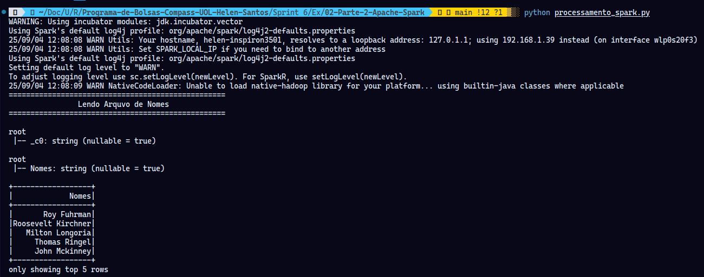

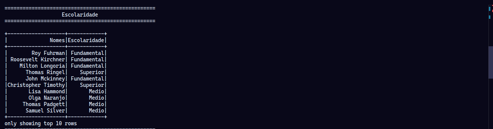

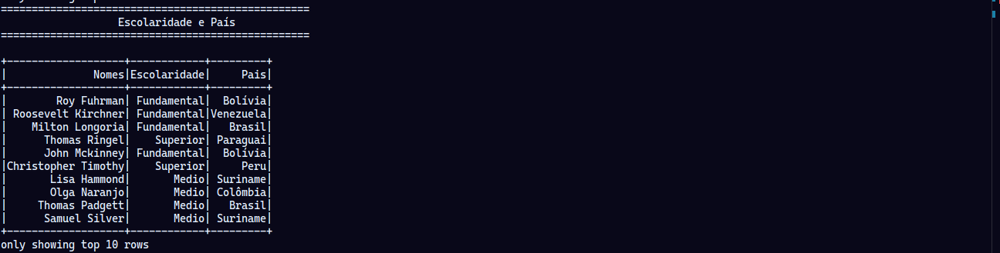

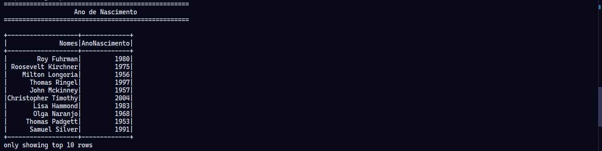

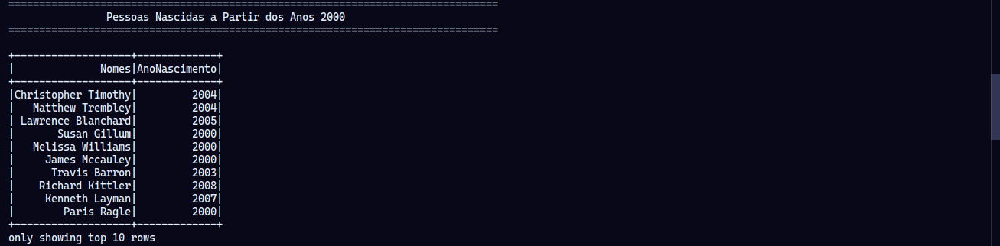

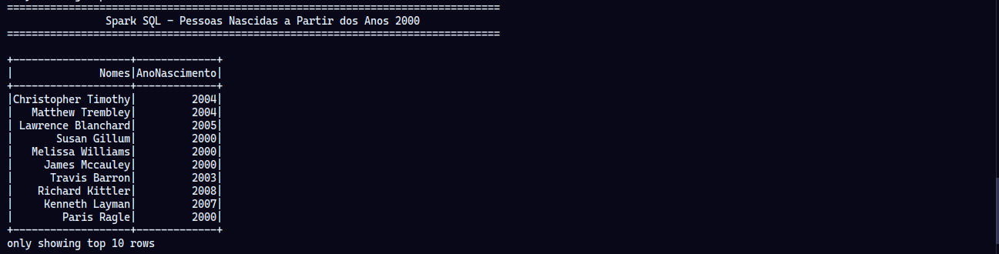

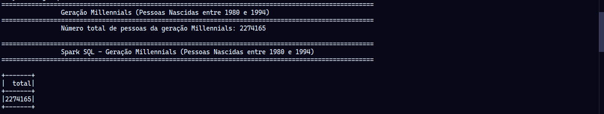


Abaixo os relatórios gerado pelas consultas:

[Relatório Países e Gerações](./Exercicios/02-Parte-2-Apache-Spark/respostas/relatorio_geracoes_csv/part-00000-a55eab8d-73e8-4d45-b317-6bf04606cef3-c000.csv)

[Relatório Millenius](./Exercicios/02-Parte-2-Apache-Spark/respostas/relatorio_millenius_csv/part-00000-6f08a126-5283-4293-9b8c-a604d59cb9cd-c000.csv)

[Relatório Século](./Exercicios/02-Parte-2-Apache-Spark/respostas/relatorio_seculo_csv/part-00000-873b4a0f-0db1-4e6b-b95f-8c7818d5d642-c000.csv)

##  Lab AWS Glue

Primeiramente foi realizado o upload do arquivo `nomes.csv` para o bucket do S3 no caminho `s3://lab-glue-2497/lab-glue/input/`.

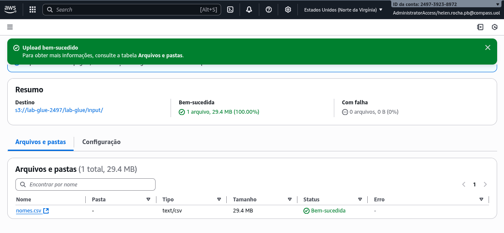

Em seguida foi craido um novo role chamado `AWSGlueServiceRole-Lab4`, associada a policies geridas pela AWS `AmazonS3FullAccess`,`AWSLakeFormationDataAdmin`,`AWSGlueConsoleFullAccess` e `CloudWatchFullAccess`. Isso foi importante para a permissão do acesso do serviço do Glue ao S3.

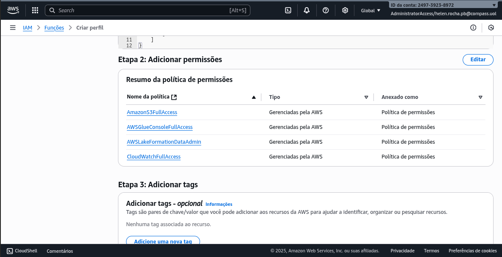

Após isso, o AWS Glue foi preparado e configurado para utilizar o IAM Role criado (`AWSGlueServiceRole-Lab4`).

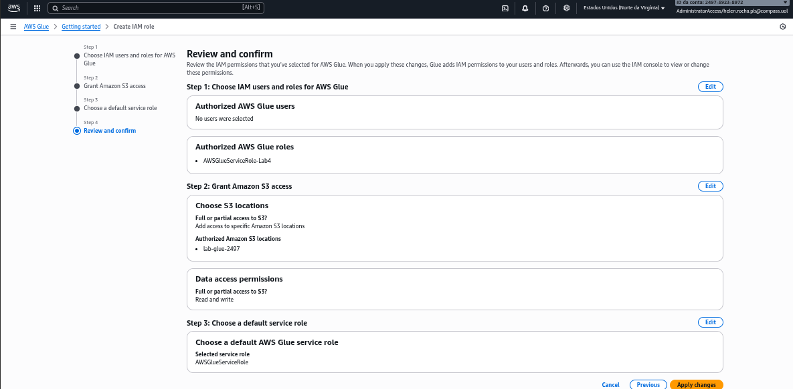

Posteriormente foi criado o banco de dados para adição automatica de uma tabela a partir dos dados armazenados no S3. Isso foi permitido pelo AWS Lake Formation que é um serviço que facilita da criação e gerenciamento de data lakes.

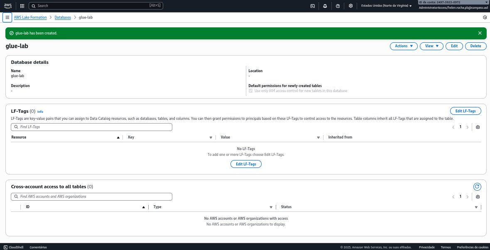

Para realizar o processamento do arquivo `nomes.csv`, foi criado o job por meio do AWS Glue. 

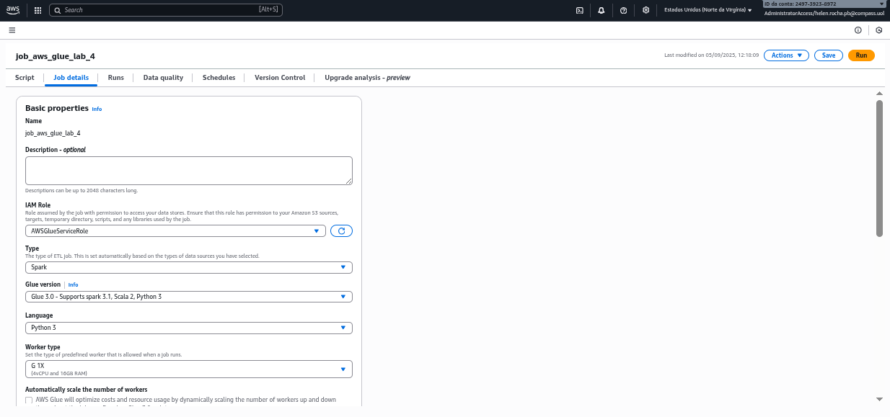

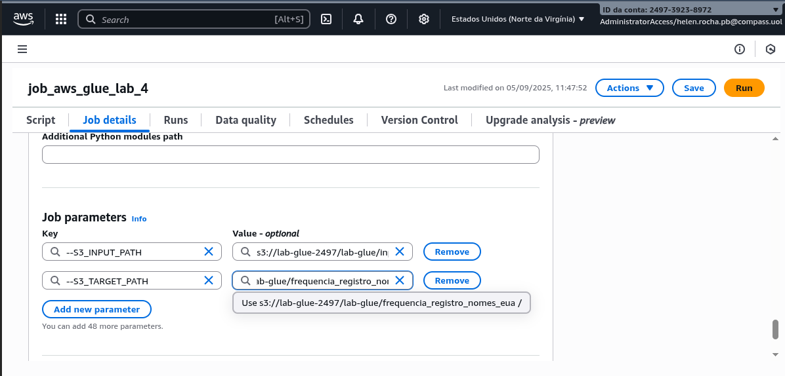

Foi criado o script que implementa um processo de ETL (Extração, Transformação e Carga) projetado para ser executado no job no AWS Glue. Seu principal objetivo é ler o arquivo CSV `nomes.csv` a partir do bucket S3 e realizar uma série de transformações e análises utilizando PySpark, e carregar o resultado em um novo local no S3. As transformações incluem a padronização dos nomes para letras maiúsculas, enquanto as análises englobam diversas agregações, como a contagem de registros por ano e sexo, a ordenação dos dados e a identificação dos nomes masculino e feminino mais populares em todo o dataset. Ao final do processamento, os dados enriquecidos são salvos em formato JSON, sendo particionados pelas colunas "sexo" e "ano" para otimizar o desempenho.


Apesar de algumas falhas, o Job foi executado com sucesso.

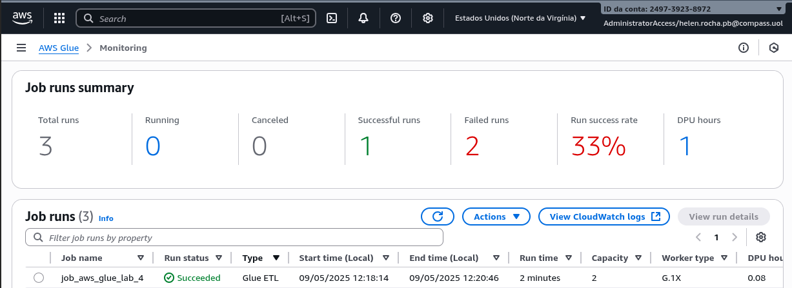

E esses foram os resultados no S3:

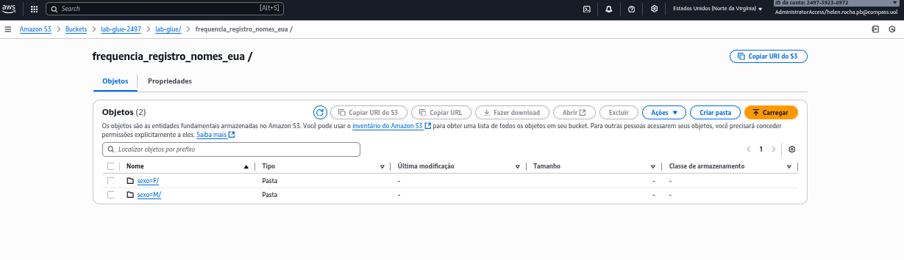

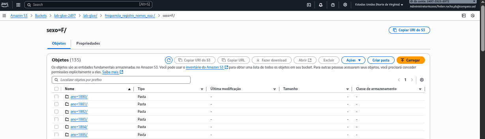

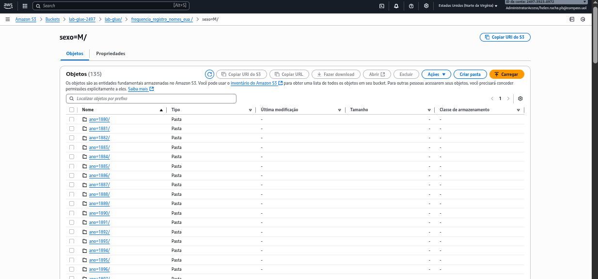

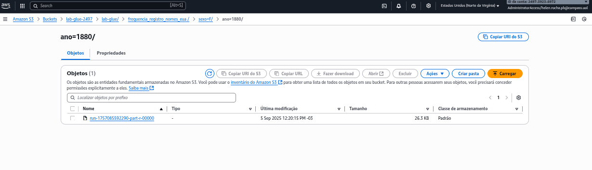

Após isso foi desenvolvido um crawler para que fosse criada uma tabela chamada `frequencia_registro_nomes_eua` a partir dos dados escritos no S3.

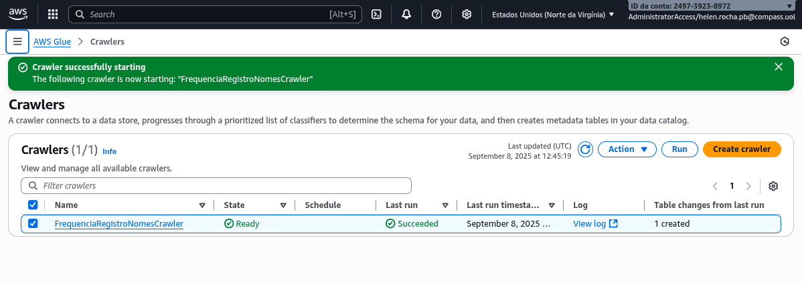


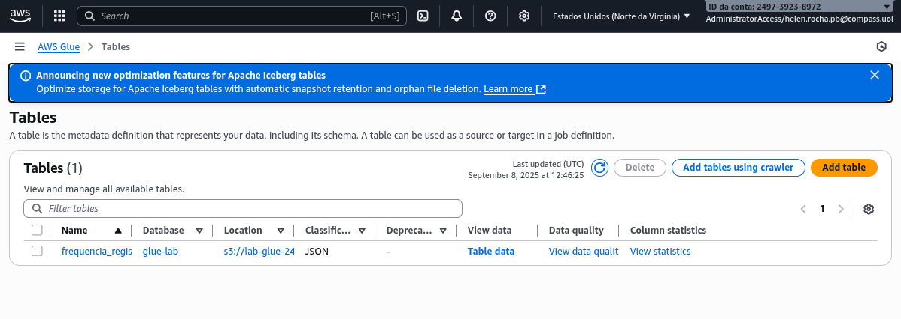

Após isso, foi permitido a realização de uma consulta no Athena com o comando `SELECT`.

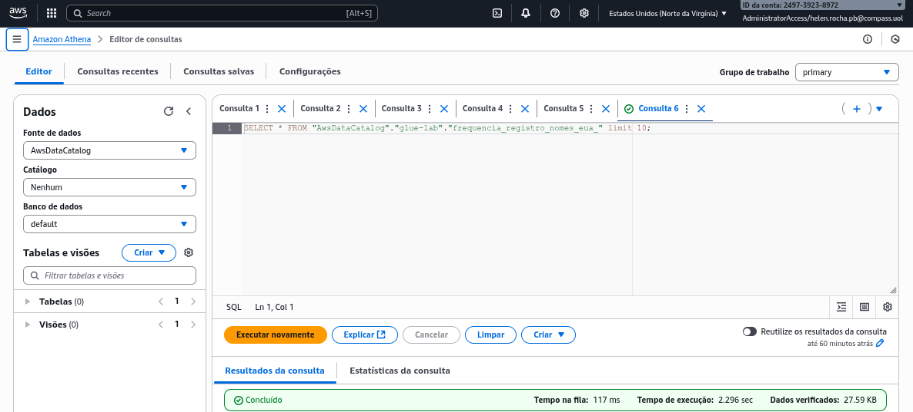

Abaixo está o arquivo com o resultado da consulta:

[Resultado do Athena](./Exercicios/03-Lab-AWS-Glue/resultado/resultado.csv)

# Certificados

Certificado do Curso *Fundamentals of Analytics on AWS – Part 2 (Português)*

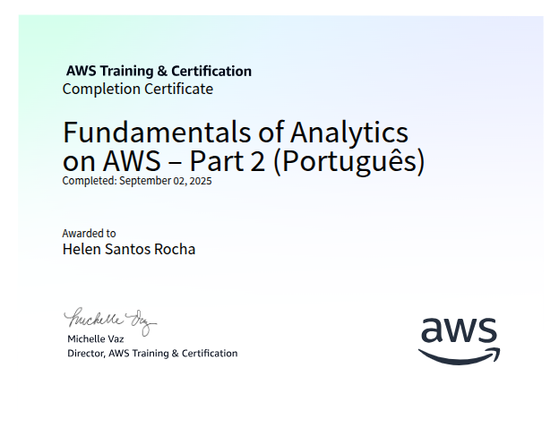

Certificado do Curso *AWS Glue Getting Started (Português)*


Comprovante de Conclusão do Curso *AWS - Tutoriais Técnicos - Analytics*


