# Processamento da Camada Refined: modelando e preparando tabelas no AWS Glue Data Catalog

A Camada Refinada representa a fase final e de maior valor agregado do Data Lake. O objetivo principal desta camada é transformar os dados limpos da Trusted Zone em um modelo de dados otimizado, pronto para consumo direto por analistas e ferramentas de Business Intelligence.

O processo para construir esta camada envolve três etapas principais:

1.  **Modelagem de Dados:** Os dados da camada Trusted são reestruturados seguindo os princípios da **modelagem multidimensional**. Foi implementado um **Fact Constellation** (Esquema Constelação de Fatos), uma evolução do Star Schema que permite análises mais complexas e inter-relacionadas. Este modelo é composto por múltiplas tabelas Fato que compartilham tabelas de Dimensão em comum.
    
2.  **Processamento com AWS Glue:** Um job dedicado do AWS Glue, utilizando o poder do Apache Spark, é responsável por orquestrar toda a transformação. Ele lê as tabelas da camada Trusted, aplica as regras de negócio para construir as dimensões e fatos, e carrega o resultado final na Refined Zone, já no formato do modelo dimensional.
    
3.  **Disponibilização para Análise:** Todas as tabelas finais geradas pelo job são salvas em formato Parquet no S3 e devidamente catalogadas no **AWS Glue Data Catalog**. Isso as torna imediatamente "descobertas" e disponíveis para serem consultadas por outras ferramentas do ecossistema AWS, preparando o terreno para a próxima etapa do projeto: a criação de dashboards e análises visuais com o **Amazon QuickSight**.

## Modelagem Dimensional 

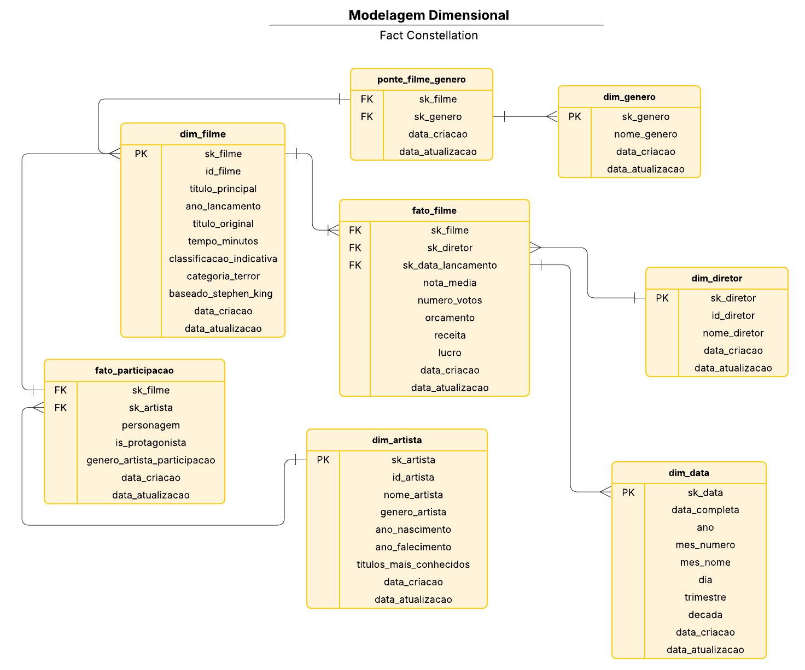

O modelo dimensional desenvolvido adota a abordagem de `Fact Constellation`, indicada por Ralph Kimball para representar múltiplos processos de negócio que compartilham dimensões comuns. Neste caso, o esquema contempla dois processos centrais: o desempenho financeiro e de recepção dos filmes e a participação dos artistas em cada obra.

A tabela `fato_filme` possui granularidade de um registro por filme e armazena métricas aditivas, como nota média, quantidade de votos, orçamento, receita e lucro. Ela se conecta diretamente às dimensões de filmes, diretores e datas, permitindo análises do sucesso de cada obra sob diferentes perspectivas: financeira, crítica ou temporal. A ligação com a dimensão de filmes fornece os atributos descritivos da obra; a ligação com a dimensão de diretores normaliza e identifica os cineastas; e a ligação com a dimensão de datas contextualiza o lançamento em termos de ano, mês, trimestre e década.

Já a tabela `fato_participacao` apresenta granularidade de um registro por artista em cada filme, registrando atributos como personagem interpretado, gênero e se o artista foi protagonista. Ela não contém métricas numéricas, caracterizando-se como uma tabela fato sem fatos (factless fact table), voltada apenas para registrar o evento da participação. A ligação ocorre principalmente com a dimensão de artistas, que armazena informações pessoais e biográficas, e com a dimensão de filmes, possibilitando análises sobre quais atores participaram em quais obras e em quais papéis.

A dimensão `dim_filme` é central, reunindo atributos descritivos das obras como título principal, título original, ano de lançamento, duração e classificação indicativa. Também registra informações derivadas, como a categoria de terror e se o filme é baseado em Stephen King. Essa dimensão está ligada tanto à fato_filme quanto à fato_participacao, funcionando como elo comum para diferentes análises.

A dimensão `dim_artista` armazena informações sobre os atores, incluindo nome, gênero, ano de nascimento e falecimento, além de títulos mais conhecidos. A ligação com a fato_participacao permite investigar quais artistas participaram em cada filme e detalhar suas contribuições individuais.

A dimensão `dim_diretor`, por sua vez, contém os dados dos cineastas, como identificador e nome. Essa dimensão se conecta à fato_filme, permitindo comparações de desempenho entre diretores e suas obras.

A dimensão `dim_genero` organiza os gêneros dos filmes, como terror, drama ou suspense. Como o relacionamento entre filmes e gêneros é de muitos-para-muitos, ele é resolvido por meio da tabela de ponte `ponte_filme_genero`, que associa as chaves substitutas de filmes e gêneros. Essa modelagem viabiliza análises de distribuição de filmes por gênero ou o cruzamento de métricas financeiras com categorias específicas.

A dimensão `dim_data` é responsável por organizar a estrutura temporal. A partir da data de lançamento, foram derivados atributos como ano, mês, dia, trimestre e década. A ligação com a fato_filme fornece a possibilidade de análises temporais detalhadas, como evolução do lucro ou das notas médias ao longo do tempo.

Todas as tabelas incluem colunas de auditoria, como `data_criacao` e `data_atualizacao`, que permitem rastrear o ciclo de vida de cada registro individualmente. Esse recurso garante transparência sobre quando cada informação foi inserida ou atualizada no sistema, algo essencial para governança e qualidade de dados.

Em conjunto, essas relações e atributos conformam uma arquitetura de barramento robusta e extensível, permitindo consultas consistentes e análises drill-across entre diferentes processos de negócio. O modelo garante clareza e precisão nas análises, ao mesmo tempo em que oferece flexibilidade para expansão futura, seja pela inclusão de novas métricas ou pela incorporação de novas fontes de dados.

# Etapas

1. ... [Etapa I](./etapa-1/teste_local.py)

## Boa Prática - AWS Credenciais

- **Arquivo `.env` para Credenciais:** Ocorreu  a implementação de um arquivo `.env` com as credenciais da AWS. Isso foi necessário para a execução do teste local utilizado para a primeira etapa. 

Variáveis de ambiente utilizadas:

```
AWS_ACCESS_KEY_ID=XXXXXXXXXXXXXXXX
AWS_SECRET_ACCESS_KEY=XXXXXXXXXXXXXXXX
AWS_SESSION_TOKEN=XXXXXXXXXXXXXXXX
AWS_REGION=XXXXXXXXXXXXXXXX
S3_BUCKET=XXXXXXXXXXXXXXXX
```

## O Script de Teste Local

O script **`teste_local.py`** foi desenvolvido como uma versão de validação em ambiente local do job da camada *Refined*. Em vez de depender do Glue na AWS para cada execução, ele permite que todas as transformações sejam processadas diretamente no computador com o auxílio do PySpark, utilizando os dados já tratados e armazenados na camada *Trusted*.

O processo inicia carregando as credenciais armazenadas no arquivo `.env`, necessárias para autenticar a conexão com o S3. Em seguida, os arquivos `parquet` da *Trusted Zone* são baixados para uma pasta temporária, possibilitando que os dados sejam manipulados localmente. Esse mecanismo assegura que o mesmo insumo usado em produção seja também empregado nos testes, garantindo fidelidade entre os ambientes.

Uma vez carregados, os dados passam por uma etapa de normalização e padronização. Nela, são ajustados os identificadores dos filmes, os títulos são tratados e uniformizados para permitir comparações consistentes e as colunas de interesse são convertidas para os tipos corretos. A partir desse ponto, o script executa a lógica central de modelagem dimensional: cria as tabelas de dimensões como a`dim_data`, a `dim_diretor`, a `dim_artista`,  a `dim_genero` e a`dim_filme`, aplicando chaves substitutas (`sk_*`) que servirão de referência para as tabelas fato.

Com as dimensões estabelecidas, são construídas as tabelas de fatos. A `fato_filme` concentra métricas numéricas, como nota média, quantidade de votos, orçamento, receita e lucro, relacionadas aos filmes. Já a `fato_participacao` registra o vínculo entre artistas e obras, incluindo informações sobre personagens e protagonismo, caracterizando-se como uma *factless fact table*. Todas essas estruturas são então gravadas localmente, em formato `parquet`, dentro da pasta `dados/refined`, simulando a saída final que seria armazenada na camada *Refined* na nuvem.

Por fim, o script remove os arquivos temporários baixados e encerra a sessão do Spark, deixando apenas os resultados finais disponíveis para consulta. Dessa forma, ele cumpre um papel essencial: permite que a lógica do ETL seja testada, validada e depurada em ambiente local antes da execução no Glue, reduzindo custos, acelerando o ciclo de desenvolvimento e assegurando a qualidade da modelagem dimensional.

### Configuração e Inicialização

Este bloco inicial é responsável por preparar todo o ambiente para a execução do script. Ele começa importando todas as bibliotecas e funções necessárias do PySpark e de outras ferramentas. Em seguida, ele utiliza a biblioteca `dotenv` para carregar de forma segura as credenciais da AWS (chaves de acesso, token) a partir de arquivo `.env`, evitando que informações sensíveis fiquem expostas no código. Por fim, ele inicializa a SparkSession, que é o ponto de entrada para qualquer funcionalidade do Spark, e cria um cliente boto3 para se comunicar com os serviços da AWS, como o S3.

```
import os
import shutil
from dotenv import load_dotenv
import boto3
from pyspark.sql import SparkSession
from pyspark.sql.functions import col, lit, concat, monotonically_increasing_id, split, lower, explode, year, month, dayofmonth, trim, when, current_timestamp, regexp_replace

load_dotenv()
print("Variáveis de ambiente do arquivo .env carregadas.")

aws_access_key_id = os.getenv('AWS_ACCESS_KEY_ID')
aws_secret_access_key = os.getenv('AWS_SECRET_ACCESS_KEY')
aws_session_token = os.getenv('AWS_SESSION_TOKEN')
aws_region = os.getenv('AWS_REGION')
s3_bucket_name = os.getenv('S3_BUCKET')

if not all([aws_access_key_id, aws_secret_access_key, aws_session_token, aws_region, s3_bucket_name]):
    raise ValueError("Uma ou mais variáveis de ambiente necessárias (AWS_*, S3_BUCKET) não foram definidas!")

spark = SparkSession.builder \
    .appName("JobRefinedLocalBoto3") \
    .master("local[*]") \
    .getOrCreate()

print("SparkSession iniciada.")

s3 = boto3.client(
    's3',
    aws_access_key_id=aws_access_key_id,
    aws_secret_access_key=aws_secret_access_key,
    aws_session_token=aws_session_token,
    region_name=aws_region
)
```

### Download dos Dados da Camada Trusted

Este bloco define a lógica para obter os dados necessários para o processamento. Primeiro, ele estabelece os caminhos no S3 para as tabelas da camada Trusted. A função `baixar_parquet_s3` é o coração desta etapa: ela se conecta ao bucket S3, lista todos os arquivos .parquet dentro de um determinado prefixo (pasta) e os baixa para uma pasta temporária local (`arquivos_temporarios`). Isso permite que o ambiente Spark local acesse os dados como se fossem arquivos locais, otimizando o processo de teste.

```
temp_dir = "arquivos_temporarios"
os.makedirs(temp_dir, exist_ok=True)

print(f"Arquivos temporários serão baixados em: {temp_dir}")

def baixar_parquet_s3(prefix):
    s3_objects = s3.list_objects_v2(Bucket=s3_bucket_name, Prefix=prefix)
    paths = []
    if 'Contents' not in s3_objects:
        print(f"AVISO: Nenhum arquivo encontrado em: {prefix}")
        return paths
    for obj in s3_objects.get('Contents', []):
        key = obj['Key']
        if key.endswith('.parquet'):
            local_path = os.path.join(temp_dir, os.path.basename(key))
            if not os.path.exists(local_path):
                s3.download_file(s3_bucket_name, key, local_path)
            paths.append(local_path)
    return paths

TRUSTED_S3_PATH_MOVIES = "Trusted/ARQUIVO_MOVIE/PARQUET/movies_dataset/"
TRUSTED_S3_PATH_TMDB = "Trusted/TMDB/PARQUET/dados_filmografia/2025/09/26/"

df_movies_path = baixar_parquet_s3(TRUSTED_S3_PATH_MOVIES)
df_atores_path = baixar_parquet_s3(f'{TRUSTED_S3_PATH_TMDB}atores_filmografia_trusted/')
df_diretores_path = baixar_parquet_s3(f'{TRUSTED_S3_PATH_TMDB}diretores_filmografia_trusted/')
df_classificacao_path = baixar_parquet_s3(f'{TRUSTED_S3_PATH_TMDB}terror_classificacao_trusted/')
df_sk_path = baixar_parquet_s3(f'{TRUSTED_S3_PATH_TMDB}stephen_king_trusted/')
df_protagonista_path = baixar_parquet_s3(f'{TRUSTED_S3_PATH_TMDB}protagonista_feminina_trusted/')
df_terror_psicologico_path = baixar_parquet_s3(f'{TRUSTED_S3_PATH_TMDB}terror_psicologico_misterio_trusted/')
```

### Leitura dos Arquivos Parquet

Com os arquivos Parquet já baixados localmente, este bloco utiliza o comando `spark.read.parquet()` para carregá-los em DataFrames do Spark. O `*` (asterisco) é usado para passar a lista de caminhos de arquivos como argumentos separados, permitindo que o Spark leia todos os arquivos de partição de uma tabela de uma só vez. Ao final desta etapa, todos os dados da camada Trusted estão em memória, prontos para serem transformados.

```
df_movies_trusted = spark.read.parquet(*df_movies_path)
df_atores_trusted = spark.read.parquet(*df_atores_path)
df_diretores_trusted = spark.read.parquet(*df_diretores_path)
df_classificacao_trusted = spark.read.parquet(*df_classificacao_path)
df_sk_trusted = spark.read.parquet(*df_sk_path)
df_protagonista_trusted = spark.read.parquet(*df_protagonista_path)
df_terror_psicologico_trusted = spark.read.parquet(*df_terror_psicologico_path)

print("Leitura dos arquivos parquet concluída.")
```

### Pré-processamento e Normalização

Este é um dos blocos mais importantes, pois prepara os dados para as junções complexas que virão a seguir. Ele executa duas tarefas cruciais de limpeza e padronização. Primeiro, ele garante que todos os IDs de filmes (`id_filme` e `filme_id`) sejam convertidos para um formato numérico inteiro e consistentes entre todas as tabelas. Segundo, e mais importante, ele cria a coluna `titulo_normalizado` e extrai o `ano_lancamento`. Essa normalização, que remove caracteres especiais e converte para minúsculas, foi a chave para resolver o desafio de juntar fontes de dados com títulos e IDs inconsistentes.

```
df_movies_trusted = df_movies_trusted.withColumn("id_filme", regexp_replace(col("id_filme"), "^tt", "").cast("int"))
df_atores_trusted = df_atores_trusted.withColumn("id_filme", col("filme_id").cast("int"))
df_diretores_trusted = df_diretores_trusted.withColumn("id_filme", col("filme_id").cast("int"))
df_protagonista_trusted = df_protagonista_trusted.withColumn("id_filme", col("filme_id").cast("int"))

df_movies_trusted = df_movies_trusted.withColumn("titulo_normalizado", regexp_replace(lower(col("titulo_principal")), "[^a-z0-9]", ""))
df_classificacao_trusted = df_classificacao_trusted.filter(col("filme_data_lancamento").isNotNull() & (col("filme_data_lancamento") != "")).withColumn("titulo_normalizado", regexp_replace(lower(col("filme_titulo")), "[^a-z0-9]", "")).withColumn("ano_lancamento", year(col("filme_data_lancamento")))
df_sk_trusted = df_sk_trusted.filter(col("filme_data_lancamento").isNotNull() & (col("filme_data_lancamento") != "")).withColumn("titulo_normalizado", regexp_replace(lower(col("filme_titulo")), "[^a-z0-9]", "")).withColumn("ano_lancamento", year(col("filme_data_lancamento"))).filter(col("fonte") == "stephen_king")
df_terror_psicologico_trusted = df_terror_psicologico_trusted.filter(col("filme_data_lancamento").isNotNull() & (col("filme_data_lancamento") != "")).withColumn("titulo_normalizado", regexp_replace(lower(col("filme_titulo")), "[^a-z0-9]", "")).withColumn("ano_lancamento", year(col("filme_data_lancamento")))
```

### Construção da `dim_data`

Este bloco constrói a dimensão de calendário, essencial para análises baseadas em tempo. Ele extrai todas as datas de lançamento únicas dos filmes, as quebra em componentes (dia, mês, ano) e as enriquece com informações úteis como nome do mês, trimestre e década. Ao final, ele cria a `sk_data`, uma chave substituta numérica (formato `AAAAMMDD`) que é otimizada para `JOINs` em um ambiente de Data Warehouse.

```
meses_data = [(1, "Janeiro"), (2, "Fevereiro"), (3, "Março"), (4, "Abril"), (5, "Maio"), (6, "Junho"), (7, "Julho"), (8, "Agosto"), (9, "Setembro"), (10, "Outubro"), (11, "Novembro"), (12, "Dezembro")]
df_meses_lookup = spark.createDataFrame(meses_data, ["mes_numero", "mes_nome"])
df_datas = df_atores_trusted.select(col("filme_data_lancamento").alias("data_completa")).distinct().dropna()
dim_data_base = df_datas.withColumn("ano", year(col("data_completa"))).withColumn("mes_numero", month(col("data_completa"))).withColumn("dia", dayofmonth(col("data_completa")))
dim_data_enriquecida = dim_data_base.join(df_meses_lookup, on="mes_numero", how="left").withColumn("trimestre", when(col("mes_numero").isin([1, 2, 3]), lit("T1")).when(col("mes_numero").isin([4, 5, 6]), lit("T2")).when(col("mes_numero").isin([7, 8, 9]), lit("T3")).otherwise(lit("T4"))).withColumn("decada", concat(((col("ano") / 10).cast("integer") * 10).cast("string"), lit("s")))
dim_data = dim_data_enriquecida.withColumn("sk_data", col("ano") * 10000 + col("mes_numero") * 100 + col("dia")).select("sk_data", "data_completa", "ano", "mes_numero", "mes_nome", "dia", "trimestre", "decada").distinct()
salvar_refined_local(dim_data, "dim_data")
```

### Construção da `dim_diretor`, `dim_artista` e `dim_genero`

Este conjunto de blocos cria as dimensões descritivas. Para `dim_diretor` e `dim_genero`, o processo é similar: ele seleciona os dados relevantes, remove duplicatas com `.distinct()` e cria uma chave substituta única (`sk_diretor`, `sk_genero`). A criação da `dim_artista` é um pouco mais complexa, pois ela combina (`JOIN`) informações de duas fontes de dados diferentes para criar uma visão unificada e enriquecida de cada artista.

```
dim_diretor = df_diretores_trusted.select(
    col("diretor_id").alias("id_diretor"),
    col("diretor").alias("nome_diretor")
).distinct().withColumn("sk_diretor", monotonically_increasing_id())
salvar_refined_local(dim_diretor, "dim_diretor")

print("Construindo a dim_artista...")
artistas_csv = df_movies_trusted.select(
    "nome_artista", 
    "genero_artista", 
    "ano_nascimento", 
    "ano_falecimento",
    regexp_replace(col("titulos_mais_conhecidos"), "tt", "").alias("titulos_mais_conhecidos")
).distinct()
atores_json = df_atores_trusted.select(col("ator_id").alias("id_artista"), col("ator").alias("nome_artista")).distinct()
dim_artista = atores_json.join(artistas_csv, on="nome_artista", how="left").withColumn("sk_artista", monotonically_increasing_id())
salvar_refined_local(dim_artista, "dim_artista")

print("Construindo a dim_genero...")
dim_genero = df_movies_trusted.select(explode(split(col("genero"), ",")).alias("nome_genero")).select(trim(col("nome_genero")).alias("nome_genero")).distinct().dropna()
dim_genero = dim_genero.withColumn("sk_genero", monotonically_increasing_id())
salvar_refined_local(dim_genero, "dim_genero")
```

### Construção da `dim_filme`

Este é o bloco mais complexo e o coração do ETL. Ele constrói a dimensão de filmes, que é a tabela central do modelo. Ele parte de uma base de filmes únicos e, utilizando a chave composta `titulo_normalizado` + `ano_lancamento`, realiza uma série de `LEFT JOINs` para enriquecer cada filme com informações de outras tabelas: a classificação indicativa, a flag de Stephen King e a categoria de terror. Ao final, ele remove as colunas de trabalho (como `titulo_normalizado` e `flag_sk`) para entregar uma tabela final limpa e pronta para o consumo.

```
print("Construindo a dim_filme...")
dim_filme_base = df_movies_trusted.select(
    "id_filme", "titulo_principal", "titulo_original",
    "ano_lancamento", "tempo_minutos", "titulo_normalizado"
).distinct()

dim_filme_temp = dim_filme_base.join(
    df_classificacao_trusted.select("titulo_normalizado", "ano_lancamento", "classificacao_indicativa"),
    on=["titulo_normalizado", "ano_lancamento"], how="left"
)

dim_filme_temp = dim_filme_temp.join(
    df_sk_trusted.select("titulo_normalizado", "ano_lancamento").withColumn("flag_sk", lit(True)),
    on=["titulo_normalizado", "ano_lancamento"], how="left"
)

dim_filme_temp = dim_filme_temp.join(
    df_terror_psicologico_trusted.select("titulo_normalizado", "ano_lancamento", col("categoria").alias("categoria_terror")),
    on=["titulo_normalizado", "ano_lancamento"],
    how="left"
)

dim_filme = dim_filme_temp.withColumn(
    "baseado_em_stephen_king", when(col("flag_sk").isNotNull(), True).otherwise(False)
).drop("flag_sk", "titulo_normalizado").withColumn("sk_filme", monotonically_increasing_id())

salvar_refined_local(dim_filme, "dim_filme")
```

### Construção das Tabelas Fato e Ponte

Estes blocos constroem as tabelas que contêm as métricas e os eventos do modelo. A `ponte_filme_genero` é criada para resolver a relação "muitos-para-muitos" entre filmes e gêneros. A `fato_participacao` registra cada evento de um artista participando de um filme, incluindo uma lógica para definir se o papel era de protagonista. Finalmente, a `fato_filme`, a tabela de fatos principal, é construída de forma otimizada, unindo as métricas financeiras e de avaliação aos IDs (chaves substitutas) das dimensões correspondentes.

```
print("Construindo a ponte_filme_genero...")
df_generos_exploded = df_movies_trusted.select(
    col("id_filme"), 
    explode(split(col("genero"), ",")).alias("nome_genero")
).select("id_filme", trim(col("nome_genero")).alias("nome_genero"))
ponte_temp1 = df_generos_exploded.join(dim_filme, on="id_filme", how="inner")
ponte_temp2 = ponte_temp1.join(dim_genero, on="nome_genero", how="inner")
ponte_filme_genero = ponte_temp2.select("sk_filme", "sk_genero")
salvar_refined_local(ponte_filme_genero, "ponte_filme_genero")

print("Construindo a fato_participacao...")
df_filmes_protagonistas_fem = df_protagonista_trusted.select(
    col("id_filme").alias("id_filme_protagonista")
).distinct()
part_temp1 = df_movies_trusted.select(
    "id_filme", "nome_artista", "personagem", "genero_artista" 
).dropna(subset=["nome_artista"])
part_temp2 = part_temp1.join(df_filmes_protagonistas_fem, part_temp1.id_filme == df_filmes_protagonistas_fem.id_filme_protagonista, how="left")
part_temp3 = part_temp2.withColumn("is_protagonista", (col("personagem").isNotNull()) | (col("id_filme_protagonista").isNotNull() & (col("genero_artista") == 'Feminino')))
part_temp4 = part_temp3.join(dim_filme, on="id_filme", how="inner")
dim_artista_para_join = dim_artista.select("nome_artista", "sk_artista")
part_temp5 = part_temp4.join(dim_artista_para_join, on="nome_artista", how="inner") 
fato_participacao = part_temp5.select(
    "sk_filme", "sk_artista", "personagem", "is_protagonista",
    col("genero_artista").alias("genero_protagonista")
)
salvar_refined_local(fato_participacao, "fato_participacao")

metricas_atores = df_atores_trusted.groupBy("id_filme").agg(
    {"filme_orcamento": "first", "filme_receita": "first"}
).withColumnRenamed("first(filme_orcamento)", "orcamento") \
 .withColumnRenamed("first(filme_receita)", "receita")

fato_filme = df_movies_trusted.select("id_filme", "nota_media", "numero_votos") \
    .join(metricas_atores, on="id_filme", how="left") \
    .join(df_diretores_trusted.select("id_filme", "diretor", "filme_data_lancamento"), on="id_filme", how="left") \
    .join(dim_filme.select("id_filme", "sk_filme"), on="id_filme", how="inner") \
    .join(dim_diretor.select("nome_diretor", "sk_diretor"), col("diretor") == col("nome_diretor"), how="left") \
    .join(dim_data.select("data_completa", "sk_data"), col("filme_data_lancamento") == col("data_completa"), how="left") \
    .withColumn("lucro", col("receita") - col("orcamento")) \
    .select(
        "sk_filme", "sk_diretor", col("sk_data").alias("sk_data_lancamento"),
        "nota_media", "numero_votos", "orcamento", "receita", "lucro"
    )
salvar_refined_local(fato_filme, "fato_filme")
```

### Finalização e Limpeza

Este bloco final encerra o processo de forma limpa. O comando `shutil.rmtree(temp_dir)` apaga a pasta temporária que foi criada no início para baixar os arquivos do S3, garantindo que não seja deixado "lixo" de execução na máquina. Por fim, `spark.stop()` libera todos os recursos (memória, processamento) que a `SparkSession` estava utilizando, finalizando o job de forma organizada.

```
shutil.rmtree(temp_dir)
print("Arquivos temporários apagados.")

spark.stop()
print("Job Refined local finalizado com sucesso!")
```

A partir desse script, obtive os seguintes resultados:

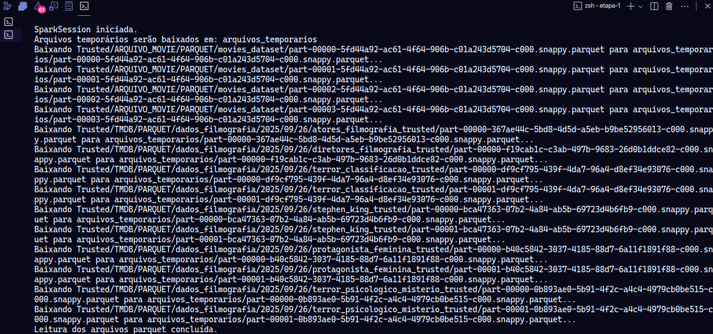

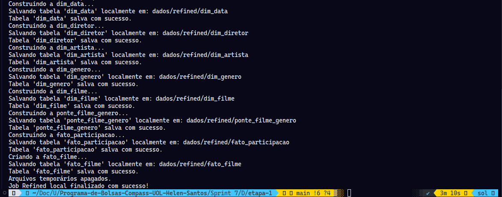

Resultados obtidos:

`dim_artista`:

[Tabela Salva - dim_artista](../Desafio/etapa-1/dados/refined/dim_artista/)

`dim_data`:

[Tabela Salva - dim_data](../Desafio/etapa-1/dados/refined/dim_data/)

`dim_diretor`:

[Tabela Salva - dim_diretor](../Desafio/etapa-1/dados/refined/dim_diretor/)

`dim_filme`:

[Tabela Salva - dim_filme](../Desafio/etapa-1/dados/refined/dim_filme/)

`dim_genero`:

[Tabela Salva - dim_genero](../Desafio/etapa-1/dados/refined/dim_genero/)

`fato_filme`:

[Tabela Salva - fato_filme](../Desafio/etapa-1/dados/refined/fato_filme/)

`fato_participacao`:

[Tabela Salva - fato_participacao](../Desafio/etapa-1/dados/refined/fato_participacao/)

`ponte_filme_genero`:

[Tabela Salva - ponte_filme_genero](../Desafio/etapa-1/dados/refined/ponte_filme_genero/)

2. ... [Etapa II](./etapa-2/job_camada_refined.py)

## Script `job_camada_refined`

O script **`job_camada_refined.py`** foi projetado para ser executado como um job automatizado no **AWS Glue**. Nomeado como `job_camada_refined`, sua principal responsabilidade é construir a **Camada Refinada (Refined Zone)** do Data Lake.

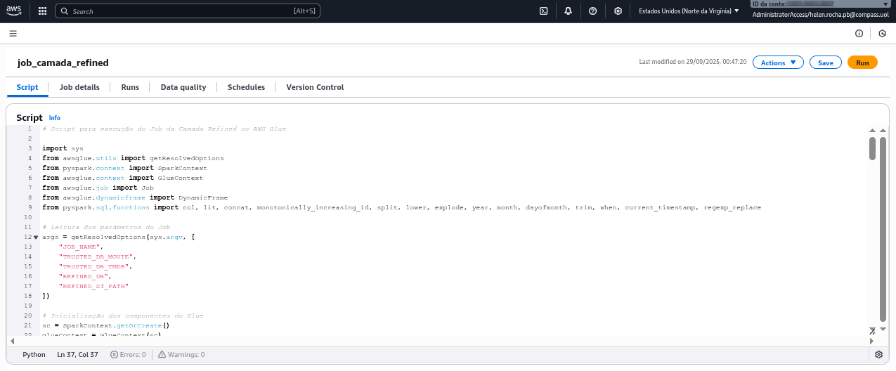

Ele executa a etapa final e mais complexa da transformação de dados, a partir das informações já limpas da Camada Confiável (Trusted) e reestruturando-as em um modelo de dados dimensional, otimizado para análises e visualizações.

O processo executado pelo job pode ser dividido em três grandes etapas:

1.  **Leitura do Catálogo de Dado:** O job não acessa os arquivos S3 diretamente. Em vez disso, ele se conecta ao **AWS Glue Data Catalog** para ler os metadados das tabelas da camada Trusted. Ele utiliza os bancos de dados `movie_db` (para os dados do dataset principal) e `tmdb_db` (para os dados enriquecidos do TMDB) como sua fonte de dados.

    - **`movie_db`**: 

        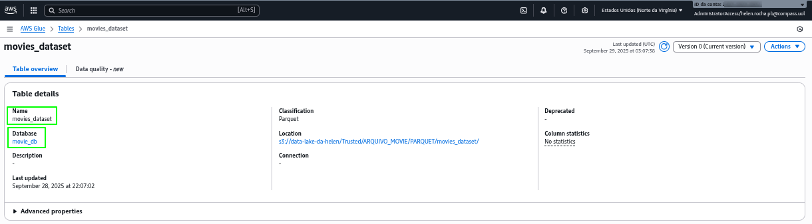

        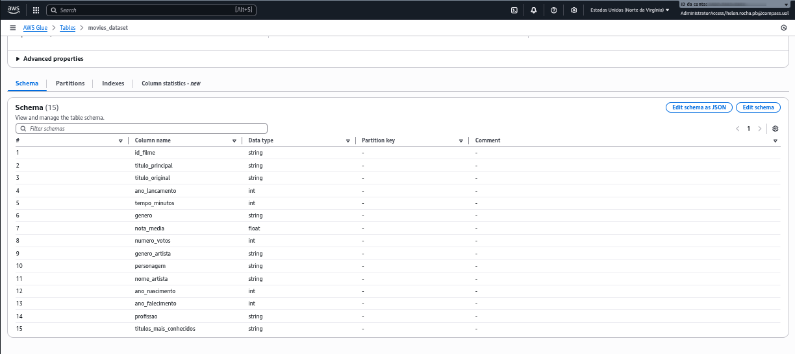

    - **`tmdb_db`**:
        
        Tabela atores - Dados da Camada Trusted:

        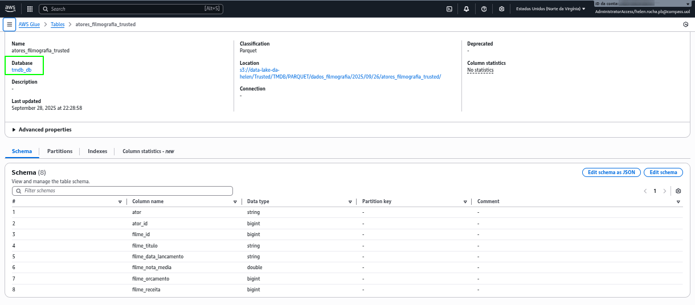

        Tabela Diretores - Dados da Camada Trusted:

        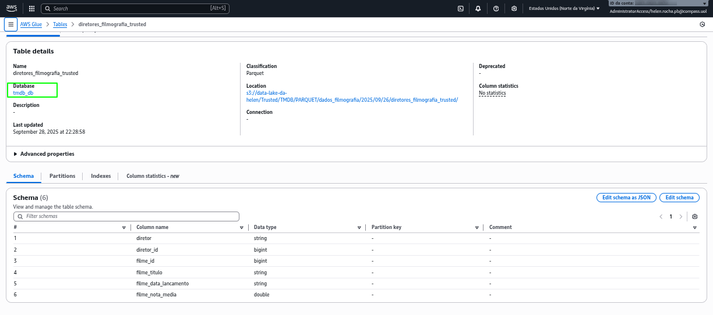

        Tabela Protagonista - Dados da Camada Trusted:

        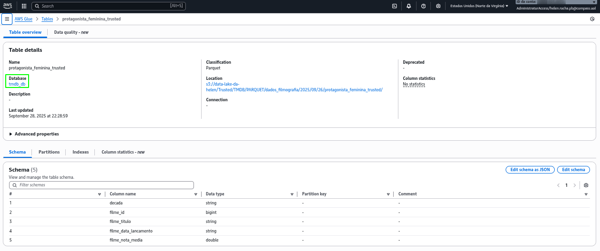

        Tabela Stephen King - Dados da Camada Trusted:

        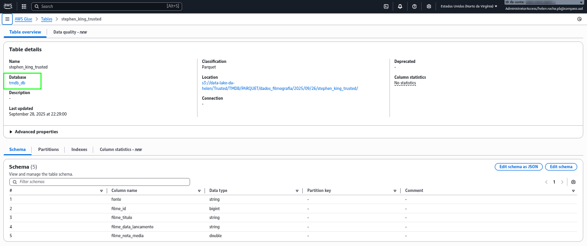

        Tabela Terror Classificação - Dados da Camada Trusted:

        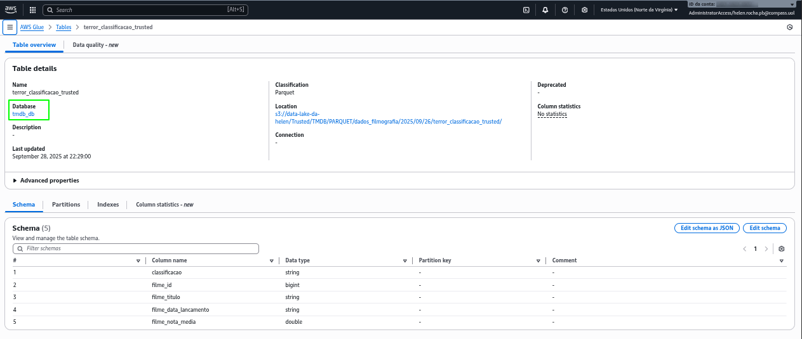

        Tabela Terror Psicológico e Mistério - Dados da Camada Trusted:

        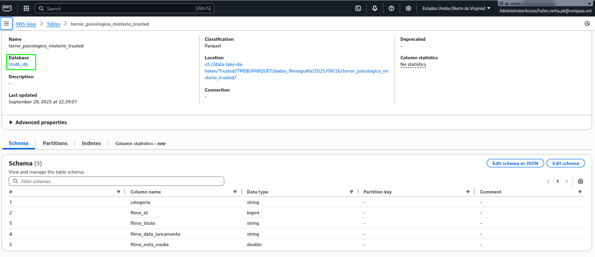

    
2.  **Transformação e Modelagem:** Utilizando o poder do Apache Spark, o script aplica toda a lógica de negócio que desenvolvida. Isso inclui:
    
    - **Normalização de Dados:** Padronização de IDs, datas e, crucialmente, dos títulos dos filmes para permitir a junção de fontes de dados inconsistentes.
        
    - **Criação do Modelo Dimensional:** Constrói as tabelas de Dimensão (`dim_filme`, `dim_artista`, `dim_data`, etc.) e as tabelas Fato (`fato_filme`, `fato_participacao`), implementando o modelo **Fact Constellation Schema**.
        
3.  **Carga e Catalogação:** Após as transformações, o job salva cada uma das novas tabelas em formato colunar **Parquet** em seus respectivos diretórios dentro do caminho S3 da Camada Refinada (`s3://data-lake-da-helen/Refined/`). Simultaneamente, ele registra os metadados dessas novas tabelas no banco de dados `refined_db` do Glue Data Catalog, tornando-as imediatamente disponíveis para consulta por outras ferramentas da AWS.

### Configuração e Execução

Para garantir a flexibilidade e o reuso, o job é configurado através de parâmetros que são passados no momento da sua execução. Isso permite que o mesmo script rode em diferentes ambientes (desenvolvimento, produção) sem nenhuma alteração no código.

Os parâmetros utilizados são:

- `--TRUSTED_DB_MOVIE`: Informa o nome do banco de dados no Glue Data Catalog que contém a tabela de filmes da camada Trusted.
    
    - **Valor utilizado:** `movie_db`
- `--TRUSTED_DB_TMDB`: Informa o nome do banco de dados que contém as tabelas enriquecidas do TMDB na camada Trusted.
    
    - **Valor utilizado:** `tmdb_db`
- `--REFINED_DB`: Define o nome do banco de dados no Glue Data Catalog onde as novas tabelas da camada Refinada serão catalogadas.
    
    - **Valor utilizado:** `refined_db`
- `--REFINED_S3_PATH`: Especifica o caminho no Amazon S3 que servirá como destino para os arquivos Parquet da camada Refinada.
    
    - **Valor utilizado:** `s3://data-lake-da-helen/Refined/PARQUET/`

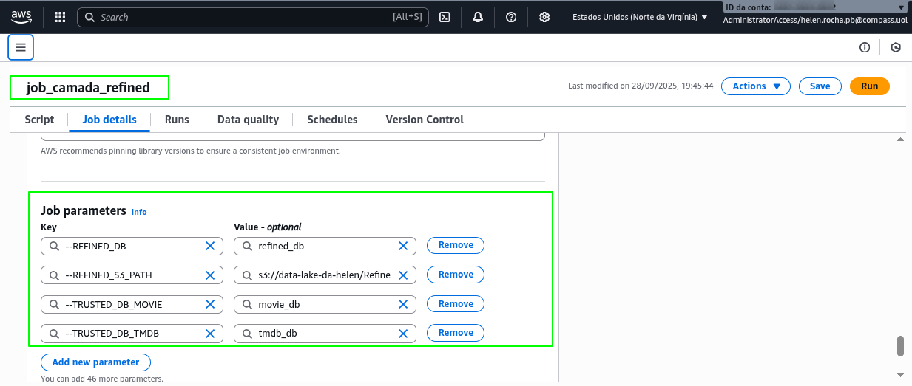

Para garantir uma execução controlada, eficiente e com custos otimizados, o job `job_camada_refined` foi configurado com os seguintes parâmetros, seguindo as diretrizes do desafio:

- **Worker Type**: `G.1X`

    Foi escolhida a opção **`G.1X`** por ser a de menor configuração disponível. Para o volume de dados deste desafio, não é necessário alocar máquinas mais potentes e caras. Essa escolha garante que o processamento seja realizado com o **menor custo possível**, seguindo as boas práticas de otimização de recursos na nuvem.
    
- **Requested Number of Workers**: `2`

    Foi definido o valor **2**, que é o **número mínimo** permitido pelo AWS Glue. Assim como a escolha do "Worker Type", essa configuração visa a economia de custos. Para a carga de trabalho, dois workers são suficientes para completar a tarefa em um tempo razoável sem a necessidade de escalar horizontalmente, o que aumentaria os custos.
    

- **Job Timeout**: `60`
   
    Foi definido um timeout de **60 minutos** como uma salvaguarda para evitar custos inesperados. Se, por algum motivo (como um erro de código que cause um loop infinito ou um problema de performance), o job demorar mais do que o esperado, ele será finalizado após uma hora. Isso previne que um job com falha continue consumindo recursos (e gerando custos) indefinidamente. É uma prática essencial para o controle de gastos em ambientes de nuvem.

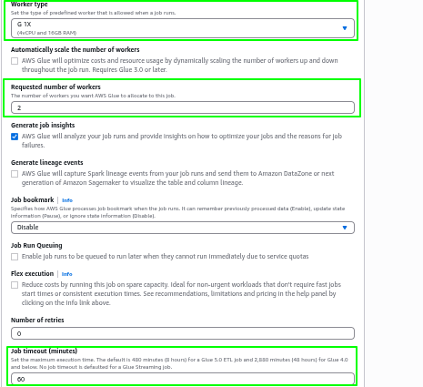

### Inicialização e Parâmetros do Job

Este bloco inicial é o ponto de partida padrão para qualquer job no AWS Glue. Ele começa importando todas as bibliotecas e funções necessárias, tanto do AWS Glue (`awsglue`) quanto do PySpark (`pyspark`). Em seguida, ele utiliza a função `getResolvedOptions` para ler os parâmetros que são passados para o job no momento da execução (como nomes de bancos de dados e caminhos do S3). Finalmente, ele inicializa todos os componentes essenciais: a `SparkContext`, a `GlueContext` (que integra o Spark com os serviços da AWS) e o próprio `Job`, deixando o ambiente pronto para o processamento.

```
import sys
from awsglue.utils import getResolvedOptions
from pyspark.context import SparkContext
from awsglue.context import GlueContext
from awsglue.job import Job
from awsglue.dynamicframe import DynamicFrame
from pyspark.sql.functions import col, lit, concat, monotonically_increasing_id, split, lower, explode, year, month, dayofmonth, trim, when, current_timestamp, regexp_replace

args = getResolvedOptions(sys.argv, [
    "JOB_NAME",
    "TRUSTED_DB_MOVIE",
    "TRUSTED_DB_TMDB",
    "REFINED_DB",
    "REFINED_S3_PATH"
])

sc = SparkContext.getOrCreate()
glueContext = GlueContext(sc)
spark = glueContext.spark_session
job = Job(glueContext)
job.init(args["JOB_NAME"], args)
logger = glueContext.get_logger()
```

### Atribuição de Variáveis e Função de Persistência

Este bloco organiza a configuração do job. Primeiro, ele atribui os parâmetros lidos a variáveis com nomes mais claros, facilitando a leitura do restante do código. Em seguida, define a função `salvar_refined`, uma peça central e reutilizável do ETL. Esta função é responsável por salvar qualquer DataFrame na camada Refinada. Ela implementa uma excelente prática de engenharia de dados ao adicionar automaticamente colunas de auditoria (`data_criacao` e `data_atualizacao`) a cada tabela. Além de salvar os dados em formato Parquet no S3, ela também atualiza o AWS Glue Data Catalog, garantindo que as novas tabelas fiquem imediatamente disponíveis para consulta.

```
TRUSTED_DB_MOVIE = args['TRUSTED_DB_MOVIE']
TRUSTED_DB_TMDB = args['TRUSTED_DB_TMDB']
REFINED_DB = args['REFINED_DB']
REFINED_S3_PATH = args['REFINED_S3_PATH']

timestamp_execucao = current_timestamp()

def salvar_refined(df, nome_tabela):
    df_com_auditoria = df.withColumn("data_criacao", timestamp_execucao) \
                         .withColumn("data_atualizacao", timestamp_execucao)

    caminho_s3 = f"{REFINED_S3_PATH}{nome_tabela}/"
    logger.info(f"Salvando tabela '{nome_tabela}' em: {caminho_s3}")

    dynamic_frame_write = DynamicFrame.fromDF(df_com_auditoria, glueContext, f"df_{nome_tabela}")

    glueContext.write_dynamic_frame.from_options(
        frame=dynamic_frame_write,
        connection_type="s3",
        connection_options={"path": caminho_s3, "database": REFINED_DB, "partitionKeys": []},
        format="parquet",
        transformation_ctx=f"write_{nome_tabela}"
    )
    logger.info(f"Tabela '{nome_tabela}' salva e catalogada com sucesso.")
```

### Leitura de Dados da Camada Trusted

Esta seção é responsável pela ingestão de dados. Em vez de ler arquivos diretamente do S3, o script utiliza o comando `glueContext.create_dynamic_frame.from_catalog`. Isso significa que ele consulta o Glue Data Catalog, usando os nomes dos bancos de dados passados por parâmetro (`TRUSTED_DB_MOVIE` e `TRUSTED_DB_TMDB`), para encontrar e ler todas as tabelas da camada Trusted. Os dados são então convertidos de `DynamicFrame` (um formato do Glue) para `DataFrame` (o formato padrão do Spark), preparando-os para as transformações complexas que virão a seguir.

```
logger.info("Iniciando leitura das tabelas da camada Trusted via Data Catalog...")
df_movies_trusted = glueContext.create_dynamic_frame.from_catalog(database=TRUSTED_DB_MOVIE, table_name="movies_dataset").toDF()
df_atores_trusted = glueContext.create_dynamic_frame.from_catalog(database=TRUSTED_DB_TMDB, table_name="atores_filmografia_trusted").toDF()
df_diretores_trusted = glueContext.create_dynamic_frame.from_catalog(database=TRUSTED_DB_TMDB, table_name="diretores_filmografia_trusted").toDF()
df_classificacao_trusted = glueContext.create_dynamic_frame.from_catalog(database=TRUSTED_DB_TMDB, table_name="terror_classificacao_trusted").toDF()
df_sk_trusted = glueContext.create_dynamic_frame.from_catalog(database=TRUSTED_DB_TMDB, table_name="stephen_king_trusted").toDF()
df_protagonista_trusted = glueContext.create_dynamic_frame.from_catalog(database=TRUSTED_DB_TMDB, table_name="protagonista_feminina_trusted").toDF()
df_terror_psicologico_trusted = glueContext.create_dynamic_frame.from_catalog(database=TRUSTED_DB_TMDB, table_name="terror_psicologico_misterio_trusted").toDF()
logger.info("Leitura da camada Trusted concluída.")
```

### Pré-processamento e Normalização

Este é um dos blocos mais críticos, pois prepara os dados para as junções. Ele realiza duas tarefas principais: primeiro, padroniza os IDs dos filmes em todas as tabelas para que sejam do tipo inteiro, removendo o prefixo "tt" quando necessário. Segundo, ele implementa a solução para o maior desafio: a criação da coluna `titulo_normalizado`. Ao converter os títulos para minúsculas e remover todos os caracteres não alfanuméricos, ele cria uma chave de junção confiável que nos permitirá combinar os dados das diferentes fontes, mesmo que os títulos ou IDs originais não sejam consistentes. Ele também adiciona um filtro para remover datas nulas ou vazias, evitando erros de conversão.

```
logger.info("Iniciando pré-processamento e normalização dos dados...")
df_movies_trusted = df_movies_trusted.withColumn("id_filme", regexp_replace(col("id_filme"), "^tt", "").cast("int"))
df_atores_trusted = df_atores_trusted.withColumn("id_filme", col("filme_id").cast("int"))
df_diretores_trusted = df_diretores_trusted.withColumn("id_filme", col("filme_id").cast("int"))
df_protagonista_trusted = df_protagonista_trusted.withColumn("id_filme", col("filme_id").cast("int"))

df_movies_trusted = df_movies_trusted.withColumn("titulo_normalizado", regexp_replace(lower(col("titulo_principal")), "[^a-z0-9]", ""))
df_classificacao_trusted = df_classificacao_trusted.filter(col("filme_data_lancamento").isNotNull() & (col("filme_data_lancamento") != "")).withColumn("titulo_normalizado", regexp_replace(lower(col("filme_titulo")), "[^a-z0-9]", "")).withColumn("ano_lancamento", year(col("filme_data_lancamento")))
df_sk_trusted = df_sk_trusted.filter(col("filme_data_lancamento").isNotNull() & (col("filme_data_lancamento") != "")).withColumn("titulo_normalizado", regexp_replace(lower(col("filme_titulo")), "[^a-z0-9]", "")).withColumn("ano_lancamento", year(col("filme_data_lancamento"))).filter(col("fonte") == "stephen_king")
df_terror_psicologico_trusted = df_terror_psicologico_trusted.filter(col("filme_data_lancamento").isNotNull() & (col("filme_data_lancamento") != "")).withColumn("titulo_normalizado", regexp_replace(lower(col("filme_titulo")), "[^a-z0-9]", "")).withColumn("ano_lancamento", year(col("filme_data_lancamento")))
logger.info("Pré-processamento concluído.")
```

### Construção das Dimensões (`dim_data`, `dim_diretor`, `dim_artista`, `dim_genero`)

Esta seção constrói as tabelas de dimensão, que fornecem o contexto descritivo para as análises. Cada bloco tem uma responsabilidade específica: `dim_data` cria uma tabela de calendário rica em atributos temporais; `dim_diretor` e `dim_genero` criam listas únicas de diretores e gêneros; e `dim_artista` combina informações de duas fontes para criar uma visão unificada dos artistas. Todas as dimensões seguem a melhor prática de modelagem ao criar uma chave substituta (`sk_...`), que é um ID numérico único para otimizar as futuras consultas.

```
logger.info("Construindo a dim_data...")
meses_data = [(1, "Janeiro"), (2, "Fevereiro"), (3, "Março"), (4, "Abril"), (5, "Maio"), (6, "Junho"), (7, "Julho"), (8, "Agosto"), (9, "Setembro"), (10, "Outubro"), (11, "Novembro"), (12, "Dezembro")]
df_meses_lookup = spark.createDataFrame(meses_data, ["mes_numero", "mes_nome"])
df_datas = df_atores_trusted.select(col("filme_data_lancamento").alias("data_completa")).distinct().dropna()
dim_data_base = df_datas.withColumn("ano", year(col("data_completa"))).withColumn("mes_numero", month(col("data_completa"))).withColumn("dia", dayofmonth(col("data_completa")))
dim_data_enriquecida = dim_data_base.join(df_meses_lookup, on="mes_numero", how="left").withColumn("trimestre", when(col("mes_numero").isin([1, 2, 3]), lit("T1")).when(col("mes_numero").isin([4, 5, 6]), lit("T2")).when(col("mes_numero").isin([7, 8, 9]), lit("T3")).otherwise(lit("T4"))).withColumn("decada", concat(((col("ano") / 10).cast("integer") * 10).cast("string"), lit("s")))
dim_data = dim_data_enriquecida.withColumn("sk_data", col("ano") * 10000 + col("mes_numero") * 100 + col("dia")).select("sk_data", "data_completa", "ano", "mes_numero", "mes_nome", "dia", "trimestre", "decada").distinct()
salvar_refined(dim_data, "dim_data")

logger.info("Construindo a dim_diretor...")
dim_diretor = df_diretores_trusted.select(col("diretor_id").alias("id_diretor"), col("diretor").alias("nome_diretor")).distinct().withColumn("sk_diretor", monotonically_increasing_id())
salvar_refined(dim_diretor, "dim_diretor")

logger.info("Construindo a dim_artista...")
artistas_csv = df_movies_trusted.select("nome_artista", "genero_artista", "ano_nascimento", "ano_falecimento", regexp_replace(col("titulos_mais_conhecidos"), "tt", "").alias("titulos_mais_conhecidos")).distinct()
atores_json = df_atores_trusted.select(col("ator_id").alias("id_artista"), col("ator").alias("nome_artista")).distinct()
dim_artista = atores_json.join(artistas_csv, on="nome_artista", how="left").withColumn("sk_artista", monotonically_increasing_id())
salvar_refined(dim_artista, "dim_artista")

logger.info("Construindo a dim_genero...")
dim_genero = df_movies_trusted.select(explode(split(col("genero"), ",")).alias("nome_genero")).select(trim(col("nome_genero")).alias("nome_genero")).distinct().dropna()
dim_genero = dim_genero.withColumn("sk_genero", monotonically_increasing_id())
salvar_refined(dim_genero, "dim_genero")
```

### Construção da `dim_filme`

Este é o bloco central da modelagem. Ele constrói a `dim_filme`, que servirá como a principal dimensão para conectar as tabelas fato. O processo começa com a base de filmes do `df_movies_trusted` e, em seguida, realiza uma série de `LEFT JOINs` para enriquecer cada filme com informações adicionais: a classificação indicativa, a flag de Stephen King e a categoria de terror. A chave para o sucesso desses `JOINs` é a chave composta `titulo_normalizado` + `ano_lancamento`, que foi preparado no bloco de normalização. Ao final, as colunas de trabalho são removidas para entregar uma dimensão final limpa e pronta para o consumo.

```
logger.info("Construindo a dim_filme...")
dim_filme_base = df_movies_trusted.select("id_filme", "titulo_principal", "titulo_original", "ano_lancamento", "tempo_minutos", "titulo_normalizado").distinct()
dim_filme_temp = dim_filme_base.join(df_classificacao_trusted.select("titulo_normalizado", "ano_lancamento", col("classificacao").alias("classificacao_indicativa")), on=["titulo_normalizado", "ano_lancamento"], how="left")
dim_filme_temp = dim_filme_temp.join(df_sk_trusted.select("titulo_normalizado", "ano_lancamento").withColumn("flag_sk", lit(True)), on=["titulo_normalizado", "ano_lancamento"], how="left")
dim_filme_temp = dim_filme_temp.join(df_terror_psicologico_trusted.select("titulo_normalizado", "ano_lancamento", col("categoria").alias("categoria_terror")), on=["titulo_normalizado", "ano_lancamento"], how="left")
dim_filme = dim_filme_temp.withColumn("baseado_em_stephen_king", when(col("flag_sk").isNotNull(), True).otherwise(False)).drop("flag_sk", "titulo_normalizado").withColumn("sk_filme", monotonically_increasing_id())
salvar_refined(dim_filme, "dim_filme")
```

### Construção das Tabelas Fato e Ponte

Este bloco final da transformação constrói as tabelas que contêm as métricas e os eventos do modelo, formando o núcleo do Fact Constellation Schema. A `ponte_filme_genero` resolve a relação muitos-para-muitos entre filmes e gêneros. A `fato_participacao` registra cada evento de um artista participando de um filme, e a `fato_filme` é a tabela principal de fatos, que une as métricas financeiras (orçamento, receita) e de avaliação (nota, votos) às chaves substitutas das dimensões correspondentes.

```
logger.info("Construindo a ponte_filme_genero...")
df_generos_exploded = df_movies_trusted.select("id_filme", explode(split(col("genero"), ",")).alias("nome_genero")).select("id_filme", trim(col("nome_genero")).alias("nome_genero"))
ponte_temp1 = df_generos_exploded.join(dim_filme, on="id_filme", how="inner")
ponte_temp2 = ponte_temp1.join(dim_genero, on="nome_genero", how="inner")
ponte_filme_genero = ponte_temp2.select("sk_filme", "sk_genero")
salvar_refined(ponte_filme_genero, "ponte_filme_genero")

logger.info("Construindo a fato_participacao...")
df_filmes_protagonistas_fem = df_protagonista_trusted.select(col("id_filme").alias("id_filme_protagonista")).distinct()
part_temp1 = df_movies_trusted.select("id_filme", "nome_artista", "personagem", "genero_artista").dropna(subset=["nome_artista"])
part_temp2 = part_temp1.join(df_filmes_protagonistas_fem, part_temp1.id_filme == df_filmes_protagonistas_fem.id_filme_protagonista, how="left")
part_temp3 = part_temp2.withColumn("is_protagonista", (col("personagem").isNotNull()) | (col("id_filme_protagonista").isNotNull() & (col("genero_artista") == 'Feminino')))
part_temp4 = part_temp3.join(dim_filme, on="id_filme", how="inner")
part_temp5 = part_temp4.join(dim_artista, on="nome_artista", how="inner")
fato_participacao = part_temp5.select("sk_filme", "sk_artista", "personagem", "is_protagonista", col("genero_artista").alias("genero_artista_participacao"))
salvar_refined(fato_participacao, "fato_participacao")

logger.info("Construindo a fato_filme...")
metricas_atores = df_atores_trusted.groupBy("id_filme").agg({"filme_orcamento": "first", "filme_receita": "first"}).withColumnRenamed("first(filme_orcamento)", "orcamento").withColumnRenamed("first(filme_receita)", "receita")
fato_filme = df_movies_trusted.select("id_filme", "nota_media", "numero_votos") \
    .join(metricas_atores, on="id_filme", how="left") \
    .join(df_diretores_trusted.select("id_filme", "diretor", "filme_data_lancamento"), on="id_filme", how="left") \
    .join(dim_filme.select("id_filme", "sk_filme"), on="id_filme", how="inner") \
    .join(dim_diretor.select("nome_diretor", "sk_diretor"), col("diretor") == col("nome_diretor"), how="left") \
    .join(dim_data.select("data_completa", "sk_data"), col("filme_data_lancamento") == col("data_completa"), how="left") \
    .withColumn("lucro", col("receita") - col("orcamento")) \
    .select("sk_filme", "sk_diretor", col("sk_data").alias("sk_data_lancamento"), "nota_media", "numero_votos", "orcamento", "receita", "lucro")
salvar_refined(fato_filme, "fato_filme")
```

### Finalização do Job

Este bloco finaliza a execução do job. O comando `job.commit()` sinaliza ao AWS Glue que o job foi concluído com sucesso, permitindo o monitoramento e o registro do seu status. A mensagem de log final serve para confirmar que todo o processo, desde a leitura até a gravação, foi finalizado.

```
job.commit()
logger.info("Job da camada Refined finalizado com sucesso!")
```

A partir desses processos pude obter o seguintes resultados: 

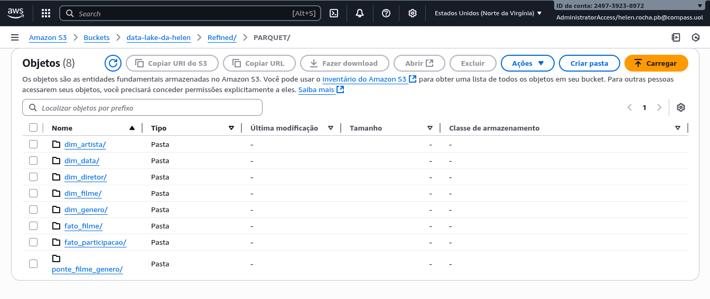

### Banco de dados `refined_db`:

O `refined_db` é o banco de dados final do pipeline, criado no AWS Glue Data Catalog. Ele não armazena os dados fisicamente, mas atua como um catálogo de metadados, uma espécie de "vitrine" para as tabelas prontas para análise.

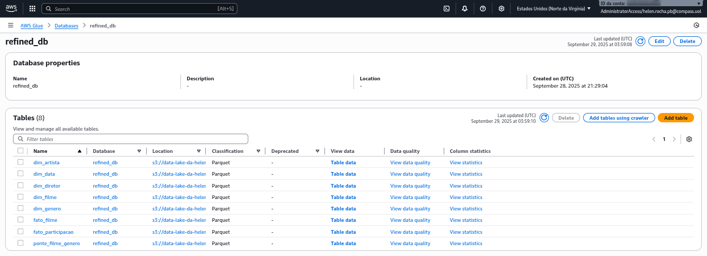

Para que esses tabelas consultáveis se tornassem acessíveis, o **AWS Glue Crawler** foi configurado e executado. A função deste Crawler foi escanear o diretório de saída da camada Refinada no S3 e inferir o esquema de cada subdiretório.

O resultado, como pode ser visto abaixo, é a criação e catalogação bem-sucedida de todas as tabelas do nosso modelo de dados dentro do banco de dados `refined_db`, deixando-as prontas para serem consultadas por outras ferramentas da AWS, como o Amazon Athena e o Amazon QuickSight.

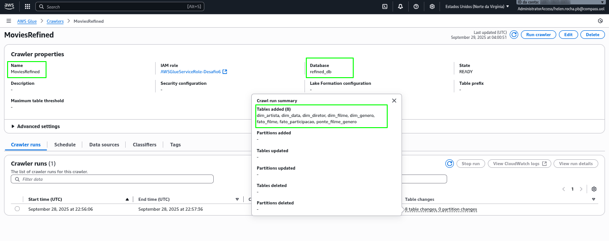

- **Tabelas Criadas**: 

    - `dim_artista`:

        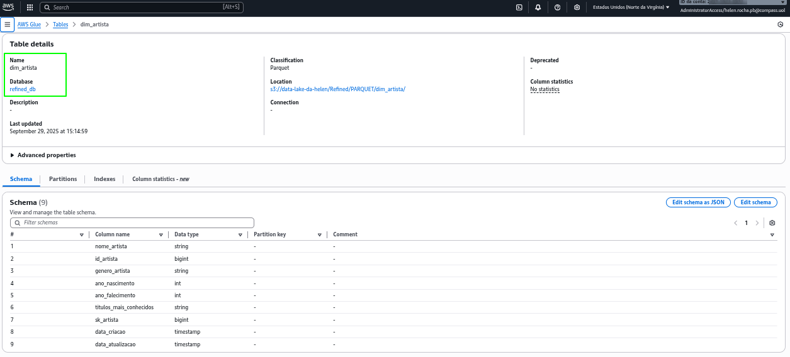

        Por meio desta consulta no Athena:

        ```
        SELECT * FROM "AwsDataCatalog"."refined_db"."dim_artista" limit 10;
        ```

        Obtive o seguinte resultado:

        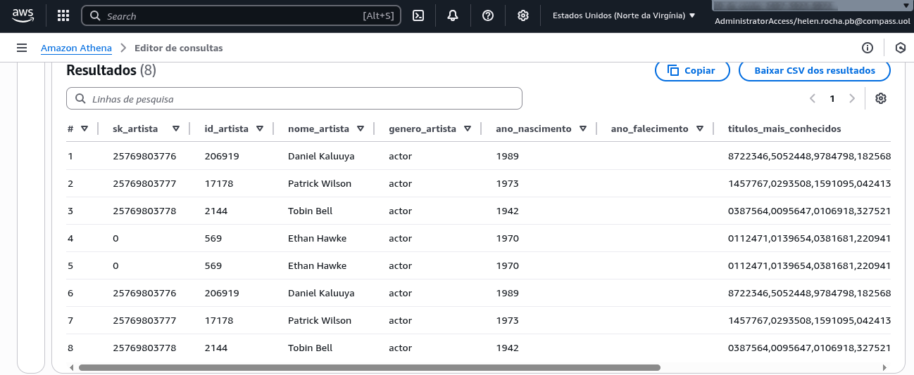

    - `dim_data`:

        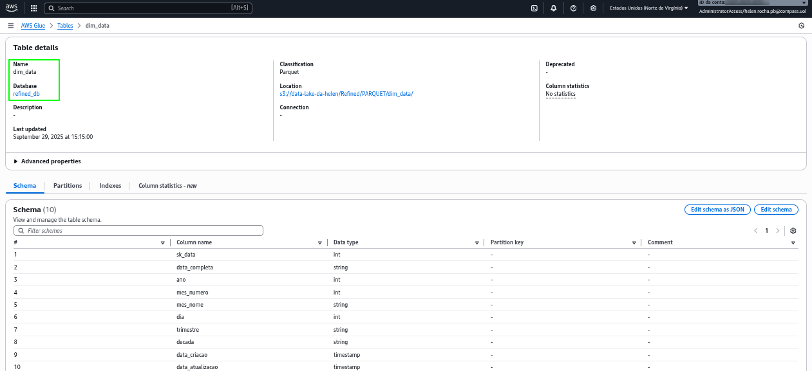

        Por meio desta consulta no Athena:

        ```
        SELECT * FROM "AwsDataCatalog"."refined_db"."dim_data" limit 10;       
        ```

        Obtive o seguinte resultado:

        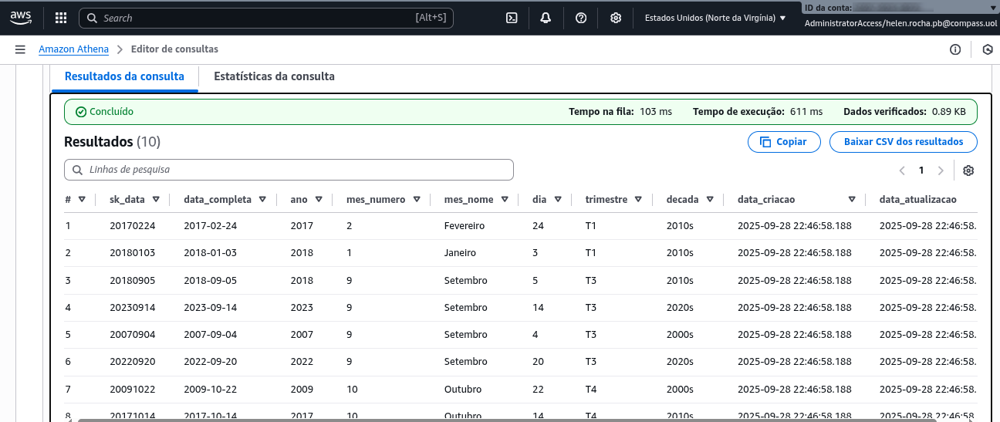
    
    - `dim_diretor`:

      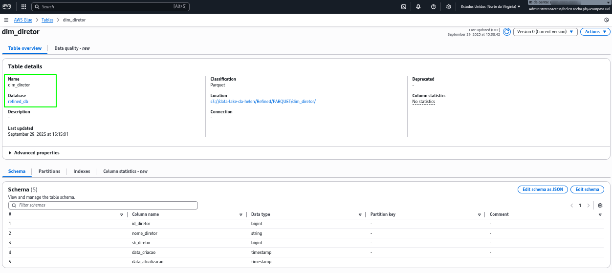

        Por meio desta consulta no Athena:

        ```
        SELECT * FROM "AwsDataCatalog"."refined_db"."dim_diretor" limit 10;
        ```

        Obtive o seguinte resultado:

        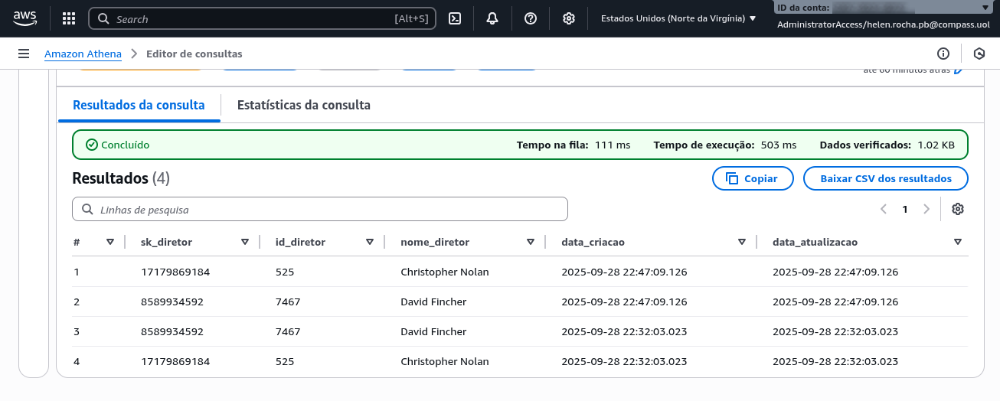
    
    - `dim_filme`:

      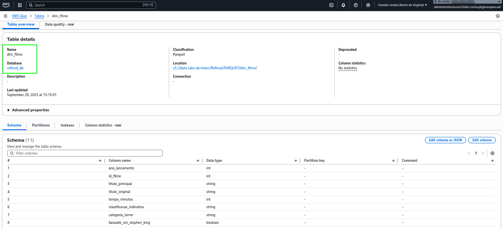

        Por meio desta consulta no Athena:

        ```
        SELECT * FROM "AwsDataCatalog"."refined_db"."dim_filme" limit 10;
        ```

        Obtive o seguinte resultado:

        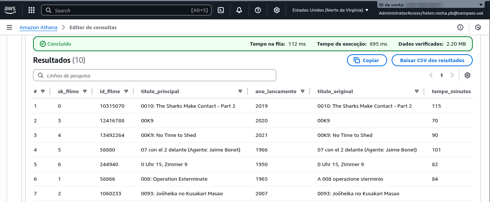

    - `dim_genero`:

      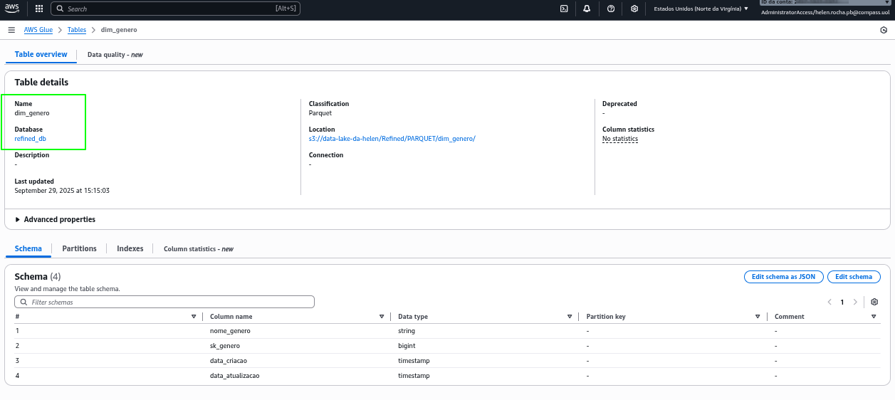
        
        Por meio desta consulta no Athena:

        ```
        SELECT * FROM "AwsDataCatalog"."refined_db"."dim_genero" limit 10;
        ```

        Obtive o seguinte resultado:

        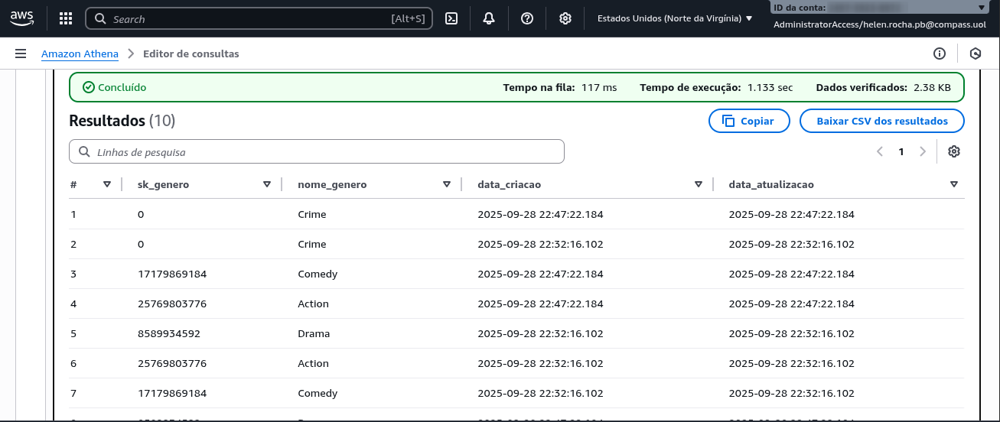

    
    - `ponte_filme_genero`:

      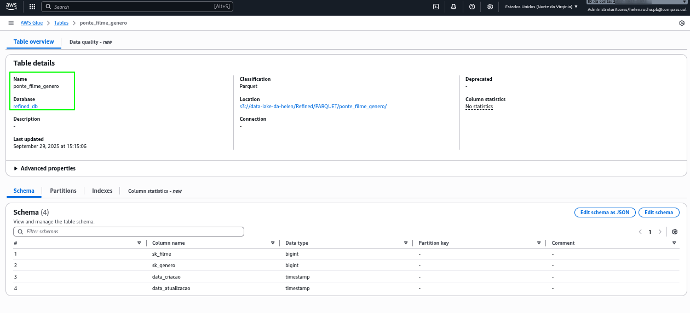

       Por meio desta consulta no Athena:

        ```
        SELECT * FROM "AwsDataCatalog"."refined_db"."ponte_filme_genero" limit 10;
        ```

        Obtive o seguinte resultado:

        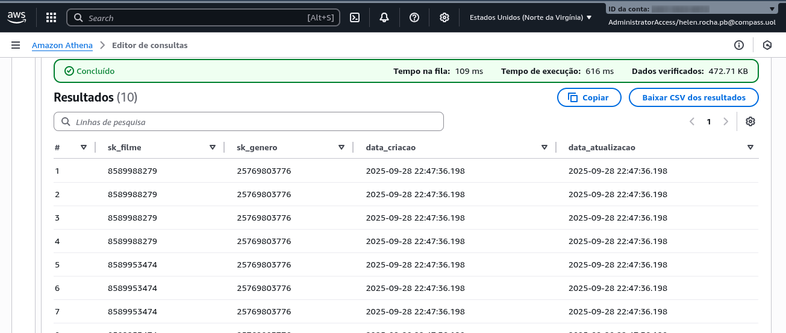

    
    - `fato_filme`:

      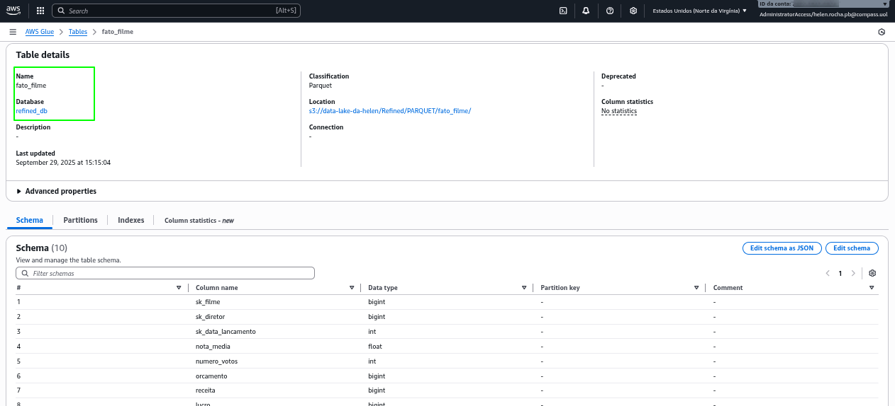

        Por meio desta consulta no Athena:

        ```
        SELECT * FROM "AwsDataCatalog"."refined_db"."fato_filme" limit 10;
        ```

        Obtive o seguinte resultado:

        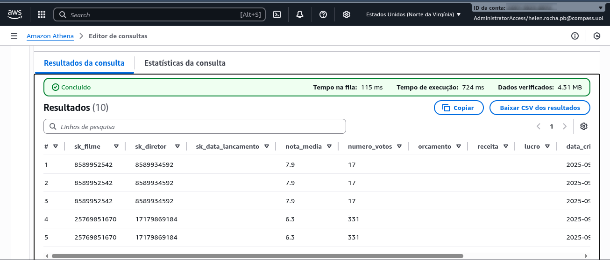

    - `fato_participacao`:

      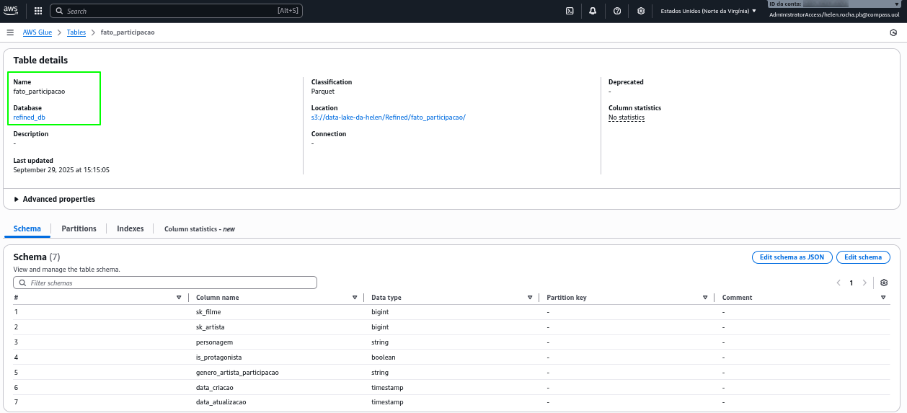

        Por meio desta consulta no Athena:

        ```
        SELECT * FROM "AwsDataCatalog"."refined_db"."fato_participacao" limit 10;;
        ```

        Obtive o seguinte resultado:

        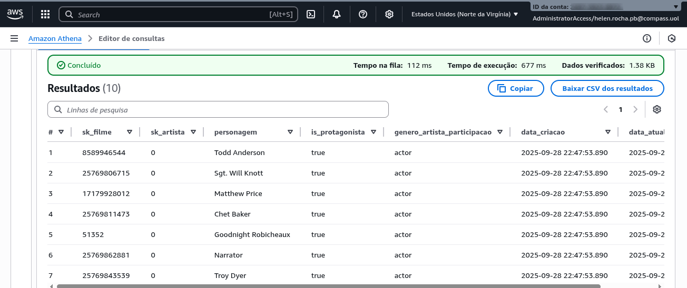


