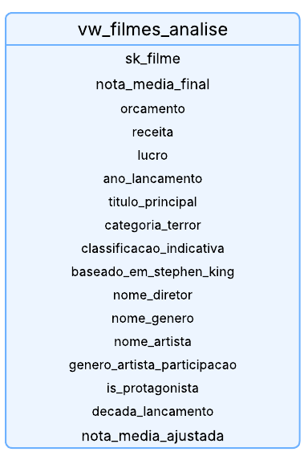
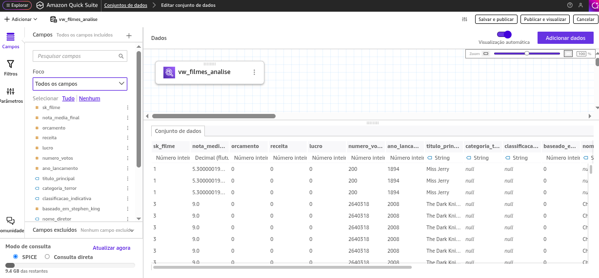
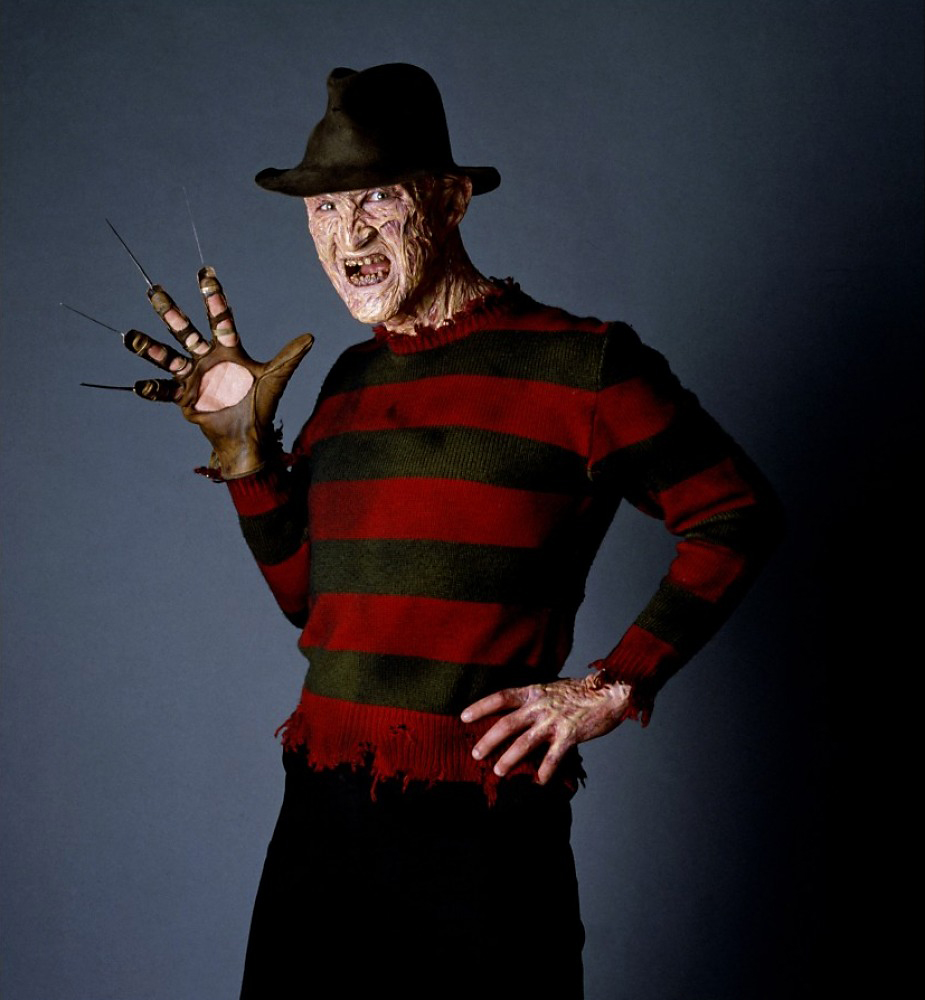
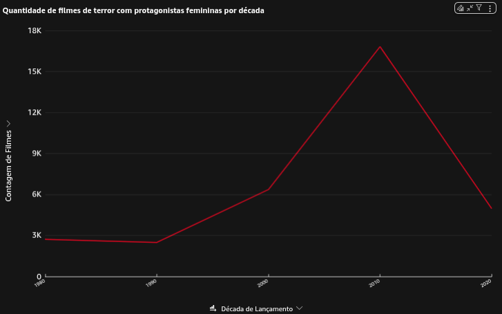
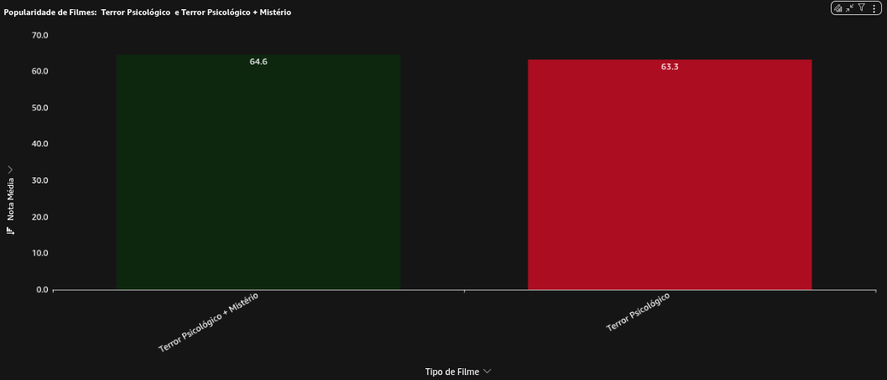
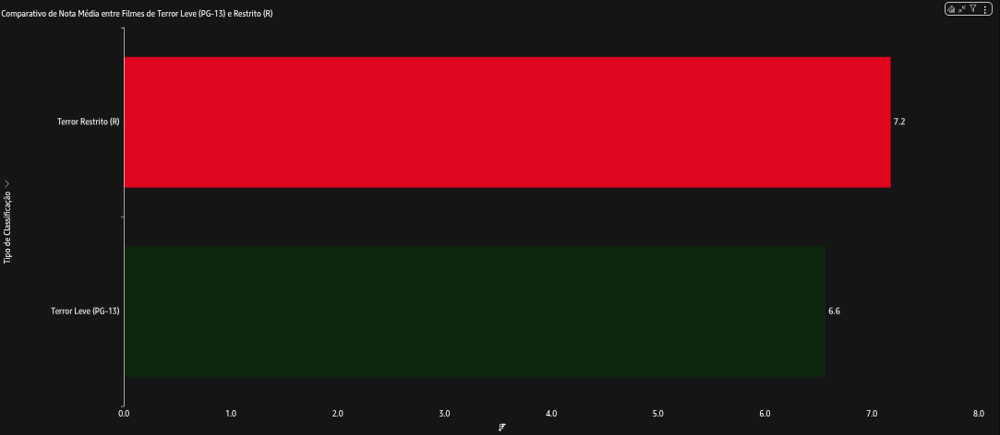
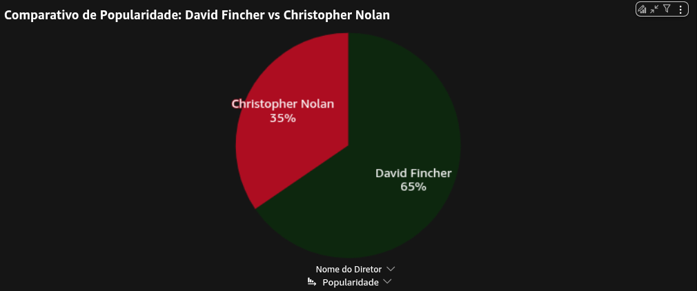
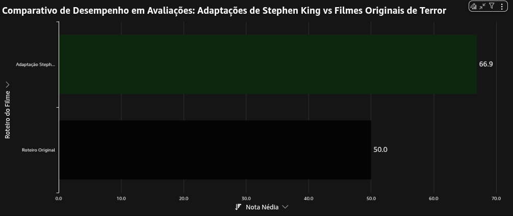
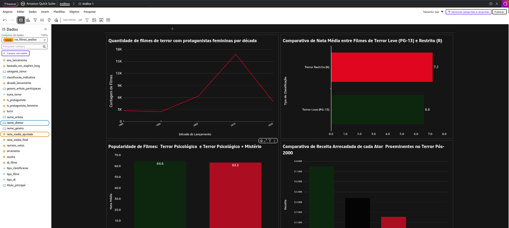
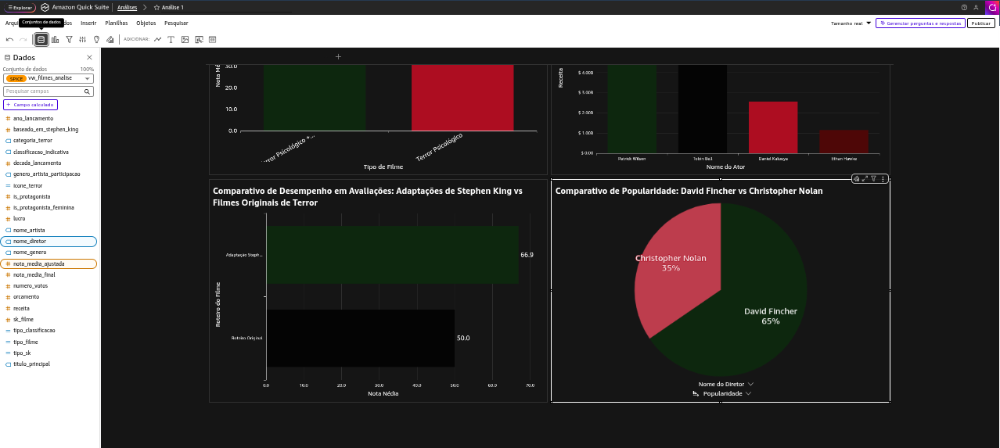

# Consumo de Dados: QuickSight

Enfim, à etapa final e mais gratificante do desafio, focada no consumo dos dados. Após todo o trabalho de ingestão, armazenamento e processamento para construir um modelo dimensional robusto na camada Refined, o objetivo desta fase foi transformar esses dados em insights visuais e acionáveis.

A ferramenta utilizada para esta tarefa foi o AWS QuickSight, uma poderosa solução de Business Intelligence nativa da AWS.

## Modificação das Tabelas do Modelo Dimensional

O script desenvolvido para criação do modelo dimensional foi alterado (as alterações serão explicadas no Readme.md do Desafio da Sprint 7). Enquanto o **script original** executava um processo de transformação linear e isolado para cada tabela, esta nova versão adota uma abordagem muito mais sofisticada: ela trata as diversas fontes de dados como peças de um mesmo quebra-cabeça, trabalhando ativamente para unificá-las e construir uma "fonte única da verdade" na camada Refined.

As principais modificações, em comparação com a abordagem anterior, podem ser entendidas através:


Uma mudança importante foi a remoção das colunas de auditoria (`data_criacao` e `data_atualizacao`). Essa decisão reflete um foco pragmático no objetivo central do projeto. Ao remover essa lógica, o script se torna mais enxuto e sua execução é direcionada inteiramente para as complexas transformações de negócio. 

1. ... [Etapa I](./etapa-1/Grafico_Analise.pdf)


## Criação da View: `vw_filmes_analise`

A view `vw_filmes_analise` foi criada no banco `refined_db_atualizado` no AWS Athena com o objetivo de centralizar as principais informações necessárias para as análises de desempenho e tendências em filmes de terror e Mistério.

Ela integra dados de múltiplas dimensões (`dim_filme`, `dim_diretor`, `dim_genero`, `dim_artista`, `dim_data`) e fatos (`fato_filme`, `fato_participacao`, `ponte_filme_genero`), permitindo consultas diretas a partir de uma única fonte.

```

CREATE OR REPLACE VIEW refined_db_atualizado.vw_filmes_analise AS
SELECT 
    f.sk_filme,
    f.nota_media_final,
    f.orcamento,
    f.receita,
    f.lucro,
    f.numero_votos,
    d.ano_lancamento,
    d.titulo_principal,
    d.categoria_terror,
    d.classificacao_indicativa,
    d.baseado_em_stephen_king,
    di.nome_diretor,
    g.nome_genero,
    a.nome_artista,
    fp.genero_artista_participacao,
    fp.is_protagonista
FROM refined_db_atualizado.fato_filme f
JOIN refined_db_atualizado.dim_filme d 
    ON f.sk_filme = d.sk_filme
LEFT JOIN refined_db_atualizado.dim_diretor di 
    ON f.sk_diretor = di.sk_diretor
LEFT JOIN refined_db_atualizado.ponte_filme_genero pg 
    ON d.sk_filme = pg.sk_filme
LEFT JOIN refined_db_atualizado.dim_genero g 
    ON pg.sk_genero = g.sk_genero
LEFT JOIN refined_db_atualizado.fato_participacao fp 
    ON d.sk_filme = fp.sk_filme
LEFT JOIN refined_db_atualizado.dim_artista a 
    ON fp.sk_artista = a.sk_artista;

```

- **`sk_filme`**: identificador único de cada filme na base refinada. É usado como chave principal para unir informações e evitar duplicidades.  
    *Serve de base para todas as análises e agregações.*
    
- **`nota_media_final`**: representa a média das avaliações recebidas pelo filme nas plataformas.  
    *Usada em análises de qualidade e recepção crítica, como comparar notas médias entre décadas ou gêneros.*
    
- **`orcamento`**: valor total investido na produção do filme.  
   *Permite estudos sobre relação entre orçamento e retorno financeiro (análises de lucratividade).*
    
- **`receita`**: total arrecadado em bilheteria mundial.  
    *Usado em análises de sucesso comercial, comparações entre atores, diretores e tipos de terror.*
    
- **`lucro`**: campo calculado que mostra a diferença entre receita e orçamento.  
    *Essencial para entender o retorno financeiro real das produções e identificar os filmes mais rentáveis.*
    
- **`numero_votos`**: quantidade de pessoas que avaliaram o filme.  
    *Ajuda a medir popularidade e engajamento, servindo de complemento à nota média.*
    
- **`ano_lancamento`**: indica o ano em que o filme foi lançado.  
    *Usado em análises temporais, como evolução de tendências ou comparações entre épocas.*
    
- **`titulo_principal`**: nome do filme.  
    *Usado para exibição e identificação nas análises.*
    
- **`categoria_terror`**: subgênero do terror ao qual o filme pertence (ex: “Terror Psicológico").  
    *Permite segmentar filmes de terror psicológico.*
    
- **`classificacao_indicativa`**: faixa etária recomendada (ex: “PG-13”, “R”).  
    *Usada em análises sobre impacto da classificação na popularidade e nas notas médias.*
    
- **`baseado_em_stephen_king`**: indica se o filme foi inspirado em obras de Stephen King.  
    *Permite comparar a recepção e o sucesso de filmes baseados em Stephen King com os que não são.*
    
- **`nome_diretor`**: registra o diretor responsável pela obra.  
   *Usado em análises de autoria, impacto e estilos criativos no terror.*
    
- **`nome_genero`**: identifica os gêneros adicionais do filme como “Mystery”, “Horror”.  
    *Permite cruzar o terror com outros gêneros, por exemplo, “Terror Psicológico + Mistério”.*
    
- **`nome_artista`**: nome dos principais atores do elenco.  
   *Usado em estudos de protagonismo, influência de atores e identificação de ícones do terror moderno.*
    
- **`genero_artista_participacao`**: gênero do actor/actress (masculino/feminino).  
    *Base para análises sobre representatividade e protagonismo feminino.*
    
- **`is_protagonista`**: indica se o artista tem papel principal no filme.  
    *Permite filtrar apenas os protagonistas em análises de destaque e desempenho.*
    
- **`decada_lancamento`**: agrupa os filmes por década.  
    *Facilita comparações históricas, como a evolução da nota média ou bilheteria ao longo do tempo.*
    
- **`nota_media_ajustada`**: campo calculado que ajusta a nota média considerando o número de votos (ponderação de popularidade).  
    *Usada em análises mais refinadas de qualidade, equilibrando filmes muito avaliados e pouco avaliados.*

<p align="center">
  
</p>

    
## Criação do Conjunto de Dados no Amazon QuickSight

Após a criação da *view* `vw_filmes_analise` no Amazon Athena, que consolida informações de múltiplas tabelas do banco de dados **refined_db_atualizado** (como `dim_filme`, `dim_diretor`, `dim_artista`, `dim_genero`, `fato_filme`, `fato_participacao` e `ponte_filme_genero`), foi necessário criar um **conjunto de dados (dataset)** no **Amazon QuickSight** para possibilitar as visualizações analíticas.


*Os seguintes passos foram seguidos:*

- - **Acesso à Área de Conjuntos de Dados:**  
        No painel principal do QuickSight, acessou-se a seção *Conjuntos de dados* (Datasets).
        
    - **Criação do Conjunto de Dados:**  
        Foi selecionada a opção **“Criar conjunto de dados”**, localizada no canto superior direito da interface.
        
    - **Fonte de Dados Selecionada:**  
        A fonte escolhida foi o **Amazon Athena**, já conectado ao banco de dados onde a *view* `vw_filmes_analise` havia sido criada.
        
    - **Escolha da View:**  
        Dentro do banco **refined_db_atualizado**, foi selecionada a *view* `vw_filmes_analise`, que reúne todas as informações necessárias para as análises sobre filmes de terror, protagonistas, diretores, gêneros e classificações.
        
    - **Importação via SPICE:**  
        O dataset foi importado para o mecanismo **SPICE (Super-fast, Parallel, In-memory Calculation Engine)**, garantindo melhor desempenho nas análises e nos gráficos interativos.
        
    - **Validação do Conjunto de Dados:**  
        Após a importação, o conjunto `vw_filmes_analise` passou a aparecer listado entre os datasets disponíveis, indicando que está pronto para ser utilizado na criação de gráficos e dashboards.



Após isso, foi selecionada a opção `Publicar e Visualizar`, e assim as configurações de geração dos gráficos foram realizadas.

# Curiosidade: Design e Identidade Visual - A Paleta de Cores de Freddy Krueger

A escolha da paleta de cores para os dashboards no QuickSight não foi aleatória. Ela foi concebida como um elemento narrativo, uma forma de conectar a identidade visual do projeto diretamente ao conteúdo dos dados analisados: o universo do cinema.

A inspiração para o design veio de um dos ícones mais reconhecíveis do cinema de terror: **Freddy Krueger**, do clássico *A Hora do Pesadelo* (*A Nightmare on Elm Street*). A paleta de cores característica do personagem, extraída de seu icônico suéter listrado, foi a base para a criação dos gráficos.

As cores foram aplicadas da seguinte forma:

- **Vermelho Escuro e Verde Oliva:** Representando as listras do suéter, essas cores são a base principal do dashboard, utilizadas para destacar as principais séries de dados nos gráficos, como linhas, barras e segmentos de pizza.
    
- **Tons de Cinza e Preto:** Utilizados para fundos, textos e elementos secundários, evocando a atmosfera sombria e noturna característica dos filmes de terror e do próprio personagem.
    
- **Bege e Marrom:** Empregados como cores de destaque ou secundárias, fazendo uma alusão sutil ao seu chapéu e à sua luva de lâminas.

<p align="center">
  
</p>

<p align="center">Fonte: Screen Geek</p>

Essa decisão de design serve a múltiplos propósitos:

1.  **Conexão Temática:** O dashboard analisa um vasto catálogo de filmes, com uma atenção especial ao gênero de terror, incluindo análises sobre terror psicológico e obras de Stephen King. A paleta de cores cria uma imersão imediata neste universo, estabelecendo um tom consistente com os dados.
    
2.  **Identidade Memorável:** O uso de um esquema de cores tão distinto confere ao projeto uma identidade visual única e memorável, diferenciando-o de dashboards com paletas de cores genéricas.
    
3.  **Storytelling Visual:** A própria estética do dashboard se torna parte da narrativa sobre os dados de cinema, funcionando como um *easter egg* para os fãs do gênero e demonstrando uma camada adicional de criatividade no projeto.
    

Dessa forma, a experiência do usuário é enriquecida, unindo a precisão da análise de dados a uma homenagem criativa e bem-humorada à cultura cinematográfica.

## Análises 

### 1\. Quantidade de filmes de terror com protagonistas femininas por década

A Evolução da Protagonista Feminina: Comparando a década de 80 com a de 2010, filmes de terror com protagonistas femininas se tornaram mais comuns? 

- O gráfico de linhas foi ideal para mostrar a evolução de uma variável (como a contagem de filmes) ao longo do tempo (décadas). A progressão ficou imediatamente visível. Ele também facilitou a identificação de períodos de crescimento acelerado, estabilidade ou queda no número de filmes com protagonistas femininas. O gráfico "Quantidade de filmes de terror com protagonistas femininas por década" mostrou um crescimento notável e consistente ao longo das décadas, especialmente a partir dos anos 1980.



**Conclusão**: Entre 1980 e 2020, os filmes de terror com protagonistas femininas deixaram de ocupar um espaço limitado, o arquétipo previsível da “final girl” para representar uma parte significativa das produções do gênero. Esse crescimento evidencia uma transformação dupla: a evolução da representação feminina no terror e a ampliação do espaço da indústria para narrativas conduzidas por mulheres. Ainda assim, observa-se uma leve queda na quantidade de títulos a partir da década de 2010, sugerindo que, embora o protagonismo feminino tenha conquistado força, ele ainda enfrenta oscilações dentro do mercado cinematográfico. 

### 2\. Comparativo de Nota Média entre Filmes de Terror Leve (PG-13) e Restrito (R)

O Reinado dos Ícones Masculinos do Terror Moderno: Quem são os atores que definem o terror moderno? Analisando a filmografia de atores proeminentes no gênero pós-anos 2000, qual deles construiu a carreira mais impactante em termos de número de filmes, nota média e sucesso de bilheteria?

*Obs: Os atores icônicos escolhidos para essa análise foram: Patrick Wilson, Ethan Hawke, Tobin Bell e Daniel Kaluuya.*

Foi criado este campo calculado para comparar o desempenho entre filmes de terror psicológico puro e os que combinam terror psicológico com mistério:

- `tipo_filme`:

```
ifelse(
    {categoria_terror} = 'Terror Psicológico' AND {nome_genero} = 'Mystery',
    'Terror Psicológico + Mistério',
    ifelse(
        {categoria_terror} = 'Terror Psicológico',
        'Terror Psicológico',
        NULL
    )
)
```

A intenção foi isolar essas duas categorias de forma clara e mensurável, permitindo analisar se a adição do elemento "mistério" traz mais sucesso (em notas, popularidade ou receita) aos filmes.

É uma classificação estratégica para validar uma hipótese: que a fusão de gêneros resulta em melhor recepção.

- Este gráfico de barras apresenta um comparativo claro e objetivo da receita acumulada por quatro atores proeminentes no gênero de terror no período pós-2000. A disposição visual facilita a compreensão das disparidades e similaridades na performance comercial de cada ator, tornando evidente o domínio de Wilson neste segmento específico. A eficácia deste formato reside em sua capacidade de transmitir rapidamente a hierarquia e a magnitude das diferenças, sem necessitar de longas explicações numéricas.


**Conclusão**: Os resultados evidenciam a compreensão das disparidades e similaridades na performance comercial de cada ator, tornando evidente o domínio de Wilson neste segmento específico. A visualização coloca tem como destaque Patrick Wilson como o ator de maior bilheteria, com aproximadamente US$ 7,5 bilhões, seguido por Tobin Bell com cerca de US$ 6 bilhões. Daniel Kaluuya e Ethan Hawke aparecem em posições subsequentes, com aproximadamente US$ 3,5 bilhões e US$ 2 bilhões, respectivamente.

### 3\. Popularidade de Filmes:  Terror Psicológico  e Terror Psicológico + Mistério

Terror Psicológico e Mistério: Filmes de terror psicológico que também são classificados como mistério são, de fato, mais bem avaliados pela crítica do que aqueles que são puramente terror psicológico.

- O gráfico de barras apresenta uma comparação clara e imediata entre as notas médias de dois tipos de filme: Terror Psicológico, com 63.3, e Terror Psicológico e Mistério, com 64.6. A escolha por este formato visual não foi por acaso; as barras lado a lado permitem que se perceba instantaneamente a ligeira, mas notável, vantagem dos filmes que incorporam o elemento de mistério. Esta representação direta elimina a necessidade de analisar tabelas ou números soltos, transmitindo de maneira eficaz e sem distrações a conclusão central. De forma simples e objetiva, o gráfico demonstra que a fusão de gêneros, especificamente, a adição do mistério ao terror psicológico resulta em uma recepção ligeiramente mais positiva pelo público, validando visualmente a força dessa combinação na narrativa cinematográfica.



**Conclusão** Oss resultados indicam que os filmes que combinam terror psicológico com mistério tendem a ser melhor avaliados pelo público, comprovando visualmente o valor desta combinação de gêneros.

### 4\. Comparativo de Nota Média entre Filmes de Terror Leve (PG-13) e Restrito (R)

O Dilema do Terror Leve: Filmes de terror com classificação indicativa mais branda (PG-13 nos EUA) são mais populares ou mais bem avaliados que os filmes com classificação restrita (R)? Como a popularidade e a nota média desses filmes se comparam?

- `tipo_classificacao`:

    Este campo calculado foi criado com o objetivo de simplificar e agrupar as classificações indicativas em categorias mais intuitivas e analiticamente úteis para o estudo do gênero de terror. A lógica implementada transforma as siglas técnicas das classificações em descrições mais claras e significativas, mapeando "PG-13" para "Terror Leve" e "R" para "Terror Restrito".

```
ifelse(
    {classificacao_indicativa} = 'PG-13',
    'Terror Leve (PG-13)',
    ifelse(
        {classificacao_indicativa} = 'R',
        'Terror Restrito (R)',
        NULL
    )
)
```

- O gráfico de barras horizontais oferece uma comparação visual imediata entre as duas classificações, permitindo que o observador identifique de forma clara e direta a disparidade nas notas médias atribuídas a cada categoria.



**Conclusão**: Esse formato evidencia de maneira particularmente eficaz o destaque para a diferença significativa nas avaliações médias. A distância considerável entre as barras não é apenas perceptível, mas quantificável visualmente, sublinhando que não se trata de uma mera variação marginal, mas de um abismo avaliativo. Os filmes restritos, com uma nota média em torno de 7.2, superam em 0.6 os filmes leves, que se mantêm próximos de 6.6. 

### 5\. Comparativo de Popularidade: David Fincher vs Christopher Nolan

Mestres do Suspense Moderno: Quem é o verdadeiro mestre do suspense: David Fincher ou Christopher Nolan? Analisando a filmografia de mistério e suspense de ambos, qual diretor apresenta uma carreira mais consistente em termos de aclamação da crítica (nota média de seus filmes)?

- Com base no gráfico de pizza, podemos analisar a popularidade comparativa entre dois dos mais renomados diretores do cinema contemporâneo: David Fincher e Christopher Nolan.



**Conclusão**: Através dessa visualização, fica evidente a dominância de Fincher, cujo estilo visualmente sóbrio, narrativas complexas e abordagem sombria, presente em filmes como Seven: Os Sete Crimes Capitais, Clube da Luta e Garota Exemplar parecem ressoar mais fortemente com o público dentro do gênero em questão.

Por outro lado, Christopher Nolan, embora amplamente aclamado por sucessos de grande escala como A Origem, Interestelar e a trilogia do Cavaleiro das Trevas, apresenta aqui uma popularidade menor neste recorte específico. Isso pode refletir uma associação maior de Nolan com ficção científica e super-heróis, enquanto Fincher é frequentemente vinculado de forma mais direta ao suspense psicológico e a tramas sombrias e realistas.

### 6\. Comparativo de Desempenho em Avaliações: Adaptações de Stephen King vs Filmes Originais de Terror

O Toque de Midas de Stephen King: Filmes de terror baseados na obra de Stephen King apresentam um desempenho crítico superior à média do gênero? Como a nota média das adaptações de King se compara com filmes de terror com roteiros originais?

- `tipo_sk`:

    Esse campo calculado foi desenvolvido com o propósito claro de categorizar os filmes em dois grupos distintos, a lógica implementada classifica as produções entre "Adaptação Stephen King" e "Roteiro Original", criando uma divisão binária que permite avaliar o desempenho relativo de cada categoria.

```
ifelse(
    {baseado_em_stephen_king} = 1, 'Adaptação Stephen King',
    'Roteiro Original'
)
```

- O gráfico de barras compara o desempenho em avaliações entre dois tipos de produções cinematográficas do gênero de terror: as adaptações de obras de Stephen King e os filmes com roteiros originais. 



**Conclusão**: A visualização demonstra de maneira clara e imediata que as adaptações do autor mantêm uma vantagem significativa nas notas médias em relação às produções originais.Esta disparidade nas avaliações pode ser atribuída a vários fatores fundamentais. As obras de Stephen King chegam às telas com uma base narrativa já consolidada e profundamente desenvolvida em seus romances e contos, oferecendo personagens complexos e tramas bem estruturadas desde sua concepção. Além disso, as adaptações beneficiam-se de uma base de fãs pré-existente e cativa, que não apenas comparece às salas de cinema, mas também tende a responder positivamente a adaptações bem-executadas.

Outro aspecto relevante é a qualidade literária do material de origem. Stephen King é reconhecido por sua capacidade de criar terror que vai além dos sustos momentâneos, explorando temas psicológicos profundos e desenvolvendo personagens com os quais o público consegue se identificar, elementos que, quando transferidos competentemente para o cinema, resultam em produções de maior substância narrativa.

Em contrapartida, os filmes de terror com roteiros originais frequentemente enfrentam o desafio de precisar estabelecer sua mitologia, regras e personagens em um espaço de tempo limitado, sem contar com o benefício do reconhecimento prévio do público. Embora existam notáveis exceções de sucesso, os dados sugerem que, em termos de consistência nas avaliações, as adaptações de King mantêm uma posição de destaque.

## Imagem do Projeto no QuickSight





