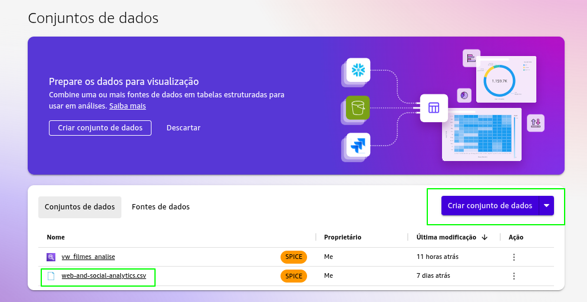
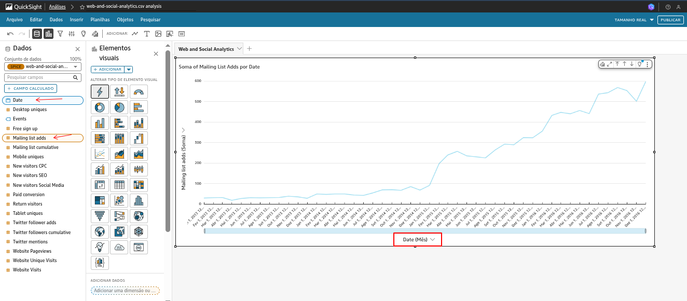
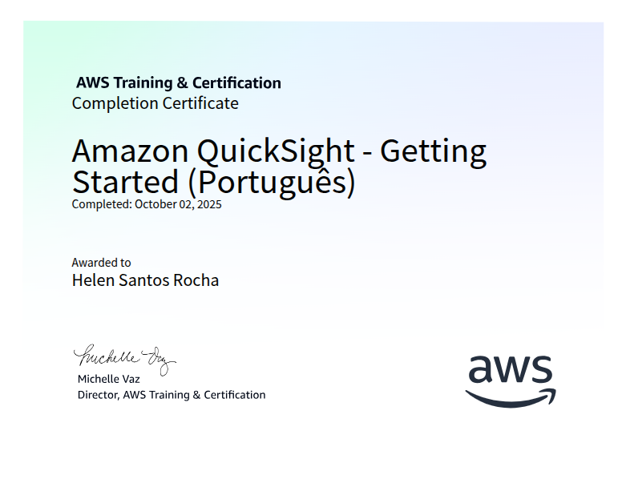

# Resumo

**Amazon QuickSight - Getting Started (Português)**: Nesse curso eu aprendi a usar o Amazon QuickSight de ponta a ponta: conectar e combinar dados na nuvem e on‑premises, acelerar consultas com SPICE, aplicar ML para previsão, detecção de anomalias e narrativas, e fazer perguntas em linguagem natural com o Q, entendendo também preços por sessão e por capacidade. Dominei arquitetura e ativos (fontes, conjuntos de dados, análises, visuais, temas, painéis, tópicos Q), integrações com Redshift, RDS, S3, Athena e VPC, segurança RLS/CLS, auditoria via CloudTrail, namespaces e perfis de administrador, autor e leitor. 

**Complete Introduction to Amazon QuickSight**: Ao longo deste curso, ficou claro como conduzir o ciclo completo no Amazon QuickSight: carregar e preparar dados, criar relações entre tabelas, definir campos calculados com fórmulas e aplicar diferentes agregações como médias, maiores e menores valores e contagens distintas; construir KPIs e usar cálculos de tabela para porcentagens, totais acumulados, rankings e diferenças; empregar filtros e controles para refinar visualizações e relatórios com poucos cliques; criar gráficos de tendência para apoiar previsões e explorar múltiplos tipos de visuais para análises mais ricas; compor histórias de dados e ajustar temas da análise; e, por fim, montar e compartilhar painéis poderosos em minutos, do preparo à distribuição.

*Arquivo Exportado em PDF*:

[Web and Social Analytics](./Exercicios/01-Lab-AWS-QuickSight/Web%20and%20Social%20Analytics.pdf)

# Exercício

No QuickSight, o menu `Conjuntos de dados` foi aberto e, em seguida, o botão `Criar  conjunto de dados` foi selecionado; depois, a opção `Fazer upload de arquivo`. Ademias foi escolhido o arquivo `web-and-social-analytics.csv` na máquina local; na sequência, as opções de envio foram confirmadas, a prévia com colunas como Date e Events foi conferida; por fim, na tela de detalhes da fonte, o botão `Visualizar` foi usado para iniciar o gráfico, concluindo-se ao alcançar a página de `Análise`.

A análise Web and Social Analytics buscou entender a evolução de engajamento e crescimento de audiência ao longo do tempo, consolidando os dados por mês para destacar tendências e reduzir ruído diário. O `eixo X` utilizou o campo Date agregado em `Mês`, enquanto o `eixo Y` somou métricas de interesse, como Mailing list adds, permitindo observar períodos de aceleração, quedas pontuais e mudanças de patamar. Com essa granularidade, ficou mais fácil comparar sazonalidade entre meses, identificar picos associados a campanhas ou conteúdos específicos e avaliar a consistência do crescimento. O visual de linha mostrou a trajetória acumulada, útil para verificar se as iniciativas digitais sustentam um avanço contínuo; já controles e filtros podem isolar canais (web, social, e‑mail) para checar quais contribuem mais em cada intervalo. A partir desse panorama, decisões práticas incluem reforçar ações nos meses com melhor tração, ajustar calendário editorial antes de períodos historicamente fracos e testar variações de campanha quando forem notados desvios da curva esperada.

# Certificado 

Certificado do Curso *Amazon QuickSight - Getting Started (Português)*

